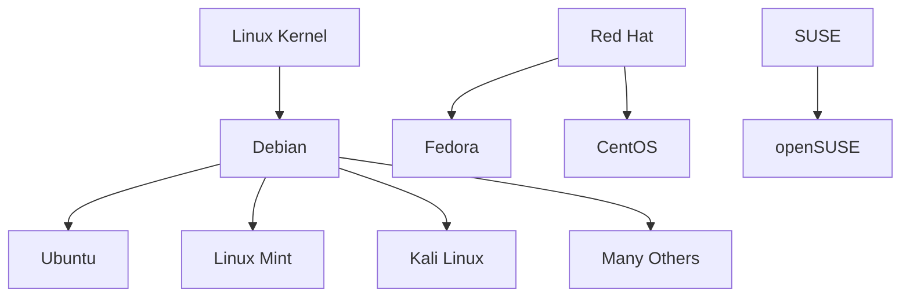
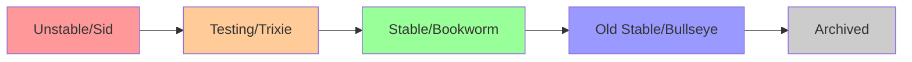

# Debian Introduction

## What is Debian?

Debian is a free and open-source operating system based on the Linux kernel. It's one of the oldest and most respected Linux distributions, known for its commitment to the free software philosophy, stability, and comprehensive software repository.

Founded by Ian Murdock in 1993, Debian has grown from a small project to one of the most influential Linux distributions, with many popular distros like Ubuntu and Linux Mint being based on Debian.

## Key Features of Debian

Debian stands out among Linux distributions for several reasons:

- **Stability**: Debian is known for its rock-solid stability, making it ideal for servers and production environments.
- **Package Management**: The Advanced Package Tool (APT) system is powerful and user-friendly.
- **Large Software Repository**: With over 59,000 packages, Debian offers one of the largest collections of free software.
- **Release Cycle**: Debian follows a conservative release cycle with three branches:
  - **Stable**: Thoroughly tested, receives security updates only
  - **Testing**: The next stable release in preparation
  - **Unstable** (Sid): Leading edge, constantly updated with new packages

- **Community-Driven**: Debian is developed by a large community of volunteers rather than a corporate entity.
- **Universal Operating System**: Designed to work on multiple hardware architectures.

## Debian Versus Other Linux Distributions



Debian differs from other popular distributions in several ways:

| Feature | Debian | Ubuntu | Fedora | Arch Linux |
|---------|--------|--------|--------|------------|
| Base | Independent | Debian-based | Independent | Independent |
| Release Cycle | Slow/Stable | 6 months + LTS | 6 months | Rolling |
| Package Manager | APT | APT | DNF | Pacman |
| Default Desktop | Various | GNOME | GNOME | None |
| Target Users | All levels | Beginners/All | Developers | Advanced |
| Commercial Support | Community | Canonical | Red Hat | Community |

## Getting Started with Debian

### Installation Options

Debian offers several installation methods:

1. **Standard Installation**: Full installation with graphical interface
2. **Minimal Installation**: Command-line only, ideal for servers
3. **Live CD/USB**: Try before installing
4. **Network Install**: Small initial download, packages fetched from repositories

### Basic System Requirements

For a desktop installation with the GNOME environment:
- 2 GHz dual-core processor
- 2 GB RAM (4 GB recommended)
- 10 GB disk space (20 GB recommended)
- Graphics card capable of 1024×768 resolution

For a server or minimal installation:
- 1 GHz processor
- 512 MB RAM
- 2 GB disk space

## First Steps After Installation

### Updating Your System

One of the first tasks after installing Debian is updating your system:

```bash
# Update package lists
sudo apt update

# Upgrade installed packages
sudo apt upgrade

# Output:
# Reading package lists... Done
# Building dependency tree... Done
# Reading state information... Done
# Calculating upgrade... Done
# The following packages will be upgraded:
#   [list of packages]
# Do you want to continue? [Y/n] y
```

### Installing Software

Debian's package management system makes installing software straightforward:

```bash
# Search for packages
apt search firefox

# Install a package
sudo apt install firefox

# Remove a package
sudo apt remove firefox

# Install multiple packages
sudo apt install gimp libreoffice vlc
```

### Basic System Navigation

Here are some essential commands to navigate your Debian system:

```bash
# Check current directory
pwd
# Output: /home/username

# List files and directories
ls -la
# Output: 
# total 76
# drwxr-xr-x 15 username username 4096 Jan 10 12:34 .
# drwxr-xr-x  3 root     root     4096 Dec 25 10:11 ..
# -rw-------  1 username username 8192 Jan 10 11:22 .bash_history
# ...

# Change directory
cd /etc

# Create a directory
mkdir my_directory

# Remove a file
rm filename.txt

# View file contents
cat /etc/debian_version
# Output: 11.0
```

## Understanding Debian Releases

Debian uses codenames from the movie Toy Story for its releases, with "Sid" permanently assigned to the unstable branch:

| Version | Codename | Release Date | Status |
|---------|----------|--------------|--------|
| 12      | Bookworm | 2023-06-10   | Stable |
| 11      | Bullseye | 2021-08-14   | Old Stable |
| 10      | Buster   | 2019-07-06   | Old Stable |
| Testing | Trixie   | Future       | Testing |
| Unstable| Sid      | Always       | Unstable |

### Release Cycle Explained



Packages enter the Debian ecosystem through the Unstable branch and gradually progress to Testing and eventually Stable after sufficient testing and bug fixes.

## Debian's Package Management System

### The APT Ecosystem

APT (Advanced Package Tool) is a suite of tools for managing Debian packages:

- `apt`: User-friendly command for common package operations
- `apt-get`: More technical, scriptable package management
- `apt-cache`: Query package information
- `dpkg`: Low-level package management tool

### Working with Package Repositories

Debian repositories are configured in `/etc/apt/sources.list`:

```bash
# Example sources.list entry
deb http://deb.debian.org/debian bookworm main contrib non-free-firmware

# Adding a repository
echo "deb http://deb.debian.org/debian bookworm-backports main" | sudo tee -a /etc/apt/sources.list.d/backports.list

# After adding repositories, update package lists
sudo apt update
```

## The Debian Community

### Getting Help

Debian has extensive documentation and an active community:

- [Official Debian Documentation](https://www.debian.org/doc/)
- [Debian Wiki](https://wiki.debian.org/)
- [Debian Forums](https://forums.debian.net/)
- IRC: #debian on OFTC

### Contributing to Debian

There are many ways to contribute to Debian:

- Package maintenance
- Documentation
- Translation
- Bug reporting and testing
- Advocacy and support

## Practical Example: Setting Up a Basic Web Server

Let's create a simple web server using Apache:

```bash
# Install Apache
sudo apt install apache2

# Start the service
sudo systemctl start apache2

# Enable at boot
sudo systemctl enable apache2

# Check status
sudo systemctl status apache2
# Output:
# ● apache2.service - The Apache HTTP Server
#    Loaded: loaded (/lib/systemd/system/apache2.service; enabled; vendor preset: enabled)
#    Active: active (running) since Mon 2023-01-10 15:30:45 UTC; 5s ago
#      ...

# Create a simple web page
echo "<html><body><h1>My Debian Web Server</h1></body></html>" | sudo tee /var/www/html/index.html

# Access the site
# Navigate to http://localhost or your server IP address in a web browser
```

## Summary

Debian is a powerful, stable, and versatile Linux distribution suitable for various use cases from personal desktops to enterprise servers. Its commitment to free software, extensive package repository, and strong community support make it an excellent choice for both beginners and experienced users.

In this introduction, we've covered:

- Debian's history and philosophy
- Key features that set it apart from other distributions
- Basic installation requirements
- Essential commands for system management
- Understanding Debian's release cycle
- Package management with APT
- Community resources
- A practical example of setting up a web server

## Next Steps

To continue your Debian journey:

1. Experiment with different desktop environments (GNOME, KDE, Xfce)
2. Learn more advanced package management techniques
3. Explore system administration tasks
4. Set up more complex server configurations
5. Consider contributing to the Debian community

## Exercises

1. Install Debian in a virtual machine using the minimal installation option.
2. Create a custom sources.list file with repositories for your region.
3. Install and configure a different desktop environment than the default.
4. Set up a simple file sharing server using Samba.
5. Create a simple bash script to automate system updates and cleaning.