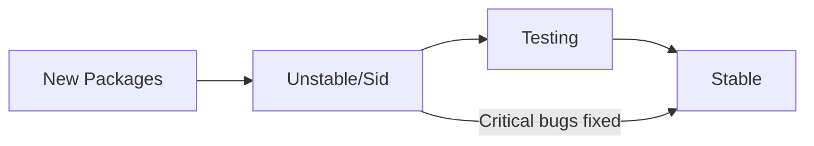

# Debian History

## Introduction

Debian is one of the oldest and most respected Linux distributions in existence. Its influence on the Linux ecosystem and broader open-source world cannot be overstated. Understanding Debian's rich history provides valuable context for new Linux users and helps explain why so many modern distributions are Debian-based. This article explores the origins, evolution, and impact of the Debian project over the decades.

## The Birth of Debian (1993-1995)

Debian began as a personal project by Ian Murdock, a computer science student at Purdue University. On August 16, 1993, Murdock announced his intention to create a new Linux distribution in a post to the comp.os.linux.development newsgroup.

The name "Debian" was a combination of his then-girlfriend (later wife) Debra's name and his own – "Deb" and "Ian."

Murdock's announcement highlighted his vision:

```
"Debian Linux is a brand-new kind of Linux distribution. Rather than being developed by one isolated individual or group, as other distributions of Linux have been developed in the past, Debian is being developed openly in the spirit of Linux and GNU."
```

This collaborative approach to development was revolutionary at the time and set the foundation for what would become one of Debian's core strengths.

### Key Early Milestones

- **August 1993**: Ian Murdock announces the Debian project
- **January 1994**: Debian 0.91 released, featuring a simple package system
- **March 1995**: Debian 0.93R5 released
- **June 1996**: Debian 1.1 "Buzz" released - the first officially numbered release

## The Debian Social Contract and Free Software Guidelines (1997)

In 1997, the Debian project took a significant step by formalizing its commitment to the free software philosophy. The Debian Social Contract was created, outlining the project's promises to the free software community.

The Social Contract included the Debian Free Software Guidelines (DFSG), which defined what the project considered "free software." These guidelines later became influential beyond Debian itself - they formed the basis of the Open Source Definition when the Open Source Initiative was founded in 1998.

The key points of the Debian Social Contract included:

1. Debian will remain 100% free software
2. The project will give back to the free software community
3. Problems will not be hidden from users
4. The project's priorities are its users and free software

## Package Management Revolution (1995-1999)

One of Debian's most important technical innovations was its advanced package management system. While early versions used a simple `.deb` format, the development of APT (Advanced Package Tool) revolutionized software installation on Linux.

APT introduced the concept of repositories and dependency resolution, making it much easier to install, update, and remove software. This example shows basic APT usage:

```bash
# Update package lists
apt-get update

# Install a package, automatically resolving dependencies
apt-get install firefox

# Output would show all dependencies being downloaded and installed
# Reading package lists... Done
# Building dependency tree... Done
# The following additional packages will be installed:
#   [list of dependencies]
# ...
```

The `.deb` package format and APT system were so effective that they've been adopted by many other distributions and influenced package management across the Linux ecosystem.

## Release Philosophy and Structure (1999-Present)

Debian established a unique release structure that balances stability with access to newer software. This approach introduced three main branches:

- **Stable**: Thoroughly tested, receives only security updates and critical bug fixes
- **Testing**: Packages that will eventually become the next stable release
- **Unstable**: Always called "Sid", contains the latest package versions



Debian's release cycle is not time-based but feature-based. A new stable version is released when it's ready, typically every 2-3 years. Each stable release is supported for about 3 years.

All stable releases since version 1.1 have been named after characters from the Toy Story films:

| Version | Code Name | Release Date |
|---------|-----------|--------------|
| 1.1     | Buzz      | June 1996    |
| 1.2     | Rex       | December 1996|
| 1.3     | Bo        | June 1997    |
| 2.0     | Hamm      | July 1998    |
| 2.1     | Slink     | March 1999   |
| 2.2     | Potato    | August 2000  |
| 3.0     | Woody     | July 2002    |
| 3.1     | Sarge     | June 2005    |
| 4.0     | Etch      | April 2007   |
| 5.0     | Lenny     | February 2009|
| 6.0     | Squeeze   | February 2011|
| 7.0     | Wheezy    | May 2013     |
| 8.0     | Jessie    | April 2015   |
| 9.0     | Stretch   | June 2017    |
| 10.0    | Buster    | July 2019    |
| 11.0    | Bullseye  | August 2021  |
| 12.0    | Bookworm  | June 2023    |

## Debian's Influence: The Family Tree (2000s-Present)

Debian's technical excellence and commitment to free software principles have made it the foundation for numerous derivative distributions. Most notably, Ubuntu (launched in 2004) is based on Debian, and in turn, many popular distributions are based on Ubuntu.

Some notable Debian-based distributions include:

- **Ubuntu**: Focuses on user-friendliness and predictable release schedule
- **Linux Mint**: Built on Ubuntu, emphasizes out-of-the-box usability
- **Kali Linux**: Security-focused distribution for penetration testing
- **Raspbian/Raspberry Pi OS**: Optimized for Raspberry Pi hardware
- **MX Linux**: Lightweight distribution with simple configuration
- **Pop!_OS**: Gaming and development-focused distribution from System76

The Debian family tree is vast, with hundreds of distributions tracing their lineage back to Debian.

## Debian's Organizational Structure

Debian pioneered a democratic, community-based governance model for open-source projects. The project is governed by the Debian Constitution, which outlines:

1. The role of the Debian Project Leader (DPL), who is elected annually
2. The decision-making process through General Resolutions
3. Technical decision delegation to the Technical Committee

This organizational structure has helped Debian maintain stability despite being one of the largest collaborative software projects in the world, with thousands of volunteer developers.

## Practical Example: Tracing Debian's Influence in Your System

If you're using a Debian-based system, you can trace its Debian heritage with these commands:

```bash
# Check if your system is Debian-based
cat /etc/os-release

# Output might look like:
# NAME="Ubuntu"
# VERSION="22.04 LTS (Jammy Jellyfish)"
# ID=ubuntu
# ID_LIKE=debian
# ...

# List installed packages on a Debian-based system
dpkg -l | head

# Find the version of the APT package management system
apt --version
```

These commands demonstrate how Debian's packaging system and infrastructure remain at the core of many modern Linux distributions.

## Debian Today

Debian continues to be a central pillar of the Linux ecosystem. Its commitment to stability, security, and free software principles has earned it a place in critical infrastructure, servers, desktops, and embedded systems worldwide.

Key aspects of modern Debian include:

- **Universal Architecture Support**: Debian supports an unmatched range of hardware architectures
- **Security Focus**: The Debian Security Team provides timely updates for security vulnerabilities
- **Extensive Repository**: Tens of thousands of packages, one of the largest software collections in any OS
- **Alternative Init Systems**: While systemd is the default, Debian supports alternative init systems
- **Long-term Support**: Extended support periods for stable releases

## Summary

Debian's history showcases the power of community-driven development and the impact of clear principles on technical excellence. From its humble beginnings in 1993 to its current status as one of the most important open-source projects, Debian has maintained its commitment to free software and technical quality.

The project's innovations in package management, release philosophy, and governance have influenced countless other distributions and projects. Understanding Debian's history provides valuable context for anyone working with Linux, especially as so many modern distributions can trace their lineage back to Debian.

## Further Learning

To deepen your understanding of Debian:

1. Try installing Debian in a virtual machine to experience the pure distribution
2. Explore the differences between Debian Stable, Testing, and Unstable
3. Research how the Debian package system works by building a simple `.deb` package
4. Read the Debian Social Contract and Free Software Guidelines
5. Consider contributing to Debian through packaging, documentation, or testing

## Additional Resources

- The official Debian website: [debian.org](https://www.debian.org)
- The Debian Wiki: [wiki.debian.org](https://wiki.debian.org)
- The Debian Package Tracker: [tracker.debian.org](https://tracker.debian.org)
- Debian Manuals: [manuals.debian.org](https://manuals.debian.org)