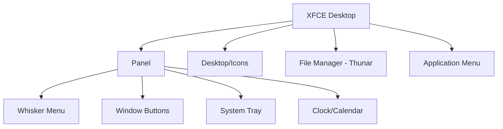

# Debian XFCE Interface

## Introduction

The XFCE desktop environment is one of the most popular choices for Debian users seeking a lightweight yet feature-rich graphical interface. XFCE strikes an excellent balance between performance and functionality, making it ideal for both older hardware and modern systems where efficiency is valued. In this guide, we'll explore how to install, configure, and effectively use the XFCE interface on Debian, providing you with the knowledge to customize your desktop experience to suit your programming workflow.

## What is XFCE?

XFCE (pronounced as either X-F-C-E or "ex-face") is a free and open-source desktop environment for Unix-like operating systems. It aims to be fast and lightweight while still being visually appealing and user-friendly. Some key characteristics of XFCE include:

- **Resource Efficiency**: Uses fewer system resources compared to heavier desktop environments like GNOME or KDE
- **Modularity**: Components can be installed and configured separately
- **Customizability**: Highly configurable to match your preferences and workflow
- **Stability**: Known for its reliability and consistent performance

## Installing XFCE on Debian

There are multiple ways to get XFCE on your Debian system:

### Method 1: Install Debian with XFCE

The simplest approach is to choose the XFCE desktop during Debian installation:

1. Download the Debian netinst or full ISO from the [Debian website](https://www.debian.org/distrib/)
2. During installation, when prompted to choose a desktop environment, select "Xfce"
3. Complete the installation as normal

### Method 2: Install XFCE on an Existing Debian System

If you already have Debian installed with another desktop environment (or no desktop environment), you can add XFCE:

```bash
# Update your package lists
sudo apt update

# Install XFCE and its recommended packages
sudo apt install xfce4 xfce4-goodies

# Install a display manager if you don't have one
sudo apt install lightdm
```

After installation, you'll need to restart your system or start the display manager:

```bash
sudo systemctl restart lightdm
```

Select XFCE from the session menu at the login screen.

## The XFCE Desktop Layout

<div style={{ textAlign: 'center', margin: '20px 0' }}>
  <p><i>XFCE's default desktop layout consists of several key components</i></p>
</div>



Let's explore these components:

### 1. The Panel

The XFCE panel (typically located at the top or bottom of the screen) contains:

- **Whisker Menu**: The main application launcher (accessible by clicking the Debian logo)
- **Window Buttons**: Shows running applications
- **System Tray**: Displays system notifications and statuses
- **Clock/Calendar**: Shows the current time and date

### 2. Thunar File Manager

Thunar is XFCE's default file manager, offering a clean interface with essential functionality:

```bash
# Launch Thunar from terminal
thunar

# Open a specific directory
thunar ~/Documents
```

### 3. Desktop

The desktop can display icons for common locations and can be customized via right-click menu.

## Customizing XFCE

One of XFCE's greatest strengths is its customizability. Here's how to personalize your environment:

### Appearance Settings

1. Open the **Applications Menu** → **Settings** → **Appearance**
2. Here you can change themes, icons, and fonts

```bash
# You can also launch appearance settings from terminal
xfce4-appearance-settings
```

### Panel Customization

1. Right-click on any empty area of the panel and select **Panel** → **Panel Preferences**
2. You can adjust:
   - Panel size and position
   - Background appearance
   - Add/remove/rearrange panel items

### Window Manager Settings

1. Go to **Applications Menu** → **Settings** → **Window Manager**
2. Customize:
   - Window behavior
   - Keyboard shortcuts
   - Theme settings

```bash
# Launch window manager settings from terminal
xfwm4-settings
```

### Desktop Settings

1. Right-click on the desktop and select **Desktop Settings**
2. Modify:
   - Wallpaper
   - Menu behavior
   - Desktop icons

## Useful XFCE Shortcuts

Learning keyboard shortcuts will significantly improve your productivity:

| Shortcut | Action |
|----------|--------|
| `Alt + F1` | Open Applications Menu |
| `Alt + F2` | Run Command Dialog |
| `Alt + F4` | Close Window |
| `Alt + Tab` | Switch Between Windows |
| `Ctrl + Alt + D` | Show Desktop |
| `Ctrl + Esc` | Task Manager |
| `Print Screen` | Screenshot |

You can customize these shortcuts in **Settings** → **Keyboard** → **Application Shortcuts**.

## Terminal Usage in XFCE

The XFCE terminal (xfce4-terminal) is a powerful tool for developers:

```bash
# Launch terminal
xfce4-terminal

# Launch with specific settings
xfce4-terminal --maximize --hide-menubar
```

### Customizing the Terminal

1. Open Terminal and go to **Edit** → **Preferences**
2. Customize:
   - Colors and appearance
   - Behavior
   - Shortcuts

For programmers, consider enabling features like:
- Unlimited scrollback
- Custom color schemes
- Copy on selection

## Programming Productivity Tips with XFCE

XFCE can be optimized for programming with these adjustments:

### 1. Multiple Workspaces

Use multiple workspaces to organize your development environment:

1. Right-click panel → **Add New Items** → **Workspace Switcher**
2. Configure workspaces in **Settings** → **Workspaces**

```bash
# Switch to a specific workspace from terminal
wmctrl -s 1  # Switch to workspace 2 (zero-indexed)
```

### 2. Window Tiling

XFCE supports basic window tiling:
- Drag a window to the left/right edge to tile to half the screen
- Drag to corners for quarter tiling
- `Alt + F7` to start moving a window with keyboard

For advanced tiling, consider installing a plugin:

```bash
sudo apt install xfce4-tile-plugin
```

### 3. Development Environment Setup

A typical programmer's XFCE setup might include:

- Workspace 1: Code Editor/IDE
- Workspace 2: Terminal(s)
- Workspace 3: Documentation/Browser
- Workspace 4: Communication tools

## Troubleshooting Common Issues

### Issue: XFCE Seems Slow or Unresponsive

```bash
# Check for resource-intensive processes
ps aux | sort -k 3,3 -r | head -10

# Restart XFCE without logging out
xfce4-panel --restart
```

### Issue: Missing or Corrupted Themes

```bash
# Reinstall XFCE themes
sudo apt install --reinstall xfce4-artwork

# Reset XFCE configuration (caution: this removes customizations)
rm -rf ~/.config/xfce4
```

### Issue: Panel Items Disappeared

1. Right-click panel → **Panel** → **Add New Items**
2. Re-add the missing components

## Practical Example: Setting Up a Development Environment

Let's create a productive development environment in XFCE:

### Step 1: Install Development Tools

```bash
# Install basic development packages
sudo apt update
sudo apt install build-essential git vim-gtk3 meld

# Install VSCode (example IDE)
sudo apt install curl
curl -L https://go.microsoft.com/fwlink/?LinkID=760868 -o vscode.deb
sudo apt install ./vscode.deb
```

### Step 2: Configure Panel for Development

1. Right-click panel → **Add New Items**
2. Add:
   - **CPU Graph** - Monitor system load
   - **Workspace Switcher** - Quick workspace navigation
   - **Window Menu** - List all open windows

### Step 3: Create Custom Application Launcher

1. Right-click panel → **Add New Items** → **Launcher**
2. Add shortcuts to:
   - Your IDE/editor
   - Terminal
   - Browser
   - Project directories

### Step 4: Configure Keyboard Shortcuts

1. Go to **Settings** → **Keyboard** → **Application Shortcuts**
2. Add:

```
xfce4-terminal --drop-down    # Ctrl+Alt+T (drop-down terminal)
code ~/projects               # Ctrl+Alt+C (open projects in VSCode)
firefox developer.mozilla.org # Ctrl+Alt+D (open developer docs)
```

## Summary

The XFCE desktop environment in Debian provides an excellent balance of performance, functionality, and customizability, making it an ideal choice for programmers and developers. In this guide, we've covered:

- Installation and basic setup of XFCE on Debian
- Understanding the XFCE interface components
- Customization options for appearance and behavior
- Productivity enhancements for programming workflows
- Troubleshooting common issues

By mastering the XFCE environment, you'll have a stable, efficient platform for your programming projects that can be tailored precisely to your workflow needs.

## Additional Resources

- [Official XFCE Documentation](https://docs.xfce.org/)
- [Debian Wiki: XFCE](https://wiki.debian.org/Xfce)
- [XFCE Shortcuts Reference](https://docs.xfce.org/xfce/getting-started#keyboard_shortcuts)

## Exercises

1. Install XFCE on a Debian virtual machine and customize the appearance to your liking
2. Create a custom panel layout optimized for web development with shortcuts to your most-used tools
3. Configure multiple workspaces and practice moving windows between them using keyboard shortcuts
4. Set up a custom keyboard shortcut to launch your favorite IDE and open your most recent project
5. Experiment with different terminal color schemes and settings to find the most comfortable setup for long coding sessions