# Debian File Structure

## Introduction

The Debian file system follows the Filesystem Hierarchy Standard (FHS), which defines the directory structure and directory contents in Unix-like operating systems. Understanding this structure is fundamental for effectively navigating, managing, and troubleshooting your Debian system. This guide will walk you through the key directories, their purposes, and how they work together to create a coherent operating system.

## The Root Directory

In Debian, everything starts at the root directory, represented by a forward slash `/`. This is the top-level directory that contains all other files and directories. Unlike Windows systems with multiple drives (C:, D:, etc.), Linux unifies all storage under this single hierarchical tree.

Let's explore the main directories you'll find under root:

```bash
$ ls -la /
total 92
drwxr-xr-x  20 root root  4096 Jan 25 12:34 .
drwxr-xr-x  20 root root  4096 Jan 25 12:34 ..
lrwxrwxrwx   1 root root     7 Nov 15 09:48 bin -> usr/bin
drwxr-xr-x   4 root root  4096 Feb  5 18:22 boot
drwxr-xr-x  17 root root  3220 Mar 12 15:41 dev
drwxr-xr-x 136 root root 12288 Mar 12 15:41 etc
drwxr-xr-x   3 root root  4096 Nov  2 19:37 home
lrwxrwxrwx   1 root root     7 Nov 15 09:48 lib -> usr/lib
lrwxrwxrwx   1 root root     9 Nov 15 09:48 lib32 -> usr/lib32
lrwxrwxrwx   1 root root     9 Nov 15 09:48 lib64 -> usr/lib64
lrwxrwxrwx   1 root root    10 Nov 15 09:48 libx32 -> usr/libx32
drwx------   2 root root 16384 Nov  2 19:35 lost+found
drwxr-xr-x   4 root root  4096 Nov  2 19:36 media
drwxr-xr-x   3 root root  4096 Jan 14 09:12 mnt
drwxr-xr-x   6 root root  4096 Jan 26 10:19 opt
dr-xr-xr-x 284 root root     0 Mar 12 15:41 proc
drwx------   7 root root  4096 Feb 12 08:15 root
drwxr-xr-x  34 root root   960 Mar 13 10:02 run
lrwxrwxrwx   1 root root     8 Nov 15 09:48 sbin -> usr/sbin
drwxr-xr-x   6 root root  4096 Nov  2 19:37 srv
dr-xr-xr-x  13 root root     0 Mar 12 15:41 sys
drwxrwxrwt  20 root root  4096 Mar 13 11:24 tmp
drwxr-xr-x  14 root root  4096 Nov  2 19:37 usr
drwxr-xr-x  13 root root  4096 Nov  2 19:38 var
```

## Essential Directories and Their Functions

Let's examine each important directory and understand its purpose:

### `/bin` - Essential User Binaries

```bash
$ ls -la /bin
lrwxrwxrwx 1 root root 7 Nov 15 09:48 /bin -> usr/bin
```

In modern Debian systems, `/bin` is a symbolic link to `/usr/bin`. This directory contains essential command binaries (programs) that are required for basic system functionality and are available to all users:

- Shell commands like `bash`, `cp`, `ls`, `mv`
- Basic utilities like `cat`, `grep`, `sed`

### `/boot` - Boot Files

```bash
$ ls -la /boot
total 108768
drwxr-xr-x  4 root root     4096 Feb  5 18:22 .
drwxr-xr-x 20 root root     4096 Jan 25 12:34 ..
-rw-r--r--  1 root root   252144 Jan 10 08:54 config-5.10.0-21-amd64
-rw-r--r--  1 root root   252698 Feb  1 18:20 config-5.10.0-22-amd64
drwxr-xr-x  5 root root     4096 Mar 12 15:41 grub
-rw-r--r--  1 root root 35428428 Jan 14 10:30 initrd.img-5.10.0-21-amd64
-rw-r--r--  1 root root 35488022 Feb  5 18:22 initrd.img-5.10.0-22-amd64
-rw-r--r--  1 root root  5902880 Jan 10 08:54 System.map-5.10.0-21-amd64
-rw-r--r--  1 root root  5907560 Feb  1 18:20 System.map-5.10.0-22-amd64
-rw-r--r--  1 root root 12615680 Jan 10 08:54 vmlinuz-5.10.0-21-amd64
-rw-r--r--  1 root root 12656144 Feb  1 18:20 vmlinuz-5.10.0-22-amd64
```

This directory contains files needed to boot the system:
- The Linux kernel (vmlinuz files)
- Initial RAM disk images (initrd.img files)
- Boot loader configuration (grub directory)
- System map files

These files are critical for system startup and should not be modified unless you know exactly what you're doing.

### `/etc` - System Configuration

```bash
$ ls -la /etc | head -10
total 1136
drwxr-xr-x 136 root root    12288 Mar 12 15:41 .
drwxr-xr-x  20 root root     4096 Jan 25 12:34 ..
drwxr-xr-x   3 root root     4096 Nov  2 19:37 alternatives
drwxr-xr-x   3 root root     4096 Nov  2 19:37 apache2
drwxr-xr-x   6 root root     4096 Feb 12 08:14 apt
-rw-r--r--   1 root root     2319 Feb  8 17:38 bash.bashrc
-rw-r--r--   1 root root       45 Feb 27  2020 bash_completion
drwxr-xr-x   2 root root     4096 Mar  5 09:34 bash_completion.d
-rw-r--r--   1 root root      367 Jan 30  2020 bindresvport.blacklist
```

The `/etc` directory contains system-wide configuration files and scripts:
- Network configuration (`/etc/network/`)
- User and group information (`/etc/passwd`, `/etc/group`)
- System services configuration (`/etc/systemd/`)
- Package management information (`/etc/apt/`)

Most of these files are plain text and can be edited with a text editor, but they control critical system functionality, so modifications should be made carefully.

### `/home` - User Home Directories

```bash
$ ls -la /home
total 12
drwxr-xr-x  3 root  root  4096 Nov  2 19:37 .
drwxr-xr-x 20 root  root  4096 Jan 25 12:34 ..
drwxr-xr-x 21 user1 user1 4096 Mar 13 09:24 user1
```

Each regular user on the system has a subdirectory in `/home` where they can store their personal files, configurations, and data. These directories are typically named after the username.

User-specific configurations are stored in hidden files (starting with a dot) in their home directory:

```bash
$ ls -la /home/user1 | grep "^\."
drwxr-xr-x 21 user1 user1 4096 Mar 13 09:24 .
drwxr-xr-x  3 root  root  4096 Nov  2 19:37 ..
-rw-------  1 user1 user1  200 Mar 13 09:24 .bash_history
-rw-r--r--  1 user1 user1  220 Nov  2 19:37 .bash_logout
-rw-r--r--  1 user1 user1 3771 Nov  2 19:37 .bashrc
drwx------ 15 user1 user1 4096 Mar 12 14:05 .config
drwxr-xr-x  3 user1 user1 4096 Jan 14 10:30 .local
-rw-r--r--  1 user1 user1  807 Nov  2 19:37 .profile
```

### `/lib`, `/lib32`, `/lib64`, `/libx32` - System Libraries

In modern Debian, these directories are symbolic links to their counterparts in `/usr`:

```bash
$ ls -la /lib*
lrwxrwxrwx 1 root root 7 Nov 15 09:48 /lib -> usr/lib
lrwxrwxrwx 1 root root 9 Nov 15 09:48 /lib32 -> usr/lib32
lrwxrwxrwx 1 root root 9 Nov 15 09:48 /lib64 -> usr/lib64
lrwxrwxrwx 1 root root 10 Nov 15 09:48 /libx32 -> usr/libx32
```

These directories contain library files that system programs depend on. The different directories handle libraries for different architectures:
- `/lib` - Main library directory
- `/lib32` - 32-bit libraries on 64-bit systems
- `/lib64` - 64-bit libraries
- `/libx32` - X32 ABI libraries (a special case)

### `/media` and `/mnt` - Removable Media and Temporary Mounts

```bash
$ ls -la /media
total 12
drwxr-xr-x  3 root root 4096 Jan 14 09:12 .
drwxr-xr-x 20 root root 4096 Jan 25 12:34 ..
drwxr-xr-x  2 root root 4096 Jan 14 09:12 user1

$ ls -la /mnt
total 12
drwxr-xr-x  3 root root 4096 Jan 14 09:12 .
drwxr-xr-x 20 root root 4096 Jan 25 12:34 ..
drwxr-xr-x  2 root root 4096 Jan 14 09:12 backup
```

- `/media` - Used for automated mounting of removable media like USB drives
- `/mnt` - Used for temporarily mounting filesystems manually

### `/opt` - Optional Packages

```bash
$ ls -la /opt
total 24
drwxr-xr-x  6 root root 4096 Jan 26 10:19 .
drwxr-xr-x 20 root root 4096 Jan 25 12:34 ..
drwxr-xr-x  3 root root 4096 Nov 15 10:22 containerd
drwxr-xr-x  3 root root 4096 Nov 15 10:25 google
drwxr-xr-x  3 root root 4096 Jan 26 10:19 microsoft
drwxr-xr-x  4 root root 4096 Jan 15 11:33 sublime_text
```

The `/opt` directory is used for installing third-party software packages that aren't part of the standard Debian distribution. These applications typically keep all their files in one subdirectory.

### `/proc` - Process Information

```bash
$ ls -la /proc | head -10
total 0
dr-xr-xr-x 284 root      root         0 Mar 12 15:41 .
drwxr-xr-x  20 root      root      4096 Jan 25 12:34 ..
dr-xr-xr-x   9 root      root         0 Mar 13 11:34 1
dr-xr-xr-x   9 root      root         0 Mar 13 11:34 10
dr-xr-xr-x   9 user1     user1        0 Mar 13 11:34 11287
dr-xr-xr-x   9 root      root         0 Mar 13 11:34 116
dr-xr-xr-x   9 root      root         0 Mar 13 11:34 12
dr-xr-xr-x   9 user1     user1        0 Mar 13 11:34 12572
dr-xr-xr-x   9 user1     user1        0 Mar 13 11:34 12573
```

The `/proc` directory is a virtual filesystem that provides access to kernel information and running processes. It doesn't contain actual files on disk but rather is an interface to the kernel. Each numbered directory corresponds to a running process, and various files provide information about system resources.

Example: To see information about the CPU:

```bash
$ cat /proc/cpuinfo | head -5
processor	: 0
vendor_id	: GenuineIntel
cpu family	: 6
model		: 142
model name	: Intel(R) Core(TM) i5-8265U CPU @ 1.60GHz
```

### `/root` - Root User Home

```bash
$ ls -la /root
total 28
drwx------  7 root root 4096 Feb 12 08:15 .
drwxr-xr-x 20 root root 4096 Jan 25 12:34 ..
-rw-------  1 root root  412 Mar 11 09:10 .bash_history
-rw-r--r--  1 root root  571 Apr 10  2021 .bashrc
drwxr-xr-x  3 root root 4096 Nov  2 19:37 .local
-rw-r--r--  1 root root  161 Jul  9  2019 .profile
drwx------  2 root root 4096 Nov  2 19:37 .ssh
```

This is the home directory for the root user (system administrator). Unlike regular users whose home directories are in `/home`, the root user's home is directly under the root filesystem for availability reasons, even if the `/home` partition is unavailable.

### `/run` - Runtime Data

```bash
$ ls -la /run | head -5
total 52
drwxr-xr-x  34 root root   960 Mar 13 10:02 .
drwxr-xr-x  20 root root  4096 Jan 25 12:34 ..
drwxr-xr-x   2 root root    60 Mar 13 10:02 blkid
drwxrwxr-x   2 root root    40 Mar 13 10:02 credentials
```

The `/run` directory contains runtime data for processes started since the last boot. This includes process IDs, locks, sockets, and other temporary files needed by running applications.

### `/sbin` - System Binaries

```bash
$ ls -la /sbin
lrwxrwxrwx 1 root root 8 Nov 15 09:48 /sbin -> usr/sbin
```

Like `/bin`, this is now a symbolic link to `/usr/sbin` in modern Debian systems. It contains essential system binaries that are typically used by the system administrator, such as tools for system maintenance, network configuration, and disk management.

### `/srv` - Service Data

```bash
$ ls -la /srv
total 24
drwxr-xr-x  6 root root 4096 Nov  2 19:37 .
drwxr-xr-x 20 root root 4096 Jan 25 12:34 ..
drwxr-xr-x  3 root root 4096 Nov  2 19:37 ftp
drwxr-xr-x  4 root root 4096 Jan 15 09:44 http
drwxr-xr-x  2 root root 4096 Nov  2 19:37 nfs
drwxr-xr-x  2 root root 4096 Nov  2 19:37 tftp
```

The `/srv` directory contains data for services provided by the system, such as web, FTP, or other servers. For example, web files for an Apache server might be stored in `/srv/http` or `/srv/www`.

### `/sys` - System Files

```bash
$ ls -la /sys | head -10
total 0
dr-xr-xr-x 13 root root 0 Mar 12 15:41 .
drwxr-xr-x 20 root root 4096 Jan 25 12:34 ..
drwxr-xr-x 65 root root 0 Mar 13 11:34 block
drwxr-xr-x 85 root root 0 Mar 13 11:34 bus
drwxr-xr-x 76 root root 0 Mar 13 11:34 class
drwxr-xr-x  4 root root 0 Mar 13 11:34 dev
drwxr-xr-x 31 root root 0 Mar 13 11:34 devices
drwxr-xr-x  5 root root 0 Mar 13 11:34 firmware
drwxr-xr-x 10 root root 0 Mar 13 11:34 fs
```

Similar to `/proc`, the `/sys` directory is a virtual filesystem that provides an interface to kernel data structures, particularly for hardware devices and their configuration. This is part of the sysfs system, which provides a more structured view of devices than `/proc`.

### `/tmp` - Temporary Files

```bash
$ ls -la /tmp | head -5
total 48
drwxrwxrwt 20 root  root  4096 Mar 13 11:35 .
drwxr-xr-x 20 root  root  4096 Jan 25 12:34 ..
drwx------  3 user1 user1 4096 Mar 13 10:02 apt-source-pts
drwx------  2 gdm   gdm   4096 Mar 13 10:02 ssh-XXXXXXXX
```

The `/tmp` directory is for temporary files created by programs. This directory is typically cleared on reboot. Note the permissions `drwxrwxrwt`, where the "t" is the sticky bit, which prevents users from deleting files owned by others.

### `/usr` - User Programs

```bash
$ ls -la /usr
total 60
drwxr-xr-x 14 root root  4096 Nov  2 19:37 .
drwxr-xr-x 20 root root  4096 Jan 25 12:34 ..
drwxr-xr-x  2 root root 20480 Mar  5 09:34 bin
drwxr-xr-x  2 root root  4096 Apr 15  2020 games
drwxr-xr-x 41 root root  4096 Mar  5 09:34 include
drwxr-xr-x 97 root root  4096 Mar  5 09:34 lib
drwxr-xr-x  3 root root  4096 Nov  2 19:37 lib32
drwxr-xr-x  3 root root  4096 Nov  2 19:37 lib64
drwxr-xr-x  3 root root  4096 Nov  2 19:37 libx32
drwxr-xr-x 12 root root  4096 Nov  2 19:37 local
drwxr-xr-x  2 root root  4096 Mar  5 09:34 sbin
drwxr-xr-x 284 root root 12288 Mar  5 09:34 share
drwxr-xr-x  7 root root  4096 Nov  2 19:37 src
```

The `/usr` directory contains user programs, libraries, documentation, and other data that aren't needed for basic system operation. In modern systems, this directory has become more important as `/bin`, `/sbin`, and `/lib` are now symbolic links to their counterparts in `/usr`.

Key subdirectories include:
- `/usr/bin` - User command binaries
- `/usr/sbin` - System administration binaries
- `/usr/lib` - Libraries
- `/usr/share` - Architecture-independent data files
- `/usr/local` - Locally installed software
- `/usr/include` - C/C++ header files

### `/var` - Variable Data

```bash
$ ls -la /var
total 56
drwxr-xr-x 13 root root     4096 Nov  2 19:38 .
drwxr-xr-x 20 root root     4096 Jan 25 12:34 ..
drwxr-xr-x  2 root root     4096 Jan 15 09:44 backups
drwxr-xr-x 18 root root     4096 Mar  5 09:34 cache
drwxr-xr-x  2 root root     4096 Nov  2 19:37 crash
drwxr-xr-x 66 root root     4096 Mar  5 09:34 lib
drwxrwsr-x  2 root staff    4096 Apr 15  2020 local
lrwxrwxrwx  1 root root        9 Jul  9  2022 lock -> /run/lock
drwxr-xr-x 24 root root     4096 Mar 13 10:04 log
drwxrwsr-x  2 root mail     4096 Nov  2 19:37 mail
drwxr-xr-x  2 root root     4096 Nov  2 19:37 opt
lrwxrwxrwx  1 root root        4 Jul  9  2022 run -> /run
drwxr-xr-x 11 root root     4096 Mar  5 09:34 spool
drwxrwxrwt  8 root root     4096 Mar 13 11:24 tmp
drwxr-xr-x  3 root root     4096 Nov  2 19:37 www
```

The `/var` directory contains files that are expected to grow or change during system operation:

- `/var/log` - Log files
- `/var/cache` - Application cache data
- `/var/spool` - Queued data (print jobs, mail, etc.)
- `/var/lib` - Variable state information for applications
- `/var/www` - Web server files

## Visual Representation of the Debian File System

Here's a diagram to help visualize the Debian file system hierarchy:

```mermaid
graph TD
    root["/"] --> bin["/bin"]
    root --> boot["/boot"]
    root --> dev["/dev"]
    root --> etc["/etc"]
    root --> home["/home"]
    root --> lib["/lib"]
    root --> media["/media"]
    root --> mnt["/mnt"]
    root --> opt["/opt"]
    root --> proc["/proc"]
    root --> root_dir["/root"]
    root --> run["/run"]
    root --> sbin["/sbin"]
    root --> srv["/srv"]
    root --> sys["/sys"]
    root --> tmp["/tmp"]
    root --> usr["/usr"]
    root --> var["/var"]
    
    usr --> usr_bin["/usr/bin"]
    usr --> usr_sbin["/usr/sbin"]
    usr --> usr_lib["/usr/lib"]
    usr --> usr_share["/usr/share"]
    usr --> usr_local["/usr/local"]
    usr --> usr_include["/usr/include"]
    
    var --> var_log["/var/log"]
    var --> var_cache["/var/cache"]
    var --> var_lib["/var/lib"]
    var --> var_spool["/var/spool"]
    var --> var_www["/var/www"]
    
    bin -.-> usr_bin
    sbin -.-> usr_sbin
    lib -.-> usr_lib
    
    style root fill:#f96,stroke:#333,stroke-width:2px
    style usr fill:#9cf,stroke:#333,stroke-width:2px
    style var fill:#9cf,stroke:#333,stroke-width:2px
    style home fill:#9cf,stroke:#333,stroke-width:2px
    style etc fill:#9cf,stroke:#333,stroke-width:2px
```



## Practical Examples

### Finding Configuration Files

If you need to configure your network settings, you would look in `/etc/network/`:

```bash
$ ls -la /etc/network/
total 24
drwxr-xr-x   3 root root 4096 Nov  2 19:37 .
drwxr-xr-x 136 root root 12288 Mar 12 15:41 ..
-rw-r--r--   1 root root   65 Feb  2 08:12 interfaces
drwxr-xr-x   2 root root 4096 Nov  2 19:37 if-up.d
```

### Managing System Logs

System logs are stored in `/var/log/`. For example, to check authentication logs:

```bash
$ sudo tail /var/log/auth.log
Mar 13 10:02:25 debian-server sudo: user1 : TTY=pts/0 ; PWD=/home/user1 ; USER=root ; COMMAND=/bin/tail /var/log/auth.log
Mar 13 10:15:42 debian-server sudo: user1 : TTY=pts/0 ; PWD=/home/user1 ; USER=root ; COMMAND=/usr/bin/apt update
Mar 13 11:05:18 debian-server sshd[12345]: Accepted publickey for user1 from 192.168.1.100 port 52437 ssh2
```

### Installing Software

When you install software using APT, different files go to different directories:
- Executables go to `/usr/bin/`
- Configuration files go to `/etc/`
- Libraries go to `/usr/lib/`
- Documentation goes to `/usr/share/doc/`

For example, when installing Apache:

```bash
$ sudo apt install apache2
$ which apache2
/usr/sbin/apache2
$ ls -la /etc/apache2/
total 84
drwxr-xr-x  3 root root  4096 Feb 10 14:22 .
drwxr-xr-x 136 root root 12288 Mar 12 15:41 ..
-rw-r--r--  1 root root  7115 Jan 15 12:20 apache2.conf
drwxr-xr-x  2 root root  4096 Feb 10 14:22 conf-available
drwxr-xr-x  2 root root  4096 Feb 10 14:22 conf-enabled
-rw-r--r--  1 root root  1782 Jan  5 10:15 envvars
-rw-r--r--  1 root root 31063 Jan  5 10:15 magic
drwxr-xr-x  2 root root 12288 Feb 10 14:22 mods-available
drwxr-xr-x  2 root root  4096 Feb 10 14:22 mods-enabled
-rw-r--r--  1 root root   320 Jan  5 10:15 ports.conf
drwxr-xr-x  2 root root  4096 Feb 10 14:22 sites-available
drwxr-xr-x  2 root root  4096 Feb 10 14:22 sites-enabled
```

### Finding User Data

User configuration files are located in their home directories, often as hidden files:

```bash
$ ls -la ~/.config
total 32
drwx------ 15 user1 user1 4096 Mar 12 14:05 .
drwxr-xr-x 21 user1 user1 4096 Mar 13 09:24 ..
drwxr-xr-x  3 user1 user1 4096 Dec 15 09:24 chromium
drwxr-xr-x  2 user1 user1 4096 Jan 20 11:42 dconf
drwxr-xr-x  3 user1 user1 4096 Nov 20 15:32 gtk-3.0
drwxr-xr-x  4 user1 user1 4096 Feb 28 10:15 libreoffice
drwxr-xr-x  3 user1 user1 4096 Jan 14 10:30 pulse
```

## Summary

The Debian file system follows a hierarchical structure that organizes files based on their purpose and usage patterns. Understanding this structure will help you:

1. Navigate the system efficiently
2. Find configuration files when needed
3. Understand where applications store their data
4. Troubleshoot issues effectively
5. Create backups of the right directories

Key points to remember:
- Everything begins at the root directory (`/`)
- System configurations are in `/etc/`
- User files are in `/home/username/`
- System binaries are in `/usr/bin/` and `/usr/sbin/`
- Variable data (logs, caches) are in `/var/`
- Virtual filesystems like `/proc/` and `/sys/` provide kernel and hardware information

## Additional Resources

To learn more about the Debian file system:

1. Read the Filesystem Hierarchy Standard (FHS) documentation:
   - Run `man hier` for a quick overview of the filesystem hierarchy
   - Visit the [FHS website](https://refspecs.linuxfoundation.org/FHS_3.0/fhs/index.html)

2. Explore your system with these commands:
   - `find / -type f -name "*.conf" | grep apache` to find all Apache configuration files
   - `du -sh /var/log/` to see how much space your logs are taking
   - `lsof` to see which processes are using which files

## Exercises

1. Use the `find` command to locate all configuration files related to SSH in the `/etc/` directory.

2. Create a simple shell script that lists the top 5 largest directories in `/var/`.

3. Use the `du` command to find out which user in the `/home/` directory is using the most disk space.

4. Examine the `/proc/cpuinfo` and `/proc/meminfo` files and extract useful information about your system's hardware.

5. Create a small diagram showing where different components of a web application (like Apache, MySQL, and PHP) store their files in the Debian file system.