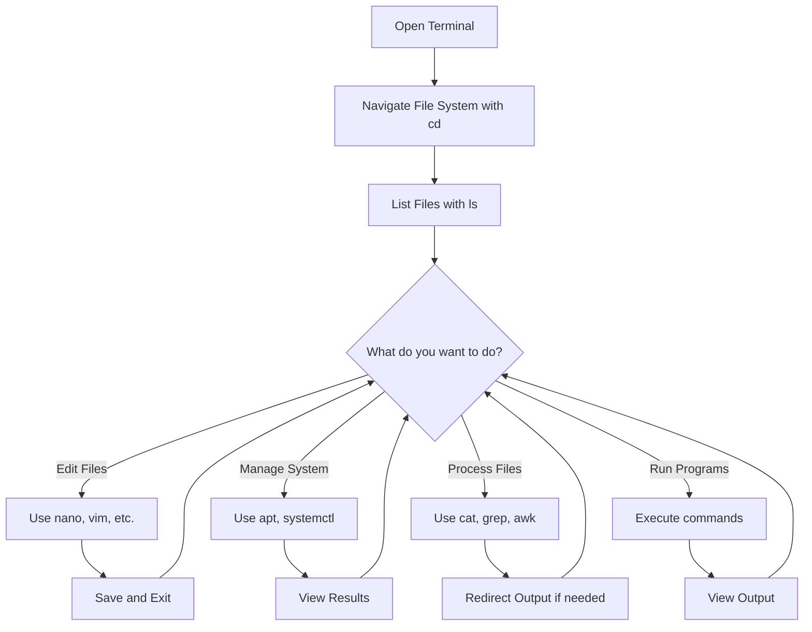

# Debian Terminal Basics

## Introduction

The terminal is a powerful interface that allows users to interact with their Debian system through text commands. While graphical user interfaces (GUIs) make many tasks accessible, mastering the terminal unlocks the full potential of your Debian system, offering greater control, efficiency, and the ability to automate tasks.

In this guide, you'll learn the essential terminal concepts and commands that form the foundation of working with Debian Linux. Whether you're a complete beginner or looking to refresh your knowledge, this tutorial will equip you with the skills to navigate, manipulate, and control your Debian system effectively through the command line.

## Opening the Terminal

In Debian, there are several ways to access the terminal:

1. **Using the Application Menu**: Click on Applications → System Tools → Terminal
2. **Keyboard Shortcut**: Press `Ctrl + Alt + T` (works in most Debian desktop environments)
3. **Right-click on Desktop**: Some desktop environments allow you to right-click and select "Open Terminal"

Once opened, you'll see a window with a prompt that typically looks like:

```bash
username@hostname:~$
```

This prompt tells you:
- Your username
- The hostname of your computer
- Your current directory (~ represents your home directory)
- $ indicates you're a regular user (# would indicate root user)

## Basic Navigation Commands

### Checking Your Current Location

To find out which directory you're currently in:

```bash
pwd
```

**Output:**
```
/home/username
```

The `pwd` command stands for "print working directory" and shows your current location in the filesystem.

### Listing Directory Contents

To see the files and folders in your current directory:

```bash
ls
```

**Output:**
```
Documents  Downloads  Music  Pictures  Videos
```

Add options to see more details:

```bash
ls -l
```

**Output:**
```
drwxr-xr-x 2 username username 4096 Mar 10 09:23 Documents
drwxr-xr-x 2 username username 4096 Mar 12 15:42 Downloads
drwxr-xr-x 2 username username 4096 Feb 25 20:11 Music
drwxr-xr-x 2 username username 4096 Mar 01 11:33 Pictures
drwxr-xr-x 2 username username 4096 Feb 20 18:57 Videos
```

The `-l` option shows:
- File permissions
- Number of links
- Owner
- Group
- File size
- Last modified date
- File/directory name

To show hidden files (those starting with a dot):

```bash
ls -a
```

**Output:**
```
.  ..  .bash_history  .bashrc  .config  Documents  Downloads  Music  Pictures  Videos
```

Combine options:

```bash
ls -la
```

### Changing Directories

To move to another directory:

```bash
cd Documents
```

To move up one level to the parent directory:

```bash
cd ..
```

To return to your home directory from anywhere:

```bash
cd
```

or

```bash
cd ~
```

To navigate to a specific path:

```bash
cd /usr/share/doc
```

To return to the previous directory you were in:

```bash
cd -
```

## File and Directory Operations

### Creating Directories

To create a new directory:

```bash
mkdir projects
```

To create nested directories (including parent directories if they don't exist):

```bash
mkdir -p projects/website/css
```

### Creating Files

To create an empty file:

```bash
touch myfile.txt
```

To create and edit a file in one step:

```bash
nano myfile.txt
```

This opens the nano text editor where you can type content, save with `Ctrl+O`, and exit with `Ctrl+X`.

### Copying Files and Directories

To copy a file:

```bash
cp myfile.txt myfile_backup.txt
```

To copy a directory with all its contents:

```bash
cp -r projects projects_backup
```

### Moving or Renaming Files and Directories

The `mv` command is used for both moving and renaming:

```bash
# To rename a file
mv myfile.txt newname.txt

# To move a file to another directory
mv newname.txt Documents/

# To move and rename at the same time
mv myfile_backup.txt Documents/archived_file.txt
```

### Removing Files and Directories

To delete a file:

```bash
rm unwanted_file.txt
```

To delete an empty directory:

```bash
rmdir empty_folder
```

To delete a directory and all its contents (use with caution!):

```bash
rm -r projects_backup
```

> ⚠️ **Warning**: Unlike graphical environments, the terminal doesn't have a trash bin or recycle folder. When you delete something with `rm`, it's permanently gone!

## Viewing File Contents

### Displaying Entire File Contents

To display the entire contents of a file:

```bash
cat README.txt
```

### Viewing Files Page by Page

For larger files, use `less` to view content one screen at a time:

```bash
less large_logfile.log
```

Navigation in `less`:
- `Space` or `Page Down`: next page
- `b` or `Page Up`: previous page
- `/pattern`: search for "pattern"
- `q`: quit

### Viewing the Beginning or End of a File

To see the first 10 lines of a file:

```bash
head README.txt
```

To specify number of lines:

```bash
head -n 5 README.txt
```

To see the last 10 lines of a file:

```bash
tail README.txt
```

To continuously watch new content being added to a file (useful for log files):

```bash
tail -f /var/log/syslog
```

## Understanding File Permissions

In Debian and all Linux systems, every file and directory has permissions that control who can read, write, or execute them.

When you run `ls -l`, you'll see something like:

```
-rw-r--r-- 1 username groupname 2048 Mar 12 14:30 myfile.txt
```

The first block of characters represents permissions:
- First character: file type (`-` for regular file, `d` for directory)
- Next three characters: owner permissions
- Next three characters: group permissions
- Last three characters: other users' permissions

Each set of three characters represents:
- `r`: read permission
- `w`: write permission
- `x`: execute permission (for files) or access permission (for directories)
- `-`: permission not granted

### Changing File Permissions

To modify permissions, use the `chmod` command:

```bash
# Give the owner execute permission
chmod u+x script.sh

# Remove write permission for group and others
chmod go-w myfile.txt

# Set specific permissions (read/write for owner, read for group and others)
chmod 644 myfile.txt
```

The numeric format (like 644) represents:
- First digit: owner permissions
- Second digit: group permissions
- Third digit: other users' permissions

Each digit is calculated by: read (4) + write (2) + execute (1)

Common permission values:
- 755: rwxr-xr-x (directories, scripts)
- 644: rw-r--r-- (regular files)

## Finding Files and Directories

### Using the Find Command

To search for files by name:

```bash
find /home/username -name "*.txt"
```

To search for directories:

```bash
find /home/username -type d -name "project*"
```

To find files modified in the last 7 days:

```bash
find /home/username -type f -mtime -7
```

### Using grep to Search File Contents

To search for a pattern in a specific file:

```bash
grep "error" logfile.txt
```

**Output:**
```
error: failed to connect to database
critical error: system shutdown initiated
```

To search recursively through all files in a directory:

```bash
grep -r "function" /home/username/projects/
```

To ignore case sensitivity:

```bash
grep -i "ERROR" logfile.txt
```

## Command History and Shortcuts

### Command History

To view previously executed commands:

```bash
history
```

**Output:**
```
1  ls
2  cd Documents
3  pwd
4  ls -la
5  cd ..
```

To run a command from history by its number:

```bash
!3
```

This would execute `pwd` from the example above.

To search through command history:
- Press `Ctrl+R`
- Type part of the command
- Press `Enter` to execute it or arrows to edit

### Useful Keyboard Shortcuts

- `Ctrl+C`: Interrupt/stop the current command
- `Ctrl+Z`: Suspend the current command
- `Ctrl+D`: Exit the current shell
- `Ctrl+L`: Clear the screen
- `Ctrl+A`: Move cursor to beginning of line
- `Ctrl+E`: Move cursor to end of line
- `Ctrl+W`: Delete the word before the cursor
- `Tab`: Auto-complete commands, filenames, or directories

## Redirecting Input and Output

The terminal allows you to redirect command output to files or use files as input.

### Redirecting Output to a File

To save command output to a file (overwrites existing content):

```bash
ls -la > directory_listing.txt
```

To append command output to a file:

```bash
echo "New line" >> notes.txt
```

### Redirecting Input from a File

To use a file as input for a command:

```bash
sort < unsorted_list.txt
```

### Piping Commands

Pipes (`|`) connect the output of one command to the input of another:

```bash
ls -la | grep "Jan"
```

This filters the directory listing to show only entries containing "Jan".

**Output:**
```
-rw-r--r-- 1 username groupname 1024 Jan 15 10:23 january_report.txt
drwxr-xr-x 2 username username 4096 Jan 30 18:43 January_Photos
```

Multiple pipes can be chained together:

```bash
cat log.txt | grep "error" | sort | uniq
```

This sequence:
1. Shows the contents of log.txt
2. Filters for lines containing "error"
3. Sorts these lines
4. Removes duplicate lines

## Package Management Basics

Debian uses the APT (Advanced Package Tool) system for installing, updating, and removing software.

### Updating Package Lists

Before installing new packages, update the package lists:

```bash
sudo apt update
```

### Upgrading Installed Packages

To upgrade all installed packages to their latest versions:

```bash
sudo apt upgrade
```

### Installing Software

To install a new package:

```bash
sudo apt install package_name
```

Example:

```bash
sudo apt install htop
```

### Removing Software

To remove an installed package:

```bash
sudo apt remove package_name
```

To remove the package along with its configuration files:

```bash
sudo apt purge package_name
```

### Searching for Packages

To search for available packages:

```bash
apt search keyword
```

Example:

```bash
apt search text-editor
```

## System Information Commands

### Checking System Resources

To see a dynamic view of system processes:

```bash
top
```

A more user-friendly alternative:

```bash
htop
```

To check disk space usage:

```bash
df -h
```

**Output:**
```
Filesystem      Size  Used Avail Use% Mounted on
/dev/sda1        20G   12G  6.8G  64% /
/dev/sda2       100G   23G   77G  24% /home
```

To check memory usage:

```bash
free -h
```

**Output:**
```
              total        used        free      shared  buff/cache   available
Mem:           7.7G        2.1G        3.8G        287M        1.8G        5.1G
Swap:          2.0G          0B        2.0G
```

### Checking System and Kernel Information

To see kernel and OS information:

```bash
uname -a
```

**Output:**
```
Linux hostname 5.10.0-21-amd64 #1 SMP Debian 5.10.162-1 (2023-01-21) x86_64 GNU/Linux
```

To see Debian version information:

```bash
lsb_release -a
```

**Output:**
```
No LSB modules are available.
Distributor ID: Debian
Description:    Debian GNU/Linux 11 (bullseye)
Release:        11
Codename:       bullseye
```

## Process Management

### Viewing Running Processes

To list all running processes:

```bash
ps aux
```

To filter for specific processes:

```bash
ps aux | grep firefox
```

### Killing Processes

To terminate a process by its ID:

```bash
kill 1234
```

To forcefully terminate a stubborn process:

```bash
kill -9 1234
```

To kill a process by name:

```bash
killall firefox
```

## Terminal Customization

### Bash Configuration Files

The main configuration files for the Bash shell are:

- `~/.bashrc`: Contains user-specific Bash settings
- `~/.bash_profile`: Executed for login shells
- `~/.bash_history`: Contains your command history
- `~/.bash_logout`: Executed when exiting a login shell

To apply changes from .bashrc without logging out:

```bash
source ~/.bashrc
```

### Creating Aliases

Aliases are shorthand commands you can create for convenience.

Add these to your `~/.bashrc` file:

```bash
# List aliases
alias ll='ls -la'
alias la='ls -a'

# Navigation aliases
alias documents='cd ~/Documents'
alias downloads='cd ~/Downloads'

# System aliases
alias update='sudo apt update && sudo apt upgrade'
```

## Working with Archives

### Creating Archives

To create a tar archive:

```bash
tar -cvf archive.tar directory/
```

To create a compressed archive with gzip:

```bash
tar -czvf archive.tar.gz directory/
```

### Extracting Archives

To extract a tar archive:

```bash
tar -xvf archive.tar
```

To extract a compressed archive:

```bash
tar -xzvf archive.tar.gz
```

## Connecting to Remote Systems

### SSH Remote Login

To connect to a remote Debian server:

```bash
ssh username@remote_host
```

Example:

```bash
ssh admin@192.168.1.100
```

### File Transfer with SCP

To copy a file to a remote system:

```bash
scp localfile.txt username@remote_host:/path/to/destination/
```

To copy a file from a remote system:

```bash
scp username@remote_host:/path/to/remotefile.txt local_directory/
```

## Common Terminal Tasks

### Network Troubleshooting

To check if a server is reachable:

```bash
ping google.com
```

To trace the route to a server:

```bash
traceroute google.com
```

To view network interfaces and IP addresses:

```bash
ip addr
```

### Scheduling Tasks with Cron

To edit your crontab file:

```bash
crontab -e
```

Example entry (run a backup script every day at 2 AM):

```
0 2 * * * /home/username/scripts/backup.sh
```

### Checking Logs

Most system logs are located in `/var/log/`. To view the system log:

```bash
sudo less /var/log/syslog
```

To view authentication attempts:

```bash
sudo less /var/log/auth.log
```

## Terminal Workflow Diagram

Here's a visual representation of a typical terminal workflow:



## Summary

In this guide, you've learned the essential terminal commands and concepts for working with Debian Linux:

- Navigating the file system with commands like `pwd`, `ls`, and `cd`
- Managing files and directories with `mkdir`, `touch`, `cp`, `mv`, and `rm`
- Viewing and manipulating file contents using `cat`, `less`, `head`, and `tail`
- Understanding and changing file permissions with `chmod`
- Finding files and text patterns using `find` and `grep`
- Redirecting input and output with `>`, `>>`, and pipes (`|`)
- Managing packages with APT
- Checking system information and resources
- Managing processes
- Customizing your terminal environment
- Working with archives and remote systems

Mastering these basics will provide a solid foundation for more advanced terminal usage and will make your Debian experience more productive.

## Exercises

1. Create a directory structure for a hypothetical web project with folders for HTML, CSS, and JavaScript files.
2. Write a shell command that finds all PNG images in your home directory and copies them to a new "Images" folder.
3. Create a bash alias that shows system information using multiple commands.
4. Write a command to find all text files in your Documents folder containing the word "important".
5. Create a tar.gz archive of your home directory's configuration files (all hidden files).

## Additional Resources

- The Debian Administrator's Handbook: Available in the package `debian-handbook`
- Manual pages: Access with `man [command]`
- Info pages: More detailed than man pages, access with `info [command]`
- Built-in help: Most commands support the `--help` option

Remember, the best way to learn the terminal is through regular practice. Start incorporating these commands into your daily work, and you'll quickly become proficient with the Debian terminal.