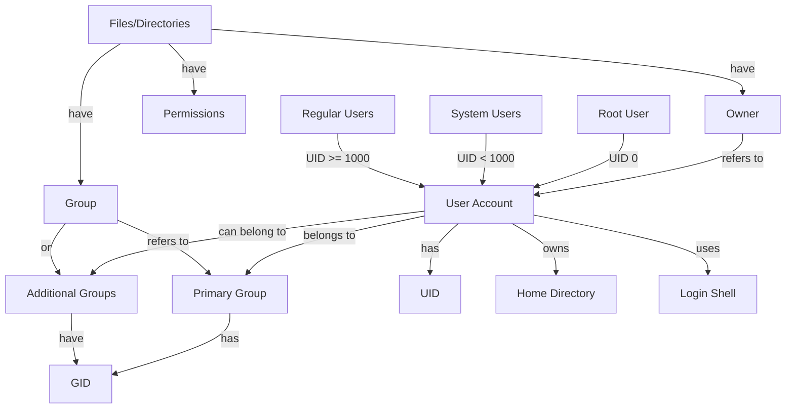

# Debian User Accounts

## Introduction

User account management is a fundamental aspect of any operating system administration, and Debian Linux is no exception. A user account provides a secure way to access a system, with each account having specific permissions and privileges. This guide explores how Debian handles user accounts, from creation and management to security best practices.

In Debian, like most Linux distributions, the user account system is built around a multi-user design that allows multiple users to access the system simultaneously while maintaining security and separation between user activities.

## Understanding Users and Groups in Debian

### Types of User Accounts

Debian distinguishes between several types of user accounts:

1. **Root User (Superuser)** - The administrator account with unrestricted access to all system resources
2. **System Users** - Accounts for system services and processes
3. **Regular Users** - Accounts for human users of the system

### User and Group Information Storage

User account information in Debian is primarily stored in these files:

- `/etc/passwd` - Contains basic user information
- `/etc/shadow` - Contains encrypted passwords and password policies
- `/etc/group` - Contains group information
- `/etc/gshadow` - Contains encrypted group passwords

Let's examine the structure of the `/etc/passwd` file:

```bash
cat /etc/passwd
```

Output example:
```
root:x:0:0:root:/root:/bin/bash
daemon:x:1:1:daemon:/usr/sbin:/usr/sbin/nologin
bin:x:2:2:bin:/bin:/usr/sbin/nologin
sys:x:3:3:sys:/dev:/usr/sbin/nologin
sync:x:4:65534:sync:/bin:/bin/sync
games:x:5:60:games:/usr/games:/usr/sbin/nologin
man:x:6:12:man:/var/cache/man:/usr/sbin/nologin
lp:x:7:7:lp:/var/spool/lpd:/usr/sbin/nologin
mail:x:8:8:mail:/var/mail:/usr/sbin/nologin
news:x:9:9:news:/var/spool/news:/usr/sbin/nologin
user1:x:1000:1000:John Doe,,,:/home/user1:/bin/bash
```

Each line represents a user account with fields separated by colons:
1. Username
2. Password placeholder (actual encrypted password is in `/etc/shadow`)
3. User ID (UID)
4. Group ID (GID)
5. User information (GECOS field)
6. Home directory
7. Login shell

## Creating and Managing User Accounts

### Adding a New User

The primary command for creating a new user in Debian is `adduser`:

```bash
sudo adduser newusername
```

Output:
```
Adding user `newusername' ...
Adding new group `newusername' (1001) ...
Adding new user `newusername' (1001) with group `newusername' ...
Creating home directory `/home/newusername' ...
Copying files from `/etc/skel' ...
New password: 
Retype new password: 
passwd: password updated successfully
Changing the user information for newusername
Enter the new value, or press ENTER for the default
	Full Name []: John Smith
	Room Number []: 
	Work Phone []: 
	Home Phone []: 
	Other []: 
Is the information correct? [Y/n] Y
```

Alternatively, you can use the lower-level `useradd` command:

```bash
sudo useradd -m -s /bin/bash newusername
sudo passwd newusername
```

The `-m` flag creates a home directory, and `-s` sets the login shell.

### Modifying a User Account

You can modify existing user accounts with the `usermod` command:

```bash
# Change a user's shell
sudo usermod -s /bin/zsh username

# Add a user to an additional group
sudo usermod -aG sudo username

# Change a user's home directory
sudo usermod -d /newhome username
```

### Deleting a User Account

To delete a user account, use the `deluser` command:

```bash
# Delete user but keep their home directory
sudo deluser username

# Delete user and their home directory
sudo deluser --remove-home username

# Delete user, their home directory, and all files owned by them
sudo deluser --remove-all-files username
```

## User Authentication and Password Management

### Setting or Changing Passwords

Users can change their own passwords using the `passwd` command:

```bash
passwd
```

Output:
```
Changing password for user1.
Current password: 
New password: 
Retype new password: 
passwd: password updated successfully
```

The root user can change any user's password without knowing their current password:

```bash
sudo passwd username
```

### Password Policies

Debian allows you to set password policies for increased security using the `libpam-pwquality` package:

```bash
sudo apt install libpam-pwquality
```

You can configure password policies by editing `/etc/pam.d/common-password` and adding parameters like:

```
password requisite pam_pwquality.so retry=3 minlen=12 difok=3 ucredit=-1 lcredit=-1 dcredit=-1 ocredit=-1 reject_username enforce_for_root
```

This configuration:
- Allows 3 password change attempts (`retry=3`)
- Requires minimum 12 characters (`minlen=12`)
- Requires at least 3 characters different from the old password (`difok=3`)
- Requires at least 1 uppercase letter (`ucredit=-1`)
- Requires at least 1 lowercase letter (`lcredit=-1`)
- Requires at least 1 digit (`dcredit=-1`)
- Requires at least 1 special character (`ocredit=-1`)
- Prevents using username in password (`reject_username`)
- Applies these rules to the root user too (`enforce_for_root`)

## Understanding User Permissions

### Basic Permission Concepts

Debian, like all Linux systems, uses a permission model based on:

- **User/Owner**: The user who owns the file
- **Group**: The group assigned to the file
- **Others**: Everyone else

Each file and directory has three types of permissions:

- **Read (r)**: Permission to read the file or list directory contents
- **Write (w)**: Permission to modify the file or create/delete files in the directory
- **Execute (x)**: Permission to execute the file or access files within the directory

Let's see an example:

```bash
ls -l /home/user1/example.txt
```

Output:
```
-rw-r--r-- 1 user1 user1 1024 Jan 15 10:30 /home/user1/example.txt
```

The permissions `-rw-r--r--` break down as:
- Owner (user1): read and write
- Group (user1): read only
- Others: read only

### Changing File Permissions

You can change permissions using the `chmod` command:

```bash
# Give execute permission to the owner
chmod u+x filename

# Remove write permission from group and others
chmod go-w filename

# Set specific permissions using octal notation
chmod 755 filename  # rwxr-xr-x
```

### Changing File Ownership

To change the owner or group of a file, use the `chown` command:

```bash
# Change owner
sudo chown newowner filename

# Change owner and group
sudo chown newowner:newgroup filename

# Change only the group
sudo chgrp newgroup filename
```

## Sudo and Administrative Access

### Configuring Sudo Access

The `sudo` command allows regular users to perform administrative tasks. To grant a user sudo privileges:

```bash
# Add user to sudo group
sudo usermod -aG sudo username
```

Alternatively, you can configure specific sudo permissions by editing the sudoers file:

```bash
sudo visudo
```

Adding a line like this would allow a user to run specific commands with sudo:

```
username ALL=(ALL) /usr/bin/apt, /sbin/reboot
```

### Using Sudo

Once configured, users can perform administrative tasks by prefixing commands with `sudo`:

```bash
sudo apt update
```

For security reasons, sudo typically asks for the user's password and grants elevated privileges for a limited time.

## User Account Security Best Practices

### Implementing Account Security

1. **Use Strong Passwords**: Enforce strong, unique passwords for all accounts

2. **Regular Password Changes**: Encourage or enforce periodic password changes

3. **Limit Sudo Access**: Only grant sudo privileges to users who need them

4. **Account Lockout Policies**: Configure account lockout after failed login attempts:

   ```bash
   sudo apt install libpam-faillock
   ```

   Then edit `/etc/pam.d/common-auth` to add lockout rules.

5. **Monitor Login Attempts**: Regularly check authentication logs:

   ```bash
   sudo tail -f /var/log/auth.log
   ```

6. **Use SSH Keys Instead of Passwords**: For remote access, SSH keys are more secure than passwords

## Working with System Groups

### Creating and Managing Groups

Groups help organize users and manage permissions efficiently. To create a new group:

```bash
sudo addgroup projectx
```

Add users to a group:

```bash
sudo adduser username projectx
# or
sudo usermod -aG projectx username
```

List all groups a user belongs to:

```bash
groups username
```

Output:
```
username : username sudo projectx
```

## Practical Examples

### Example 1: Setting Up a Shared Project Directory

Let's create a shared directory for a team working on "Project X":

```bash
# Create project group
sudo addgroup projectx

# Add users to the group
sudo usermod -aG projectx user1
sudo usermod -aG projectx user2

# Create the shared directory
sudo mkdir -p /srv/projectx

# Set ownership and permissions
sudo chown root:projectx /srv/projectx
sudo chmod 2775 /srv/projectx
```

The permissions used here (2775) include:
- 2: SGID bit, making new files inherit the group
- 7: Owner has read, write, execute
- 7: Group has read, write, execute
- 5: Others have read, execute (but not write)

### Example 2: Creating a Service User

For running a specific service, it's best to create a dedicated system user:

```bash
# Create system user without login capability
sudo useradd --system --no-create-home --shell /usr/sbin/nologin webservice

# Create directory for the service
sudo mkdir -p /var/www/service
sudo chown webservice:webservice /var/www/service

# Create systemd service file using this user
sudo nano /etc/systemd/system/webservice.service
```

Example service file:
```
[Unit]
Description=Web Service
After=network.target

[Service]
User=webservice
Group=webservice
WorkingDirectory=/var/www/service
ExecStart=/usr/bin/python3 app.py
Restart=always

[Install]
WantedBy=multi-user.target
```

### Example 3: User Account Lifecycle Automation

For environments where you need to automatically create and manage user accounts, you might create a script:

```bash
#!/bin/bash
# user_management.sh - Script to manage user accounts

# Function to create a new user with standard groups
create_user() {
    if [ $# -lt 1 ]; then
        echo "Usage: create_user <username> [fullname]"
        return 1
    fi
    
    USERNAME="$1"
    FULLNAME="${2:-$1}"
    
    # Create user with home directory
    sudo useradd -m -s /bin/bash -c "$FULLNAME" "$USERNAME"
    
    # Set random initial password and force change on first login
    TEMPPASS=$(openssl rand -base64 12)
    echo "$USERNAME:$TEMPPASS" | sudo chpasswd
    sudo passwd -e "$USERNAME"
    
    # Add to standard groups
    sudo usermod -aG users "$USERNAME"
    
    echo "User $USERNAME created with temporary password: $TEMPPASS"
    echo "User will be prompted to change password on first login"
}

# Function to disable a user account
disable_user() {
    if [ $# -lt 1 ]; then
        echo "Usage: disable_user <username>"
        return 1
    fi
    
    USERNAME="$1"
    
    # Lock the account
    sudo passwd -l "$USERNAME"
    
    # Expire the account
    sudo usermod --expiredate 1 "$USERNAME"
    
    echo "User $USERNAME has been disabled"
}

# Main script logic
case "$1" in
    "create")
        create_user "$2" "$3"
        ;;
    "disable")
        disable_user "$2"
        ;;
    *)
        echo "Usage: $0 {create|disable} username [fullname]"
        exit 1
        ;;
esac

exit 0
```

To use this script:

```bash
# Create a new user
sudo ./user_management.sh create jsmith "John Smith"

# Disable a user account
sudo ./user_management.sh disable jsmith
```

## User Account Visualization

Here's a diagram showing how users, groups, and permissions are related in Debian:



## Summary

User account management in Debian provides a robust framework for controlling system access and permissions. This guide covered:

- Creating, modifying, and deleting user accounts
- Managing passwords and implementing security policies
- Understanding and configuring file permissions
- Working with sudo for administrative access
- Best practices for user account security
- Practical examples of user management in real-world scenarios

By properly managing user accounts, you can maintain a secure system while providing appropriate access levels to users based on their needs.

## Additional Resources and Exercises

### Further Reading

- The Debian Administrator's Handbook (available online)
- Linux user management man pages: `man useradd`, `man usermod`, `man passwd`
- Debian Wiki Security section

### Exercises

1. **Basic User Management**:
   - Create a new user account
   - Set an appropriate password policy
   - Add the user to additional groups
   - Delete the user account when finished

2. **Permission Practice**:
   - Create a directory structure with different permission levels
   - Experiment with different chmod and chown commands
   - Verify the results using `ls -l`

3. **Sudo Configuration**:
   - Configure a user with limited sudo privileges
   - Test the configuration to ensure it works as expected
   - Review the auth log to see the sudo activity

4. **Group Collaboration**:
   - Set up a group-based collaborative environment
   - Create multiple users and a shared group
   - Configure a shared directory with appropriate permissions
   - Test file creation and modification by different users

5. **Security Audit**:
   - Review your system for unnecessary user accounts
   - Check for users with excessive privileges
   - Implement password policies and account lockouts
   - Monitor login attempts and authentication logs