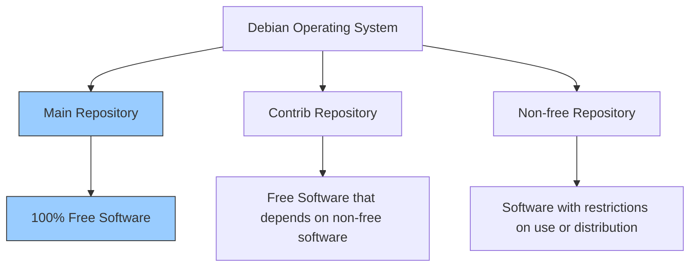
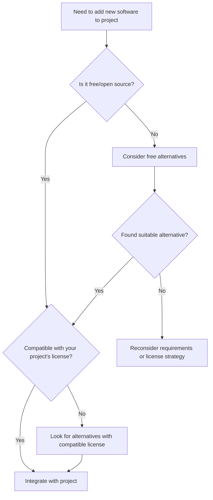

# Debian Philosophy

## Introduction

The Debian Project, founded in 1993 by Ian Murdock, is more than just a Linux distribution. It represents a comprehensive philosophy about software development, community collaboration, and freedom. This philosophy guides how Debian is built, maintained, and shared with the world. Understanding these principles is essential for anyone using Debian or considering contributing to the project.

In this article, we'll explore the core philosophical tenets that make Debian unique in the open-source ecosystem, and why these principles matter even for beginners.

## The Debian Social Contract

At the heart of Debian's philosophy is the **Debian Social Contract**, a statement of commitments that Debian makes to its users and to the free software community. Let's examine its key points:

### 1. Debian Will Remain 100% Free Software



Debian commits to keeping the Debian system (everything in the "main" distribution) entirely free software according to the **Debian Free Software Guidelines (DFSG)**. This means users have the freedom to:

- Run the programs for any purpose
- Study how programs work and modify them
- Redistribute copies
- Distribute modified versions

This commitment ensures that users always maintain control over their computing environment.

### 2. We Will Give Back to the Free Software Community

Debian developers actively contribute improvements back to the original software authors. The project shares bug fixes, enhancements, and user requests with upstream developers, strengthening the entire free software ecosystem.

For example, when a Debian developer finds and fixes a bug in a package:

```bash
# Example of creating a patch to send upstream
$ cd package-source-directory
$ git diff > fix-memory-leak.patch
$ git format-patch HEAD~1  # Create formatted patch of last commit
```

This patch would then be sent to the original software maintainers, benefiting all users of that software, not just Debian users.

### 3. We Won't Hide Problems

Debian maintains a completely open bug tracking system:

```bash
# Anyone can view Debian bugs
$ reportbug packagename  # Report a bug
$ firefox https://bugs.debian.org  # Browse all bugs online
```

Bug reports in Debian are publicly accessible, allowing anyone to see the current issues with any package. This transparency helps users make informed decisions about the software they use.

### 4. Our Priorities are Our Users and Free Software

Debian makes decisions based on the needs of its users and the principles of free software, rather than commercial interests. This user-centric approach shapes everything from release schedules to package selection.

### 5. Works That Don't Meet Our Free Software Standards

Debian acknowledges that some users require non-free software and provides separate areas ("contrib" and "non-free") to accommodate these needs, while clearly separating them from the main free distribution.

```bash
# Sources.list entry showing the separation
deb http://deb.debian.org/debian bullseye main
deb http://deb.debian.org/debian bullseye contrib non-free
```

## The Debian Free Software Guidelines (DFSG)

The DFSG defines what Debian considers "free software." These guidelines have been influential beyond Debian, forming the basis for the Open Source Definition.

Here are the key principles:

1. **Free Redistribution**: The license must allow free redistribution
2. **Source Code**: The program must include source code
3. **Derived Works**: The license must allow modifications and derived works
4. **Integrity of Author's Source Code**: The license may restrict distribution of modified source only if it allows distribution of "patch files"
5. **No Discrimination Against Persons or Groups**
6. **No Discrimination Against Fields of Endeavor**
7. **Distribution of License**: Rights must apply to everyone who receives the program
8. **License Must Not Be Specific to Debian**
9. **License Must Not Contaminate Other Software**
10. **Example Licenses**: GPL, BSD, and Artistic licenses are examples of free licenses

Let's see a practical example of how these guidelines affect software packaging:

```bash
# Checking if a package meets DFSG standards
$ debc package.changes  # Examine the package contents
$ grep -r Copyright .   # Look for copyright statements
$ grep -r License .     # Check license information
```

## Practical Application: Choosing Software for Your Project

Understanding Debian's philosophy helps when selecting components for your own projects. Here's a decision process for choosing libraries and tools:



### Example: Checking a Library's License Compatibility

Let's say you're building a GPL-licensed application and need to decide whether to use a particular library:

```bash
# First, check the library's license
$ apt-cache show libexample-dev | grep -i license
License: MIT

# For GPL compatibility, MIT is acceptable
# Now check if it's in the main repository (confirming it's free)
$ apt-cache policy libexample-dev
libexample-dev:
  Installed: (none)
  Candidate: 2.0-1
  Version table:
     2.0-1 500
        500 http://deb.debian.org/debian bullseye/main amd64 Packages
```

The library being in the "main" repository and having an MIT license confirms it meets Debian's standards for free software and is compatible with your GPL project.

## The Debian Community and Governance

Debian's philosophical approach extends to its community structure and governance:

### The Debian Constitution

Debian operates under a formal constitution that defines roles, responsibilities, and decision-making processes. It establishes a democratic system where developers can vote on important issues through a Condorcet voting method.

### Meritocratic Development

Contributions to Debian are assessed on technical merit rather than a contributor's status or affiliations. This allows anyone with skills and dedication to become a Debian Developer.

```bash
# Example process of becoming a Debian contributor
$ reportbug wnpp  # Report intention to package new software
$ dh_make -p mypackage_1.0 --createorig  # Create package template
$ debuild -us -uc  # Build the package locally
$ lintian mypackage_1.0-1_amd64.changes  # Check for policy compliance
```

### Consensus-Based Decision Making

Debian strives for consensus in technical decisions, with votes as a last resort. This collaborative approach ensures that decisions are well-considered and reflect the community's collective wisdom.

## Real-World Impact of Debian's Philosophy

Debian's philosophical foundations have had far-reaching effects beyond the distribution itself:

1. **Derived Distributions**: Ubuntu, Linux Mint, and many other distributions build upon Debian's solid free software foundation
2. **Free Software Ecosystem**: Debian's packaging work and contributions to upstream projects strengthen the entire free software movement
3. **Educational Value**: Debian's transparency makes it an excellent learning platform for understanding how operating systems work
4. **Long-term Stability**: The commitment to freedom and quality over speed has made Debian a reliable choice for critical infrastructure

### Example: Debian in Education

Many educational institutions use Debian because its philosophical alignment with academic values of openness and sharing:

```bash
# Setting up a Debian-based computer lab
$ sudo apt install ltsp-server-standalone  # Install Linux Terminal Server
$ sudo ltsp-build-client  # Build thin client image
$ sudo service ltsp-server restart  # Start the service
```

This allows schools with limited resources to provide computing access to more students through thin clients, embodying the practical benefits of Debian's free software philosophy.

## Summary

The Debian Philosophy represents a comprehensive approach to software development and distribution centered on freedom, technical excellence, openness, and community. Its principles are codified in the Social Contract and the Debian Free Software Guidelines, which have influenced the broader open-source movement.

Understanding these philosophical underpinnings helps users and developers appreciate why Debian makes certain choices and how these choices benefit users' freedom and control over their computing environment.

For beginners entering the Linux world, Debian offers not just an operating system but an education in the values that have made free software a powerful force in computing.

## Additional Resources

- [Debian Social Contract](https://www.debian.org/social_contract)
- [Debian Free Software Guidelines](https://www.debian.org/social_contract#guidelines)
- [Debian Developer's Reference](https://www.debian.org/doc/manuals/developers-reference/)
- [Debian Policy Manual](https://www.debian.org/doc/debian-policy/)

## Exercises

1. Examine the license of five packages in your Debian system and determine if they meet the DFSG criteria.
2. Find a bug in the Debian bug tracking system and observe how the community addresses it.
3. Compare the "main," "contrib," and "non-free" repositories to understand the practical implementation of Debian's software freedom principles.
4. Research a case where Debian's commitment to free software led to the replacement of a non-free component with a free alternative.
5. Try packaging a simple free software application following Debian's packaging guidelines.