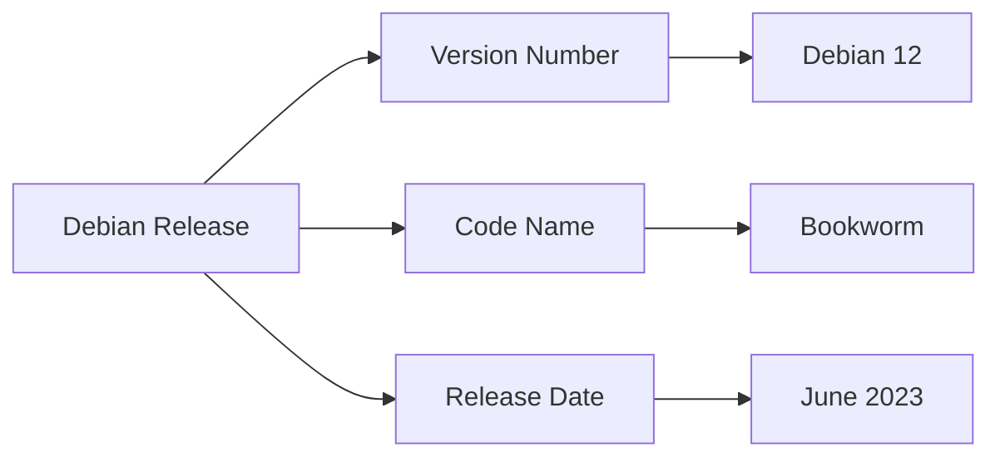
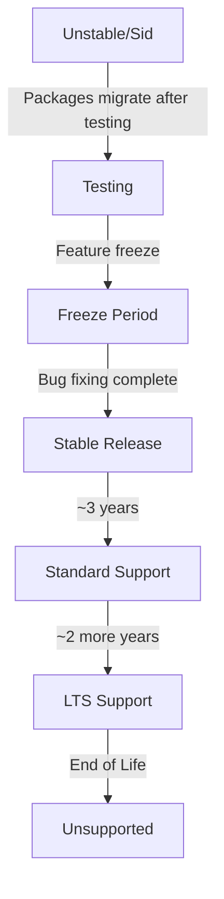

# Debian Versions

## Introduction

Debian is one of the oldest and most respected Linux distributions, serving as the foundation for many other distributions including Ubuntu. Understanding Debian's versioning system is essential for anyone working with Debian-based systems, as it helps you identify which features, packages, and support timelines apply to your installation.

In this guide, we'll explore how Debian versions work, the naming conventions, release cycles, and practical ways to identify and work with different Debian versions.

## Debian Release Philosophy

Debian follows a unique release philosophy that balances stability with access to newer software. Before diving into specific versions, let's understand Debian's release channels:

- **Stable**: The official Debian release, thoroughly tested and receiving security updates
- **Testing**: The next version in development, more current packages but not fully tested
- **Unstable (Sid)**: Constantly updated with the latest packages, used by developers and advanced users
- **Experimental**: Cutting-edge packages not yet ready for regular use

## Debian Version Naming Convention

Debian uses a distinctive naming convention for its releases, with each version receiving:

1. A **version number** (e.g., Debian 12)
2. A **code name** based on characters from the Toy Story movies (e.g., "Bookworm")

Here's a visual representation of the relationship:



## Major Debian Releases

Here's a chronological overview of major Debian stable releases:

| Version | Code Name | Release Date | End of Life |
|---------|-----------|--------------|-------------|
| 7       | Wheezy    | May 2013     | May 2018    |
| 8       | Jessie    | April 2015   | June 2020   |
| 9       | Stretch   | June 2017    | July 2022   |
| 10      | Buster    | July 2019    | June 2024   |
| 11      | Bullseye  | August 2021  | ~2026       |
| 12      | Bookworm  | June 2023    | ~2028       |

## Checking Your Debian Version

There are several ways to check which version of Debian you're running. Let's explore the most common methods:

### Method 1: Using `lsb_release`

The most straightforward way to check your Debian version is with the `lsb_release` command:

```bash
lsb_release -a
```

Output example:
```
No LSB modules are available.
Distributor ID: Debian
Description:    Debian GNU/Linux 12 (bookworm)
Release:        12
Codename:       bookworm
```

### Method 2: Check `/etc/os-release`

This file contains distribution information:

```bash
cat /etc/os-release
```

Output example:
```
PRETTY_NAME="Debian GNU/Linux 12 (bookworm)"
NAME="Debian GNU/Linux"
VERSION_ID="12"
VERSION="12 (bookworm)"
VERSION_CODENAME=bookworm
ID=debian
HOME_URL="https://www.debian.org/"
SUPPORT_URL="https://www.debian.org/support"
BUG_REPORT_URL="https://bugs.debian.org/"
```

### Method 3: Check `/etc/debian_version`

The simplest but least informative method:

```bash
cat /etc/debian_version
```

Output example:
```
12.0
```

## Understanding Debian Release Cycles

Debian's release schedule is not fixed to a calendar but follows a "when it's ready" approach. However, the project aims to release a new version approximately every 2 years.

### Release Phases

Each Debian release goes through these phases:

1. **Development Phase**: Packages enter through the unstable (Sid) branch
2. **Testing Phase**: Packages move to testing after meeting quality criteria
3. **Freeze Period**: Feature development stops, focus on bug fixing
4. **Stable Release**: Official release after all critical bugs are fixed
5. **Support Period**: Regular security updates for about 3 years
6. **LTS Period**: Limited Long Term Support for additional 2 years



## Upgrading Between Debian Versions

Debian provides tools to upgrade from one version to another. Here's the general process:

### 1. Update current system

```bash
sudo apt update
sudo apt upgrade
sudo apt full-upgrade
```

### 2. Update sources list

Edit `/etc/apt/sources.list` to replace the old codename with the new one:

```bash
# Example: Change from bullseye to bookworm
sudo sed -i 's/bullseye/bookworm/g' /etc/apt/sources.list
```

### 3. Perform the distribution upgrade

```bash
sudo apt update
sudo apt upgrade
sudo apt full-upgrade
```

### 4. Clean up and reboot

```bash
sudo apt autoremove
sudo reboot
```

## Debian Versions vs. Other Distributions

Many popular Linux distributions are based on Debian. Here's how some of them relate to Debian versions:

- **Ubuntu**: Releases every 6 months, with LTS versions every 2 years, based on Debian Testing/Unstable
- **Linux Mint**: Based on Ubuntu LTS, indirectly inherits from Debian
- **MX Linux**: Based directly on Debian Stable
- **Kali Linux**: Based on Debian Testing, focused on security testing

## Understanding Version Numbers in Package Management

When working with Debian's package manager (APT), understanding version numbers is crucial:

```bash
# List available versions of a package
apt-cache policy firefox-esr

# Install a specific version
sudo apt install firefox-esr=102.9.0esr-1~deb12u1
```

Package versions in Debian typically follow this format:
`[upstream version]-[debian revision]~[distribution]u[update number]`

## Practical Examples

### Example 1: Setting up a repository for a specific Debian version

When adding third-party repositories, you often need to specify your Debian version:

```bash
# Add a repository for Debian Bookworm
echo "deb https://packages.example.com/debian bookworm main" | sudo tee /etc/apt/sources.list.d/example.list
```

### Example 2: Docker containers with specific Debian versions

When using Docker, you can specify which Debian version to use as a base:

```bash
# Use Debian 12 (Bookworm)
FROM debian:12

# OR use the codename
FROM debian:bookworm

# Run a command to verify the version
RUN cat /etc/debian_version
```

### Example 3: Checking compatibility of software

Before installing software, you might need to check compatible Debian versions:

```bash
# Check if a package is available for your Debian version
apt-cache policy postgresql

# Output might show which versions are available for your release
```

## Common Questions About Debian Versions

### Should I use Stable, Testing, or Unstable?

- **Stable**: Recommended for production servers, critical workstations, or when you prefer reliability over having the latest software
- **Testing**: Good balance for desktop users who want relatively recent software with decent stability
- **Unstable**: For developers and those who need the latest packages and don't mind occasional breakage

### What does "oldstable" mean?

Once a new stable version is released, the previous stable version becomes "oldstable" and continues to receive security updates for a limited time.

### What is Debian LTS?

Long Term Support extends security support for older Debian versions beyond their normal end-of-life, typically for an additional 2 years.

## Summary

Understanding Debian versions is fundamental for anyone working with Debian or its derivatives. The version system helps you:

- Identify the age and support status of your installation
- Make informed decisions about upgrades
- Ensure compatibility with software and repositories
- Plan for security support timelines

Debian's balance of stability and reliability has made it one of the most trusted Linux distributions for over 30 years, and its versioning system reflects this philosophy.

## Additional Resources

- [Debian Releases Wiki](https://wiki.debian.org/DebianReleases)
- [Debian LTS Project](https://wiki.debian.org/LTS)
- [Debian Security Information](https://www.debian.org/security/)

## Exercises

1. Check which Debian version you're currently running using at least two different methods.
2. Research the upcoming Debian release and create a plan for when you might want to upgrade.
3. Find a third-party application you use and determine which Debian versions it officially supports.
4. Practice creating a container with a specific Debian version and identify key differences between versions.