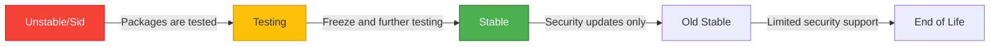

# Debian Releases

## Introduction

Debian is one of the oldest and most respected Linux distributions, serving as the foundation for many other distributions like Ubuntu. Understanding Debian's release system is crucial for system administrators, developers, and even beginners who want to use Debian effectively. This guide will walk you through Debian's release philosophy, naming conventions, life cycles, and how to choose the right version for your needs.

## Debian Release Philosophy

Debian follows a conservative release approach that prioritizes stability and reliability over having the newest software. The project maintains several releases simultaneously, each serving different purposes:

- **Stable**: The primary release for production environments
- **Testing**: The development state for the next stable release
- **Unstable**: The cutting-edge development branch

This tiered approach allows users to choose between stability and access to newer software based on their requirements.

## Debian Codenames and Numbering

Debian uses a unique naming convention for its releases:

1. Each release has a **version number** (e.g., 10, 11, 12)
2. Each release has a **codename** based on characters from the Toy Story movies

For example:

| Version | Codename | Release Date | End of Life |
|---------|----------|--------------|-------------|
| 10      | Buster   | July 2019    | June 2024   |
| 11      | Bullseye | August 2021  | August 2026 |
| 12      | Bookworm | June 2023    | June 2028   |
| 13      | Trixie   | Expected 2025 | TBD        |

### Checking Your Debian Version

You can easily check which Debian version you're running with the following commands:

```bash
# Show the Debian version number
cat /etc/debian_version

# Show the codename and more information
lsb_release -a
```

Example output:

```
$ cat /etc/debian_version
11.7

$ lsb_release -a
No LSB modules are available.
Distributor ID: Debian
Description:    Debian GNU/Linux 11 (bullseye)
Release:        11
Codename:       bullseye
```

## Debian Release Branches

Debian maintains several different branches simultaneously:

### Stable

The Stable release is the primary recommended version for production systems. It receives security updates but no major software upgrades.

- **Pros**: Extremely stable and reliable
- **Cons**: Software versions may be older
- **Best for**: Servers, critical systems, and production environments

### Testing

The Testing branch contains packages that are waiting to enter the next Stable release.

- **Pros**: More recent software than Stable
- **Cons**: Not as thoroughly tested, may have occasional issues
- **Best for**: Desktop users who want a balance of stability and newer features

### Unstable (Sid)

The Unstable branch, always codenamed "Sid", contains the latest packages.

- **Pros**: Latest software features
- **Cons**: May break, frequent updates
- **Best for**: Developers, contributors, and users who want cutting-edge software

:::tip
Unlike other releases, "Sid" is a permanent codename for the Unstable branch, named after the toy-destroying character in Toy Story who "breaks toys" – a humorous reference to the potential instability of this branch.
:::

## Release Cycle Visualization



## Life Cycle of a Debian Release

Debian follows a predictable pattern for each release:

1. **Development phase**: Software enters through Unstable/Sid
2. **Testing phase**: Packages move to Testing after initial quality checks
3. **Freeze period**: When a new release is approaching, Testing is "frozen" 
4. **Stable release**: After extensive testing, the frozen Testing becomes the new Stable
5. **Maintenance**: Security updates and critical fixes for 3-5 years
6. **Long-term support**: Selected releases get extended support (LTS) for up to 10 years

### Long-Term Support (LTS)

Some Debian releases receive LTS (Long-Term Support) for 5 years and even ELTS (Extended LTS) for up to 10 years total through community projects.

```bash
# Check if your release is still supported
debian-security-support status
```

## Choosing the Right Debian Release

Selecting the appropriate Debian release depends on your needs:

### For Servers and Production Systems

```
Recommendation: Stable
Rationale: Maximum reliability and security support
```

### For Desktop/Workstation Use

```
Recommendation: Testing or Stable
Rationale: Balance between stability and newer applications
```

### For Developers and Contributors

```
Recommendation: Unstable/Sid or Testing
Rationale: Access to newer libraries and development tools
```

## Tracking Different Releases

You can mix repositories from different releases cautiously using APT pinning:

```bash
# Example /etc/apt/preferences file for prioritizing Stable but allowing some Testing packages
Package: *
Pin: release a=stable
Pin-Priority: 700

Package: *
Pin: release a=testing
Pin-Priority: 650
```

:::caution
Mixing releases can lead to dependency issues. Use this approach carefully, especially on production systems.
:::

## Upgrading Between Releases

Debian provides well-documented upgrade paths between releases:

```bash
# Update current packages first
sudo apt update
sudo apt upgrade

# Install the upgrade tool
sudo apt install debian-upgrade

# Start the upgrade process to the next release
sudo debian-upgrade
```

For major version upgrades, always:
1. Backup your data
2. Read the release notes
3. Follow the official upgrade guide
4. Have a recovery plan

## Practical Example: Setting Up a Development Environment

Let's say you're setting up a web development environment and need to choose a Debian version:

```bash
# For a stable server environment (production)
# Choose Debian Stable (currently Bookworm/12)
sudo apt install apache2 mariadb-server php

# For a development machine with newer software
# Choose Debian Testing and enable backports
sudo apt install apache2 mariadb-server php
# Then add backports for newer versions of specific tools
echo "deb http://deb.debian.org/debian $(lsb_release -cs)-backports main" | \
  sudo tee /etc/apt/sources.list.d/backports.list
sudo apt update
sudo apt -t $(lsb_release -cs)-backports install nodejs
```

## Summary

Debian's release system offers flexibility through its different branches:
- **Stable**: Prioritizes reliability for production environments
- **Testing**: Balances newer software with reasonable stability
- **Unstable/Sid**: Provides the latest software for developers and enthusiasts

Understanding these release types helps you choose the right Debian version for your specific needs, whether you're deploying servers, creating development environments, or just learning Linux.

## Additional Resources

- [Debian Official Documentation](https://www.debian.org/doc/)
- [Debian Wiki: Release Information](https://wiki.debian.org/DebianReleases)
- [Debian Security Information](https://www.debian.org/security/)

## Exercises

1. Install a virtual machine with Debian Stable and identify the version and codename using terminal commands.
2. Research and create a table of the last 5 Debian releases with their codenames and release dates.
3. Configure a system to track both Stable and Testing repositories with appropriate pinning priorities.
4. Create a simple bash script that reports whether your Debian version is still receiving security updates.