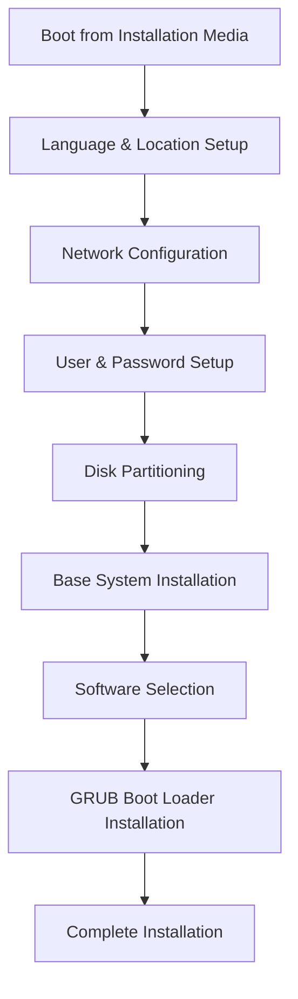

# Debian Installation

## Introduction

Debian is one of the oldest and most respected Linux distributions, known for its stability, security, and commitment to free software principles. Whether you're setting up a personal computer, a server, or preparing for more advanced Linux endeavors, installing Debian is an excellent starting point for your Linux journey.

This guide walks you through the complete Debian installation process, from preparing your system to performing the first boot. By the end, you'll have a functional Debian system ready for further configuration and use.

## Prerequisites

Before beginning the installation, make sure you have:

- A computer with at least 2GB RAM (4GB recommended)
- At least 10GB of free disk space (20GB+ recommended)
- Internet connection (preferably wired) for downloading packages
- A USB drive (4GB+) or blank DVD for creating installation media
- Basic knowledge of computer hardware components

## Preparing Installation Media

The first step is to download Debian and create bootable installation media.

### Step 1: Download the Debian ISO

Visit the [official Debian website](https://www.debian.org/distrib/) and download the latest stable release ISO. For beginners, the recommended option is:

- **Debian 12 (Bookworm)** - the current stable release
- **netinst** ISO - a smaller download that installs additional packages from the internet

### Step 2: Create Bootable USB Drive

#### On Linux:

If you're already using Linux, you can create a bootable USB using the `dd` command:

```bash
# Replace /dev/sdX with your USB device and path/to/debian.iso with your ISO file location
sudo dd if=path/to/debian.iso of=/dev/sdX bs=4M status=progress
```

#### On Windows:

On Windows, you can use tools like Rufus or balenaEtcher:

1. Download and install [Rufus](https://rufus.ie/) or [balenaEtcher](https://www.balena.io/etcher/)
2. Launch the program
3. Select the Debian ISO file
4. Select your USB drive (be careful to choose the correct drive!)
5. Click "Start" or "Flash" to create the bootable drive

## Starting the Installation

### Step 1: Boot from Installation Media

1. Insert your bootable USB drive into the computer
2. Restart the computer
3. Access the boot menu (usually by pressing F12, F2, or Del during startup - varies by computer)
4. Select your USB drive from the boot menu

### Step 2: Choose Installation Type

When the Debian installer starts, you'll see a menu. For beginners, select:

- **Install** - for text-based installation (simpler and works on all hardware)
- **Graphical Install** - for a more user-friendly interface (recommended if available)

## Installation Process

The installation process follows several key stages:



### Language, Location, and Keyboard

1. Select your language (e.g., English)
2. Choose your location (e.g., United States)
3. Select your keyboard layout (e.g., American English)

### Network Configuration

1. Enter a hostname (computer name) for your system
   - Example: `debian-workstation`
2. Enter domain name (can be left blank for home users)
3. Configure the network:
   - For wired connections, DHCP usually works automatically
   - For wireless connections, select your Wi-Fi network and enter the password

### User Setup

1. Set the root (administrator) password
   - Choose a strong, secure password
   - Note: Some Debian installations skip this and use sudo instead
2. Create a regular user account:
   - Enter your full name
   - Choose a username (lowercase, no spaces)
   - Set a secure password for this user

### Disk Partitioning

This is often the most challenging part for beginners. The safest options are:

#### Option 1: Guided - Use Entire Disk

For beginners, this is the simplest option. The installer will automatically create appropriate partitions.

1. Select "Guided - use entire disk"
2. Select the disk to install Debian on
3. Choose the partitioning scheme:
   - "All files in one partition" (simplest)
   - "Separate /home partition" (recommended for most users)
4. Review the changes and confirm by selecting "Finish partitioning and write changes to disk"
5. Confirm again when prompted with "Write the changes to disks?"

#### Option 2: Manual Partitioning

For advanced users who want more control:

1. Select "Manual"
2. Create at least:
   - A root partition (`/`) - ext4 format, at least 10GB
   - A swap partition - approximately 2x your RAM size (up to 8GB max)
   - Optionally, a separate `/home` partition for user data

Example manual partitioning scheme for a 500GB drive:

| Partition | Size | Type | Mount Point |
|-----------|------|------|-------------|
| /dev/sda1 | 512MB | EFI System Partition | /boot/efi |
| /dev/sda2 | 8GB | Swap | [SWAP] |
| /dev/sda3 | 50GB | ext4 | / |
| /dev/sda4 | ~440GB | ext4 | /home |

### Base System Installation

The installer will now copy the base Debian system to your hard drive. This process will take several minutes.

### Software Selection

After installing the base system, you'll be asked to:

1. Configure the package manager:
   - Select a mirror close to your location
   - Configure proxy settings if necessary (most home users can leave this blank)

2. Choose software to install:
   - Debian Desktop Environment (select your preferred desktop: GNOME, KDE, XFCE, etc.)
   - Web server (optional)
   - SSH server (optional, useful for remote access)
   - Standard system utilities (recommended)

This screen typically looks like:

```
[ ] Debian desktop environment
    [ ] ... GNOME
    [ ] ... Xfce
    [ ] ... KDE Plasma
    [ ] ... Cinnamon
    [ ] ... MATE
    [ ] ... LXDE
    [ ] ... LXQt
[ ] web server
[ ] print server
[ ] SSH server
[*] standard system utilities
```

Use the space bar to toggle selections and Tab to navigate.

### GRUB Boot Loader Installation

1. Agree to install the GRUB boot loader (almost always "Yes")
2. Select the drive to install GRUB on (usually the same as your main disk)

## Completing the Installation

1. The system will finalize the installation and prompt you to remove the installation media
2. Click "Continue" to reboot into your new Debian system
3. After reboot, log in with the user account you created during installation

## First Steps After Installation

Once you've logged in to your new Debian system, consider these first steps:

### Update Your System

Open a terminal and run:

```bash
sudo apt update
sudo apt upgrade
```

### Install Additional Software

You can install new software using the `apt` package manager:

```bash
# Example: Install Firefox browser
sudo apt install firefox-esr

# Example: Install development tools
sudo apt install build-essential
```

### Configure System Settings

Most desktop environments provide a Settings application where you can:
- Configure display settings
- Set up printers
- Customize appearance
- Configure network connections
- Set up user accounts

## Troubleshooting Common Issues

### Boot Problems

If your system doesn't boot after installation:
- Ensure your BIOS/UEFI is set to boot from the correct drive
- Try reinstalling GRUB using the rescue mode on the installation media

### Network Issues

If your network doesn't work:
- For wireless connections, you might need to install additional firmware:
  ```bash
  sudo apt install firmware-iwlwifi  # For Intel wireless cards
  sudo apt install firmware-realtek  # For Realtek wireless cards
  ```

### Graphics Issues

If your desktop environment doesn't display correctly:
- Try booting in recovery mode from the GRUB menu
- Install appropriate drivers for your graphics card:
  ```bash
  # For NVIDIA cards
  sudo apt install nvidia-driver
  
  # For AMD cards
  sudo apt install firmware-amd-graphics
  ```

## Summary

Congratulations! You've successfully installed Debian Linux on your computer. This is just the beginning of your Linux journey. Debian provides a stable, secure foundation for learning about Linux systems and developing your skills further.

Remember that Debian emphasizes stability and free software, making it an excellent choice for both beginners learning the fundamentals and professionals building reliable systems.

## Additional Resources

- [Debian Official Documentation](https://www.debian.org/doc/)
- [Debian Wiki](https://wiki.debian.org/)
- [Debian User Forums](https://forums.debian.net/)

## Practice Exercises

1. **System Exploration**: Navigate through your new Debian system, exploring the file structure using commands like `ls`, `cd`, and `pwd`.

2. **Package Management**: Practice installing, updating, and removing software using the `apt` command.

3. **User Management**: Create a new user account and give it sudo privileges.

4. **System Monitoring**: Learn to check system resources using commands like `top`, `free`, and `df`.

5. **Custom Configuration**: Customize your desktop environment, including themes, backgrounds, and panel arrangements.