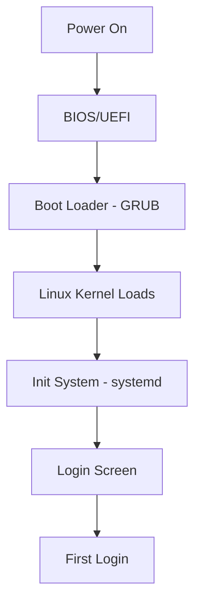

# Debian First Boot

## Introduction

After successfully installing Debian Linux on your system, the first boot experience is a crucial step in setting up your operating system. This guide walks you through the entire process of booting into your fresh Debian installation for the first time, configuring essential settings, and performing important post-installation tasks. Understanding this process is fundamental for any Linux user and forms the foundation for your journey with Debian.

## The Boot Process

When you start your computer after installing Debian, the system goes through several stages before presenting you with a usable environment.



### GRUB Boot Loader

The first software you'll see is the GRUB boot loader. By default, it displays a menu allowing you to select which operating system or kernel to boot.

![GRUB Boot Menu]

If you don't make a selection within a few seconds, the system will automatically boot into the default option (usually your newly installed Debian system).

## First Login

After the system boots, you'll be presented with a login prompt. You'll need to use the username and password you created during installation.

```
Debian GNU/Linux 12 computer tty1

computer login: your_username
Password: 
```

For security reasons, the password characters are not displayed as you type.

## Initial System Configuration

### Network Configuration

One of the first things you might want to check is your network connection. You can verify your network status with:

```bash
ip a
```

Output example:

```
1: lo: <LOOPBACK,UP,LOWER_UP> mtu 65536 qdisc noqueue state UNKNOWN group default qlen 1000
    link/loopback 00:00:00:00:00:00 brd 00:00:00:00:00:00
    inet 127.0.0.1/8 scope host lo
       valid_lft forever preferred_lft forever
    inet6 ::1/128 scope host 
       valid_lft forever preferred_lft forever
2: enp0s3: <BROADCAST,MULTICAST,UP,LOWER_UP> mtu 1500 qdisc pfifo_fast state UP group default qlen 1000
    link/ether 08:00:27:a9:27:6a brd ff:ff:ff:ff:ff:ff
    inet 192.168.1.105/24 brd 192.168.1.255 scope global dynamic enp0s3
       valid_lft 86395sec preferred_lft 86395sec
    inet6 fe80::a00:27ff:fea9:276a/64 scope link 
       valid_lft forever preferred_lft forever
```

If you need to set up your networking manually, you can edit the network configuration file:

```bash
sudo nano /etc/network/interfaces
```

### System Updates

It's essential to update your system right after installation to ensure you have the latest security patches and software updates. First, update your package lists:

```bash
sudo apt update
```

Then, upgrade your installed packages:

```bash
sudo apt upgrade
```

## Essential Post-Installation Tasks

### Setting Up Sudo

If you didn't create a root password during installation or prefer using sudo, you might need to set it up:

1. Switch to the root account:

```bash
su -
```

2. Install sudo if it's not already installed:

```bash
apt install sudo
```

3. Add your user to the sudo group:

```bash
usermod -aG sudo your_username
```

4. Log out and back in for the changes to take effect.

### Installing Essential Software

Debian's minimal installation doesn't include many applications by default. Here's how to install some essential packages:

```bash
sudo apt install build-essential curl wget git htop neofetch
```

This command installs:
- `build-essential`: Tools for compiling software
- `curl` and `wget`: Command-line tools for downloading files
- `git`: Version control system
- `htop`: Interactive process viewer
- `neofetch`: System information tool

### Setting Up a Firewall

For better security, you should set up a firewall. UFW (Uncomplicated Firewall) is a user-friendly interface for iptables:

```bash
sudo apt install ufw
sudo ufw allow ssh
sudo ufw enable
```

To check the status:

```bash
sudo ufw status
```

Output:

```
Status: active

To                         Action      From
--                         ------      ----
22/tcp                     ALLOW       Anywhere
22/tcp (v6)                ALLOW       Anywhere (v6)
```

## Desktop Environment Configuration

If you installed a desktop environment during setup (like GNOME, KDE, Xfce, etc.), you'll want to customize it.

### GNOME Desktop

If you're using GNOME, you can install the GNOME Tweaks tool for additional customization options:

```bash
sudo apt install gnome-tweaks
```

Launch it from the application menu to customize:
- Theme and appearance
- Window behavior
- Keyboard and mouse settings
- Font adjustments

### Managing Application Updates

The Software & Updates application allows you to configure how and when your system checks for updates:

1. Open "Software & Updates" from the application menu
2. Configure:
   - When to check for updates
   - Which updates to install automatically
   - Which repositories to use

## System Monitoring

It's good practice to understand how to monitor your system's performance and resource usage.

### Using the `top` Command

The `top` command provides a dynamic real-time view of the processes running on your system:

```bash
top
```

Output (example):

```
top - 15:42:03 up  2:40,  1 user,  load average: 0.00, 0.01, 0.05
Tasks: 213 total,   1 running, 212 sleeping,   0 stopped,   0 zombie
%Cpu(s):  0.7 us,  0.3 sy,  0.0 ni, 99.0 id,  0.0 wa,  0.0 hi,  0.0 si,  0.0 st
MiB Mem :   3920.7 total,   2446.1 free,    794.0 used,    680.6 buff/cache
MiB Swap:   2048.0 total,   2048.0 free,      0.0 used.   2869.8 avail Mem 

    PID USER      PR  NI    VIRT    RES    SHR S  %CPU  %MEM     TIME+ COMMAND                      
   1853 user      20   0   14380   4144   3248 R   0.7   0.1   0:00.11 top                          
      1 root      20   0  165656  12148   8492 S   0.0   0.3   0:03.88 systemd                      
      2 root      20   0       0      0      0 S   0.0   0.0   0:00.01 kthreadd                     
```

Press `q` to exit.

### Using System Monitor

If you're using a desktop environment, you can use the graphical System Monitor:

```bash
gnome-system-monitor
```

This provides a more user-friendly interface for monitoring:
- Processes
- Resources (CPU, memory, network)
- File systems

## Creating Snapshots (Optional)

If you have set up LVM (Logical Volume Manager) during installation, you can create snapshots of your filesystem as a backup before making significant changes:

```bash
sudo lvcreate -L 1G -s -n snapshot_name /dev/volume_group/logical_volume
```

Replace `snapshot_name`, `volume_group`, and `logical_volume` with your specific values.

## Common Issues and Troubleshooting

### Missing Wireless Drivers

If your wireless network isn't working, you might need to install non-free firmware:

1. Edit your sources list:

```bash
sudo nano /etc/apt/sources.list
```

2. Add "contrib non-free" to each repository line, for example:

```
deb http://deb.debian.org/debian bullseye main contrib non-free
```

3. Update and install firmware:

```bash
sudo apt update
sudo apt install firmware-iwlwifi
```

4. Reboot your system:

```bash
sudo reboot
```

### Display Resolution Issues

If your display resolution isn't correct:

```bash
sudo apt install xrandr
xrandr --output DISPLAY_NAME --mode 1920x1080
```

Replace `DISPLAY_NAME` with your display name (found by running `xrandr` without parameters).

## Security Best Practices

### Automatic Security Updates

Setting up automatic security updates is recommended:

```bash
sudo apt install unattended-upgrades
sudo dpkg-reconfigure unattended-upgrades
```

Select "Yes" to enable automatic updates.

### Setting Up SSH Keys (If Needed)

If you plan to connect to your Debian system remotely, setting up SSH keys is more secure than password authentication:

1. Generate SSH keys on your client machine:

```bash
ssh-keygen -t ed25519 -C "your_email@example.com"
```

2. Copy the public key to your Debian server:

```bash
ssh-copy-id username@debian_server_ip
```

3. Edit SSH configuration for better security:

```bash
sudo nano /etc/ssh/sshd_config
```

4. Make these changes:

```
PermitRootLogin no
PasswordAuthentication no
```

5. Restart SSH service:

```bash
sudo systemctl restart ssh
```

## Summary

Congratulations! You've successfully navigated through the first boot process of your Debian system and performed essential post-installation configuration. Your system is now updated, secured, and ready for use.

Remember that Debian emphasizes stability and security, so keeping your system updated is crucial. The configuration you've done provides a solid foundation for your Linux journey, whether you're setting up a personal workstation, a development environment, or a server.

## Additional Resources

- [Official Debian Documentation](https://www.debian.org/doc/)
- [Debian Wiki](https://wiki.debian.org/)
- [Debian User Forums](https://forums.debian.net/)

## Exercises

1. Create a new user account with administrative privileges.
2. Set up automatic backups using `rsync` or another tool of your choice.
3. Configure a cron job to perform system maintenance tasks.
4. Explore different desktop environments (if you've installed a GUI) and determine which one best suits your needs.
5. Install and configure a development environment for your preferred programming language.