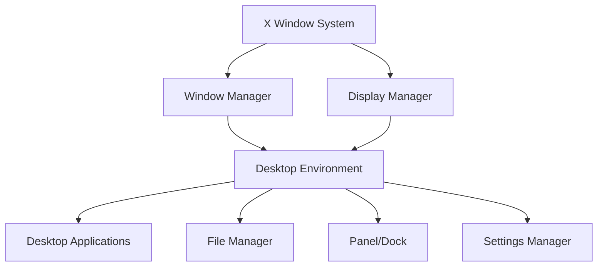

# Debian Desktop Environment

## Introduction

A desktop environment is a collection of software that provides a graphical user interface (GUI) for your operating system. In Debian Linux, desktop environments give users a visual way to interact with the system instead of using only the command line interface.

Unlike Windows or macOS, which come with a fixed interface, Debian allows you to choose from various desktop environments, each with different appearances, resource requirements, and workflow philosophies. This flexibility is one of Linux's greatest strengths, allowing you to customize your computing experience to match your preferences and hardware capabilities.

## Available Desktop Environments in Debian

Debian supports numerous desktop environments, each with its own characteristics:

### GNOME

GNOME is Debian's default desktop environment and focuses on simplicity and ease of use.


Key features:
- Modern, minimalist interface
- Activities overview for app launching and window management
- GNOME Shell extensions for customization
- Well-integrated applications

Resource usage: Moderate to high

### KDE Plasma

KDE Plasma offers a highly customizable desktop experience with a familiar layout for Windows users.

Key features:
- Extensive customization options
- Widget-based desktop components
- Visual effects and animations
- Powerful file manager (Dolphin)

Resource usage: Moderate to high

### Xfce

Xfce is designed to be lightweight and fast while maintaining visual appeal.

Key features:
- Low system resource requirements
- Traditional desktop layout
- Stable and reliable
- Fast performance on older hardware

Resource usage: Low to moderate

### LXDE/LXQt

LXDE and its successor LXQt are extremely lightweight desktop environments.

Key features:
- Minimal resource consumption
- Fast performance on very old hardware
- Simple, straightforward interface
- Basic functionality without extras

Resource usage: Very low

### MATE

MATE is a continuation of the classic GNOME 2 desktop environment.

Key features:
- Traditional desktop experience
- Familiar menus and panels
- Moderate resource requirements
- Stability and reliability

Resource usage: Low to moderate

### Cinnamon

Developed by Linux Mint, Cinnamon is also available in Debian repositories.

Key features:
- Modern appearance with traditional workflow
- Advanced effects and customizations
- Windows-like user experience
- Custom applets and desklets

Resource usage: Moderate

## Desktop Environment Architecture

Understanding how desktop environments work in Debian helps you make better choices and troubleshoot issues.

<br />



A desktop environment consists of several components:

1. **X Window System/Wayland**: The foundation that enables graphical interfaces
2. **Window Manager**: Controls placement and appearance of windows
3. **Display Manager**: Handles login screen and session initiation
4. **File Manager**: Enables browsing and managing files graphically
5. **Panel/Dock**: Provides access to applications and system information
6. **Settings Manager**: Allows configuration of system and environment settings
7. **Core Applications**: Includes text editors, terminals, and other utilities

## Installing Desktop Environments

Debian makes it easy to install desktop environments through the package management system. You can install multiple desktop environments and switch between them at login time.

### Installation Methods

#### Using tasksel (Recommended for beginners)

Tasksel provides a simple interface for installing common software collections.

```bash
# Install tasksel if not already installed
sudo apt update
sudo apt install tasksel

# Run tasksel to select desktop environments
sudo tasksel
```

Within tasksel, you can select desktop environments using the arrow keys and spacebar, then press Enter to install.

#### Using apt directly

You can also use apt to install specific desktop environments:

```bash
# Install GNOME (default)
sudo apt update
sudo apt install gnome-core

# Install KDE Plasma
sudo apt install kde-standard

# Install Xfce
sudo apt install xfce4

# Install MATE
sudo apt install mate-desktop-environment

# Install Cinnamon
sudo apt install cinnamon-desktop-environment

# Install LXQt
sudo apt install lxqt
```

### Switching Between Desktop Environments

You can switch between installed desktop environments at the login screen:

1. Log out of your current session
2. At the login screen, look for a settings icon or menu (often near the password field or username)
3. Select your preferred desktop environment from the list
4. Log in as usual

## Customizing Your Desktop Environment

Each desktop environment offers different customization options. Here's how to access them in various environments:

### GNOME Customization

```bash
# Install GNOME Tweaks for additional settings
sudo apt install gnome-tweaks

# Install GNOME Shell extensions
sudo apt install gnome-shell-extensions
```

Open the "Tweaks" application to access settings for:
- Appearance themes
- Window behaviors
- Fonts
- Extensions management

### KDE Plasma Customization

In KDE Plasma, most settings are accessible through "System Settings":
- Right-click on the desktop and select "Configure Desktop"
- Access "System Settings" from the main menu

KDE allows customization of:
- Desktop themes
- Window decorations
- Widget styles
- Panel layouts
- Desktop effects

### Xfce Customization

Access Xfce settings through:
- Applications Menu > Settings
- Right-click on the desktop and select "Desktop Settings"

Xfce customization includes:
- Panel configuration
- Window manager settings
- Appearance themes
- Session and startup options

## Desktop Environment Configuration Files

Debian desktop environments store their settings in various configuration files:

```bash
# User-specific configuration (most desktop settings)
~/.config/

# Some legacy applications may use
~/.local/share/

# System-wide configuration files
/etc/xdg/
```

For example, to backup your GNOME settings:

```bash
# Backup GNOME settings
dconf dump /org/gnome/ > gnome-settings-backup
```

To restore:

```bash
# Restore GNOME settings
dconf load /org/gnome/ < gnome-settings-backup
```

## Managing Desktop Environment Resources

Desktop environments vary in resource usage. Here's how to check resource consumption:

```bash
# Check CPU and memory usage
top

# More user-friendly alternative
sudo apt install htop
htop
```

For systems with limited resources, consider:
1. Using a lightweight desktop environment (Xfce, LXQt, MATE)
2. Disabling desktop effects and animations
3. Reducing the number of startup applications
4. Using lightweight application alternatives

## Troubleshooting Desktop Environments

Common issues and solutions:

### Desktop Environment Won't Start

If you're unable to access the graphical interface:

```bash
# Check X server logs
cat /var/log/Xorg.0.log | grep EE

# Reconfigure X server
sudo dpkg-reconfigure xserver-xorg

# Try starting X manually
startx
```

### Missing or Corrupted Theme

```bash
# Reset GNOME settings
dconf reset -f /org/gnome/

# Reset KDE Plasma settings
rm -rf ~/.config/plasma-*
```

### Slow Performance

```bash
# Check which processes are consuming resources
ps aux --sort=-%mem | head -10

# Disable desktop compositing in Xfce
xfconf-query -c xfwm4 -p /general/use_compositing -s false
```

## Practical Example: Setting Up a Development Environment

Let's create a productive development setup in Debian GNOME:

1. Install development tools and extensions:

```bash
# Install development tools
sudo apt install build-essential git vscode

# Install useful GNOME extensions
sudo apt install gnome-shell-extension-dash-to-dock \
                 gnome-shell-extension-system-monitor
```

2. Configure workspace settings:

```bash
# Create multiple workspaces for different tasks
gsettings set org.gnome.mutter dynamic-workspaces false
gsettings set org.gnome.desktop.wm.preferences num-workspaces 4

# Set keyboard shortcuts for workspace switching
gsettings set org.gnome.desktop.wm.keybindings switch-to-workspace-1 "['<Super>1']"
gsettings set org.gnome.desktop.wm.keybindings switch-to-workspace-2 "['<Super>2']"
gsettings set org.gnome.desktop.wm.keybindings switch-to-workspace-3 "['<Super>3']"
gsettings set org.gnome.desktop.wm.keybindings switch-to-workspace-4 "['<Super>4']"
```

3. Enable development-friendly features:

```bash
# Enable night light to reduce eye strain
gsettings set org.gnome.settings-daemon.plugins.color night-light-enabled true

# Configure power settings for development (prevent sleep during long compilations)
gsettings set org.gnome.settings-daemon.plugins.power sleep-inactive-ac-type 'nothing'
```

## Summary

Desktop environments are a crucial part of the Debian experience, providing the graphical interface through which you interact with your system. Debian's strength lies in offering choices – from lightweight options for older hardware to feature-rich environments for modern systems.

Key takeaways:
- Debian offers multiple desktop environments to suit different needs and preferences
- You can install and switch between desktop environments without reinstalling the operating system
- Each environment offers different customization options and resource requirements
- Configuration files allow for backup and restoration of settings
- Troubleshooting tools help resolve common desktop environment issues

## Additional Resources

For further learning:

- [Debian Official Wiki: Desktop Environments](https://wiki.debian.org/DesktopEnvironment)
- [Debian Package Search](https://packages.debian.org/)
- [GNOME User Documentation](https://help.gnome.org/)
- [KDE UserBase Wiki](https://userbase.kde.org/)
- [Xfce Documentation](https://docs.xfce.org/)

## Exercises

1. Install two different desktop environments and compare their resource usage using `htop`.
2. Create a custom keyboard shortcut in your desktop environment to launch the terminal.
3. Find and install a new theme for your desktop environment, then apply it.
4. Configure your desktop environment to automatically start your favorite development tools when you log in.
5. Backup your desktop environment settings to a file, then restore them on another user account or system.