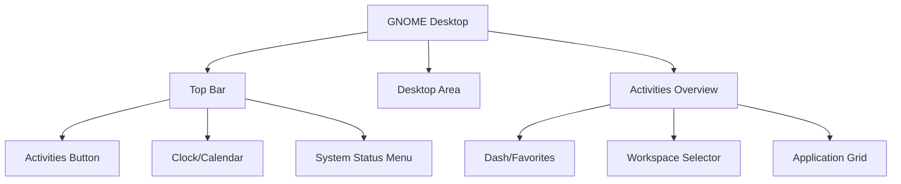

# Debian GNOME Interface

## Introduction

The GNOME desktop environment is one of the most popular graphical user interfaces (GUI) for Linux distributions, including Debian. It provides users with an intuitive, clean, and modern interface to interact with their operating system. If you're transitioning from Windows or macOS to Debian Linux, understanding the GNOME interface will help you navigate and use your system efficiently.

This guide introduces you to the Debian GNOME interface, its key components, and basic operations, helping you become comfortable with this powerful desktop environment.

## What is GNOME?

GNOME (GNU Network Object Model Environment) is a free and open-source desktop environment for Unix-like operating systems. It's designed with simplicity, accessibility, and usability in mind. 

In Debian, GNOME is the default desktop environment for the standard installation, starting from Debian 9 (Stretch). It provides:

- A clean, minimal desktop
- An activities overview for application management
- Virtual workspaces
- Notifications system
- Integrated search functionality
- System settings for customization

## The GNOME Desktop Layout

When you first boot into Debian with GNOME, you'll see a clean desktop with these main elements:

- **Top Bar**: Contains the Activities button, clock, and system status menu
- **Desktop Area**: The main workspace where you can place files and folders
- **Activities Overview**: Accessed by clicking "Activities" or pressing the Super key (Windows key)



## Getting Started with GNOME

### The Top Bar

The top bar in GNOME is always visible and contains:

- **Activities**: Click to access the Activities Overview
- **Clock/Calendar**: Shows the current time and date; click to see calendar and notifications
- **System Status Menu**: Contains volume, network, battery status, and power options

### Activities Overview

The Activities Overview is the central hub for finding and launching applications, managing windows, and switching workspaces.

To access the Activities Overview:
1. Click on "Activities" in the top-left corner
2. Press the Super key (Windows key) on your keyboard
3. Move your mouse cursor to the top-left hot corner (if enabled)

Within the Activities Overview, you'll find:

- **Search Bar**: Type to find applications, files, or settings
- **Dash/Favorites**: Quick access to frequently used applications
- **Workspace Selector**: Navigate between virtual desktops
- **Window Overview**: See all open windows

### Launching Applications

There are several ways to launch applications in GNOME:

1. **Using the Activities Overview**:
   - Press the Super key
   - Type the name of the application
   - Press Enter or click on the application icon

2. **Using the Applications Grid**:
   - Enter Activities Overview (Super key)
   - Click the "Show Applications" button (nine dots) at the bottom of the Dash
   - Browse through available applications

3. **From Favorites**:
   - Applications pinned to the Dash can be launched with a single click

For example, to launch the Terminal:

```
Super key → Type "terminal" → Press Enter
```

### Managing Windows

GNOME provides several ways to manage your application windows:

- **Maximize/Restore**: Double-click the title bar or use the window buttons
- **Resize**: Drag any edge or corner of a window
- **Move**: Drag the window by its title bar
- **Close**: Click the X button or press Alt+F4
- **Switch Between Windows**: Alt+Tab or view all windows in Activities Overview

### Virtual Workspaces

Workspaces help you organize your applications and reduce desktop clutter:

1. **Create a New Workspace**:
   - Enter Activities Overview (Super key)
   - Drag an application to the workspace selector on the right
   - A new workspace is automatically created

2. **Switch Between Workspaces**:
   - Use Super+Page Up/Page Down
   - Ctrl+Alt+Up/Down arrows
   - Select from the workspace selector in Activities Overview

## File Management with Nautilus

GNOME's file manager, Nautilus (also called "Files"), provides an intuitive way to manage your files and folders.

To open Nautilus:
```
Super key → Type "files" → Press Enter
```

Key features of Nautilus include:

- **Sidebar Navigation**: Quick access to common locations
- **Search Functionality**: Find files quickly by name or content
- **View Options**: List or grid view (use the menu in the top-right)
- **Tabs**: Open multiple locations in tabs (Ctrl+T to create a new tab)

Basic file operations:

- **Copy files**: Ctrl+C
- **Cut files**: Ctrl+X
- **Paste files**: Ctrl+V
- **Create new folder**: Ctrl+Shift+N
- **Delete files**: Delete key (moves to trash) or Shift+Delete (permanent deletion)

## System Settings

GNOME provides a comprehensive Settings application for customizing your desktop experience.

To access Settings:
```
Super key → Type "settings" → Press Enter
```

Or click on the system status menu in the top-right corner and select the settings gear icon.

Common settings you may want to adjust:

- **Appearance**: Change desktop background, enable dark mode
- **Display**: Adjust resolution, scale, multi-monitor setup
- **Keyboard**: Customize shortcuts
- **Mouse & Touchpad**: Adjust pointer speed and behavior
- **Network**: Configure internet connections
- **Sound**: Adjust volume levels and notification sounds
- **Privacy**: Control location services and usage history

Example of changing the desktop background:
1. Open Settings
2. Click on "Background"
3. Select either a preset background or click "Add Picture" to use your own image
4. The change is applied immediately

## GNOME Extensions

GNOME can be enhanced with extensions that add new features or modify existing ones. These are similar to browser extensions but for your desktop.

To manage extensions:

1. Install the GNOME Extensions package:
```bash
sudo apt update
sudo apt install gnome-shell-extensions gnome-shell-extension-manager
```

2. Launch the Extensions app:
```
Super key → Type "extensions" → Press Enter
```

3. From here, you can:
   - Enable/disable installed extensions
   - Access settings for individual extensions
   - Browse and install new extensions (via the Extensions Manager)

Some popular GNOME extensions include:
- Dash to Dock (adds a persistent dock)
- Clipboard Indicator (enhanced clipboard management)
- Weather (displays weather information in the top bar)
- Screenshot Tool (improved screenshot capabilities)

## Terminal Integration

While GNOME provides a complete graphical interface, the terminal remains an essential tool for many tasks in Debian.

To open the GNOME Terminal:
```
Super key → Type "terminal" → Press Enter
```

Or use the keyboard shortcut: Ctrl+Alt+T (if configured)

The GNOME Terminal features:
- Tab support (Ctrl+Shift+T to open a new tab)
- Customizable color schemes and fonts
- Profile management for different terminal configurations

Basic terminal commands to get started:

```bash
# List files and directories
ls

# Change directory
cd Documents

# Create a new directory
mkdir new_folder

# Check system information
neofetch

# Update your system
sudo apt update && sudo apt upgrade
```

## Keyboard Shortcuts

Learning keyboard shortcuts can significantly improve your productivity in GNOME. Here are some essential ones:

| Shortcut | Action |
|----------|--------|
| Super | Open Activities Overview |
| Super+A | Show Applications grid |
| Alt+Tab | Switch between windows |
| Super+L | Lock screen |
| Super+D | Show desktop |
| Super+V | Notification center |
| Ctrl+Alt+T | Open Terminal (if configured) |
| Print Screen | Take screenshot |
| Alt+F2 | Run command dialog |
| Super+Arrow keys | Snap windows |

## Customizing Your GNOME Experience

GNOME can be customized to match your preferences and workflow:

### Changing Themes

1. Install GNOME Tweaks:
```bash
sudo apt update
sudo apt install gnome-tweaks
```

2. Open GNOME Tweaks:
```
Super key → Type "tweaks" → Press Enter
```

3. Navigate to "Appearance" to change:
   - Application themes
   - Cursor themes
   - Icon themes
   - Shell themes (requires User Themes extension)

### Adjusting Behavior

In GNOME Tweaks, you can also modify:
- Window titlebars (buttons and their placement)
- Keyboard and mouse behavior
- Top bar settings
- Startup applications

### Creating Custom Keyboard Shortcuts

1. Open Settings
2. Navigate to "Keyboard"
3. Scroll down to "Keyboard Shortcuts"
4. Click the "+" button at the bottom to add a new shortcut
5. Define a name, command, and the keyboard combination

For example, to create a shortcut for taking a screenshot of a selected area:
- Name: "Screenshot Area"
- Command: `gnome-screenshot -a`
- Shortcut: Shift+Print Screen

## Troubleshooting Common Issues

### Desktop Freezes

If your GNOME desktop becomes unresponsive:

1. Try restarting the shell by pressing Alt+F2, typing `r`, and pressing Enter
2. If that doesn't work, switch to a console with Ctrl+Alt+F3, log in, and restart GNOME:
```bash
killall -3 gnome-shell
```
3. Return to the graphical interface with Ctrl+Alt+F2

### Missing Icons or Themes

If icons or themes aren't displaying correctly:

```bash
# Refresh the icon cache
gtk-update-icon-cache -f -t ~/.local/share/icons/

# Ensure theme packages are installed
sudo apt install gnome-themes-extra
```

### Session Problems

If you're having trouble with your GNOME session:

1. Check if your session is properly configured:
```bash
cat ~/.config/gnome-session/sessions
```

2. Reset GNOME configuration (caution: this resets all customizations):
```bash
dconf reset -f /org/gnome/
```

## Summary

The GNOME desktop environment in Debian provides a clean, modern interface that combines simplicity with powerful features. In this guide, we've covered:

- The basic layout and components of the GNOME desktop
- How to launch and manage applications
- File management with Nautilus
- System customization through Settings and GNOME Tweaks
- Using virtual workspaces for better organization
- Essential keyboard shortcuts to improve productivity
- Terminal integration for advanced tasks
- Troubleshooting common issues

As you become more familiar with GNOME, you'll discover that it offers an efficient and customizable environment for both everyday computing tasks and more advanced Linux operations.

## Additional Resources

To further explore and master the GNOME desktop environment:

- **Official GNOME Documentation**: [GNOME Help](https://help.gnome.org/)
- **Debian GNOME Wiki**: [Debian Wiki GNOME Page](https://wiki.debian.org/Gnome)
- **GNOME Extensions Website**: [extensions.gnome.org](https://extensions.gnome.org/)

## Exercises

1. **Workspace Management**: Create three workspaces and arrange different applications in each. Practice switching between them using keyboard shortcuts.

2. **Terminal Practice**: Use the terminal to create a folder structure for a project with multiple subdirectories.

3. **Customization Challenge**: Change your desktop theme, background, and add at least one GNOME extension that enhances your workflow.

4. **Keyboard Shortcut Mastery**: Create three custom keyboard shortcuts for operations you perform frequently.

5. **File Management**: Create a file organization system using Nautilus bookmarks for your most-used folders.