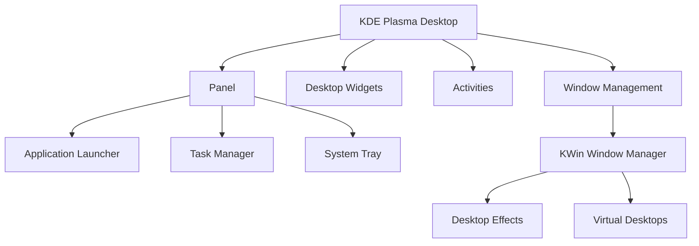

# Debian KDE Interface

## Introduction

The KDE Plasma desktop environment is one of several graphical user interfaces available for Debian Linux. KDE offers a modern, customizable, and feature-rich experience that many users find both powerful and intuitive. This guide will introduce you to KDE on Debian, explain its core components, and walk you through essential tasks and customizations to help you become productive with this desktop environment.

KDE Plasma differs from other desktop environments like GNOME or Xfce in its philosophy of providing extensive customization options while maintaining a familiar desktop paradigm with a panel, application menu, and desktop widgets.

## Installing KDE on Debian

If you haven't installed KDE yet, you can add it to your existing Debian system or choose it during the Debian installation process.

### Installing KDE on an Existing Debian System

To install the full KDE Plasma desktop environment on a Debian system, use the following command:

```bash
sudo apt update
sudo apt install kde-full
```

For a minimal KDE installation, use:

```bash
sudo apt update
sudo apt install kde-plasma-desktop
```

After installation, you'll need to restart your system or log out and select KDE Plasma at the login screen.

## Core Components of KDE Plasma

### The Plasma Desktop

The Plasma desktop in KDE consists of several key components:

1. **Panel** - The bar (typically at the bottom) containing the application launcher, task manager, and system tray
2. **Plasma Widgets** - Small applications that can be placed on the desktop or panel
3. **Activities** - Different desktop configurations for various tasks or projects
4. **KRunner** - A powerful search and launch tool (activated with Alt+Space)



### System Settings

KDE System Settings is the central configuration hub where you can customize nearly every aspect of your desktop environment. To access it:

1. Click on the application launcher (usually in the bottom-left corner)
2. Search for "System Settings" or find it in the Applications menu

Alternatively, you can launch it from the terminal:

```bash
systemsettings5
```

## Basic Navigation and Usage

### Application Launcher

The default application launcher in KDE Plasma is accessed by clicking on the menu icon (typically in the lower-left corner of the screen). This launcher displays:

- Favorite applications
- A search field
- Categorized list of all installed applications
- Power and session options

### Task Manager

The task manager displays running applications in the panel. You can:

- Click on an application to bring it to focus
- Right-click for additional options like "Close" or "Move to Desktop"
- Middle-click to close an application

### Virtual Desktops

KDE allows you to organize your work across multiple virtual desktops:

1. To switch between desktops, use the desktop pager in the panel or press `Ctrl+F1`, `Ctrl+F2`, etc.
2. To move a window to another desktop, right-click on its title bar and select "Move to Desktop"

You can configure virtual desktops in System Settings → Workspace Behavior → Virtual Desktops.

## Customizing KDE Plasma

One of KDE's greatest strengths is its customizability. Here are some common customizations:

### Changing the Theme

1. Open System Settings
2. Go to "Appearance"
3. Choose "Global Theme" for overall look and feel
4. For more specific customization, explore the individual sections:
   - Plasma Style
   - Application Style
   - Window Decorations
   - Colors
   - Fonts
   - Icons

### Adding Widgets to Desktop or Panel

To add widgets to your desktop:

1. Right-click on an empty area of the desktop
2. Select "Add Widgets"
3. Drag your chosen widget to the desktop

To add widgets to the panel:

1. Right-click on the panel
2. Select "Add Widgets"
3. Drag your chosen widget to the panel

### Configuring Panel

To customize your panel:

1. Right-click on an empty area of the panel
2. Select "Edit Panel"
3. You can now:
   - Drag to reposition widgets
   - Add or remove widgets
   - Change panel height and position
   - Add additional panels

```bash
# Example of using KDE configuration from the command line
# To change the plasma theme:
kwriteconfig5 --file plasmarc --group Theme --key name breeze-dark

# To reload the configuration
qdbus org.kde.plasmashell /PlasmaShell org.kde.PlasmaShell.refreshCurrentShell
```

## KDE Applications

KDE comes with a suite of applications designed to integrate well with the desktop environment. Here are some notable ones:

### Dolphin File Manager

Dolphin is KDE's powerful file manager:

```bash
# Launch Dolphin
dolphin
```

Key features include:
- Split view (F3)
- Tabs (Ctrl+T)
- Places sidebar
- Detailed file information
- Built-in terminal (F4)

### Konsole Terminal Emulator

Konsole is KDE's feature-rich terminal:

```bash
# Launch Konsole
konsole
```

Notable features:
- Tab support
- Split terminals
- Profile management
- Customizable appearance

### KWrite and Kate Text Editors

KDE offers two text editors:
- KWrite: A simple text editor
- Kate: A more advanced editor with programming features

```bash
# Launch Kate text editor
kate

# Launch KWrite
kwrite
```

## Working with KDE Configuration Files

KDE stores its configuration in several locations:

1. User-specific configuration: `~/.config/`
2. User-specific data: `~/.local/share/`
3. KDE-specific configuration: `~/.kde/` or `~/.kde4/` (on some systems)

Example of a manual configuration change:

```bash
# Edit the KWin configuration file
nano ~/.config/kwinrc

# After manual editing, you may need to restart KWin
kwin_x11 --replace &
```

## Troubleshooting Common Issues

### Resetting Plasma Configuration

If your KDE desktop becomes unstable, you can reset Plasma to default settings:

```bash
# Stop Plasma
kquitapp5 plasmashell

# Remove the configuration file
rm ~/.config/plasma-org.kde.plasma.desktop-appletsrc

# Restart Plasma
plasmashell &
```

### Resolving Display Issues

If you encounter display problems:

1. Check your graphics drivers
2. Try disabling desktop effects:
   - System Settings → Workspace Behavior → Desktop Effects → Uncheck "Enable desktop effects"

```bash
# To disable compositing from the command line
kwriteconfig5 --file kwinrc --group Compositing --key Enabled false

# Restart KWin
kwin_x11 --replace &
```

## Practical Examples

### Setting Up a Development Environment

Here's how to configure KDE for programming:

1. **Create a coding Activity**:
   - Right-click on desktop → Activities → Create Activity
   - Name it "Development"

2. **Add development widgets**:
   - Notes widget for quick code snippets
   - System monitor to track resource usage
   - Recent documents for quick access to projects

3. **Configure Konsole for development**:
   - Open Konsole → Settings → Edit Current Profile
   - Set a monospace font like Fira Code or DejaVu Sans Mono
   - Create a custom color scheme optimized for coding

4. **Set up virtual desktops**:
   - Desktop 1: Code editor and documentation
   - Desktop 2: Terminal and build tools
   - Desktop 3: Testing and debugging

### Creating a Custom KDE Panel Layout

Let's create a productivity-focused panel layout:

1. Remove the default panel:
   - Right-click panel → More Options → Remove Panel

2. Add a new panel:
   - Right-click on desktop → Add Panel → Empty Panel

3. Configure the new panel:
   - Right-click on panel → Edit Panel
   - Position at the top of the screen
   - Set height to 32px

4. Add essential widgets in this order:
   - Application Launcher
   - Global Menu (displays menu of active application)
   - Icons-only Task Manager
   - Digital Clock
   - System Tray

```bash
# After setting up your perfect layout, you can export it
# (This requires plasma-sdk to be installed)
plasmapackage --create mypanellayout --type plasma-layout
cp ~/.config/plasma-org.kde.plasma.desktop-appletsrc mypanellayout/contents/layout.js
# Then edit the layout.js file to clean it up
```

## Integrating with the Debian System

KDE integrates well with the Debian system in several ways:

### Package Management

While KDE includes Discover as a graphical package manager, you can still use Debian's traditional tools:

```bash
# Install software using apt in terminal
sudo apt install package-name

# Or use Synaptic package manager
sudo apt install synaptic
```

### System Administration

KDE provides graphical tools for many system administration tasks:

- User management: System Settings → Users
- Network configuration: System Settings → Connections
- Printer setup: System Settings → Printers

For more advanced tasks, you can still use Debian's traditional command-line tools.

## Summary

The KDE Plasma desktop environment on Debian provides a powerful, flexible, and user-friendly computing experience. Key takeaways from this guide:

- KDE offers extensive customization options to suit your workflow
- The desktop environment includes a comprehensive suite of integrated applications
- You can modify nearly every aspect of the interface through System Settings
- KDE works seamlessly with Debian's package management and system tools
- Advanced users can leverage configuration files and scripting for deeper customization

## Additional Resources

To continue learning about KDE on Debian:

- Visit the [KDE Community website](https://kde.org/) for documentation and news
- Explore Debian's [KDE Wiki](https://wiki.debian.org/KDE)
- Join the KDE community forums for support and tips
- Experiment with KDE Plasma widgets from the KDE Store

## Exercises

1. **Basic**: Install KDE on a Debian system and configure the panel to match your preferences.

2. **Intermediate**: Create a custom global theme by modifying the colors, icons, and window decorations.

3. **Advanced**: Set up three different Activities for specific workflows (e.g., Development, Office, Entertainment) with appropriate widgets and applications.

4. **Expert**: Write a Bash script that automatically configures KDE settings to your preferences, useful for setting up new installations quickly.