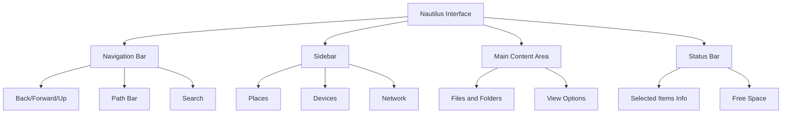

# Debian File Explorer

## Introduction

In Debian Linux, a file explorer (also known as a file manager) is an essential tool that provides a graphical user interface for browsing, searching, and manipulating files and directories on your system. Unlike Windows Explorer or macOS Finder, Debian offers several file explorers that vary in features, resource usage, and user interface design. This guide will introduce you to the most common file explorers available in Debian, their key features, and how to use them effectively as a beginner.

## Popular File Explorers in Debian

Debian supports multiple file explorers, each with its own strengths. The ones you'll most commonly encounter are:

1. **Nautilus (Files)** - The default file manager in GNOME desktop environment
2. **Thunar** - The default file manager in Xfce desktop environment
3. **PCManFM** - The default file manager in LXDE/LXQt desktop environments
4. **Dolphin** - The default file manager in KDE Plasma desktop environment
5. **Nemo** - The default file manager in Cinnamon desktop environment

Let's examine each of these options in more detail.

## Nautilus (GNOME Files)

Nautilus, also simply called "Files" in the GNOME desktop environment, is the default file explorer in Debian when using GNOME.

### Key Features

- Clean, modern interface
- Tabbed browsing
- Powerful search functionality
- Customizable sidebar
- Built-in file previews
- Network browsing capability
- Integrated file compression/extraction

### Basic Usage

To open Nautilus:
- Click on the "Files" icon in the dock or applications menu
- Press `Alt+F2` and type `nautilus`
- Open a terminal and run:

```bash
nautilus
```

### Interface Overview



### Common Operations

#### Creating New Folders

1. Right-click in an empty area of the file explorer
2. Select "New Folder"
3. Type a name for the folder
4. Press Enter

Alternatively, use the keyboard shortcut `Ctrl+Shift+N`.

#### Copying and Moving Files

**Method 1: Drag and Drop**
- To copy: Hold `Ctrl` while dragging files to the destination
- To move: Simply drag files to the destination
- To create a link: Hold `Ctrl+Shift` while dragging

**Method 2: Copy/Paste**
1. Select your files
2. Press `Ctrl+C` to copy or `Ctrl+X` to cut
3. Navigate to the destination
4. Press `Ctrl+V` to paste

#### File Selection

- Select multiple contiguous files: Click the first file, then `Shift`-click the last file
- Select multiple non-contiguous files: Hold `Ctrl` while clicking each file
- Select all files: Press `Ctrl+A`

#### Viewing Options

Nautilus offers several view modes:
- **Icon View**: Press `Ctrl+1` - Shows files as icons in a grid
- **List View**: Press `Ctrl+2` - Shows files in a detailed list with columns
- **Compact View**: A condensed version of the List View

#### Hidden Files

To show hidden files (those beginning with a dot), press `Ctrl+H` or select "Show Hidden Files" from the view menu.

## Thunar File Manager

Thunar is the default file manager for the Xfce desktop environment, known for being lightweight yet feature-rich.

### Key Features

- Lightweight and fast performance
- Customizable sidebar
- Bulk renaming tool
- Custom actions
- Thumbnail support
- Volume management

### Basic Usage

To open Thunar:
- Click on the "File Manager" icon in the application menu
- Open a terminal and run:

```bash
thunar
```

### Custom Actions

One of Thunar's standout features is the ability to create custom actions for files. Here's how:

1. Go to Edit → Configure custom actions
2. Click the + button to add a new action
3. Fill in:
   - Name: (e.g., "Open in Text Editor")
   - Command: (e.g., `gedit %f`)
   - File Pattern: (e.g., `*`)
   - Appearance Conditions: (select when this action should appear)

Example custom action to compress selected files:

```bash
zip -r %n.zip %F
```

This creates a ZIP archive named after the first selected file, containing all selected files.

## PCManFM

PCManFM is the default file manager for LXDE/LXQt desktop environments, designed to be extremely lightweight.

### Key Features

- Very low resource usage
- Tabbed browsing
- Dual-pane view option
- File searching
- Thumbnail support
- Network browsing

### Basic Usage

To open PCManFM:
- Click on the file manager icon in the application menu
- Open a terminal and run:

```bash
pcmanfm
```

### Dual-Pane Mode

PCManFM offers a dual-pane mode similar to traditional file managers like Midnight Commander:

1. Go to View → Dual Pane Mode
2. You can now work with two different directories side by side
3. This makes copying or moving files between locations much easier

## Command Line File Management

While graphical file explorers are convenient, many Debian users prefer command-line tools for file management due to their power and efficiency.

### Essential Commands

#### Listing Files and Directories

```bash
# List files in current directory
ls

# List files with details (permissions, size, date)
ls -l

# List all files including hidden ones
ls -la

# List files with human-readable sizes
ls -lh
```

Example output:

```
$ ls -lh
total 20K
drwxr-xr-x 2 user user 4.0K Mar 10 14:22 Documents
drwxr-xr-x 2 user user 4.0K Mar 10 14:22 Downloads
drwxr-xr-x 2 user user 4.0K Mar 10 14:22 Pictures
-rw-r--r-- 1 user user  150 Mar 10 14:23 notes.txt
-rw-r--r-- 1 user user 2.5K Mar 10 14:23 report.pdf
```

#### Navigating Directories

```bash
# Change to a specific directory
cd /path/to/directory

# Change to home directory
cd

# Go up one level
cd ..

# Go to previous directory
cd -

# Print working directory (show where you are)
pwd
```

#### File Operations

```bash
# Copy a file
cp source.txt destination.txt

# Copy a directory and its contents
cp -r source_dir destination_dir

# Move or rename a file
mv oldname.txt newname.txt

# Move a file to another directory
mv file.txt /path/to/directory/

# Remove a file
rm filename.txt

# Remove an empty directory
rmdir directory_name

# Remove a directory and all its contents (be careful!)
rm -r directory_name
```

#### Creating Directories and Files

```bash
# Create a directory
mkdir directory_name

# Create nested directories
mkdir -p parent/child/grandchild

# Create an empty file
touch filename.txt
```

## Integration Between GUI and Command Line

Debian's file explorers integrate well with the command line:

### Opening Terminal in Current Location

- **In Nautilus**: Right-click in the folder and select "Open in Terminal"
- **In Thunar**: Right-click and select "Open Terminal Here"
- **In PCManFM**: Right-click and select "Open in Terminal"

### Opening File Explorer from Terminal

```bash
# Open Nautilus in current directory
nautilus .

# Open Thunar in current directory
thunar .

# Open PCManFM in current directory
pcmanfm .
```

## File Permissions in Debian

Understanding file permissions is crucial when working with files in Debian:

### Reading Permissions

In the output of `ls -l`, the first column shows permissions:

```
-rw-r--r-- 1 user group 1024 Mar 10 14:30 file.txt
```

Breaking down these permissions:
- First character: File type (`-` for regular file, `d` for directory)
- Next three characters: Owner permissions (`rw-` = read, write, no execute)
- Next three characters: Group permissions (`r--` = read only)
- Last three characters: Others permissions (`r--` = read only)

### Changing Permissions

```bash
# Give execute permission to owner
chmod u+x script.sh

# Remove write permission from group and others
chmod go-w file.txt

# Set specific permissions (read/write for owner, read for group and others)
chmod 644 file.txt
```

## Practical Examples

### Example 1: Creating a Project Directory Structure

Let's create a directory structure for a web project:

```bash
# Create the main project directory
mkdir -p mywebsite

# Change to that directory
cd mywebsite

# Create subdirectories
mkdir {css,js,images,pages}

# Create initial files
touch index.html
touch css/style.css
touch js/script.js

# View the structure
ls -la
```

You can do the same in any of the graphical file explorers by creating folders and files using the context menu.

### Example 2: Finding Files

**Using find command**:

```bash
# Find all PDF files in the current directory and subdirectories
find . -name "*.pdf"

# Find files modified in the last 7 days
find . -type f -mtime -7
```

**Using Nautilus search**:
1. Press `Ctrl+F` in Nautilus
2. Type "*.pdf" to find all PDF files
3. Use the additional filters to narrow down results

### Example 3: Batch Renaming Files

**Using Thunar's bulk rename tool**:
1. Select multiple files in Thunar
2. Right-click and select "Bulk Rename"
3. Choose a renaming option (Insert, Replace, Remove, etc.)
4. Apply the changes

**Using command line**:
```bash
# Rename all .txt files to .md
for file in *.txt; do mv "$file" "${file%.txt}.md"; done
```

## Keyboard Shortcuts

Learning keyboard shortcuts can greatly increase your productivity:

| Action | Nautilus | Thunar | PCManFM |
|--------|----------|--------|---------|
| New Folder | Ctrl+Shift+N | Ctrl+Shift+N | Ctrl+Shift+N |
| Copy | Ctrl+C | Ctrl+C | Ctrl+C |
| Cut | Ctrl+X | Ctrl+X | Ctrl+X |
| Paste | Ctrl+V | Ctrl+V | Ctrl+V |
| Delete | Delete | Delete | Delete |
| Permanent Delete | Shift+Delete | Shift+Delete | Shift+Delete |
| Select All | Ctrl+A | Ctrl+A | Ctrl+A |
| Search | Ctrl+F | Ctrl+F | Ctrl+F |
| Show Hidden Files | Ctrl+H | Ctrl+H | Ctrl+H |
| Refresh | F5 | F5 | F5 |
| Open Location | Ctrl+L | Ctrl+L | Ctrl+L |
| New Tab | Ctrl+T | Ctrl+T | Ctrl+T |
| Close Tab | Ctrl+W | Ctrl+W | Ctrl+W |

## Troubleshooting Common Issues

### Issue: Cannot Delete a File

If you encounter "Permission denied" errors when trying to delete a file:

1. Check the file permissions:
   ```bash
   ls -l filename
   ```

2. If you need elevated privileges, use sudo:
   ```bash
   sudo rm filename
   ```

3. In graphical file explorers, you can open with admin privileges:
   ```bash
   sudo nautilus
   ```
   (Be cautious when using file explorers with root privileges!)

### Issue: Hidden Files Not Showing

1. Press `Ctrl+H` in any file explorer
2. Or use `ls -a` in terminal

### Issue: Thumbnail Generation

If thumbnails aren't generating or are outdated:

1. Clear the thumbnail cache:
   ```bash
   rm -rf ~/.cache/thumbnails/*
   ```
2. Restart the file explorer

## Summary

Debian offers a variety of file explorers to suit different needs and preferences. Whether you prefer the feature-rich Nautilus, the lightweight Thunar, the minimalist PCManFM, or the power of command-line tools, Debian provides flexible options for managing your files.

As a beginner, start with the graphical file explorer that comes with your desktop environment, but don't hesitate to explore alternatives. Each file manager has its strengths, and you might find one that better suits your workflow.

Remember that combining graphical tools with command-line operations often provides the most efficient file management experience in Debian.

## Additional Resources

Here are some resources to expand your knowledge of file management in Debian:

1. Official Debian Documentation: [Debian User's Manual](https://www.debian.org/doc/manuals/debian-handbook/)
2. The Linux Command Line: A Complete Introduction by William Shotts
3. GNOME Documentation: [Files Help](https://help.gnome.org/users/gnome-help/stable/files.html)
4. Xfce Documentation: [Thunar File Manager](https://docs.xfce.org/xfce/thunar/start)

## Exercises

1. Create a directory structure for organizing your personal files (Documents, Pictures, Music, etc.)
2. Practice copying, moving, and renaming files using both GUI and command-line tools
3. Create a custom action in Thunar to open text files with your preferred editor
4. Use the find command to locate all image files modified in the last month
5. Configure your preferred file explorer to display hidden files by default
6. Practice changing file permissions for a script to make it executable
7. Create a batch renaming operation to organize a collection of photos by date