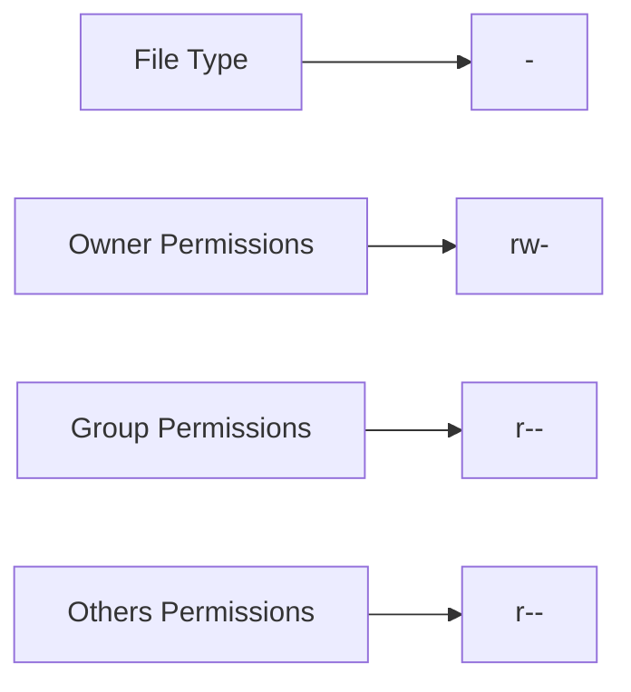

# Debian File Permissions

## Introduction

File permissions are a fundamental aspect of any Linux system, including Debian. They determine who can read, write, or execute files, forming a crucial part of system security. Understanding file permissions is essential for effective file management and maintaining system integrity in Debian.

In this guide, we'll explore how file permissions work in Debian, learn how to view and modify them, and understand their significance in day-to-day operations.

## Understanding File Permissions

In Debian, like other Linux distributions, every file and directory has three types of permissions set for three different categories of users:

### Permission Types

1. **Read (r)**: Allows viewing the contents of a file or listing the contents of a directory
2. **Write (w)**: Allows modifying a file or creating, deleting, and renaming files within a directory
3. **Execute (x)**: Allows running a file as a program or accessing a directory

### User Categories

1. **Owner**: The user who created or owns the file
2. **Group**: A set of users with specific access to the file
3. **Others**: All other users in the system

## Viewing File Permissions

Let's start by examining file permissions. The `ls -l` command displays detailed information about files, including their permissions:

```bash
$ ls -l
-rw-r--r-- 1 user group 2048 Mar 10 14:30 document.txt
drwxr-xr-x 2 user group 4096 Mar 10 14:35 scripts/
```

Let's break down the permission string `-rw-r--r--`:



- The first character indicates the file type:
  - `-` for regular files
  - `d` for directories
  - `l` for symbolic links
  - And others for special file types

- The next three characters represent owner permissions (`rw-`):
  - `r` means read permission is granted
  - `w` means write permission is granted
  - `-` means execute permission is denied

- The next three characters represent group permissions (`r--`):
  - `r` means read permission is granted
  - `-` means write permission is denied
  - `-` means execute permission is denied

- The last three characters represent permissions for others (`r--`):
  - `r` means read permission is granted
  - `-` means write permission is denied
  - `-` means execute permission is denied

## Numeric Representation of Permissions

Permissions can also be represented numerically, which is often more convenient when setting permissions:

- Read (`r`) = 4
- Write (`w`) = 2
- Execute (`x`) = 1

Permissions for each user category are calculated by adding these values:

| Permission | Symbol | Numeric Value |
|------------|--------|---------------|
| Read       | r      | 4             |
| Write      | w      | 2             |
| Execute    | x      | 1             |
| None       | -      | 0             |

For example:
- `rwx` = 4+2+1 = 7
- `rw-` = 4+2+0 = 6
- `r--` = 4+0+0 = 4
- `---` = 0+0+0 = 0

A permission setting like `754` means:
- Owner: 7 (`rwx`)
- Group: 5 (`r-x`)
- Others: 4 (`r--`)

## Modifying File Permissions

### Using chmod with Symbolic Notation

The `chmod` command is used to change file permissions. You can use symbolic notation to add, remove, or set permissions:

```bash
$ chmod u+x script.sh    # Add execute permission for the owner
$ chmod g-w document.txt # Remove write permission for the group
$ chmod o=r document.txt # Set permission for others to read-only
```

The syntax for symbolic notation is:

```
chmod [references][operator][permissions] file
```

Where:
- References: `u` (user/owner), `g` (group), `o` (others), `a` (all)
- Operator: `+` (add), `-` (remove), `=` (set exactly)
- Permissions: `r` (read), `w` (write), `x` (execute)

### Using chmod with Numeric Notation

You can also use numeric notation:

```bash
$ chmod 755 script.sh    # Set rwx for owner, r-x for group and others
$ chmod 644 document.txt # Set rw- for owner, r-- for group and others
```

### Real-world Examples

1. **Making a script executable:**

```bash
$ ls -l script.sh
-rw-r--r-- 1 user group 512 Mar 10 15:00 script.sh

$ chmod u+x script.sh

$ ls -l script.sh
-rwxr--r-- 1 user group 512 Mar 10 15:00 script.sh

$ ./script.sh
Hello, World!
```

2. **Protecting a configuration file:**

```bash
$ ls -l config.ini
-rw-r--r-- 1 user group 1024 Mar 10 15:10 config.ini

$ chmod 600 config.ini

$ ls -l config.ini
-rw------- 1 user group 1024 Mar 10 15:10 config.ini
```

## Changing File Ownership

The `chown` command changes the owner and/or group of a file:

```bash
$ chown newuser file.txt         # Change owner
$ chown newuser:newgroup file.txt # Change owner and group
$ chown :newgroup file.txt       # Change only the group
```

Example:

```bash
$ ls -l report.pdf
-rw-r--r-- 1 alice marketing 204800 Mar 10 16:00 report.pdf

$ sudo chown bob:sales report.pdf

$ ls -l report.pdf
-rw-r--r-- 1 bob sales 204800 Mar 10 16:00 report.pdf
```

## Special Permissions

Debian also has special permissions that provide additional functionality:

### SetUID (Set User ID)

When set on an executable file, it runs with the privileges of the file owner rather than the executing user.

```bash
$ chmod u+s executable
# Numeric: chmod 4755 executable
```

### SetGID (Set Group ID)

When set on an executable file, it runs with the privileges of the file group. When set on a directory, new files created within inherit the directory's group.

```bash
$ chmod g+s directory
# Numeric: chmod 2755 directory
```

### Sticky Bit

When set on a directory, it prevents users from deleting files owned by others, commonly used for shared directories.

```bash
$ chmod +t /shared
# Numeric: chmod 1777 /shared
```

## Default Permissions: umask

The `umask` command sets default permissions for newly created files and directories:

```bash
$ umask
0022
```

The umask value is subtracted from the maximum default permissions:
- Maximum for files: 666 (rw-rw-rw-)
- Maximum for directories: 777 (rwxrwxrwx)

With umask 022:
- New files: 666 - 022 = 644 (rw-r--r--)
- New directories: 777 - 022 = 755 (rwxr-xr-x)

## Practical Applications

### Securing a Web Server Configuration

```bash
# Apache configuration files
$ sudo chmod 640 /etc/apache2/apache2.conf
$ sudo chown root:www-data /etc/apache2/apache2.conf

# SSL certificates
$ sudo chmod 600 /etc/ssl/private/server.key
$ sudo chmod 644 /etc/ssl/certs/server.crt
```

### Setting Up a Collaborative Directory

```bash
# Create a shared directory for the development team
$ sudo mkdir /var/www/project
$ sudo chown www-admin:developers /var/www/project
$ sudo chmod 2775 /var/www/project
```

The permissions `2775` mean:
- `2`: SetGID bit (new files inherit the group)
- `7`: Owner has full permissions (rwx)
- `7`: Group has full permissions (rwx)
- `5`: Others can read and execute (r-x)

### File Permission Troubleshooting

When troubleshooting permission-related issues, follow these steps:

1. Check current permissions and ownership:
   ```bash
   $ ls -la problematic_file
   ```

2. Verify the user and groups you belong to:
   ```bash
   $ id
   uid=1000(user) gid=1000(user) groups=1000(user),4(adm),27(sudo)
   ```

3. Adjust permissions as needed:
   ```bash
   $ chmod 644 problematic_file  # For regular files
   $ chmod 755 problematic_dir   # For directories
   ```

## Common Permission Patterns

| Permission | Numeric | Use Case |
|------------|---------|----------|
| -rw------- | 600     | Private files only you can access |
| -rw-r--r-- | 644     | Regular files others can read |
| -rwx------ | 700     | Private scripts only you can run |
| -rwxr-xr-x | 755     | Scripts others can run but not modify |
| drwx------ | 700     | Private directories |
| drwxr-xr-x | 755     | Directories others can browse |
| drwxrwxrwx | 777     | Directories with full access for everyone (use with caution) |

## Summary

File permissions in Debian provide a robust system for controlling access to files and directories. Understanding how to view and modify permissions using commands like `chmod` and `chown` is essential for effective system administration and security.

The key points to remember:
- Every file has three permission types (read, write, execute) for three user categories (owner, group, others)
- Permissions can be viewed with `ls -l`
- Permissions can be modified with `chmod` using either symbolic or numeric notation
- File ownership can be changed with `chown`
- Special permissions (SetUID, SetGID, Sticky Bit) provide additional control
- Default permissions are controlled by `umask`

## Additional Resources and Exercises

### Exercises

1. Create a new script file and make it executable only for yourself.
2. Create a shared directory where a specific group can create files, but only the file creator can delete their own files.
3. Check the permissions of important system files like `/etc/passwd` and `/etc/shadow`. Why are they set up that way?
4. Set up a directory with appropriate permissions for a web server's document root.

### Further Reading

- The Debian Administrator's Handbook
- Linux Command Line and Shell Scripting Bible
- Advanced Linux File Permission Management

### Commands to Practice

- `ls -la`
- `chmod`
- `chown`
- `umask`
- `getfacl` and `setfacl` (for advanced access control lists)