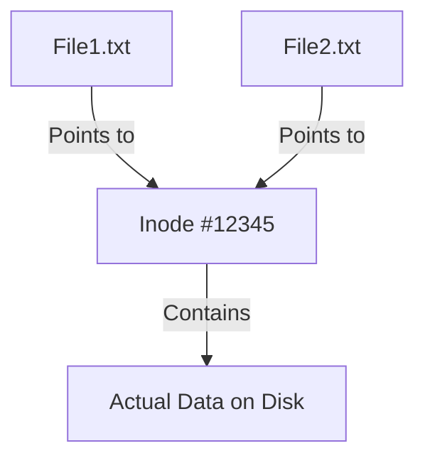

# Understanding Hard Links in Debian

## Introduction

When working with files in Debian Linux, you might encounter scenarios where you need multiple references to the same file content without duplicating the data. Hard links provide this capability, offering an efficient way to maintain multiple file paths that all point to the same physical data on disk.

In this guide, we'll explore hard links in Debian - what they are, how they differ from regular files and symbolic links, and how to use them effectively in your file management workflows.

## What Are Hard Links?

A hard link is a directory entry that points to the same inode (data structure that stores file metadata) as another file. Unlike a copy, which duplicates the file content, a hard link creates a new filename that references the exact same data blocks on the disk as the original file.



### Key Characteristics of Hard Links

- **Same Inode Number**: All hard links to a file share the same inode number.
- **Equal Status**: No link is "primary" - they're all equal references to the same data.
- **Same File Permissions**: Changes to permissions affect all hard links.
- **Same Content**: Modifying the content through any link updates the content for all links.
- **Link Count**: The system tracks how many hard links point to the same inode.
- **Space Efficiency**: Hard links don't use additional disk space for the file content.
- **Same Filesystem Restriction**: Hard links can only be created on the same filesystem/partition.
- **No Directory Links**: You cannot create hard links to directories (only to files).

## Creating Hard Links in Debian

The `ln` command is used to create hard links. The basic syntax is:

```bash
ln source_file link_name
```

### Example 1: Creating a Simple Hard Link

Let's create a file and then make a hard link to it:

```bash
# Create an original file
echo "This is our test file content." > original.txt

# Create a hard link to the original file
ln original.txt hardlink.txt

# List the files with their inode numbers
ls -li original.txt hardlink.txt
```

Output:
```
1234567 -rw-r--r-- 2 user group 31 Mar 13 10:15 original.txt
1234567 -rw-r--r-- 2 user group 31 Mar 13 10:15 hardlink.txt
```

Notice both files have:
- The same inode number (1234567)
- A link count of 2 (the second number after the permissions)
- Identical file sizes and timestamps

## Identifying Hard Links

You can identify hard links in several ways:

### Using the `ls -l` Command

The number after the permissions in the output of `ls -l` shows the link count:

```bash
ls -l original.txt
```

Output:
```
-rw-r--r-- 2 user group 31 Mar 13 10:15 original.txt
```

The "2" indicates there are two links to this inode.

### Using the `ls -i` Command

To explicitly see the inode numbers:

```bash
ls -i original.txt hardlink.txt
```

Output:
```
1234567 original.txt
1234567 hardlink.txt
```

### Using the `find` Command to Locate Hard Links

To find all hard links to a specific file:

```bash
find /path/to/search -xdev -samefile original.txt
```

## Working with Hard Links

### Modifying File Content

When you modify a file through any of its hard links, all links will show the updated content:

```bash
# Add content using one filename
echo "Additional content added." >> original.txt

# View content through the other link
cat hardlink.txt
```

Output:
```
This is our test file content.
Additional content added.
```

### File Permissions and Ownership

Changes to permissions or ownership affect all hard links:

```bash
# Change permissions on one link
chmod 600 original.txt

# Check permissions on both links
ls -l original.txt hardlink.txt
```

Output:
```
-rw------- 2 user group 61 Mar 13 10:20 original.txt
-rw------- 2 user group 61 Mar 13 10:20 hardlink.txt
```

### Deleting Hard Links

When you delete a hard link, the file content remains available through other links:

```bash
# Remove one hard link
rm original.txt

# The content is still accessible through the other link
cat hardlink.txt
```

Output:
```
This is our test file content.
Additional content added.
```

The file content is only deleted from disk when the link count reaches zero (when all hard links are deleted).

## Practical Applications of Hard Links

### 1. Backup Systems

Hard links are commonly used in backup systems like Time Machine and rsnapshot to save space when files haven't changed:

```bash
# Create backup directory structure
mkdir -p backups/day1 backups/day2

# Initial backup with full copy
cp important.txt backups/day1/

# If file hasn't changed on day2, use a hard link instead of a full copy
ln backups/day1/important.txt backups/day2/
```

### 2. Managing Multiple Versions of Configuration Files

```bash
# Create a configuration file
echo "# Default settings" > config.default

# Create hard links for different environments
ln config.default config.development
ln config.default config.production

# Now you can modify each environment's configuration separately
echo "DEBUG=true" >> config.development
echo "DEBUG=false" >> config.production
```

### 3. Saving Disk Space for Duplicate Files

```bash
# Instead of having multiple copies of the same file in different directories
ln /path/to/large_file.dat /other/location/large_file.dat
```

## Hard Links vs. Symbolic Links

Hard links have different characteristics compared to symbolic (soft) links:

| Feature | Hard Links | Symbolic Links |
|---------|------------|----------------|
| Implementation | Direct reference to inode | Reference to file path |
| Filesystem | Must be on same filesystem | Can cross filesystems |
| Directories | Cannot link to directories | Can link to directories |
| Original Deletion | Content remains accessible | Link becomes "broken" |
| File Size | No additional space (except directory entry) | Small amount of space for path storage |
| Inode Number | Same as original | Different from original |

Creating a symbolic link for comparison:

```bash
# Create a symbolic link
ln -s original.txt symlink.txt

# Compare details of both link types
ls -li original.txt hardlink.txt symlink.txt
```

Output:
```
1234567 -rw-r--r-- 2 user group 31 Mar 13 10:15 original.txt
1234567 -rw-r--r-- 2 user group 31 Mar 13 10:15 hardlink.txt
7654321 lrwxrwxrwx 1 user group 12 Mar 13 10:16 symlink.txt -> original.txt
```

## Limitations of Hard Links

1. **Cannot span filesystems**: Hard links can only be created on the same filesystem or partition.

2. **Cannot link to directories**: For system integrity reasons, hard links to directories are not allowed.

3. **Cannot distinguish the original**: Once created, all hard links are equal; there's no way to determine which was the "original" file.

4. **No visual indication**: Unlike symbolic links, there's no visual indication in standard listings that a file is a hard link.

## Filesystem Support for Hard Links

Most Linux filesystems support hard links, including:
- ext2/ext3/ext4
- XFS
- JFS
- Btrfs

However, some limitations exist:
- FAT/NTFS (from Windows) have limited or no support for hard links
- Some network filesystems may not support hard links

## Command Reference

| Command | Description |
|---------|-------------|
| `ln file1 file2` | Create a hard link named file2 to file1 |
| `ls -li` | List files with inode numbers |
| `ls -l` | View link count (number after permissions) |
| `find -samefile file` | Find all hard links to a file |
| `stat file` | Show detailed file information including inode |

## Best Practices

1. **Use descriptive names**: Choose meaningful names for hard links to indicate their purpose.

2. **Document your links**: In complex setups, document which files are hard-linked.

3. **Use with caution**: Be careful with critical system files; unexpected changes through hard links can affect multiple locations.

4. **Consider alternatives**: For cross-filesystem links or directory links, use symbolic links instead.

5. **Check link count before deletion**: Before deleting important files, check if they have multiple hard links.

## Summary

Hard links in Debian Linux provide an efficient way to have multiple references to the same file content without duplication. They share the same inode, permissions, and content, making them useful for backup systems, configuration management, and disk space optimization.

While they have limitations (same filesystem only, no directory links), hard links are a powerful tool in a Linux administrator's toolkit when used appropriately.

## Exercises for Practice

1. Create a file and make multiple hard links to it. Observe how changes to one affect the others.

2. Write a shell script that identifies all files in your home directory with a link count greater than 1.

3. Set up a simple backup system using hard links for unchanged files.

4. Compare the behavior of hard links vs. symbolic links when the original file is deleted.

5. Use the `find` command to locate all hard links to a specific file on your system.

## Additional Resources

- The Linux Documentation Project (TLDP) - Advanced file system concepts
- `man ln` - Manual page for the ln command
- `man stat` - Manual page for viewing detailed file information
- `man find` - Manual page with information on locating files by inode