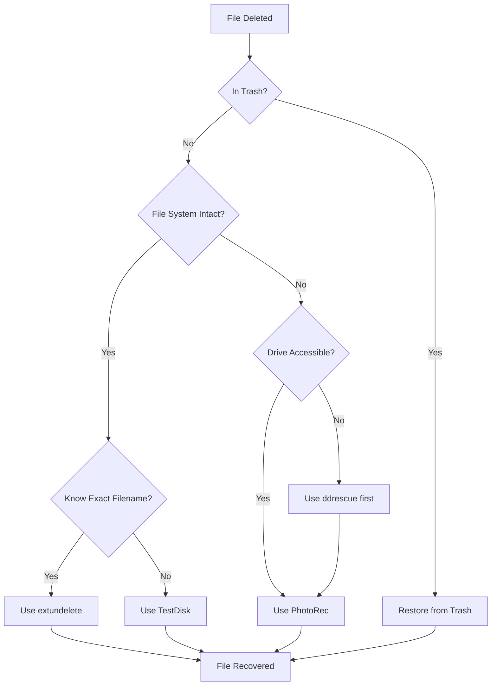

# Debian File Recovery

## Introduction

File recovery is an essential skill for any Debian user. Despite our best efforts, files can be accidentally deleted, partitions can become corrupted, or system failures can lead to data loss. This guide will walk you through various methods to recover your lost files in Debian systems, from simple command-line utilities to specialized recovery tools.

Understanding how file systems work and how deletion actually happens in Linux will help you make informed decisions when attempting recovery operations. When a file is "deleted" in Linux, the system doesn't immediately erase the data; it simply marks the space as available for new data. Until that space is overwritten, there's a good chance to recover your files.

## Basic File Recovery Concepts

### How File Deletion Works in Linux

Before diving into recovery tools, it's important to understand what happens when you delete a file in Linux:

1. When you delete a file, the filesystem marks the space as available
2. The file's contents remain on disk until overwritten
3. The longer you wait after deletion, the lower your chances of recovery
4. Using the disk after deletion reduces recovery chances

:::caution
If you've accidentally deleted important files, stop using the affected drive immediately to prevent overwriting the data!
:::

## Built-in Recovery Methods

### Checking the Trash Directory

The simplest recovery method is checking if your file is in the trash:

```bash
# Check files in trash
ls -la ~/.local/share/Trash/files/

# Restore a file from trash to current directory
cp ~/.local/share/Trash/files/important_document.txt ./
```

### Using the `extundelete` Tool

For ext2/ext3/ext4 filesystems, `extundelete` is a powerful recovery option:

```bash
# Install extundelete
sudo apt-get update
sudo apt-get install extundelete

# Unmount the partition (critical step)
sudo umount /dev/sdb1

# Recover a specific deleted file
sudo extundelete /dev/sdb1 --restore-file path/to/deleted_file

# Recover all deleted files
sudo extundelete /dev/sdb1 --restore-all
```

The recovered files will be placed in a directory called `RECOVERED_FILES` in your current working directory.

### Example: Recovering a Recently Deleted Document

Let's walk through a practical example of recovering a deleted text file:

```bash
# Scenario: You accidentally deleted important_notes.txt from /home/user/documents
# First, unmount the partition if possible
sudo umount /dev/sda5  # Assuming /home is on /dev/sda5

# Use extundelete to recover the file
sudo extundelete /dev/sda5 --restore-file user/documents/important_notes.txt
```

Output:
```
Loading filesystem metadata ... done
Loading journal descriptors ... done
Searching for file user/documents/important_notes.txt ... done
Restoring file user/documents/important_notes.txt ... success
Restored file to RECOVERED_FILES/user/documents/important_notes.txt
```

## Using TestDisk and PhotoRec

TestDisk and PhotoRec are versatile tools for more complex recovery scenarios:

### Installing TestDisk and PhotoRec

```bash
sudo apt-get update
sudo apt-get install testdisk
```

PhotoRec comes bundled with TestDisk.

### Using TestDisk to Recover Deleted Files

TestDisk can recover deleted files and also fix partition issues:

```bash
# Run TestDisk
sudo testdisk

# Follow the interactive prompts to select your drive and partition
# Use the arrow keys to navigate and choose options
```

Here's what the flow generally looks like:

1. Select your disk
2. Select partition table type (usually "Intel" for most systems)
3. Select "Advanced" options
4. Choose the partition
5. Select "Undelete" to see deleted files
6. Mark files you want to recover with the spacebar
7. Press 'C' to copy them to a safe location

### Using PhotoRec for File Recovery

When file systems are severely damaged, PhotoRec can scan the raw disk:

```bash
# Run PhotoRec
sudo photorec

# Follow the interactive prompts
```

PhotoRec ignores the filesystem and directly searches for known file patterns, making it effective even on formatted or corrupted drives.

## Advanced Recovery: `ddrescue` for Damaged Drives

For physically damaged drives, `ddrescue` can help create an image to work with:

```bash
# Install ddrescue
sudo apt-get install gddrescue

# Create an image of the failing drive
sudo ddrescue /dev/sdb damaged_drive.img damaged_drive.logfile

# Mount the image for recovery
sudo mount -o loop damaged_drive.img /mnt/recovery
```

This creates a bit-by-bit copy of your drive, which you can then analyze with other recovery tools.

## File Recovery with `foremost`

`foremost` is a forensic tool that recovers files based on their headers, footers, and data structures:

```bash
# Install foremost
sudo apt-get install foremost

# Recover specific file types from a drive
sudo foremost -t jpg,pdf,doc -i /dev/sdb1 -o recovered_files

# Recover all supported file types
sudo foremost -i /dev/sdb1 -o recovered_files
```

### Example: Recovering Photos with `foremost`

```bash
# Recover deleted JPEG images from an SD card
sudo foremost -t jpg -i /dev/sdc1 -o recovered_photos
```

Output:
```
Processing: /dev/sdc1
|*|
Finish: Wed Mar 13 15:45:32 2025
Found 127 JPEG images
```

## Recovery Process Flowchart

Here's a decision flowchart to help you choose the right recovery method:



## Best Practices for Data Recovery

1. **Act quickly**: The sooner you attempt recovery, the better the chances
2. **Stop using the affected drive**: Prevent overwriting deleted data
3. **Recover to a different drive**: Never recover files to the same drive they were deleted from
4. **Make a disk image if possible**: Work on a copy to preserve the original state
5. **Try multiple tools**: Different tools have different strengths

## Preventive Measures

Prevention is always better than recovery:

1. **Regular backups**: Use tools like `rsync` or `duplicity`
2. **Use version control**: For code and important documents
3. **Configure auto-save** in applications when possible
4. **Use RAID** for important data storage

## Example: Setting Up an Automated Backup

Here's a simple `rsync` backup script:

```bash
#!/bin/bash
# Simple backup script using rsync
SOURCE_DIR="/home/user/important_files"
BACKUP_DIR="/media/backup_drive/backups"
DATE=$(date +%Y-%m-%d)

# Create a dated backup directory
mkdir -p "$BACKUP_DIR/$DATE"

# Run the backup
rsync -av --delete "$SOURCE_DIR/" "$BACKUP_DIR/$DATE/"

# Output completion message
echo "Backup completed to $BACKUP_DIR/$DATE/"
```

Save this as `backup.sh`, make it executable with `chmod +x backup.sh`, and schedule it with cron.

## Summary

File recovery in Debian involves understanding how deletion works, acting quickly, and using the right tools for your situation. From simple trash recovery to forensic tools like `foremost`, Debian provides multiple paths to recover your important data.

Remember that prevention through regular backups is the most reliable strategy. No recovery method is 100% guaranteed, so maintaining good backup habits will save you from potential data loss.

## Additional Resources

- The [TestDisk documentation](https://www.cgsecurity.org/wiki/TestDisk_Documentation)
- Linux [File Recovery How-To](https://help.ubuntu.com/community/DataRecovery) (Ubuntu, but applicable to Debian)
- Debian [wiki article on backups](https://wiki.debian.org/BackupAndRecovery)

## Practice Exercises

1. Create a test file, delete it, then recover it using `extundelete`
2. Set up a regular backup schedule using `rsync` and cron
3. Practice using PhotoRec to recover image files from an old memory card
4. Create a bootable Debian USB drive with recovery tools pre-installed

Good luck with your file recovery journey!