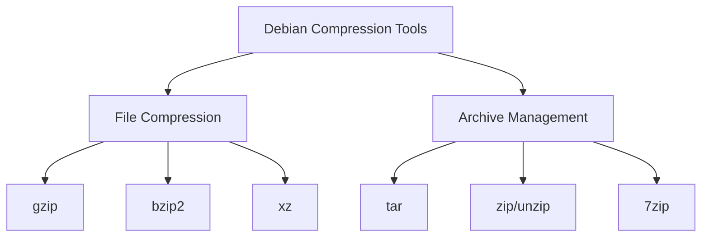

# Debian Compression Tools

## Introduction

File compression is an essential skill for any Debian user or system administrator. Compression tools allow you to reduce file sizes for storage efficiency, faster file transfers, and organizing multiple files into single archives. Debian provides a rich set of compression utilities that serve various purposes, from simple file compression to creating complex archives with different compression algorithms.

In this guide, we'll explore the most common compression tools available in Debian, their basic usage, and practical applications. Whether you're backing up important data, transferring files over a network, or simply trying to save disk space, understanding these tools will greatly enhance your file management capabilities in Debian.

## Common Compression Tools in Debian

Let's look at the most widely used compression tools in Debian:



### 1. gzip - GNU Zip

`gzip` is one of the most common compression tools in Linux. It compresses single files and replaces the original file with a compressed version having a `.gz` extension.

#### Installation

`gzip` usually comes pre-installed in Debian, but if needed:

```bash
sudo apt install gzip
```

#### Basic Usage

**Compressing a file:**

```bash
gzip filename.txt
```

This will compress `filename.txt` and replace it with `filename.txt.gz`.

**Output:**
```
# No output is displayed, but the file is now compressed
```

**Decompressing a file:**

```bash
gzip -d filename.txt.gz
```

or

```bash
gunzip filename.txt.gz
```

**Viewing compression level:**

```bash
gzip -l filename.txt.gz
```

**Output:**
```
         compressed        uncompressed  ratio uncompressed_name
                235                 754  68.8% filename.txt
```

**Preserving the original file while compressing:**

```bash
gzip -c filename.txt > filename.txt.gz
```

#### Options and Flags

- `-1` to `-9`: Compression level (1 is fastest, 9 is best compression)
- `-k`: Keep original file
- `-v`: Verbose mode
- `-c`: Write to standard output
- `-r`: Recursively compress files in directories

### 2. bzip2 - BZip2 Compression

`bzip2` provides better compression than `gzip` but is slower. It works similarly to `gzip` but creates files with the `.bz2` extension.

#### Installation

```bash
sudo apt install bzip2
```

#### Basic Usage

**Compressing a file:**

```bash
bzip2 filename.txt
```

This creates `filename.txt.bz2` and removes the original file.

**Decompressing a file:**

```bash
bzip2 -d filename.txt.bz2
```

or

```bash
bunzip2 filename.txt.bz2
```

**Keeping the original file:**

```bash
bzip2 -k filename.txt
```

### 3. xz - XZ Compression

`xz` provides even better compression than `bzip2` but is typically slower. It creates files with the `.xz` extension.

#### Installation

```bash
sudo apt install xz-utils
```

#### Basic Usage

**Compressing a file:**

```bash
xz filename.txt
```

**Decompressing a file:**

```bash
xz -d filename.txt.xz
```

or

```bash
unxz filename.txt.xz
```

**Compress with maximum compression:**

```bash
xz -9 filename.txt
```

### 4. tar - Tape Archive

`tar` is not a compression tool itself but an archiving utility. It combines multiple files into a single archive file. When paired with compression tools like `gzip` or `bzip2`, it can create compressed archives.

#### Installation

```bash
sudo apt install tar
```

#### Basic Usage

**Creating an archive (without compression):**

```bash
tar -cf archive.tar file1 file2 directory1
```

**Creating a gzipped archive (tar.gz or .tgz):**

```bash
tar -czf archive.tar.gz file1 file2 directory1
```

**Creating a bzip2 archive (tar.bz2):**

```bash
tar -cjf archive.tar.bz2 file1 file2 directory1
```

**Creating an xz archive (tar.xz):**

```bash
tar -cJf archive.tar.xz file1 file2 directory1
```

**Extracting an archive:**

```bash
tar -xf archive.tar
```

**Extracting a compressed archive (auto-detects compression):**

```bash
tar -xf archive.tar.gz
```

**Listing contents of an archive:**

```bash
tar -tf archive.tar.gz
```

**Output:**
```
file1
file2
directory1/
directory1/file3
directory1/file4
```

#### Common tar Options

- `-c`: Create a new archive
- `-x`: Extract files from an archive
- `-f`: Specify the filename of the archive
- `-t`: List the contents of an archive
- `-v`: Verbose mode (list files processed)
- `-z`: Filter the archive through gzip
- `-j`: Filter the archive through bzip2
- `-J`: Filter the archive through xz
- `-r`: Append files to an archive
- `-u`: Only append files that are newer than those in the archive

### 5. zip/unzip

While less common in Linux systems, `zip` format is useful for cross-platform compatibility, especially with Windows and macOS.

#### Installation

```bash
sudo apt install zip unzip
```

#### Basic Usage

**Creating a zip archive:**

```bash
zip archive.zip file1 file2
```

**Adding a directory recursively:**

```bash
zip -r archive.zip directory1
```

**Extracting a zip archive:**

```bash
unzip archive.zip
```

**Listing contents of a zip archive:**

```bash
unzip -l archive.zip
```

**Output:**
```
  Length      Date    Time    Name
---------  ---------- -----   ----
      325  2023-04-10 15:30   file1
      422  2023-04-10 15:31   file2
        0  2023-04-10 15:32   directory1/
      567  2023-04-10 15:32   directory1/file3
---------                     -------
     1314                     4 files
```

### 6. 7zip - p7zip

`7zip` provides high compression ratio and supports multiple formats.

#### Installation

```bash
sudo apt install p7zip-full
```

#### Basic Usage

**Creating a 7z archive:**

```bash
7z a archive.7z file1 file2 directory1
```

**Extracting a 7z archive:**

```bash
7z x archive.7z
```

**Listing contents of a 7z archive:**

```bash
7z l archive.7z
```

## Practical Examples

### Example 1: Backing Up a Project Directory

Let's say you want to create a backup of your project directory with timestamp:

```bash
# Create a timestamped backup with tar and gzip
timestamp=$(date +%Y%m%d_%H%M%S)
tar -czf project_backup_$timestamp.tar.gz /path/to/project/

# Output:
# A file named project_backup_20230410_153045.tar.gz will be created
```

### Example 2: Comparing Compression Ratios

Let's compare how different compression tools perform on the same file:

```bash
# Create a sample file
head -c 10M /dev/urandom > testfile

# Compress with different tools
gzip -k testfile
bzip2 -k testfile
xz -k testfile

# Compare sizes
ls -lh testfile*
```

**Output:**
```
-rw-r--r-- 1 user user 10M Apr 10 15:45 testfile
-rw-r--r-- 1 user user 3.8M Apr 10 15:45 testfile.bz2
-rw-r--r-- 1 user user 3.9M Apr 10 15:45 testfile.gz
-rw-r--r-- 1 user user 3.6M Apr 10 15:45 testfile.xz
```

### Example 3: Selective Extraction

Extract only specific files from an archive:

```bash
# Create an archive
tar -czf config_files.tar.gz /etc/*.conf

# Extract only one file
tar -xf config_files.tar.gz etc/ssh/ssh_config
```

### Example 4: Viewing Compressed Text Files Without Full Extraction

```bash
# View a compressed text file without decompressing it
zcat document.txt.gz

# For bzip2 files
bzcat document.txt.bz2

# For xz files
xzcat document.txt.xz
```

### Example 5: Compressing Multiple Files While Preserving Directory Structure

```bash
# Archive and compress an entire directory structure
tar -czf website_backup.tar.gz /var/www/html/

# Extract to a different location
mkdir /tmp/restore
tar -xzf website_backup.tar.gz -C /tmp/restore
```

## Choosing the Right Compression Tool

Here's a quick comparison to help you choose the right tool for your needs:

| Tool | Compression Ratio | Speed | Cross-Platform | Best For |
|------|-------------------|-------|---------------|----------|
| gzip | Good | Fast | Good | Quick compression, general use |
| bzip2 | Better | Slower | Medium | Better compression, less concern about speed |
| xz | Best | Slowest | Limited | Archives that need minimal size |
| zip | Moderate | Fast | Excellent | Sharing with Windows/macOS users |
| 7zip | Very good | Moderate | Good | Balance of compression and speed |

## Best Practices

1. **Choose the appropriate tool for your needs.** Balance compression ratio with speed requirements.
2. **Use verbose mode `-v` when learning** to understand what the tools are doing.
3. **Always test your archives** after creating them to ensure they're valid.
4. **Compress log files** that need to be kept but aren't frequently accessed.
5. **Use `tar` with compression** for backing up directories or multiple files.
6. **Consider using `.zip` format** when sharing files with non-Linux users.

## Summary

Debian offers a rich set of compression and archiving tools that can help you manage your files efficiently. From simple single-file compression with `gzip` to creating complex archives with `tar` combined with various compression algorithms, these tools provide flexibility for different use cases.

Understanding the strengths and weaknesses of each tool allows you to choose the right one for your specific needs, whether it's maximizing compression ratio, optimizing for speed, or ensuring cross-platform compatibility.

## Exercises

1. Create a compressed backup of your home directory that excludes hidden files.
2. Compare the compression ratios and times of gzip, bzip2, and xz on a large text file.
3. Extract a specific directory from a tar archive without extracting the entire archive.
4. Create a script that automatically backs up a directory and removes backups older than 7 days.
5. Use `find` command with `gzip` to compress all log files older than 30 days in a directory.

## Additional Resources

- Man pages: `man gzip`, `man tar`, `man bzip2`, `man xz`, `man zip`
- GNU documentation: [GNU Tar](https://www.gnu.org/software/tar/manual/tar.html)
- The Linux Documentation Project (TLDP) guides