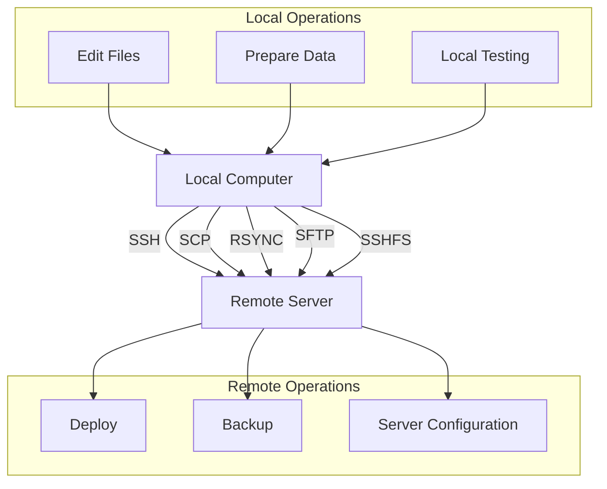

# Debian Remote Files

## Introduction

Working with remote files is an essential skill for Debian users, especially for system administrators and developers. Remote file management allows you to access, transfer, and manipulate files on distant servers without being physically present at those machines. This capability is crucial for server maintenance, deploying applications, backing up data, and collaborative development.

In this tutorial, we'll explore various methods to work with remote files in Debian Linux. We'll cover command-line tools like SSH, SCP, RSYNC, and SFTP, along with graphical alternatives that make remote file operations more accessible to beginners.

## Prerequisites

Before we begin, make sure you have:

- A Debian-based Linux distribution installed
- Basic knowledge of Linux terminal commands
- SSH access to a remote server (for practice)
- Internet connectivity

## Understanding SSH: The Foundation of Remote Access

SSH (Secure Shell) is the backbone of secure remote file operations in Linux. Before diving into specific file transfer methods, let's ensure you have SSH properly set up.

### Installing SSH Client

Most Debian installations come with an SSH client pre-installed. To verify or install it:

```bash
# Check if SSH is installed
which ssh

# If not installed, install it
sudo apt update
sudo apt install openssh-client
```

### Basic SSH Connection

To connect to a remote server:

```bash
ssh username@remote_server
```

Example:

```bash
ssh admin@192.168.1.100
```

Output:
```
The authenticity of host '192.168.1.100 (192.168.1.100)' can't be established.
ECDSA key fingerprint is SHA256:kj87jHG76tGH78gHGj87hgJH78.
Are you sure you want to continue connecting (yes/no/[fingerprint])? yes
Warning: Permanently added '192.168.1.100' (ECDSA) to the list of known hosts.
admin@192.168.1.100's password: 
Welcome to Debian 11 (Bullseye)
Last login: Sun Mar 10 14:23:17 2025 from 192.168.1.50
admin@remote-server:~$ 
```

## Methods for Working with Remote Files in Debian

Let's explore the different ways to work with remote files, from command-line tools to graphical interfaces.

### 1. SCP (Secure Copy)

SCP is a straightforward command-line tool for copying files between local and remote systems.

#### Copying a File from Local to Remote

```bash
scp /path/to/local/file username@remote_server:/path/to/remote/directory
```

Example:

```bash
scp report.pdf admin@192.168.1.100:/home/admin/documents/
```

Output:
```
report.pdf                                 100%  765KB  2.3MB/s  00:00
```

#### Copying a File from Remote to Local

```bash
scp username@remote_server:/path/to/remote/file /path/to/local/directory
```

Example:

```bash
scp admin@192.168.1.100:/home/admin/logs/server.log ./downloads/
```

Output:
```
server.log                                 100%  342KB  1.1MB/s  00:00
```

#### Copying an Entire Directory

Add the `-r` flag (recursive) to copy directories:

```bash
scp -r /path/to/local/directory username@remote_server:/path/to/remote/directory
```

Example:

```bash
scp -r ./project admin@192.168.1.100:/home/admin/workspace/
```

### 2. RSYNC: Powerful Synchronization

RSYNC is more advanced than SCP and offers features like incremental file transfers, which makes it ideal for backups and large file synchronizations.

#### Installing RSYNC

```bash
sudo apt update
sudo apt install rsync
```

#### Basic RSYNC Commands

Sync local directory to remote:

```bash
rsync -avz /path/to/local/directory/ username@remote_server:/path/to/remote/directory/
```

Example:

```bash
rsync -avz ./website/ admin@192.168.1.100:/var/www/html/
```

Output:
```
sending incremental file list
./
index.html
css/style.css
js/script.js
images/logo.png

sent 146,739 bytes  received 98 bytes  58,735.20 bytes/sec
total size is 146,520  speedup is 1.00
```

Sync remote directory to local:

```bash
rsync -avz username@remote_server:/path/to/remote/directory/ /path/to/local/directory/
```

Example:

```bash
rsync -avz admin@192.168.1.100:/home/admin/backups/ ./local_backups/
```

#### Key RSYNC Options

- `-a`: Archive mode (preserves permissions, timestamps, etc.)
- `-v`: Verbose output
- `-z`: Compress data during transfer
- `--delete`: Delete files in the destination that don't exist in the source
- `--exclude="pattern"`: Exclude files matching pattern
- `--progress`: Show progress during transfer

Example with exclusions and progress:

```bash
rsync -avz --progress --exclude="*.tmp" --exclude="node_modules/" ./project/ admin@192.168.1.100:/home/admin/project/
```

### 3. SFTP (SSH File Transfer Protocol)

SFTP provides an interactive file transfer session with command capabilities similar to FTP but over a secure SSH connection.

#### Starting an SFTP Session

```bash
sftp username@remote_server
```

Example:

```bash
sftp admin@192.168.1.100
```

Output:
```
Connected to 192.168.1.100.
sftp> 
```

#### Common SFTP Commands

Once connected, you can use these commands:

```
pwd               # Print current remote directory
lpwd              # Print current local directory
cd directory      # Change remote directory
lcd directory     # Change local directory
ls                # List remote directory contents
lls               # List local directory contents
get file          # Download file
put file          # Upload file
mkdir directory   # Create remote directory
rm file           # Delete remote file
exit              # Close connection
```

Example SFTP session:

```
sftp> pwd
Remote working directory: /home/admin
sftp> ls
Documents  Downloads  public_html  logs
sftp> cd logs
sftp> ls
access.log  error.log  system.log
sftp> get error.log
Fetching /home/admin/logs/error.log to error.log
sftp> lpwd
Local working directory: /home/user/downloads
sftp> lcd ../uploads
sftp> put config.ini
Uploading config.ini to /home/admin/logs/config.ini
sftp> exit
```

### 4. Using the `sshfs` Command to Mount Remote Filesystems

SSHFS allows you to mount a remote filesystem locally, letting you work with remote files as if they were local.

#### Installing SSHFS

```bash
sudo apt update
sudo apt install sshfs
```

#### Mounting a Remote Directory

```bash
sshfs username@remote_server:/remote/path /local/mount/point
```

Example:

```bash
# Create a mount point
mkdir ~/remote-server

# Mount the remote directory
sshfs admin@192.168.1.100:/home/admin/documents ~/remote-server
```

Now you can access the remote files by navigating to `~/remote-server` and work with them as if they were local files.

#### Unmounting the Remote Filesystem

```bash
fusermount -u ~/remote-server
```

### 5. GUI Methods for Remote File Management

For those who prefer graphical interfaces, Debian offers several options.

#### Using Nautilus (Files) with SFTP

If you're using GNOME:

1. Open Nautilus (Files)
2. Press Ctrl+L to access the location bar
3. Enter the sftp URL: `sftp://username@remote_server/path`

Example:
```
sftp://admin@192.168.1.100/home/admin
```

#### Using Dolphin (KDE File Manager)

If you're using KDE:

1. Open Dolphin
2. In the address bar, enter: `sftp://username@remote_server/path`

#### Using FileZilla

FileZilla is a powerful cross-platform FTP/SFTP client:

1. Install FileZilla:
   ```bash
   sudo apt update
   sudo apt install filezilla
   ```

2. Open FileZilla and create a new site:
   - Host: Your remote server IP/hostname
   - Protocol: SFTP - SSH File Transfer Protocol
   - Logon Type: Normal
   - User: Your username
   - Password: Your password

3. Click "Connect" to establish the connection and transfer files using drag and drop.

## Working with Remote Text Files Directly

### Using Vim with Remote Files

Vim can directly edit remote files:

```bash
vim scp://username@remote_server//path/to/file
```

Example:

```bash
vim scp://admin@192.168.1.100//etc/nginx/nginx.conf
```

### Using Emacs with TRAMP Mode

Emacs TRAMP mode allows editing remote files:

```bash
emacs /ssh:username@remote_server:/path/to/file
```

Example:

```bash
emacs /ssh:admin@192.168.1.100:/var/www/html/index.php
```

## Best Practices for Remote File Management

### Using SSH Keys for Passwordless Authentication

Create and set up SSH keys for secure, passwordless authentication:

```bash
# Generate keys
ssh-keygen -t ed25519 -C "your_email@example.com"

# Copy public key to server
ssh-copy-id username@remote_server
```

After setting up keys, commands like `scp`, `rsync`, and `sftp` will work without password prompts.

### Creating SSH Config for Easy Access

Add server details to your SSH config file for simplified connections:

```bash
# Edit SSH config
nano ~/.ssh/config
```

Add your server configuration:

```
Host webserver
    HostName 192.168.1.100
    User admin
    Port 22
    IdentityFile ~/.ssh/id_ed25519
```

Now you can use the alias instead of the full server details:

```bash
# Instead of
ssh admin@192.168.1.100

# You can use
ssh webserver

# And with other commands
scp file.txt webserver:/path/
rsync -avz ./folder/ webserver:/path/
sftp webserver
```

### Bandwidth and Compression Options

When working with large files or over slow connections:

```bash
# Use compression with SCP
scp -C large_file.tar.gz username@remote_server:/path/

# Use compression and bandwidth limits with RSYNC
rsync -avz --compress-level=9 --bwlimit=1000 large_directory/ username@remote_server:/path/
```

## Automation Examples

### Automated Backup Script Using RSYNC

Create a backup script using `rsync`:

```bash
#!/bin/bash
# Simple backup script using rsync

# Configuration
SOURCE_DIR="/home/user/important_data/"
REMOTE_USER="backup"
REMOTE_HOST="backup-server"
REMOTE_DIR="/backup/$(hostname)/$(date +%Y-%m-%d)/"
LOG_FILE="/var/log/backup-$(date +%Y-%m-%d).log"

# Create remote directory
ssh $REMOTE_USER@$REMOTE_HOST "mkdir -p $REMOTE_DIR"

# Perform backup
rsync -avz --delete \
  --exclude="*.tmp" \
  --exclude="cache/" \
  $SOURCE_DIR $REMOTE_USER@$REMOTE_HOST:$REMOTE_DIR \
  > $LOG_FILE 2>&1

# Check result
if [ $? -eq 0 ]; then
  echo "Backup completed successfully at $(date)" >> $LOG_FILE
else
  echo "Backup failed at $(date)" >> $LOG_FILE
fi
```

Save this as `backup.sh`, make it executable with `chmod +x backup.sh`, and schedule it using cron.

### Synchronizing Web Development Files

Setup a simple script to sync your local development files with a staging server:

```bash
#!/bin/bash
# Web development sync script

# Configuration
LOCAL_DIR="./website/"
REMOTE_USER="webadmin"
REMOTE_HOST="staging-server"
REMOTE_DIR="/var/www/html/"

# Sync files, excluding development-only files
rsync -avz --progress \
  --exclude=".git/" \
  --exclude="node_modules/" \
  --exclude=".env" \
  --exclude="*.log" \
  $LOCAL_DIR $REMOTE_USER@$REMOTE_HOST:$REMOTE_DIR

echo "Sync completed at $(date)"
```

## Troubleshooting Common Issues

### Permission Denied

If you encounter "Permission denied" errors:

1. Check that you have the correct permissions on the remote server
2. Verify your username and password
3. Ensure your SSH key is properly set up if using key authentication
4. Check that the remote directory is accessible to your user

### Connection Timed Out

For "Connection timed out" errors:

1. Verify the remote server is online
2. Check that you're using the correct hostname or IP address
3. Ensure that the SSH service is running on the remote server
4. Check if a firewall is blocking the connection

### Data Transfer Issues

For slow or failed transfers:

1. Use compression (-z option with rsync or -C with scp)
2. Check network connectivity and bandwidth
3. For large files, consider using rsync which can resume interrupted transfers

## Remote File Operations Workflow

Here's a typical workflow diagram for remote file operations:



## Summary

In this guide, we've explored various methods to work with remote files in Debian Linux:

- **SCP** for simple file transfers
- **RSYNC** for efficient synchronization and backups
- **SFTP** for interactive file management
- **SSHFS** for mounting remote filesystems
- **GUI options** like Nautilus, Dolphin, and FileZilla
- **Text editors** that can directly edit remote files

We've also covered best practices, automation examples, and troubleshooting tips to help you work efficiently with remote files.

These tools and techniques form an essential part of a Debian user's toolkit, enabling efficient remote administration, collaboration, and file management across networked systems.

## Exercises

To reinforce your learning, try these exercises:

1. Set up SSH key authentication between your local machine and a remote server.
2. Create a script that uses rsync to back up your home directory to a remote server.
3. Mount a remote directory using sshfs and practice working with the files.
4. Use SFTP to transfer files between your local machine and a remote server.
5. Create an SSH config file with at least two different server entries.

## Additional Resources

- [Debian SSH Documentation](https://wiki.debian.org/SSH)
- [RSYNC Manual Page](https://linux.die.net/man/1/rsync)
- [SCP Command Guide](https://linux.die.net/man/1/scp)
- [SSHFS Usage Guide](https://linux.die.net/man/1/sshfs)
- [The Linux Command Line](http://linuxcommand.org/tlcl.php) - A comprehensive guide to the command line