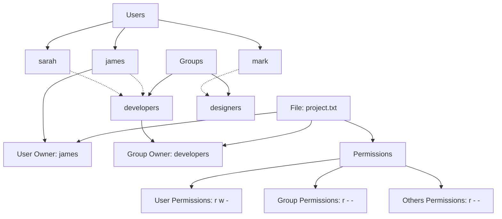

# Debian File Ownership

File ownership is a fundamental concept in Debian Linux that determines who can access, modify, or execute files on your system. Understanding file ownership is essential for managing permissions, securing your system, and collaborating with other users.

## Introduction to File Ownership

In Debian Linux, every file and directory is owned by a specific user and belongs to a specific group. This ownership system forms the foundation of the Linux security model, providing a structured way to control access to system resources.

There are two types of owners for each file:

1. **User Owner**: The individual user who owns the file
2. **Group Owner**: The group that has access to the file

## Viewing File Ownership

To view the ownership of files and directories, use the `ls` command with the `-l` (long listing) option:

```bash
ls -l /path/to/directory
```

The output will look something like this:

```
-rw-r--r-- 1 james developers 2048 Mar 13 14:22 project.txt
drwxr-xr-x 2 james developers 4096 Mar 13 14:20 images/
```

Let's break down what this means:

- The first character indicates the file type (`-` for regular files, `d` for directories)
- The next nine characters represent the permissions
- `james` is the user owner
- `developers` is the group owner
- `2048` is the file size in bytes
- `Mar 13 14:22` is the last modification time
- `project.txt` is the file name

## Understanding Users and Groups

### Users

Each user on a Debian system has:
- A unique username (like "james")
- A unique numeric user ID (UID)
- A home directory (typically `/home/username`)
- A login shell

You can see information about the current user with the `id` command:

```bash
id
```

Output example:

```
uid=1000(james) gid=1000(james) groups=1000(james),4(adm),24(cdrom),27(sudo),30(dip),46(plugdev),120(lpadmin),131(sambashare)
```

### Groups

Groups allow multiple users to share permissions. Each group has:
- A unique group name
- A unique numeric group ID (GID)
- A list of members

To see the groups you belong to, use:

```bash
groups
```

Output example:

```
james adm cdrom sudo dip plugdev lpadmin sambashare
```

To view all groups on the system:

```bash
cat /etc/group
```

## Changing File Ownership

### Changing the User Owner with `chown`

The `chown` command changes the user owner of a file or directory:

```bash
sudo chown newuser filename
```

Example:
```bash
sudo chown sarah project.txt
```

To verify the change:
```bash
ls -l project.txt
```

Output:
```
-rw-r--r-- 1 sarah developers 2048 Mar 13 14:22 project.txt
```

### Changing the Group Owner with `chgrp`

The `chgrp` command changes the group owner:

```bash
sudo chgrp newgroup filename
```

Example:
```bash
sudo chgrp designers project.txt
```

To verify:
```bash
ls -l project.txt
```

Output:
```
-rw-r--r-- 1 sarah designers 2048 Mar 13 14:22 project.txt
```

### Changing Both User and Group at Once

You can change both the user and group owner with a single `chown` command:

```bash
sudo chown newuser:newgroup filename
```

Example:
```bash
sudo chown james:developers project.txt
```

### Recursive Ownership Changes

To change ownership of a directory and all its contents, use the `-R` flag:

```bash
sudo chown -R newuser:newgroup directory/
```

Example:
```bash
sudo chown -R james:developers project/
```

## File Ownership in Practice

### Creating New Files

When you create a new file, it is automatically assigned:
- Your user account as the user owner
- Your primary group as the group owner

Example:
```bash
touch newfile.txt
ls -l newfile.txt
```

Output:
```
-rw-r--r-- 1 james james 0 Mar 13 15:01 newfile.txt
```

### Transferring Files Between Users

When you need to share files with other users:

1. Create a shared group:
```bash
sudo groupadd project-team
```

2. Add users to the group:
```bash
sudo usermod -aG project-team james
sudo usermod -aG project-team sarah
```

3. Create a shared directory:
```bash
sudo mkdir /opt/shared-project
```

4. Set ownership and permissions:
```bash
sudo chown -R root:project-team /opt/shared-project
sudo chmod -R 775 /opt/shared-project
```

Now both users can work in this shared directory.

### Web Server Example

For a practical example, let's set up proper ownership for web files:

```bash
# Create web directory
sudo mkdir -p /var/www/mywebsite

# Set ownership to the web server user
sudo chown -R www-data:www-data /var/www/mywebsite

# Set secure but functional permissions
sudo chmod -R 755 /var/www/mywebsite
```

## Special Ownership Concepts

### Default Group Ownership

The primary group of the user who creates a file becomes its group owner by default. You can change this behavior for specific directories using the "setgid" bit:

```bash
sudo mkdir /opt/team-folder
sudo chown james:developers /opt/team-folder
sudo chmod g+s /opt/team-folder
```

Now all files created in this directory will inherit the "developers" group, regardless of the user's primary group.

### Root Ownership

Many system files are owned by the `root` user:

```bash
ls -l /etc/passwd
```

Output:
```
-rw-r--r-- 1 root root 2859 Mar 10 09:44 /etc/passwd
```

Only root (or users with sudo privileges) can modify these files, providing an additional layer of system security.

## Visualizing Ownership and Permissions

Here's a diagram showing how file ownership and permissions work together:



## Practical Exercises

1. **Basic Ownership Investigation**:
   - Run `ls -l /etc` and identify the owners of various system configuration files.
   - What patterns do you notice about system file ownership?

2. **Ownership Transfer**:
   - Create a file in your home directory: `touch ~/practice.txt`
   - Create a new group: `sudo groupadd practice-group`
   - Add yourself to the group: `sudo usermod -aG practice-group $USER`
   - Change the group of your file: `chgrp practice-group ~/practice.txt`
   - Verify the change: `ls -l ~/practice.txt`

3. **Shared Directory Setup**:
   - Create a directory for sharing files with other users
   - Set up the appropriate ownership and permissions
   - Test file creation and modification

## Troubleshooting Ownership Issues

### Common Problems and Solutions

1. **"Permission denied" errors**:
   - Check if you are the owner: `ls -l filename`
   - If not, use `sudo` to perform the operation, or request ownership change

2. **Can't modify files after transferring them**:
   - Ownership may have changed during transfer
   - Fix with: `sudo chown username:groupname filename`

3. **Group members can't access files**:
   - Check group permissions: `ls -l filename`
   - Add group write permission if needed: `chmod g+w filename`

## Summary

File ownership in Debian Linux is a crucial aspect of system security and user management. By understanding and properly managing file ownership:

- You can control who can access, modify, and execute files
- You can set up effective collaboration between users
- You can maintain system security by restricting access to sensitive files

Remember these key commands:
- `ls -l` - View file ownership and permissions
- `chown` - Change the user owner
- `chgrp` - Change the group owner
- `chmod` - Modify permissions

## Additional Resources

- The Debian Administrator's Handbook (available online)
- Linux Command Line and Shell Scripting Bible by Richard Blum
- `man` pages: `man chmod`, `man chown`, `man chgrp`
- Online community support: Debian forums and Stack Exchange