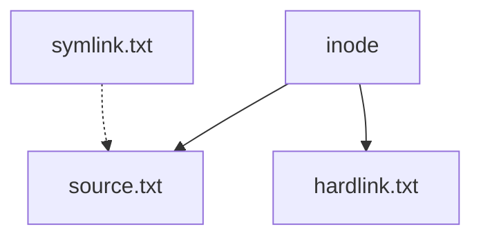

# Debian File Operations

## Introduction

File operations form the backbone of any operating system interaction. In Debian Linux, mastering these fundamental operations allows you to efficiently manage your system's files and directories. This guide will walk you through the essential file operations in Debian Linux, from basic file creation to advanced permission management.

Whether you're just starting with Debian or looking to solidify your understanding of file operations, this comprehensive guide will provide you with the knowledge and practical examples needed to become proficient.

## Basic File Operations

### Viewing Files and Directories

#### Listing Files with `ls`

The `ls` command is your go-to tool for listing files and directories.

```bash
# List files in the current directory
ls

# List files with details (permissions, size, modification date)
ls -l

# List all files (including hidden files)
ls -a

# Combine options
ls -la
```

Example output:

```
$ ls -la
total 32
drwxr-xr-x  5 user group 4096 Mar 13 14:22 .
drwxr-xr-x 18 user group 4096 Mar 13 14:10 ..
-rw-r--r--  1 user group  220 Mar 13 14:10 .bash_logout
-rw-r--r--  1 user group 3771 Mar 13 14:10 .bashrc
drwxr-xr-x  3 user group 4096 Mar 13 14:22 Documents
-rw-r--r--  1 user group   75 Mar 13 14:20 hello.txt
drwxr-xr-x  2 user group 4096 Mar 13 14:18 Pictures
```

#### Viewing File Content

To view the contents of a file, Debian provides several commands:

```bash
# Display entire file content
cat filename.txt

# Display file content with line numbers
cat -n filename.txt

# View file content page by page
less filename.txt

# View the first 10 lines of a file
head filename.txt

# View the last 10 lines of a file
tail filename.txt
```

### Creating Files and Directories

#### Creating Files

There are multiple ways to create files in Debian:

```bash
# Create an empty file
touch myfile.txt

# Create and edit a file using a text editor
nano myfile.txt
# or
vim myfile.txt

# Create a file with content
echo "Hello, Debian!" > myfile.txt

# Append content to an existing file
echo "Another line" >> myfile.txt
```

#### Creating Directories

To create directories, use the `mkdir` command:

```bash
# Create a single directory
mkdir Documents

# Create nested directories (parent directories if they don't exist)
mkdir -p Projects/WebDev/CSS
```

## Manipulating Files and Directories

### Copying Files and Directories

The `cp` command allows you to copy files and directories:

```bash
# Copy a file
cp source.txt destination.txt

# Copy a file to a directory
cp myfile.txt Documents/

# Copy multiple files to a directory
cp file1.txt file2.txt Documents/

# Copy a directory and its contents recursively
cp -r Pictures Backup/
```

### Moving and Renaming Files

The `mv` command is used for both moving and renaming files:

```bash
# Rename a file
mv oldname.txt newname.txt

# Move a file to a directory
mv myfile.txt Documents/

# Move multiple files to a directory
mv file1.txt file2.txt Documents/

# Move a directory
mv Pictures Documents/
```

### Removing Files and Directories

To remove files and directories in Debian:

```bash
# Remove a file
rm filename.txt

# Remove a file with confirmation prompt
rm -i filename.txt

# Remove an empty directory
rmdir emptydir

# Remove a directory and its contents recursively
rm -r directory
```

:::caution
Be extremely careful with the `rm` command, especially when used with the `-r` (recursive) and `-f` (force) options. Unlike the recycle bin in graphical interfaces, files deleted with `rm` are permanently removed with no easy recovery option.
:::

## File Permissions and Ownership

### Understanding File Permissions

In Debian, every file and directory has associated permissions that determine who can read, write, or execute them. Permissions are displayed when you use `ls -l`:

```
-rw-r--r--  1 user group   75 Mar 13 14:20 hello.txt
```

This format shows:
- File type (`-` for regular file, `d` for directory)
- Permissions for owner (`rw-`)
- Permissions for group (`r--`)
- Permissions for others (`r--`)

Permission symbols:
- `r`: Read permission
- `w`: Write permission
- `x`: Execute permission
- `-`: No permission

### Changing File Permissions

The `chmod` command changes file permissions:

```bash
# Using symbolic notation
chmod u+x script.sh       # Add execute permission for user
chmod g+w filename.txt    # Add write permission for group
chmod o-r filename.txt    # Remove read permission for others
chmod a+x script.sh       # Add execute permission for all

# Using numeric notation
chmod 755 script.sh       # rwxr-xr-x
chmod 644 filename.txt    # rw-r--r--
```

### Changing File Ownership

The `chown` command changes file ownership:

```bash
# Change the owner of a file
sudo chown newuser filename.txt

# Change both owner and group
sudo chown newuser:newgroup filename.txt

# Change ownership recursively
sudo chown -R newuser:newgroup directory/
```

## Advanced File Operations

### Finding Files

The `find` command helps locate files based on various criteria:

```bash
# Find files by name
find /home/user -name "*.txt"

# Find files modified in the last 7 days
find /home/user -type f -mtime -7

# Find files larger than 10MB
find /home/user -type f -size +10M

# Find empty files
find /home/user -type f -empty
```

### Linking Files

Debian supports both hard links and symbolic (soft) links:

```bash
# Create a hard link
ln source.txt hardlink.txt

# Create a symbolic link
ln -s source.txt symlink.txt
```

The difference is illustrated below:



### Archiving and Compressing Files

Debian offers various tools for archiving and compressing files:

```bash
# Create a tar archive
tar -cf archive.tar file1 file2 directory/

# Create a compressed tar archive (tar.gz)
tar -czf archive.tar.gz file1 file2 directory/

# Extract a tar archive
tar -xf archive.tar

# Extract a compressed tar archive
tar -xzf archive.tar.gz
```

Other compression utilities:

```bash
# Compress a file with gzip
gzip filename.txt

# Decompress a gzip file
gunzip filename.txt.gz

# Create a zip archive
zip -r archive.zip file1 file2 directory/

# Extract a zip archive
unzip archive.zip
```

## Practical Examples

### Example 1: Setting Up a Project Directory

Let's create a structured project directory for a web development project:

```bash
# Create the project directory structure
mkdir -p ~/Projects/MyWebsite/{css,js,images,docs}

# Navigate to the project directory
cd ~/Projects/MyWebsite

# Create initial files
touch index.html
touch css/style.css
touch js/script.js

# Add some content to the HTML file
echo "<!DOCTYPE html>" > index.html
echo "<html><head><title>My Website</title></head><body><h1>Hello, Debian!</h1></body></html>" >> index.html

# List the directory structure
find . -type f | sort
```

Output:
```
./css/style.css
./index.html
./js/script.js
```

### Example 2: File Backup Scenario

A common task is backing up important files:

```bash
# Create a backup directory
mkdir -p ~/Backups/$(date +%Y-%m-%d)

# Copy important files to the backup directory
cp -r ~/Documents ~/Pictures ~/Backups/$(date +%Y-%m-%d)/

# Create a compressed archive of the backup
tar -czf ~/backup-$(date +%Y-%m-%d).tar.gz ~/Backups/$(date +%Y-%m-%d)/

# Verify the backup contents
tar -tf ~/backup-$(date +%Y-%m-%d).tar.gz | head
```

### Example 3: Managing File Permissions for a Shared Project

When collaborating with others, you often need to manage permissions:

```bash
# Create a shared directory
sudo mkdir /opt/shared-project

# Create a group for collaborators
sudo groupadd project-team

# Add users to the group
sudo usermod -aG project-team user1
sudo usermod -aG project-team user2

# Change ownership and permissions
sudo chown -R root:project-team /opt/shared-project
sudo chmod -R 775 /opt/shared-project

# Set the SGID bit to ensure new files inherit the group
sudo chmod g+s /opt/shared-project
```

## Summary

In this guide, we've covered the essential file operations in Debian Linux:

- Viewing files and directories with `ls`, `cat`, and other commands
- Creating files and directories using `touch`, text editors, and `mkdir`
- Manipulating files with `cp`, `mv`, and `rm`
- Managing file permissions and ownership with `chmod` and `chown`
- Advanced operations like finding files, creating links, and archiving

Mastering these operations will give you a solid foundation for working with Debian Linux and make you more efficient at managing your system's files.

## Exercises

To reinforce your understanding, try these exercises:

1. Create a directory structure for organizing your photos by year and month.
2. Write a simple shell script that backs up your home directory to an external drive.
3. Set up a shared directory where multiple users can collaborate, with appropriate permissions.
4. Create a symbolic link from your home directory to a frequently accessed file located elsewhere.
5. Use the `find` command to identify all files larger than 100MB on your system.

## Additional Resources

- **Man Pages**: Access detailed documentation with `man ls`, `man cp`, etc.
- **GNU Coreutils Documentation**: The official documentation for most file operation commands.
- **The Debian Administrator's Handbook**: A comprehensive resource for Debian system administration.
- **Linux Command Library**: An online reference for Linux commands.

Remember that practice is key to becoming proficient with file operations. Start with simple commands and gradually work your way to more complex operations as you gain confidence.