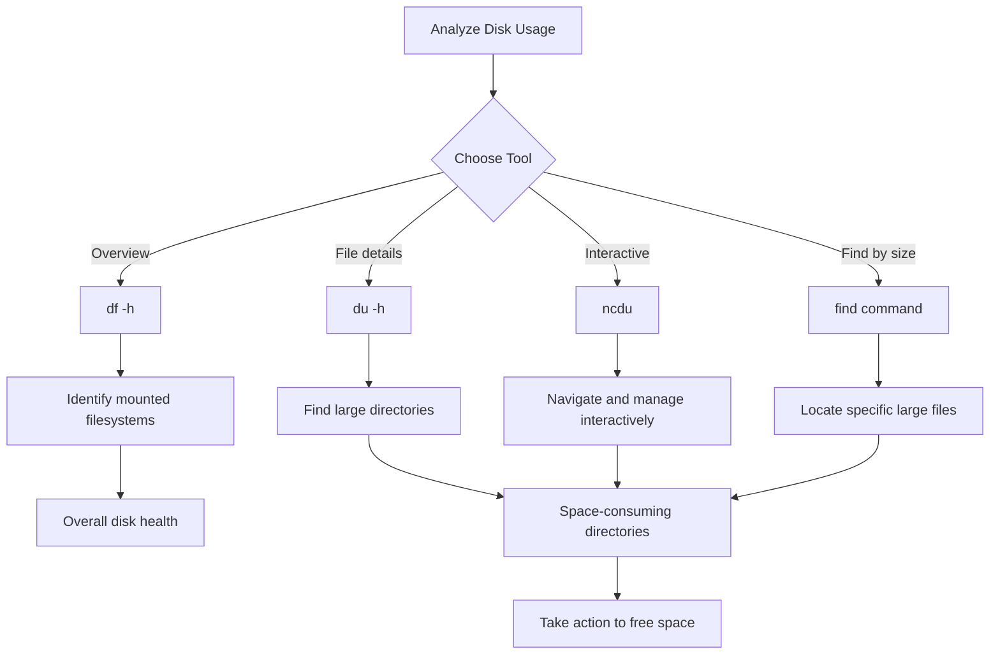

# Debian Disk Usage

## Introduction

Understanding how disk space is being used on your Debian system is a crucial skill for every Linux user. Whether you're managing a server with limited resources or just trying to clean up your personal computer, knowing how to monitor disk usage will help you maintain system health and performance. This guide explores the essential command-line tools that Debian provides for analyzing and managing disk space.

## Basic Disk Usage Commands

### Checking Available Disk Space with `df`

The `df` (disk free) command provides an overview of your file system's disk space usage.

```bash
df -h
```

The `-h` flag displays the sizes in human-readable format (KB, MB, GB).

Example output:

```
Filesystem      Size  Used Avail Use% Mounted on
/dev/sda1        20G  7.8G   11G  42% /
tmpfs           2.0G     0  2.0G   0% /dev/shm
/dev/sda2       450G  198G  230G  47% /home
```

This output shows:
- Each filesystem (device or partition)
- Total size
- Used space
- Available space
- Usage percentage
- Mount point

### Understanding File and Directory Sizes with `du`

The `du` (disk usage) command measures the disk space occupied by files and directories.

```bash
du -h /path/to/directory
```

To see only the total for a directory:

```bash
du -sh /path/to/directory
```

Example:

```bash
du -sh /home/username/Documents
```

Output:
```
784M    /home/username/Documents
```

#### Finding Large Files and Directories

To identify the largest files or directories, combine `du` with sorting:

```bash
du -h /home/username | sort -rh | head -10
```

This command:
1. Checks disk usage for all files/directories in `/home/username`
2. Sorts the results in reverse order by human-readable size
3. Shows only the top 10 entries

Example output:
```
5.2G    /home/username
4.3G    /home/username/Videos
2.1G    /home/username/Downloads
896M    /home/username/Documents
542M    /home/username/Pictures
```

## Advanced Disk Usage Tools

### Visualizing Disk Usage with `ncdu`

`ncdu` (NCurses Disk Usage) is an interactive disk usage analyzer that provides a more user-friendly interface than `du`.

First, install it if not already available:

```bash
sudo apt update
sudo apt install ncdu
```

To use `ncdu`:

```bash
ncdu /path/to/analyze
```

Navigate using arrow keys and press:
- `q` to quit
- `d` to delete a file or directory
- `Enter` to explore a directory

### Finding Files by Size with `find`

The `find` command can locate files larger than a specified size:

```bash
find /path/to/search -type f -size +100M
```

This command finds all files larger than 100MB in the specified path.

Example:

```bash
find /home/username -type f -size +500M
```

Output:
```
/home/username/Videos/movie.mp4
/home/username/Downloads/debian-11.0.0-amd64-DVD-1.iso
```

## Managing Disk Space

### Removing Unused Packages

Debian's package management system makes it easy to clean up unused packages:

```bash
sudo apt autoremove
```

### Clearing APT Cache

The APT package manager caches downloaded packages which can consume significant disk space:

```bash
sudo apt clean
```

To see how much space is used by the cache before cleaning:

```bash
du -sh /var/cache/apt/archives
```

### Analyzing Disk Usage with Visualization

Let's visually represent how disk usage analysis works:



## Real-World Examples

### Example 1: Server Running Out of Disk Space

Imagine you receive an alert that your Debian web server is running low on disk space. Here's a systematic approach to resolve it:

```bash
# 1. Check overall disk usage
df -h

# 2. Identify which partition is full (let's assume it's /)
# 3. Find the largest directories in the root partition
du -h --max-depth=1 / 2>/dev/null | sort -rh | head -10

# 4. If /var is large, check its subdirectories
du -h --max-depth=1 /var 2>/dev/null | sort -rh | head -10

# 5. If log files are the culprit, check the largest logs
find /var/log -type f -name "*.log" -exec du -h {} \; | sort -rh | head -10

# 6. Clean up large log files if appropriate
sudo truncate -s 0 /var/log/large_log_file.log
```

### Example 2: Cleaning a Personal Debian System

For a personal computer running out of space:

```bash
# 1. Check user home directory
du -sh /home/username/*

# 2. Find all files larger than 1GB
find /home/username -type f -size +1G

# 3. Clean browser cache (for Firefox)
rm -rf ~/.cache/mozilla/firefox/*.default/cache2/

# 4. Remove old downloaded packages
sudo apt clean
sudo apt autoremove

# 5. Empty trash
rm -rf ~/.local/share/Trash/*
```

## Practical Tips

1. **Regular Monitoring**: Schedule regular disk usage checks to prevent sudden space issues.

2. **Use Disk Quotas**: For systems with multiple users, consider implementing disk quotas:
   ```bash
   sudo apt install quota
   # Configuration requires editing /etc/fstab and setting up quotas
   ```

3. **Compress Old Files**: Rather than deleting, consider compressing rarely used files:
   ```bash
   tar -czf old_files.tar.gz /path/to/old/files
   ```

4. **Use Symbolic Links**: Move large data to partitions with more space and create symbolic links:
   ```bash
   mv /home/username/large_data /mnt/external_drive/
   ln -s /mnt/external_drive/large_data /home/username/large_data
   ```

## Summary

Monitoring and managing disk usage is an essential skill for Debian system administrators and users. The key tools to remember are:

- `df` for checking available disk space
- `du` for analyzing directory and file sizes
- `ncdu` for interactive disk usage navigation
- `find` for locating files by size
- Package management commands like `apt clean` and `apt autoremove` for system maintenance

By regularly checking disk usage and taking proactive measures, you can prevent performance issues and system failures caused by disk space shortages.

## Additional Resources

- The Debian wiki: [System Maintenance](https://wiki.debian.org/SystemMaintenance)
- Manual pages: Access with `man df`, `man du`, etc.

## Exercises

1. Find the three largest directories in your home folder.
2. Write a simple Bash script that alerts you when disk usage exceeds 80%.
3. Use `find` to locate all files modified in the last 7 days that are larger than 100MB.
4. Compare the output of `df -h` before and after running `apt clean` and `apt autoremove`.
5. Create a daily cron job to log disk usage statistics for monitoring trends over time.