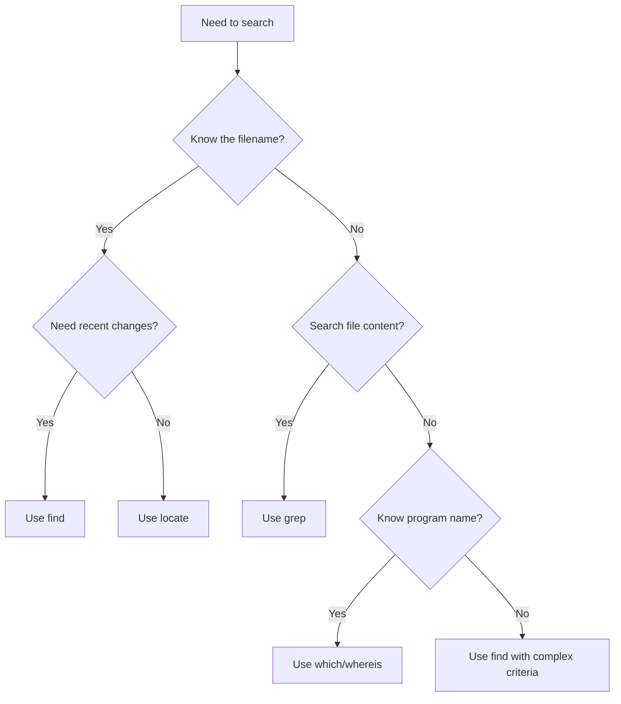

# Debian Search Functions

## Introduction

Finding files and content within a Debian Linux system is a fundamental skill for any user or developer. Debian provides several powerful tools that help you search for files, directories, and even content within files. Understanding these search functions can significantly improve your productivity and efficiency when working with Debian systems.

In this guide, we'll explore the most important search tools in Debian, including `find`, `locate`, `grep`, `which`, and `whereis`. Each tool has its strengths and specific use cases, and learning when to use each one will help you become more proficient in Debian file management.

## Basic File Search Tools

### The `find` Command

The `find` command is one of the most versatile and powerful search tools in Debian. It searches through the filesystem in real-time, allowing you to find files based on various criteria like name, size, permissions, and modification time.

#### Basic Syntax

```bash
find [path] [options] [expression]
```

#### Common Examples

**Finding files by name:**

```bash
# Find all .txt files in the current directory and subdirectories
find . -name "*.txt"
```

Output:
```
./documents/notes.txt
./backup/old_config.txt
./data/results.txt
```

**Finding files modified in the last 7 days:**

```bash
find /home/user -type f -mtime -7
```

Output:
```
/home/user/documents/report.pdf
/home/user/pictures/vacation.jpg
/home/user/.bash_history
```

**Finding files larger than 100MB:**

```bash
find /var -type f -size +100M
```

Output:
```
/var/log/syslog.1
/var/cache/apt/archives/large-package.deb
```

### The `locate` Command

The `locate` command is a much faster alternative to `find` because it uses a pre-built database of files on the system. This makes it ideal for quick searches when you know part of the filename.

#### Installation

`locate` isn't always installed by default on Debian:

```bash
sudo apt update
sudo apt install mlocate
```

After installation, the database needs to be updated:

```bash
sudo updatedb
```

#### Basic Usage

```bash
locate [options] pattern
```

#### Examples

**Find all configuration files:**

```bash
locate "*.conf"
```

Output:
```
/etc/apache2/apache2.conf
/etc/mysql/my.conf
/etc/ssh/ssh_config
/etc/resolv.conf
```

**Ignore case sensitivity:**

```bash
locate -i readme
```

Output:
```
/usr/share/doc/bash/README
/home/user/projects/README.md
/opt/application/Readme.txt
```

## Content Search Tools

### The `grep` Command

While `find` and `locate` search for files, `grep` searches for content within files. It's an essential tool for finding specific text patterns.

#### Basic Syntax

```bash
grep [options] pattern [file(s)]
```

#### Common Examples

**Search for a word in a specific file:**

```bash
grep "error" /var/log/syslog
```

Output:
```
May 10 14:23:12 debian-server systemd[1]: Failed to start Apache web server: error code 1
May 10 15:45:01 debian-server kernel: [ERROR] Unable to mount filesystem
```

**Search recursively through directories:**

```bash
grep -r "TODO" ~/projects/
```

Output:
```
/home/user/projects/app.js:// TODO: Fix authentication bug
/home/user/projects/styles.css:/* TODO: Improve mobile layout */
/home/user/projects/docs/notes.md:## TODO Items for Release
```

**Display line numbers with matches:**

```bash
grep -n "function" script.js
```

Output:
```
15:function calculateTotal(items) {
27:function validateInput(data) {
43:function renderPage() {
```

### Combining Search Tools

You can combine these tools for more powerful searches. For example, finding all Python files that contain a specific function:

```bash
find /home/user/projects -name "*.py" -exec grep -l "def process_data" {} \;
```

Output:
```
/home/user/projects/data_processor.py
/home/user/projects/utilities/helpers.py
```

## Specialized Search Commands

### The `which` Command

The `which` command helps you locate executable programs in your PATH:

```bash
which python3
```

Output:
```
/usr/bin/python3
```

### The `whereis` Command

The `whereis` command locates the binary, source, and manual page files for a command:

```bash
whereis python3
```

Output:
```
python3: /usr/bin/python3 /usr/lib/python3 /etc/python3 /usr/share/man/man1/python3.1.gz
```

## Advanced Usage: Finding Files with Complex Criteria

### Multiple Conditions with `find`

You can combine multiple conditions with `-and`, `-or`, and `-not` operators:

```bash
# Find .txt files that are larger than 1MB and were modified in the last day
find /home/user -name "*.txt" -and -size +1M -and -mtime -1
```

### Using `find` with Actions

The `-exec` option allows you to perform actions on the files you find:

```bash
# Find all .log files and delete them
find /var/log -name "*.log" -exec rm {} \;
```

```bash
# Find all .jpg files and create a backup
find ~/pictures -name "*.jpg" -exec cp {} ~/backup/ \;
```

## Real-World Examples

### Example 1: System Maintenance

Cleaning up old log files that haven't been accessed in the last 30 days:

```bash
find /var/log -name "*.log" -type f -atime +30 -exec rm {} \;
```

### Example 2: Security Audit

Finding files with improper permissions:

```bash
# Find world-writable files
find /etc -type f -perm -o=w -ls
```

### Example 3: Development Workflow

Finding all TODO comments in your code base:

```bash
grep -r "TODO" --include="*.{js,py,java,c,cpp}" ~/projects/
```

Output:
```
/home/user/projects/app.js:// TODO: Implement user authentication
/home/user/projects/api/views.py:# TODO: Add input validation
/home/user/projects/lib/database.cpp:// TODO: Optimize query performance
```

## Search Process Visualization

Here's a flowchart to help you decide which search tool to use:



## Performance Considerations

When searching on Debian systems, consider these performance tips:

1. **Use `locate` for quick filename searches** - It's much faster than `find` but requires the database to be updated.
2. **Limit search scope with `find`** - Searching from the root directory can be slow; specify subdirectories when possible.
3. **Use `grep` with file type filters** - Use `--include` or `--exclude` to limit the files searched.
4. **Consider using `xargs` with `find`** - This can be more efficient than `-exec` for multiple file operations.

## Summary

Debian provides a rich set of search tools that can help you locate files and content efficiently:

- **`find`** - Versatile real-time filesystem search with complex criteria
- **`locate`** - Fast filename search using a database
- **`grep`** - Content search within files
- **`which`** and **`whereis`** - Locate executable programs and their related files

Mastering these search functions will make you more productive when working with Debian systems, whether you're a system administrator, developer, or regular user.

## Exercises

1. Find all configuration files (ending in .conf) that contain the word "network" in the /etc directory.
2. Find all empty directories in your home folder.
3. Find all files larger than 100MB that haven't been accessed in the last 60 days.
4. Create a script that uses `find` and `grep` to search for files containing a specific pattern and outputs the results to a log file.
5. Use `locate` to find all Python script files on your system, then use `grep` to filter only those that import the "os" module.

## Additional Resources

- [Debian Manual Pages](https://manpages.debian.org/)
- [GNU Find Utils Documentation](https://www.gnu.org/software/findutils/)
- [Grep Manual](https://www.gnu.org/software/grep/manual/)