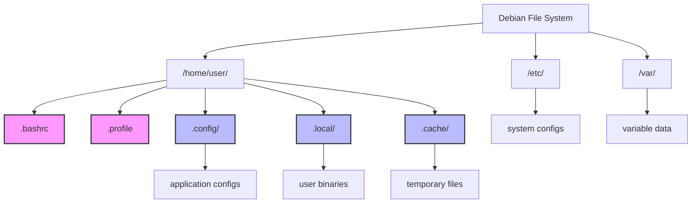

# Debian Hidden Files

## Introduction

In Debian and other Linux distributions, hidden files play a crucial role in system configuration and user preferences. These files are "hidden" from casual browsing to prevent accidental modification but are easily accessible when needed. This guide will help you understand what hidden files are, how to work with them, and why they are important in Debian systems.

## What Are Hidden Files?

In Debian, any file or directory whose name begins with a dot (`.`) is considered hidden. For example, `.bashrc` or `.config/`. These files don't appear in regular directory listings and are not shown in file managers by default.

Hidden files typically serve two main purposes:
1. **System configuration**: Files that control how applications or the system behaves
2. **User preferences**: Files that store your personal settings for various applications

## Why Use Hidden Files?

Hidden files help keep your directories clean and organized by hiding configuration files that:
- You don't need to interact with regularly
- Could cause system issues if accidentally modified
- Would clutter your view when browsing directories

## Viewing Hidden Files

### Using the Terminal

The most common way to view hidden files is using the `ls` command with the `-a` flag:

```bash
ls -a
```

Example output:
```
.              .bashrc         Documents       Pictures        Videos
..             .config         Downloads       Public
.bash_history  .local          Music           Templates
```

To get more details, combine it with the `-l` flag:

```bash
ls -la
```

Example output:
```
total 84
drwxr-xr-x 15 user user 4096 Mar 13 10:23 .
drwxr-xr-x  3 root root 4096 Jan  5 09:14 ..
-rw-------  1 user user 8192 Mar 12 22:45 .bash_history
-rw-r--r--  1 user user  220 Jan  5 09:14 .bashrc
drwxr-xr-x 10 user user 4096 Mar  3 18:30 .config
drwxr-xr-x  2 user user 4096 Jan  5 17:32 Documents
drwxr-xr-x  2 user user 4096 Jan 24 13:22 Downloads
drwxr-xr-x  3 user user 4096 Mar  1 15:43 .local
drwxr-xr-x  2 user user 4096 Jan  5 17:32 Music
drwxr-xr-x  2 user user 4096 Jan  5 17:32 Pictures
drwxr-xr-x  2 user user 4096 Jan  5 17:32 Public
drwxr-xr-x  2 user user 4096 Jan  5 17:32 Templates
drwxr-xr-x  2 user user 4096 Jan  5 17:32 Videos
```

### Using File Managers

In graphical file managers like Nautilus (GNOME Files) or Dolphin:
1. Press `Ctrl+H` to toggle display of hidden files
2. Or access the "View" menu and select "Show Hidden Files"

## Common Hidden Files in Debian

Let's explore some of the most important hidden files you'll encounter:

### User Configuration Files

| File/Directory | Purpose                                         |
|----------------|-------------------------------------------------|
| `~/.bashrc`    | Bash shell configuration for the current user   |
| `~/.profile`   | Environment variables and startup programs      |
| `~/.config/`   | Directory containing application configurations |
| `~/.local/`    | User-specific data files and executables        |
| `~/.cache/`    | Temporary cache files for applications          |
| `~/.ssh/`      | SSH keys and configuration                      |

### System-wide Hidden Files

| File/Directory   | Purpose                                   |
|------------------|-------------------------------------------|
| `/.hidden`       | Lists files to be hidden in file managers |
| `/etc/.pwd.lock` | Password database lock file               |
| `/var/.updated`  | Timestamp files for system updates        |

## Working with Hidden Files

### Creating Hidden Files

To create a hidden file, simply start the filename with a dot:

```bash
touch .myconfig
```

To create a hidden directory:

```bash
mkdir .myconfigs
```

### Editing Hidden Files

You can edit hidden files just like any other file:

```bash
nano ~/.bashrc
```

or

```bash
vim ~/.config/somefile
```

### Copying and Moving Hidden Files

Standard commands work with hidden files too, but remember to include the dot:

```bash
cp ~/.bashrc ~/.bashrc.backup
```

```bash
mv ~/.config/old_app/ ~/.config/new_app/
```

### Backing Up Hidden Files

When backing up user settings, don't forget to include important hidden files:

```bash
tar -czf config_backup.tar.gz ~/.bashrc ~/.config/
```

## Hidden Files vs Hidden Attributes

It's important to distinguish between:

1. **Hidden files**: Files with names starting with a dot (`.`)
2. **Hidden attributes**: Files with the hidden attribute set

In Debian, the primary mechanism is using dot-prefixed names, but files can also have attributes set using the `chattr` command:

```bash
# Make a file immutable (cannot be modified or deleted)
sudo chattr +i filename

# List attributes of a file
lsattr filename
```

## Real-World Examples

Let's explore some practical examples of working with hidden files:

### Example 1: Customizing Your Bash Prompt

The `~/.bashrc` file controls your bash shell behavior. To customize your prompt:

1. Open the file:
   ```bash
   nano ~/.bashrc
   ```

2. Find or add a PS1 line (prompt setting):
   ```bash
   PS1='\[\033[01;32m\]\u@\h\[\033[00m\]:\[\033[01;34m\]\w\[\033[00m\]\$ '
   ```

3. Save and reload:
   ```bash
   source ~/.bashrc
   ```

### Example 2: Creating Application Configurations

Many applications store user settings in the `~/.config` directory:

```bash
# Create configuration for a custom app
mkdir -p ~/.config/myapp
echo "theme=dark" > ~/.config/myapp/settings.conf
```

### Example 3: Managing Dot Files with Version Control

Many developers track their configuration files using Git:

```bash
# Initialize a repository for config files
git init ~/.dotfiles
cd ~/.dotfiles

# Create symbolic links to actual config files
ln -s ~/.bashrc bashrc
ln -s ~/.vimrc vimrc

# Add them to version control
git add .
git commit -m "Initial dotfiles setup"
```

## Best Practices for Hidden Files

1. **Don't modify system hidden files unless you know what you're doing**
2. **Back up important configuration files before editing them**
3. **Use version control for your personal configuration files**
4. **Clean up unused hidden files periodically to avoid clutter**

## Hidden File Locations Diagram



## Finding Hidden Files

To search for specific hidden files, you can use the `find` command:

```bash
# Find all hidden files in your home directory
find ~ -name ".*" -type f

# Find hidden directories
find ~ -name ".*" -type d

# Find hidden files modified in the last 7 days
find ~ -name ".*" -type f -mtime -7
```

## Common Issues with Hidden Files

### Problem 1: "File Not Found" errors

If you're getting "File Not Found" errors, check if you're including the dot:

```bash
# Incorrect
cat bashrc

# Correct
cat .bashrc
```

### Problem 2: Hidden Files Filling Up Disk Space

Hidden directories like `~/.cache` can consume significant disk space. To check:

```bash
du -sh ~/.cache
```

To clean up:

```bash
rm -rf ~/.cache/*
```

### Problem 3: File Manager Not Showing Hidden Files

If you can't see hidden files in your file manager even after pressing `Ctrl+H`, check your file manager's preferences or settings panel.

## Summary

Hidden files in Debian are an essential part of the system that:
- Keep your directories clean and organized
- Store important configuration settings
- Maintain user preferences across sessions
- Protect critical files from accidental modification

By understanding how to view, create, and modify hidden files, you can take full control of your Debian system and customize it to your needs.

## Additional Resources

- `man ls` - Learn more about the ls command options
- `man find` - Discover advanced techniques for finding files
- `man bash` - Understand how bash reads configuration files

## Exercises

1. Create a hidden file in your home directory named `.notes` and add some text to it.
2. Make a backup of your `.bashrc` file.
3. Use the `find` command to locate all hidden files in your home directory that were modified in the last 24 hours.
4. Create a hidden directory structure for organizing your scripts: `~/.scripts/backup/` and `~/.scripts/utilities/`.
5. Write a simple shell script that lists all hidden directories in your home folder, sorted by size.