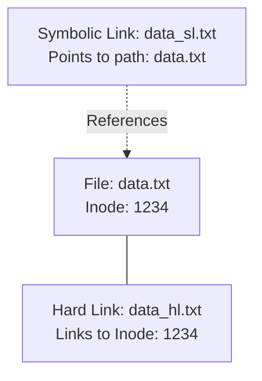

# Debian File Types

## Introduction

In Debian Linux, understanding different file types is crucial for effective system management and navigation. Unlike some operating systems that rely heavily on file extensions, Linux systems like Debian use a combination of naming conventions and file attributes to identify file types. This guide will introduce you to the common file types you'll encounter in a Debian system, how to identify them, and how they function.

## Basic File Types in Debian

Debian, like all Linux distributions, follows the "everything is a file" philosophy. However, these files can be categorized into several distinct types:

1. Regular Files
2. Directories
3. Links (Symbolic and Hard)
4. Special Files
   - Character Device Files
   - Block Device Files
   - Named Pipes (FIFOs)
   - Sockets

Let's explore each type in detail.

## Regular Files

Regular files are the most common type and contain data, text, program instructions, or other information.

### Identifying Regular Files

You can identify regular files using the `ls -l` command, which displays a dash (`-`) as the first character in the file permissions:

```bash
$ ls -l example.txt
-rw-r--r-- 1 user group 1234 Jan 15 10:30 example.txt
```

In this example, the leading dash indicates a regular file.

### Types of Regular Files

While all regular files share the same basic attributes, they can contain different types of content:

#### Text Files

Text files contain human-readable characters and can be viewed with text editors or cat commands:

```bash
$ cat hello.txt
Hello, Debian!
```

#### Binary Files

Binary files contain data in a format that isn't meant to be directly read by humans. Examples include compiled programs, images, and compressed archives:

```bash
$ file /bin/ls
/bin/ls: ELF 64-bit LSB shared object, x86-64, version 1 (SYSV), dynamically linked, ...
```

#### Configuration Files

Configuration files (usually with `.conf` extension or in `/etc` directory) contain settings for system and application behavior:

```bash
$ head -n 3 /etc/ssh/sshd_config
# Package generated configuration file
# See the sshd_config(5) manpage for details
```

## Directories

Directories are special files that contain references to other files and directories.

### Identifying Directories

Directories are identified by the 'd' at the beginning of the permissions string:

```bash
$ ls -l /home
drwxr-xr-x 5 user group 4096 Jan 15 10:30 user
```

### Working with Directories

Basic operations include creating, navigating, and removing directories:

```bash
# Create directory
$ mkdir new_directory

# Navigate into directory
$ cd new_directory

# List directory contents
$ ls -la

# Remove empty directory
$ rmdir new_directory

# Remove directory and contents
$ rm -r new_directory
```

## Links

Debian supports two types of links: symbolic links and hard links. Both point to other files but function differently.

### Symbolic Links (Soft Links)

Symbolic links are pointers to another file or directory. They can span different filesystems and point to directories.

#### Identifying Symbolic Links

Symbolic links are identified with an 'l' at the beginning of the permissions string:

```bash
$ ls -l /usr/bin/python
lrwxrwxrwx 1 root root 9 Dec 7 15:37 /usr/bin/python -> python3.9
```

#### Creating Symbolic Links

```bash
$ ln -s target_file link_name
```

For example:

```bash
$ ln -s /var/log/syslog syslog_link
$ ls -l syslog_link
lrwxrwxrwx 1 user group 15 Jan 15 12:45 syslog_link -> /var/log/syslog
```

### Hard Links

Hard links create additional directory entries for the same file, sharing the same inode. Hard links cannot span filesystems or link to directories.

#### Creating Hard Links

```bash
$ ln original_file hard_link
```

For example:

```bash
$ touch original_file
$ ln original_file hard_link
$ ls -l
-rw-r--r-- 2 user group 0 Jan 15 13:00 hard_link
-rw-r--r-- 2 user group 0 Jan 15 13:00 original_file
```

Note the "2" after permissions, indicating two links to the same inode.

### Difference Between Symbolic and Hard Links



## Special Files

Debian, like all Unix-like systems, treats hardware devices and various system resources as special files.

### Character and Block Device Files

These special files represent hardware devices:

- Character devices transmit data character by character (like keyboards, terminals)
- Block devices transmit data in blocks (like hard drives, USB drives)

#### Identifying Device Files

Device files are located in the `/dev` directory and are identified by 'c' (character) or 'b' (block) in the permissions:

```bash
$ ls -l /dev/sda /dev/tty
brw-rw---- 1 root disk    8,  0 Jan 15 09:45 /dev/sda
crw-rw-rw- 1 root tty     5,  0 Jan 15 09:45 /dev/tty
```

### Named Pipes (FIFOs)

Named pipes allow inter-process communication.

#### Identifying Named Pipes

Named pipes are identified by 'p' in the permissions:

```bash
$ mkfifo mypipe
$ ls -l mypipe
prw-r--r-- 1 user group 0 Jan 15 13:30 mypipe
```

#### Using Named Pipes

```bash
# Terminal 1
$ cat > mypipe

# Terminal 2 
$ cat < mypipe
```

Whatever you type in Terminal 1 will appear in Terminal 2.

### Sockets

Sockets are special files used for inter-process communication.

#### Identifying Sockets

Sockets are identified by 's' in the permissions:

```bash
$ ls -l /var/run/mysqld/mysqld.sock
srwxrwxrwx 1 mysql mysql 0 Jan 15 09:45 /var/run/mysqld/mysqld.sock
```

## Identifying File Types in Debian

Debian provides several ways to identify file types:

### Using the `file` Command

The `file` command examines the content of a file to determine its type:

```bash
$ file /bin/bash
/bin/bash: ELF 64-bit LSB shared object, x86-64, version 1 (SYSV), dynamically linked, ...

$ file /etc/passwd
/etc/passwd: ASCII text

$ file /usr/share/icons/default/index.theme
/usr/share/icons/default/index.theme: ASCII text
```

### Using ls with Flags

```bash
$ ls -F
filename     # Regular file
filename*    # Executable file
directory/   # Directory
symlink@     # Symbolic link
socket=      # Socket
pipe|        # Named pipe (FIFO)
```

### File Extensions in Debian

While Debian doesn't rely on extensions to determine file types, common extensions are often used for human readability:

- `.sh` - Shell scripts
- `.deb` - Debian package files
- `.conf` - Configuration files
- `.service` - Systemd service files

## Special Files in Debian Package Management

Debian uses several special files for package management:

### .deb Files

These are Debian binary packages containing software:

```bash
$ file firefox_115.0-1_amd64.deb
firefox_115.0-1_amd64.deb: Debian binary package (format 2.0)
```

### Control Files

Package metadata and configuration files:

```bash
$ dpkg -I firefox_115.0-1_amd64.deb
 new Debian package, version 2.0.
 size 81956140 bytes: control archive=34772 bytes.
     698 bytes,    12 lines      control              
     355 bytes,     5 lines      md5sums              
 ...
```

## Practical File Type Exercises

### Exercise 1: Exploring File Types

Try this command to see various file types in your system:

```bash
$ find /etc -type f -name "*.conf" | head -5   # Find configuration files
$ find /dev -type c | head -5                  # Find character devices
$ find /dev -type b | head -5                  # Find block devices
$ find /usr/bin -type l | head -5              # Find symbolic links
```

### Exercise 2: Creating and Working with Different File Types

```bash
# Create a text file
$ echo "Hello, Debian!" > hello.txt

# Create a symbolic link
$ ln -s hello.txt hello_link

# Compare the two
$ ls -l hello*
$ file hello*

# Create and use a named pipe
$ mkfifo testpipe
$ echo "Testing pipes" > testpipe &
$ cat < testpipe
```

## Summary

Understanding Debian file types is essential for effective system administration and navigation. In this guide, we've covered:

- Regular files (text, binary, configuration)
- Directories
- Links (symbolic and hard)
- Special files (devices, pipes, sockets)
- How to identify and work with different file types

By recognizing these different file types and understanding their purposes, you'll be better equipped to manage your Debian system effectively.

## Additional Resources

- Man pages: `man file`, `man ln`, `man find`
- The Linux Documentation Project: [tldp.org](https://tldp.org)
- Debian Documentation: [debian.org/doc](https://www.debian.org/doc/)

For more advanced topics, consider exploring:
- File permissions and ownership
- Extended attributes
- Access Control Lists (ACLs)
- File system types in Debian