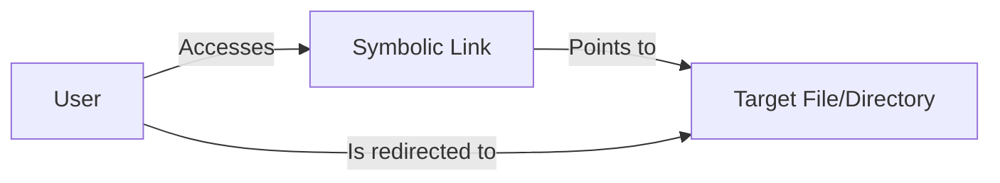

# Debian Symbolic Links

## Introduction

Symbolic links (also known as symlinks or soft links) are a powerful feature in Debian and other Linux systems that allow you to create references to files and directories. Think of them as advanced shortcuts that help you access files from multiple locations without creating duplicate copies. Symbolic links are essential tools for efficient file management in Debian systems.

In this guide, we'll explore what symbolic links are, how they differ from hard links, and how to create and manage them effectively on your Debian system.

## What Are Symbolic Links?

A symbolic link is a special type of file that points to another file or directory. Unlike regular files that store data, symbolic links store a path to the target file or directory. When you access a symbolic link, the system automatically redirects you to the target it points to.



### Key Characteristics of Symbolic Links

- They can point to files or directories
- They can link to targets across different filesystems
- They can point to targets that don't exist (creating "broken" links)
- They have their own inode and file permissions
- If the original file is deleted, the symbolic link becomes a "broken link"

## Hard Links vs. Symbolic Links

Before diving deeper, it's important to understand the difference between hard links and symbolic links:

| Feature | Symbolic Links | Hard Links |
|---------|----------------|------------|
| Implementation | Points to a path | Points to an inode |
| Cross-filesystem | Yes | No |
| Link to directories | Yes | Generally no (with exceptions) |
| Broken links possible | Yes | No |
| File size | Small (just the path length) | Same as target file |
| `ls -l` representation | Shows `l` at the start of permissions | Same as regular files |

## Creating Symbolic Links in Debian

The primary command for creating symbolic links in Debian is `ln` with the `-s` flag. The basic syntax is:

```bash
ln -s [target] [link_name]
```

### Basic Examples

Let's create a simple symbolic link to a file:

```bash
# Create a text file
echo "This is a test file" > original.txt

# Create a symbolic link to the file
ln -s original.txt link_to_original.txt

# View the link
ls -l link_to_original.txt
```

Output:
```
lrwxrwxrwx 1 user user 12 Mar 13 10:30 link_to_original.txt -> original.txt
```

### Creating Links to Directories

Creating symbolic links to directories works similarly:

```bash
# Create a directory
mkdir my_documents

# Create a symbolic link to the directory
ln -s my_documents docs_shortcut

# View the link
ls -l docs_shortcut
```

Output:
```
lrwxrwxrwx 1 user user 12 Mar 13 10:35 docs_shortcut -> my_documents
```

## Managing Symbolic Links

### Identifying Symbolic Links

You can identify symbolic links using the `ls` command with the `-l` flag. Symbolic links are shown with an `l` at the beginning of the permissions field and an arrow (`->`) pointing to their target.

```bash
ls -l
```

Output might include entries like:
```
lrwxrwxrwx 1 user user 12 Mar 13 10:35 link_name -> target_file
```

### Removing Symbolic Links

To remove a symbolic link, use the `rm` command just as you would with a regular file:

```bash
rm link_to_original.txt
```

Important: When removing symbolic links, don't include a trailing slash (`/`) when the link points to a directory, as this might attempt to remove the contents of the target directory instead of just the link.

### Updating Symbolic Links

To update a symbolic link to point to a different target, use the `-f` flag to force the creation of a new link:

```bash
# Create a new target file
echo "This is a new target" > new_file.txt

# Update the symbolic link to point to the new file
ln -sf new_file.txt link_name
```

## Practical Applications of Symbolic Links

### 1. Creating Command Shortcuts

Symbolic links are commonly used to create shortcuts for commands in directories included in your PATH:

```bash
# Create a complex command
echo 'echo "This is my complex command running"' > ~/scripts/my_complex_command.sh
chmod +x ~/scripts/my_complex_command.sh

# Create a symlink in a directory in your PATH
sudo ln -s ~/scripts/my_complex_command.sh /usr/local/bin/mycommand
```

Now you can simply type `mycommand` to run your script.

### 2. Managing Software Versions

Symbolic links can help manage multiple versions of software on your system:

```bash
# Example: Managing different Python versions
ln -s /usr/bin/python3.10 /usr/local/bin/python-latest

# Now you can use python-latest to always access the version you want
python-latest --version
```

### 3. Organizing Your Home Directory

Symbolic links can help organize your home directory by providing easy access to commonly used directories:

```bash
# Create a symbolic link to a deep directory structure
ln -s /media/storage/projects/website ~/website-shortcut

# Now you can access it directly from your home directory
cd ~/website-shortcut
```

### 4. System Administration

System administrators use symbolic links extensively for configuration management:

```bash
# Example: Enabling a site in Apache
sudo ln -s /etc/apache2/sites-available/my-site.conf /etc/apache2/sites-enabled/my-site.conf
```

## Common Issues and Troubleshooting

### Broken Symbolic Links

When the target of a symbolic link is deleted or moved, the link becomes "broken." You can find broken links using the `find` command:

```bash
# Find broken symbolic links in the current directory and its subdirectories
find . -type l -! -exec test -e {} \; -print
```

### Circular References

Be careful not to create circular references where links point to each other:

```bash
# This would create a circular reference - avoid this!
ln -s link1 link2
ln -s link2 link1
```

### Relative vs. Absolute Paths

You can create symbolic links using either relative or absolute paths. Each has its advantages:

```bash
# Absolute path (starts with /)
ln -s /home/user/documents/file.txt link1

# Relative path (relative to the current directory)
ln -s ../documents/file.txt link2
```

- **Absolute paths** always point to the same location regardless of where the link is moved
- **Relative paths** maintain their relationship if both the link and target are moved together

## Summary

Symbolic links are a powerful tool in Debian's file management system that allow you to:

1. Create shortcuts to files and directories
2. Access the same file from multiple locations without duplication
3. Manage software versions and configurations effectively
4. Organize your filesystem in a more intuitive way

By understanding how to create and manage symbolic links, you've added an essential skill to your Debian toolbox that will help you work more efficiently with files and directories.

## Exercises

1. Create a symbolic link to your home directory in `/tmp` and explore what happens when you navigate through it.
2. Create a symbolic link using a relative path, then move both the link and the target to a different directory. Does the link still work?
3. Set up a symbolic link to a configuration file, then edit the link. Verify that changes affect the original file.
4. Create a chain of symbolic links (link1 → link2 → link3 → file) and observe how the system resolves them.
5. Use the `find` command to locate all symbolic links in your home directory.

## Additional Resources

- The `ln` command manual: Access by typing `man ln` in your terminal
- The Linux Filesystem Hierarchy Standard: Understanding where files belong
- Advanced Bash scripting for managing symbolic links in bulk