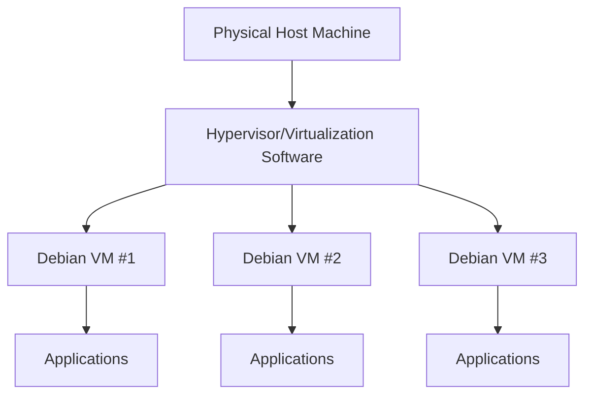

# Debian Virtual Machines

## Introduction

Virtual machines (VMs) are software emulations of physical computers that can run operating systems and applications. Debian, a robust and stable Linux distribution, is an excellent choice for virtualization due to its reliability, security, and lightweight nature. In this guide, we'll explore how to create, configure, and manage Debian virtual machines, enabling you to run multiple isolated environments on a single physical host.

## What Are Debian Virtual Machines?

A Debian virtual machine is a virtual environment running the Debian operating system. It allows you to:

- Test software in isolated environments
- Run multiple server applications without hardware conflicts
- Experiment with different configurations without risking your main system
- Learn Linux administration skills safely
- Create development environments that match production servers



## Virtualization Options for Debian

### Type 1 vs Type 2 Hypervisors

Virtualization platforms come in two main types:

1. **Type 1 (Bare metal)**: Runs directly on hardware
   - Examples: KVM, Xen, Proxmox VE
   - Better performance, more suitable for production

2. **Type 2 (Hosted)**: Runs on top of an operating system
   - Examples: VirtualBox, VMware Workstation, QEMU
   - Easier to set up, better for learning and development

### Popular Virtualization Platforms for Debian

| Platform | Type | Good For | License |
|----------|------|----------|---------|
| VirtualBox | Type 2 | Beginners, desktop users | Open Source |
| KVM | Type 1 | Production, servers | Open Source |
| QEMU | Type 2 | Experimentation, various architectures | Open Source |
| VMware | Both | Enterprise environments | Commercial |
| Proxmox VE | Type 1 | Debian-based virtualization platform | Open Source |

## Setting Up a Debian Virtual Machine

In this tutorial, we'll use VirtualBox as it's cross-platform and beginner-friendly.

### Step 1: Install VirtualBox

First, you need to install VirtualBox on your host system.

For Debian/Ubuntu hosts:

```bash
sudo apt update
sudo apt install virtualbox
```

For other operating systems, download from [VirtualBox's official website](https://www.virtualbox.org/wiki/Downloads).

### Step 2: Download Debian ISO

Download the latest Debian ISO from the [official website](https://www.debian.org/download). For beginners, the "netinst" (network install) ISO is a good choice as it's smaller and will download necessary packages during installation.

### Step 3: Create a New Virtual Machine

1. Open VirtualBox and click "New"
2. Name your VM (e.g., "Debian-VM") and select "Linux" as the type and "Debian" as the version
3. Allocate memory (RAM) to your VM (1024MB minimum, 2048MB recommended)
4. Create a virtual hard disk (VDI format is fine)
5. Choose dynamically allocated storage
6. Set the size (minimum 8GB, recommended 20GB+)

### Step 4: Configure VM Settings

Before starting the VM, adjust some settings:

1. Select your new VM and click "Settings"
2. Under "System" > "Processor," allocate at least 2 CPU cores if possible
3. Under "Display," increase video memory to 128MB
4. Under "Storage," select the empty optical drive and click the disk icon to choose the Debian ISO file
5. Under "Network," ensure "NAT" is selected for the first adapter

### Step 5: Install Debian

1. Start the VM by selecting it and clicking "Start"
2. Follow the Debian installer prompts:
   - Choose your language, location, and keyboard layout
   - Configure the network (DHCP is usually fine)
   - Set root password and create a user account
   - Partition the disk (use guided partitioning if you're unsure)
   - Choose your mirror location
   - Select software to install (Desktop environment if you want a GUI)
   - Install GRUB bootloader

### Step 6: Post-Installation Setup

After installation completes and you've rebooted into your new Debian system:

```bash
# Update your system
sudo apt update
sudo apt upgrade

# Install VirtualBox Guest Additions for better integration
sudo apt install build-essential dkms linux-headers-$(uname -r)
```

Then, from the VirtualBox menu, select "Devices" > "Insert Guest Additions CD Image" and run:

```bash
sudo mount /dev/cdrom /mnt
cd /mnt
sudo ./VBoxLinuxAdditions.run
```

Reboot your VM after the installation completes.

## Managing Debian Virtual Machines

### Snapshots

Snapshots allow you to save the state of your VM at a specific point in time, making it easy to revert changes.

To create a snapshot in VirtualBox:
1. Select your VM
2. Click "Machine" > "Take Snapshot"
3. Give your snapshot a name and description

To restore a snapshot:
1. Click "Machine" > "Restore Snapshot"
2. Select the snapshot you want to restore

### VM Cloning

Cloning creates a copy of an existing VM, which is useful for creating multiple similar environments.

To clone a VM in VirtualBox:
1. Right-click on your VM and select "Clone"
2. Give the clone a name
3. Choose between "Full clone" (completely independent) or "Linked clone" (shares disk space with original)
4. Click "Clone"

### Export and Import

You can export your VM as an appliance file (.ova) to share or back it up:

1. Select "File" > "Export Appliance"
2. Select your VM and follow the prompts

To import a VM:
1. Select "File" > "Import Appliance"
2. Browse to your .ova file and follow the prompts

## Networking in Debian VMs

### Network Configuration Options

VirtualBox offers several networking modes:

- **NAT**: Simple internet access, host can't easily access VM
- **Bridged**: VM appears as a separate device on your network
- **Host-only**: VM can only communicate with the host
- **Internal Network**: VMs can communicate with each other but not the host

### Example: Setting up a Web Server in a Debian VM

Let's configure a Debian VM with a web server that's accessible from the host:

1. In VirtualBox settings, change the network adapter to "Bridged"
2. Start the VM and install Apache:

```bash
sudo apt update
sudo apt install apache2
```

3. Check the VM's IP address:

```bash
ip addr show
```

4. On your host machine, open a browser and navigate to the VM's IP address
5. You should see the Apache default page

## Storage Management

### Resizing Virtual Disks

If you need more space, you can resize your virtual disk:

1. Shut down the VM
2. From the command line on the host:

```bash
VBoxManage modifyhd "/path/to/yourdisk.vdi" --resize 40960
```

This resizes the disk to 40GB. After restarting the VM, you'll need to extend the partition:

```bash
sudo apt install gparted
sudo gparted
```

Use GParted's graphical interface to resize the partition to use the new space.

### Adding Additional Disks

To add another virtual disk:

1. Shut down the VM
2. In VirtualBox, select your VM and open Settings
3. Go to "Storage," select the SATA controller, and click the "Add hard disk" button
4. Create a new disk and specify its size
5. Start the VM and format the new disk:

```bash
# Find the new disk (usually /dev/sdb)
sudo fdisk -l

# Create a partition
sudo fdisk /dev/sdb
# Press n for new partition, then accept defaults, then w to write changes

# Format the partition
sudo mkfs.ext4 /dev/sdb1

# Create a mount point
sudo mkdir /mnt/data

# Mount the disk
sudo mount /dev/sdb1 /mnt/data
```

To make the mount permanent, add to /etc/fstab:

```bash
echo "/dev/sdb1 /mnt/data ext4 defaults 0 2" | sudo tee -a /etc/fstab
```

## Advanced Debian VM Management

### VM Resource Management

Adjust your VM's resources based on workload:

```bash
# Check current CPU usage
top

# Check memory usage
free -h

# Check disk usage
df -h
```

In VirtualBox, you can adjust RAM and CPU cores by:
1. Shutting down the VM
2. Opening Settings > System
3. Adjusting "Base Memory" and "Processor" settings

### Automating VM Tasks with Shell Scripts

Create a script to automatically update your Debian VM:

```bash
#!/bin/bash
# save as update_vm.sh

echo "Updating Debian VM..."
sudo apt update
sudo apt upgrade -y
sudo apt autoremove -y
echo "Update complete!"
```

Make it executable and run it:

```bash
chmod +x update_vm.sh
./update_vm.sh
```

### Headless VM Management

Run VMs without a GUI using VBoxManage:

```bash
# Start a VM in headless mode
VBoxManage startvm "Debian-VM" --type headless

# Check running VMs
VBoxManage list runningvms

# Stop a VM
VBoxManage controlvm "Debian-VM" acpipowerbutton
```

## Real-World Applications

### Development Environment

Create a Debian VM with development tools:

```bash
sudo apt update
sudo apt install git build-essential nodejs npm python3 python3-pip
```

### Web Server Farm

Create multiple Debian VMs with different web servers for testing:

- VM1: Apache
- VM2: Nginx
- VM3: Lighttpd

Use bridged networking to access all servers from your host.

### Database Server

Set up a dedicated VM for database hosting:

```bash
sudo apt update
sudo apt install postgresql
```

Configure PostgreSQL to accept remote connections by editing `/etc/postgresql/*/main/postgresql.conf` and setting:

```
listen_addresses = '*'
```

And edit `/etc/postgresql/*/main/pg_hba.conf` to allow connections.

## Troubleshooting Common Issues

### Boot Problems

If your VM won't boot:
1. Check the boot order in Settings > System
2. Ensure the virtual disk is properly attached
3. Try restoring from a previous snapshot

### Network Issues

If your VM can't connect to the internet:
1. Verify the network adapter is enabled
2. Try different network modes (NAT, Bridged)
3. Check network settings within the VM:

```bash
ip addr show
sudo dhclient -v
```

### Performance Problems

If your VM is running slowly:
1. Increase RAM and CPU allocation
2. Install VirtualBox Guest Additions
3. Disable unnecessary services:

```bash
# List running services
systemctl list-units --type=service --state=running

# Disable a service
sudo systemctl disable service_name
```

## Best Practices for Debian VMs

1. **Regular Backups**: Create snapshots before making significant changes
2. **Keep Updated**: Regularly update your Debian system
3. **Resource Allocation**: Allocate appropriate resources based on workload
4. **Security**: Keep your VM as secure as your physical machine
5. **Documentation**: Document VM configurations and changes

## Summary

Debian virtual machines provide a flexible, powerful way to create isolated environments for development, testing, and production workloads. By following the steps outlined in this guide, you've learned how to:

- Create and configure Debian VMs
- Manage storage and networking
- Handle snapshots and backups
- Troubleshoot common issues
- Apply VMs to real-world scenarios

With these skills, you can leverage virtualization to enhance your productivity, test configurations safely, and create reproducible environments for various purposes.

## Further Learning

To continue developing your Debian VM skills:

1. Experiment with other virtualization platforms like KVM or Proxmox
2. Learn about containerization with Docker on Debian
3. Explore automation tools like Ansible to manage multiple VMs
4. Set up a VM cluster for high availability

## Practice Exercises

1. Create a Debian VM and install a LAMP stack (Linux, Apache, MySQL, PHP)
2. Set up two Debian VMs that can communicate with each other on an internal network
3. Create a VM snapshot, make significant system changes, then revert to the snapshot
4. Automate VM creation using VBoxManage commands or Vagrant
5. Configure a VM with multiple virtual disks in various RAID configurations