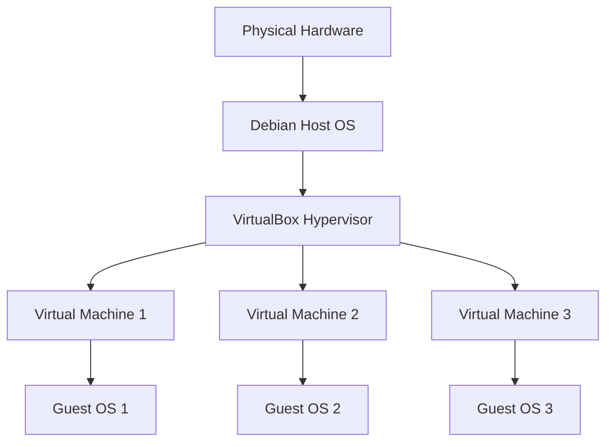

# Debian VirtualBox

## Introduction

VirtualBox is a powerful open-source virtualization software that allows you to run multiple operating systems simultaneously on a single physical machine. In this guide, we'll explore how to install, configure, and use Oracle VirtualBox on Debian Linux. Whether you're a developer wanting to test applications in different environments, a system administrator practicing configurations, or simply a curious user wanting to try new operating systems without affecting your main setup, VirtualBox on Debian provides a stable and versatile solution.

## What is VirtualBox?

Oracle VirtualBox is a type-2 hypervisor, meaning it runs on top of an existing operating system. It creates isolated environments called "virtual machines" (VMs) that emulate complete computer systems, including virtual hardware components like CPU, memory, storage, and network interfaces.



## Prerequisites

Before installing VirtualBox on Debian, ensure you have:

- Debian 11 (Bullseye) or newer installed
- Administrative (sudo) privileges
- At least 4GB of RAM (8GB+ recommended)
- 20GB+ of free disk space
- CPU with virtualization extensions (Intel VT-x or AMD-V)

## Installing VirtualBox on Debian

Let's start by installing VirtualBox from the official Debian repositories:

### Method 1: Using Debian Repositories

1. Update your system's package index:

```bash
sudo apt update
```

2. Install VirtualBox:

```bash
sudo apt install virtualbox
```

3. Verify the installation:

```bash
virtualbox --help
```

The output should show VirtualBox command-line options.

### Method 2: Using Oracle's Official Repository (Recommended)

1. Import Oracle's public key:

```bash
wget -q https://www.virtualbox.org/download/oracle_vbox_2016.asc -O- | sudo gpg --dearmor --yes --output /usr/share/keyrings/oracle-virtualbox-2016.gpg
```

2. Add the VirtualBox repository to your sources list:

```bash
echo "deb [arch=amd64 signed-by=/usr/share/keyrings/oracle-virtualbox-2016.gpg] https://download.virtualbox.org/virtualbox/debian $(lsb_release -cs) contrib" | sudo tee /etc/apt/sources.list.d/virtualbox.list
```

3. Update package information:

```bash
sudo apt update
```

4. Install the latest VirtualBox:

```bash
sudo apt install virtualbox-7.0
```

Replace `7.0` with the current version if newer.

5. Install the Extension Pack (optional but recommended):

```bash
wget https://download.virtualbox.org/virtualbox/7.0.12/Oracle_VM_VirtualBox_Extension_Pack-7.0.12.vbox-extpack
sudo vboxmanage extpack install Oracle_VM_VirtualBox_Extension_Pack-7.0.12.vbox-extpack
```

Replace the version numbers with the latest available version.

## Setting Up User Permissions

To use VirtualBox without sudo privileges, add your user to the `vboxusers` group:

```bash
sudo usermod -aG vboxusers $USER
```

Log out and log back in for the changes to take effect.

## Creating Your First Virtual Machine

Let's create a virtual machine running Debian:

1. Launch VirtualBox from the application menu or terminal:

```bash
virtualbox
```

2. Click "New" to create a new virtual machine.

3. Enter the basic details:
   - Name: Debian VM
   - Machine Folder: (default location)
   - Type: Linux
   - Version: Debian (64-bit)

4. Allocate memory (RAM):
   - Recommended: 2048 MB (2GB) minimum for Debian

5. Create a virtual hard disk:
   - Select "Create a virtual hard disk now"
   - Choose VDI (VirtualBox Disk Image) format
   - Select "Dynamically allocated" for better disk space management
   - Set the size to at least 20GB

6. Click "Create" to finish setting up the VM.

## Configuring Virtual Machine Settings

Before starting your VM, you might want to adjust some settings:

1. Select your VM and click "Settings".

2. Under "System":
   - Processor: Allocate 2 or more CPU cores
   - Enable PAE/NX if your host CPU supports it
   - Enable nested VT-x/AMD-V for nested virtualization (if needed)

3. Under "Display":
   - Increase video memory to 128MB
   - Enable 3D acceleration if your host supports it

4. Under "Network":
   - Adapter 1 is typically set to NAT by default
   - You can add more adapters as needed

5. Click "OK" to save the settings.

## Installing a Guest OS

Now let's install Debian as a guest OS:

1. Download the Debian ISO from the [official website](https://www.debian.org/download).

2. Start your VM and click the "folder" icon when prompted to select a start-up disk.

3. Navigate to your downloaded ISO file and select it.

4. Follow the Debian installation process as normal.

## Using VirtualBox Guest Additions

The Guest Additions provide enhanced functionality for your VM:

1. With your VM running, go to the VirtualBox menu and select "Devices" > "Insert Guest Additions CD image".

2. In the Debian guest, the CD should autorun. If not, open a terminal and run:

```bash
sudo mount /dev/cdrom /mnt
cd /mnt
sudo sh ./VBoxLinuxAdditions.run
```

3. Restart the VM after installation.

Benefits of Guest Additions include:
- Improved video performance
- Mouse pointer integration
- Shared folders
- Shared clipboard
- Seamless window integration

## Practical Examples and Use Cases

### Example 1: Setting Up a Development Environment

You can create a dedicated VM for development with specific versions of libraries and tools:

1. Create a new Debian VM following the steps above.
2. Install development tools:

```bash
sudo apt update
sudo apt install build-essential git python3 python3-pip nodejs npm
```

3. Now you have an isolated development environment that won't affect your host system.

### Example 2: Creating a Snapshot Before System Updates

VirtualBox allows you to create snapshots to save the state of your VM:

1. Select your VM in VirtualBox Manager.
2. Click on "Snapshots" in the right panel.
3. Click the "Take" button to create a snapshot.
4. Give it a name like "Before System Update" and a description.
5. Now you can safely update your system, knowing you can roll back if anything goes wrong:

```bash
sudo apt update && sudo apt upgrade
```

If problems occur, shut down the VM and restore the snapshot.

### Example 3: Sharing Files Between Host and Guest

With Guest Additions installed, you can set up shared folders:

1. In VM settings, go to "Shared Folders".
2. Click the "+" icon to add a new shared folder.
3. Select a folder on your host system, give it a name, and check "Auto-mount".
4. In the guest OS, access the shared folder at `/media/sf_FOLDER_NAME`.
5. To access it without root permissions, add your user to the `vboxsf` group:

```bash
sudo usermod -aG vboxsf $USER
```

Log out and log back in for the changes to take effect.

## Advanced VirtualBox Features

### Command-Line Management

VirtualBox can be managed entirely from the command line using `VBoxManage`:

```bash
# List all VMs
VBoxManage list vms

# Start a VM in headless mode (no GUI)
VBoxManage startvm "Debian VM" --type headless

# Stop a VM
VBoxManage controlvm "Debian VM" poweroff

# Create a snapshot
VBoxManage snapshot "Debian VM" take "Snapshot Name" --description "Description"

# Restore a snapshot
VBoxManage snapshot "Debian VM" restore "Snapshot Name"
```

### VM Cloning

Cloning lets you duplicate VMs quickly:

1. Right-click on a VM and select "Clone".
2. Choose between "Full clone" (completely independent) or "Linked clone" (shares disk with original).
3. Select whether to include snapshots.
4. Provide a name for the new VM and click "Clone".

### Import/Export Appliances

You can share VMs between computers:

1. To export: "File" > "Export Appliance", select your VM, and follow the wizard.
2. To import: "File" > "Import Appliance" and select the `.ova` file.

## Troubleshooting Common Issues

### VM Won't Start

If your VM fails to start, check these common issues:

1. **VT-x/AMD-V not enabled**: Enable virtualization in BIOS/UEFI.

```bash
# Check if virtualization is enabled
grep -E '(vmx|svm)' /proc/cpuinfo
```

If nothing is returned, virtualization is disabled.

2. **Kernel modules not loaded**: Try reloading the modules:

```bash
sudo modprobe vboxdrv
```

3. **Permission issues**: Ensure your user is in the `vboxusers` group:

```bash
groups | grep vboxusers
```

### Performance Problems

If your VM is slow:

1. Increase RAM allocation in VM settings.
2. Add more CPU cores.
3. Use a fixed-size VDI instead of dynamically allocated.
4. Enable I/O APIC in System settings.
5. Install Guest Additions for better performance.

### USB Devices Not Detected

If USB devices aren't working:

1. Ensure the VirtualBox Extension Pack is installed.
2. Add your user to the `vboxusers` group.
3. In VM settings, enable USB controllers (USB 3.0 recommended).
4. With the VM running, click the USB icon in the status bar to connect devices.

## Summary

VirtualBox on Debian provides a powerful platform for virtualization needs. We've covered:

- Installation methods for VirtualBox on Debian
- Creating and configuring virtual machines
- Installing guest operating systems
- Using Guest Additions for enhanced functionality
- Practical use cases and examples
- Advanced features including snapshots, cloning, and command-line management
- Troubleshooting common issues

By mastering VirtualBox, you can create isolated environments for development, testing, learning, and more—all without risking your main Debian system.

## Additional Resources

For further learning, consider exploring:

- The official [VirtualBox documentation](https://www.virtualbox.org/wiki/Documentation)
- Debian's [virtualization wiki](https://wiki.debian.org/Virtualization)
- VirtualBox's command-line tool: `man VBoxManage`

## Exercises

1. Create a new Debian VM and install a web server (Apache or Nginx). Configure it to serve a simple HTML page.
2. Set up a VM with multiple network adapters: one using NAT and another using Host-only networking.
3. Create a VM, take a snapshot, make some changes, and then practice restoring to the snapshot.
4. Try cloning a VM and changing the hostname on the clone.
5. Use the command line to start, stop, and manage your VMs without using the GUI.