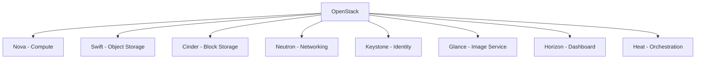

# Debian OpenStack

## Introduction

OpenStack is a powerful open-source cloud computing platform that enables organizations to create and manage private and public clouds. When combined with Debian's stability and security, it creates a robust foundation for virtualization and cloud infrastructure. This guide will walk you through understanding OpenStack on Debian, its key components, installation process, and practical applications.

OpenStack provides Infrastructure as a Service (IaaS) functionality, allowing users to provision and manage virtual machines, storage, and networking resources through a web dashboard or API. Debian's integration with OpenStack is particularly smooth, as both projects share a commitment to open-source values and community-driven development.

## Understanding OpenStack Architecture

OpenStack consists of several core components, each handling specific aspects of cloud infrastructure:



- **Nova**: Manages the compute resources
- **Swift**: Provides object storage
- **Cinder**: Handles block storage
- **Neutron**: Manages networks and IP addresses
- **Keystone**: Handles authentication and authorization
- **Glance**: Manages virtual machine images
- **Horizon**: Web-based dashboard for managing OpenStack services
- **Heat**: Orchestrates multiple composite cloud applications

## Prerequisites

Before installing OpenStack on Debian, ensure your system meets these requirements:

- Debian 11 (Bullseye) or Debian 12 (Bookworm)
- At least 8GB RAM (16GB recommended)
- 50GB available disk space
- Multicore CPU
- Internet connection
- Root or sudo access

## Installation Options

### Option 1: Using OpenStack Debian Packages

Debian provides official OpenStack packages through its repositories. This is the recommended approach for beginners.

First, update your system:

```bash
sudo apt update
sudo apt upgrade -y
```

Install the OpenStack client:

```bash
sudo apt install -y python3-openstackclient
```

Install the OpenStack Yoga release (for Debian 11) or Zed release (for Debian 12):

```bash
# For Debian 11 (Bullseye)
sudo apt install -y openstack-yoga

# For Debian 12 (Bookworm)
sudo apt install -y openstack-zed
```

### Option 2: Using DevStack

DevStack is a series of scripts that quickly deploy OpenStack for development and testing purposes.

```bash
sudo apt update
sudo apt install -y git
git clone https://opendev.org/openstack/devstack
cd devstack
```

Create a `local.conf` file:

```ini
[[local|localrc]]
ADMIN_PASSWORD=securepassword
DATABASE_PASSWORD=$ADMIN_PASSWORD
RABBIT_PASSWORD=$ADMIN_PASSWORD
SERVICE_PASSWORD=$ADMIN_PASSWORD
HOST_IP=your_server_ip
```

Run the installation script:

```bash
./stack.sh
```

This process takes approximately 15-30 minutes depending on your internet connection and hardware.

## Core Components Configuration

### Keystone (Identity Service)

After installation, set up authentication:

```bash
# Source the OpenStack credentials
source ~/devstack/openrc admin admin

# Verify Keystone is working
openstack user list
```

Output:
```
+----------------------------------+-------+
| ID                               | Name  |
+----------------------------------+-------+
| 54cd4fe7cfa74826b9f31bc9e158b2dc | admin |
| 5c42d32a0b1b4ee2b82b50a1a6538d4a | demo  |
+----------------------------------+-------+
```

### Glance (Image Service)

Upload a virtual machine image:

```bash
# Download a small Linux image
wget https://cloud-images.ubuntu.com/minimal/releases/focal/release/ubuntu-20.04-minimal-cloudimg-amd64.img

# Upload to Glance
openstack image create "Ubuntu 20.04" \
  --file ubuntu-20.04-minimal-cloudimg-amd64.img \
  --disk-format qcow2 \
  --container-format bare \
  --public
```

Verify the image was uploaded:

```bash
openstack image list
```

Output:
```
+--------------------------------------+-------------+--------+
| ID                                   | Name        | Status |
+--------------------------------------+-------------+--------+
| 7469f2b8-6e38-4163-9fa2-be70a059dd3d | Ubuntu 20.04| active |
+--------------------------------------+-------------+--------+
```

### Nova (Compute Service)

Create a flavor (VM template):

```bash
openstack flavor create --id 1 --ram 2048 --disk 20 --vcpus 1 m1.small
```

Verify available flavors:

```bash
openstack flavor list
```

Output:
```
+----+---------+-------+------+-----------+-------+-----------+
| ID | Name    |   RAM | Disk | Ephemeral | VCPUs | Is Public |
+----+---------+-------+------+-----------+-------+-----------+
| 1  | m1.small| 2048  |   20 |         0 |     1 | True      |
+----+---------+-------+------+-----------+-------+-----------+
```

### Neutron (Networking)

Create a network:

```bash
# Create a network
openstack network create private-net

# Create a subnet
openstack subnet create private-subnet \
  --network private-net \
  --subnet-range 192.168.1.0/24 \
  --gateway 192.168.1.1
```

## Launching Your First Instance

Now let's launch a virtual machine:

```bash
# Create a keypair
ssh-keygen -t rsa -f ~/cloud-key
openstack keypair create --public-key ~/cloud-key.pub my-keypair

# Create a security group rule to allow SSH
openstack security group rule create --proto tcp --dst-port 22 default

# Launch an instance
openstack server create \
  --flavor m1.small \
  --image "Ubuntu 20.04" \
  --key-name my-keypair \
  --network private-net \
  my-first-instance
```

Check the status of your instance:

```bash
openstack server list
```

Output:
```
+--------------------------------------+-----------------+--------+------------------------+---------------+
| ID                                   | Name            | Status | Networks               | Image Name    |
+--------------------------------------+-----------------+--------+------------------------+---------------+
| 5d42a9c9-567a-47b9-b8a1-4b8bbec9c4b7| my-first-instance| ACTIVE | private-net=192.168.1.2| Ubuntu 20.04  |
+--------------------------------------+-----------------+--------+------------------------+---------------+
```

## Managing OpenStack with Horizon Dashboard

OpenStack's web dashboard, Horizon, provides a user-friendly interface to manage your cloud resources. After installation, access it by navigating to `http://your_server_ip/dashboard` in your web browser.

Login credentials:
- Username: admin
- Password: the password you set during installation

From the dashboard, you can:
- Create and manage instances
- Configure networks
- Manage storage volumes
- Monitor resource usage
- Create and manage users and projects

## Practical OpenStack Use Cases

### 1. Development and Testing Environments

Create isolated environments for developers:

```bash
# Create a project for development
openstack project create development

# Create a developer user
openstack user create --password secure_password developer

# Assign roles
openstack role add --project development --user developer member
```

### 2. Deploying a Web Application Stack

Let's deploy a simple LAMP stack:

```bash
# Launch an instance for the web server
openstack server create \
  --flavor m1.small \
  --image "Ubuntu 20.04" \
  --key-name my-keypair \
  --network private-net \
  web-server

# Create and attach a volume for database storage
openstack volume create --size 10 db-volume
openstack server add volume web-server db-volume
```

After the instance is running, you can SSH into it and install the required software:

```bash
# SSH into the instance (assuming you've set up floating IPs)
ssh -i ~/cloud-key ubuntu@instance_floating_ip

# Install LAMP stack
sudo apt update
sudo apt install -y apache2 mysql-server php libapache2-mod-php
```

### 3. High Availability Cluster

OpenStack can be used to create highly available services:

```bash
# Launch multiple instances for load balancing
for i in {1..3}; do
  openstack server create \
    --flavor m1.small \
    --image "Ubuntu 20.04" \
    --key-name my-keypair \
    --network private-net \
    web-server-$i
done
```

## Common Challenges and Solutions

### Challenge 1: Network Connectivity Issues

If instances can't connect to the internet:

```bash
# Create an external network (admin only)
openstack network create public-net --external --provider-network-type flat

# Create a router
openstack router create main-router

# Add the private subnet to the router
openstack router add subnet main-router private-subnet

# Set the external gateway
openstack router set --external-gateway public-net main-router
```

### Challenge 2: Performance Optimization

For better performance:

```bash
# Check Nova service status
openstack compute service list

# Optimize Nova configuration
sudo nano /etc/nova/nova.conf

# Add these settings under [DEFAULT]
cpu_allocation_ratio = 16.0
ram_allocation_ratio = 1.5
```

## Maintenance and Upgrades

Keeping your OpenStack deployment updated is crucial:

```bash
# Check current version
openstack --version

# Update packages
sudo apt update
sudo apt upgrade -y

# Restart services
sudo systemctl restart nova-api nova-scheduler nova-conductor
sudo systemctl restart neutron-server
sudo systemctl restart keystone
```

## Summary

Debian OpenStack provides a powerful, flexible platform for building private and public clouds. We've covered:

- The architecture and core components of OpenStack
- Installation methods on Debian
- Basic configuration of key services
- Launching and managing virtual machines
- Real-world use cases and applications
- Troubleshooting common issues

By following this guide, you've taken your first steps into cloud computing with open-source technologies. OpenStack's flexibility allows it to scale from small development environments to large enterprise clouds, making it a valuable skill for any IT professional.

## Additional Resources

- [Official OpenStack Documentation](https://docs.openstack.org/)
- [Debian Cloud Team](https://wiki.debian.org/Cloud)
- [OpenStack API Reference](https://docs.openstack.org/api-ref/)

## Exercises

1. Create a multi-tier application with web, application, and database servers.
2. Set up a private Docker registry using OpenStack object storage.
3. Implement automatic scaling for a web application based on CPU usage.
4. Create a backup and recovery plan for your OpenStack instances.
5. Configure a private cloud for a small development team with project isolation.