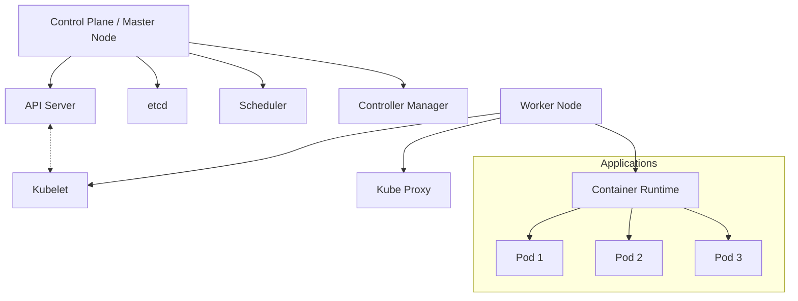

# Debian Kubernetes

## Introduction

Kubernetes (often abbreviated as K8s) is an open-source container orchestration platform that automates the deployment, scaling, and management of containerized applications. When combined with Debian's stability and security, it creates a powerful foundation for modern cloud-native infrastructure.

In this guide, we'll explore how to set up and manage Kubernetes on Debian systems. This combination is particularly popular in production environments due to Debian's reliability and Kubernetes' robust container orchestration capabilities.

## Prerequisites

Before we begin, ensure you have:

- A Debian system (Debian 11 "Bullseye" or newer recommended)
- Root or sudo access
- Basic understanding of Linux commands
- Familiarity with container concepts (Docker/Podman)

## Understanding Kubernetes Architecture

Kubernetes follows a master-worker architecture that consists of several key components:



- **Control Plane (Master)**: Manages the cluster
  - API Server: Serves the Kubernetes API
  - etcd: Stores cluster configuration
  - Scheduler: Assigns workloads to nodes
  - Controller Manager: Maintains desired state

- **Worker Nodes**: Run containerized applications
  - Kubelet: Ensures containers are running
  - Kube Proxy: Networking rules for services
  - Container Runtime: Runs containers (Docker, containerd, etc.)

## Setting Up Kubernetes on Debian

Let's walk through the process of setting up a Kubernetes cluster on Debian systems.

### 1. System Preparation

First, update your system and install prerequisites:

```bash
# Update system
sudo apt update && sudo apt upgrade -y

# Install dependencies
sudo apt install -y apt-transport-https ca-certificates curl gnupg lsb-release
```

### 2. Install Container Runtime (containerd)

Kubernetes needs a container runtime. Let's install containerd:

```bash
# Install containerd
sudo apt install -y containerd

# Create default configuration
sudo mkdir -p /etc/containerd
sudo containerd config default | sudo tee /etc/containerd/config.toml > /dev/null

# Configure containerd to use systemd cgroups
sudo sed -i 's/SystemdCgroup \= false/SystemdCgroup \= true/g' /etc/containerd/config.toml

# Restart containerd
sudo systemctl restart containerd
sudo systemctl enable containerd
```

### 3. Install Kubernetes Components

Now we'll install the three main Kubernetes components: kubeadm, kubelet, and kubectl.

```bash
# Add Kubernetes apt repository
curl -fsSL https://pkgs.k8s.io/core:/stable:/v1.29/deb/Release.key | sudo gpg --dearmor -o /etc/apt/keyrings/kubernetes-apt-keyring.gpg
echo 'deb [signed-by=/etc/apt/keyrings/kubernetes-apt-keyring.gpg] https://pkgs.k8s.io/core:/stable:/v1.29/deb/ /' | sudo tee /etc/apt/sources.list.d/kubernetes.list

# Update apt and install components
sudo apt update
sudo apt install -y kubelet kubeadm kubectl

# Prevent automatic updates
sudo apt-mark hold kubelet kubeadm kubectl
```

### 4. Configure System Settings

Prepare the system for Kubernetes:

```bash
# Load required kernel modules
cat <<EOF | sudo tee /etc/modules-load.d/k8s.conf
overlay
br_netfilter
EOF

sudo modprobe overlay
sudo modprobe br_netfilter

# Configure sysctl for networking
cat <<EOF | sudo tee /etc/sysctl.d/k8s.conf
net.bridge.bridge-nf-call-iptables  = 1
net.bridge.bridge-nf-call-ip6tables = 1
net.ipv4.ip_forward                 = 1
EOF

# Apply sysctl parameters
sudo sysctl --system

# Disable swap (required for Kubernetes)
sudo swapoff -a

# Make it permanent by commenting out swap entries in /etc/fstab
sudo sed -i '/ swap / s/^\(.*\)$/#\1/g' /etc/fstab
```

### 5. Initialize Kubernetes Cluster (Master Node)

If this is your master node, initialize the cluster:

```bash
# Initialize the cluster with a pod network CIDR
sudo kubeadm init --pod-network-cidr=10.244.0.0/16

# Example output:
# Your Kubernetes control-plane has initialized successfully!
# 
# To start using your cluster, you need to run the following as a regular user:
#   mkdir -p $HOME/.kube
#   sudo cp -i /etc/kubernetes/admin.conf $HOME/.kube/config
#   sudo chown $(id -u):$(id -g) $HOME/.kube/config
# 
# You should now deploy a pod network to the cluster.
# Run "kubectl apply -f [podnetwork].yaml" with one of the options listed at:
#   https://kubernetes.io/docs/concepts/cluster-administration/addons/
# 
# Then you can join any number of worker nodes by running the following on each as root:
# 
# kubeadm join 192.168.1.100:6443 --token abcdef.0123456789abcdef \
#         --discovery-token-ca-cert-hash sha256:1234...cdef
```

Follow the instructions from the output:

```bash
# Set up kubectl for your user
mkdir -p $HOME/.kube
sudo cp -i /etc/kubernetes/admin.conf $HOME/.kube/config
sudo chown $(id -u):$(id -g) $HOME/.kube/config
```

### 6. Install a Network Plugin

Deploy a Container Network Interface (CNI) to enable pod-to-pod communication:

```bash
# Install Flannel CNI
kubectl apply -f https://github.com/flannel-io/flannel/releases/latest/download/kube-flannel.yml
```

### 7. Join Worker Nodes

On each worker node, run the `kubeadm join` command that was output during the initialization:

```bash
# Example (your command will be different)
sudo kubeadm join 192.168.1.100:6443 --token abcdef.0123456789abcdef \
        --discovery-token-ca-cert-hash sha256:1234...cdef
```

If you need to generate a new token:

```bash
# Generate a new token on the master node
kubeadm token create --print-join-command
```

## Verifying the Cluster

Check your cluster status:

```bash
# Check node status
kubectl get nodes

# Example output:
# NAME        STATUS   ROLES           AGE     VERSION
# master-01   Ready    control-plane   10m     v1.29.2
# worker-01   Ready    <none>          5m      v1.29.2
# worker-02   Ready    <none>          5m      v1.29.2
```

## Deploying Your First Application

Let's deploy a simple web application to test our cluster:

```bash
# Create a deployment for the NGINX web server
kubectl create deployment nginx --image=nginx

# Expose the deployment as a service
kubectl expose deployment nginx --port=80 --type=NodePort

# Check the deployed service
kubectl get svc nginx

# Example output:
# NAME    TYPE       CLUSTER-IP      EXTERNAL-IP   PORT(S)        AGE
# nginx   NodePort   10.96.100.123   <none>        80:31234/TCP   1m
```

You can now access the NGINX web server by visiting any node IP address with the assigned NodePort (e.g., `http://192.168.1.101:31234`).

## Common Kubernetes Commands

Here are some essential commands for managing your Kubernetes cluster:

```bash
# View all resources in the cluster
kubectl get all

# View pods in all namespaces
kubectl get pods --all-namespaces

# Describe a specific pod for detailed info
kubectl describe pod <pod-name>

# View logs for a pod
kubectl logs <pod-name>

# Execute a command in a pod
kubectl exec -it <pod-name> -- /bin/bash

# Delete a resource
kubectl delete deployment <deployment-name>

# Apply a configuration from a file
kubectl apply -f my-config.yaml
```

## Kubernetes on Debian for Production

For production environments, consider these best practices:

1. **High Availability**: Configure multiple master nodes for high availability
2. **Secure Communication**: Enable TLS for all cluster communications
3. **Resource Management**: Set resource limits for all deployments
4. **Monitoring**: Implement monitoring with Prometheus and Grafana
5. **Backups**: Regularly back up etcd data
6. **Updates**: Plan for regular updates of both Debian and Kubernetes

### Example Production Setup

Here's a YAML configuration for a simple but resilient web application deployment:

```yaml
apiVersion: apps/v1
kind: Deployment
metadata:
  name: webapp
  labels:
    app: webapp
spec:
  replicas: 3
  selector:
    matchLabels:
      app: webapp
  template:
    metadata:
      labels:
        app: webapp
    spec:
      containers:
      - name: webapp
        image: nginx:latest
        ports:
        - containerPort: 80
        resources:
          limits:
            memory: "128Mi"
            cpu: "500m"
          requests:
            memory: "64Mi"
            cpu: "250m"
        livenessProbe:
          httpGet:
            path: /
            port: 80
          initialDelaySeconds: 30
          periodSeconds: 10
```

Apply this configuration with:

```bash
kubectl apply -f webapp-deployment.yaml
```

## Troubleshooting Common Issues

### Pods Stuck in Pending State

If pods are stuck in a pending state, check node resources:

```bash
# Check node capacity
kubectl describe nodes

# Look for "Allocatable" and "Allocated resources" sections
```

### Networking Issues

If pods can't communicate:

```bash
# Check if DNS pods are running
kubectl get pods -n kube-system | grep coredns

# Check network plugin pods
kubectl get pods -n kube-system | grep flannel
```

### Node Not Ready

If a node shows "NotReady" status:

```bash
# Check kubelet status
sudo systemctl status kubelet

# View kubelet logs
sudo journalctl -u kubelet
```

## Summary

In this guide, we've covered:

1. The basics of Kubernetes architecture and components
2. How to install and configure Kubernetes on Debian systems
3. Deploying your first application to the cluster
4. Essential commands for managing your Kubernetes resources
5. Best practices for production deployments
6. Troubleshooting common issues

Kubernetes on Debian provides a solid foundation for running containerized applications with the reliability and security that Debian is known for. As you become more familiar with this setup, you'll be able to deploy more complex applications and take advantage of advanced Kubernetes features like auto-scaling, rolling updates, and more.

## Additional Resources

- [Kubernetes Official Documentation](https://kubernetes.io/docs/home/)
- [Debian Wiki - Kubernetes](https://wiki.debian.org/Kubernetes)
- [Certified Kubernetes Administrator (CKA) Certification](https://www.cncf.io/certification/cka/)

## Exercises

1. Deploy a stateful application like MySQL to your Kubernetes cluster.
2. Configure persistent storage using Persistent Volumes.
3. Set up an Ingress controller to manage external access to services.
4. Implement auto-scaling for a deployment based on CPU usage.
5. Create a multi-tier application with frontend, backend, and database services.