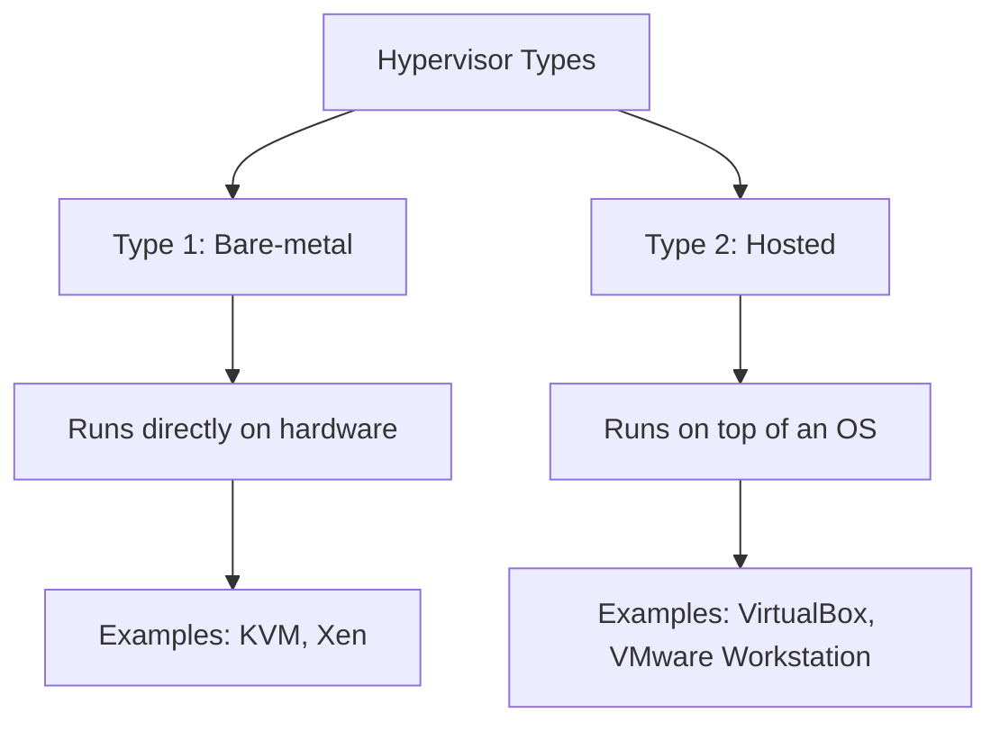

# Debian Hypervisor

## Introduction

A hypervisor is a technology that creates and manages virtual machines (VMs) - completely isolated software containers that behave like independent computers with their own operating systems and applications. In the Debian ecosystem, hypervisors play a crucial role in allowing you to run multiple operating systems on a single physical machine.

This guide explores how to set up, configure, and manage hypervisors on Debian systems, providing you with the knowledge to efficiently virtualize your computing resources.

## Understanding Hypervisors

### What is a Hypervisor?

A hypervisor (also known as a Virtual Machine Monitor or VMM) is software, firmware, or hardware that creates and runs virtual machines. It sits between the hardware and the virtual machines, allocating computing resources like CPU, memory, and storage.

There are two main types of hypervisors:



1. **Type 1 (Bare-metal)**: Runs directly on the host's hardware to control the hardware and manage guest operating systems.
2. **Type 2 (Hosted)**: Runs on a conventional operating system as an application.

In Debian environments, we primarily work with:

- **KVM (Kernel-based Virtual Machine)**: A Type 1 hypervisor that's part of the Linux kernel
- **QEMU**: Often used alongside KVM for hardware emulation
- **Xen**: Another Type 1 hypervisor option for Debian
- **VirtualBox**: A Type 2 hypervisor for desktop virtualization

## KVM: The Primary Debian Hypervisor

KVM (Kernel-based Virtual Machine) is the most commonly used hypervisor in Debian environments. It leverages hardware virtualization features in modern processors to provide efficient virtualization.

### Checking Hardware Support

Before proceeding, verify that your CPU supports hardware virtualization:

```bash
egrep -c '(vmx|svm)' /proc/cpuinfo
```

If the result is greater than 0, your CPU supports hardware virtualization (Intel VT-x or AMD-V).

## Setting Up KVM on Debian

### Step 1: Install Required Packages

First, update your package repositories and install KVM and related tools:

```bash
sudo apt update
sudo apt install qemu-kvm libvirt-daemon-system libvirt-clients bridge-utils virtinst virt-manager
```

These packages include:
- **qemu-kvm**: The primary KVM package
- **libvirt-daemon-system**: System services for libvirt
- **libvirt-clients**: Command-line utilities for managing VMs
- **bridge-utils**: Tools for configuring the network bridge
- **virtinst**: Tools for creating virtual machines
- **virt-manager**: A GUI for managing virtual machines

### Step 2: Verify Installation

Check if the KVM modules are loaded properly:

```bash
lsmod | grep kvm
```

Expected output:
```
kvm_intel             348160  0
kvm                   987136  1 kvm_intel
```

Note: On AMD processors, you'll see `kvm_amd` instead of `kvm_intel`.

### Step 3: Add Your User to the Required Groups

To manage VMs without root privileges:

```bash
sudo usermod -aG libvirt,kvm $USER
```

Log out and log back in for the group changes to take effect.

### Step 4: Start and Enable the libvirt Service

```bash
sudo systemctl enable --now libvirtd
sudo systemctl status libvirtd
```

## Creating Your First Virtual Machine

### Using virt-manager (GUI Method)

The easiest way for beginners to create a VM is using the virt-manager GUI tool:

1. Open virt-manager by running `virt-manager` in your terminal
2. Click the "Create a new virtual machine" button
3. Select your installation method (ISO image, network installation, etc.)
4. Follow the wizard to allocate resources and complete the VM setup

### Using Command Line (virsh)

For scripting and automation, you can use the command line:

```bash
sudo virt-install \
  --name debian-test \
  --ram 2048 \
  --disk path=/var/lib/libvirt/images/debian-test.qcow2,size=20 \
  --vcpus 2 \
  --os-variant debian10 \
  --network bridge=virbr0 \
  --graphics vnc \
  --console pty,target_type=serial \
  --cdrom /path/to/debian-11.0.0-amd64-netinst.iso
```

This command creates a VM named "debian-test" with:
- 2 GB RAM
- 20 GB disk space
- 2 virtual CPUs
- Debian 10 OS type
- Default network configuration
- VNC graphics support
- A console connected to the VM's serial port
- The Debian installation ISO mounted as a CD-ROM

## Managing Virtual Machines

### Basic VM Management Commands

Here are essential commands for managing your VMs:

```bash
# List all VMs
virsh list --all

# Start a VM
virsh start debian-test

# Connect to the console of a VM
virsh console debian-test

# Gracefully shut down a VM
virsh shutdown debian-test

# Force a VM to stop
virsh destroy debian-test

# Delete a VM (this removes the VM but not its storage)
virsh undefine debian-test

# Delete a VM and its storage
virsh undefine debian-test --remove-all-storage
```

### VM Snapshots

KVM allows you to create snapshots of VMs to save their state:

```bash
# Create a snapshot
virsh snapshot-create-as debian-test snapshot1 "First snapshot" --disk-only --atomic

# List snapshots
virsh snapshot-list debian-test

# Revert to a snapshot
virsh snapshot-revert debian-test snapshot1

# Delete a snapshot
virsh snapshot-delete debian-test snapshot1
```

## Advanced Configuration

### Networking Options

KVM in Debian provides several networking modes:

1. **NAT (Network Address Translation)**: The default mode, provides outbound connectivity
   
2. **Bridged Networking**: VMs appear on the same network as the host
   
   To set up bridged networking, edit `/etc/network/interfaces`:
   
   ```
   # The primary network interface
   auto enp0s3
   iface enp0s3 inet manual

   # The bridge interface
   auto br0
   iface br0 inet dhcp
       bridge_ports enp0s3
       bridge_stp off
       bridge_fd 0
       bridge_maxwait 0
   ```
   
3. **Isolated Network**: VMs can communicate with each other but not with external networks

### Storage Management

KVM supports various storage formats:

1. **raw**: Simple format with direct mapping to the host storage
   
2. **qcow2**: QEMU Copy-On-Write format, supports snapshots and compression
   
   ```bash
   # Create a new qcow2 image
   qemu-img create -f qcow2 /var/lib/libvirt/images/new-disk.qcow2 20G
   
   # Attach the disk to a VM
   virsh attach-disk debian-test /var/lib/libvirt/images/new-disk.qcow2 vdb --cache none
   ```

3. **LVM**: Using Logical Volume Manager for VM storage
   
   ```bash
   # Create a logical volume
   sudo lvcreate -n debian-test-lv -L 20G vg_name
   
   # Use it with a VM
   sudo virt-install ... --disk path=/dev/vg_name/debian-test-lv ...
   ```

## Performance Tuning

To get the best performance from your KVM virtual machines, consider:

1. **CPU Pinning**: Dedicate specific host CPUs to VMs
   
   ```bash
   virsh vcpupin debian-test 0 2
   ```
   
   This pins vCPU 0 of the VM to physical CPU 2 on the host.

2. **Memory Tuning**: Enable huge pages for better memory performance
   
   Edit `/etc/default/qemu-kvm` and add:
   
   ```
   KVM_HUGEPAGES=1
   ```

3. **I/O Tuning**: Use virtio drivers for disk and network for near-native performance

## Real-World Use Cases

### Web Hosting Environment

A common use case is setting up multiple web servers:

```bash
# Create VMs for web hosting
sudo virt-install \
  --name webserver1 \
  --ram 4096 \
  --disk path=/var/lib/libvirt/images/webserver1.qcow2,size=40 \
  --vcpus 4 \
  --os-variant debian11 \
  --network bridge=br0 \
  --graphics vnc \
  --console pty,target_type=serial \
  --cdrom /path/to/debian-11.0.0-amd64-netinst.iso
```

### Development and Testing

Create lightweight VMs for testing different configurations:

```bash
# Create a small VM for testing
sudo virt-install \
  --name test-env \
  --ram 1024 \
  --disk path=/var/lib/libvirt/images/test-env.qcow2,size=10 \
  --vcpus 1 \
  --os-variant debian11 \
  --network default \
  --graphics vnc \
  --console pty,target_type=serial \
  --cdrom /path/to/debian-11.0.0-amd64-netinst.iso
```

### Learning Environment

For educational purposes, you can create multiple VMs to simulate a network:

```bash
# Create a lab network
sudo virsh net-define /dev/stdin <<EOF
<network>
  <name>labnet</name>
  <bridge name='virbr1' stp='on' delay='0'/>
  <domain name='lab.local'/>
  <ip address='192.168.100.1' netmask='255.255.255.0'>
    <dhcp>
      <range start='192.168.100.128' end='192.168.100.254'/>
    </dhcp>
  </ip>
</network>
EOF

sudo virsh net-start labnet
sudo virsh net-autostart labnet
```

Then create VMs connected to this network.

## Troubleshooting Common Issues

### Permission Denied

If you encounter permission errors:

```bash
sudo chmod 666 /dev/kvm
sudo usermod -aG kvm,libvirt $USER
```

Then log out and log back in.

### VM Won't Start

Check logs for errors:

```bash
sudo tail -f /var/log/libvirt/qemu/debian-test.log
```

### Network Issues

If VMs can't connect to the network:

```bash
sudo systemctl restart libvirtd
sudo virsh net-start default
```

## Summary

In this guide, we've explored the Debian hypervisor ecosystem, focusing primarily on KVM:

1. We learned what hypervisors are and their types
2. We set up KVM on a Debian system
3. We created and managed virtual machines
4. We configured networking and storage
5. We explored performance tuning options
6. We looked at real-world use cases
7. We addressed common troubleshooting scenarios

Hypervisors like KVM on Debian provide a powerful and flexible foundation for virtualization, allowing you to maximize hardware utilization, isolate applications, and create versatile computing environments.

## Further Learning

To deepen your understanding of hypervisors on Debian:

1. Explore the official [libvirt documentation](https://libvirt.org/docs.html)
2. Practice creating different VM configurations
3. Try setting up a small cluster of VMs that communicate with each other
4. Experiment with automated VM provisioning using tools like Ansible

## Exercises

1. Create a VM with Debian and install a web server on it.
2. Set up a VM with an isolated network and test connectivity between multiple VMs.
3. Create a VM snapshot, make changes to the VM, then revert to the snapshot.
4. Configure a VM to automatically start when the host boots.
5. Create a VM with custom CPU and memory allocations tailored for a specific workload.