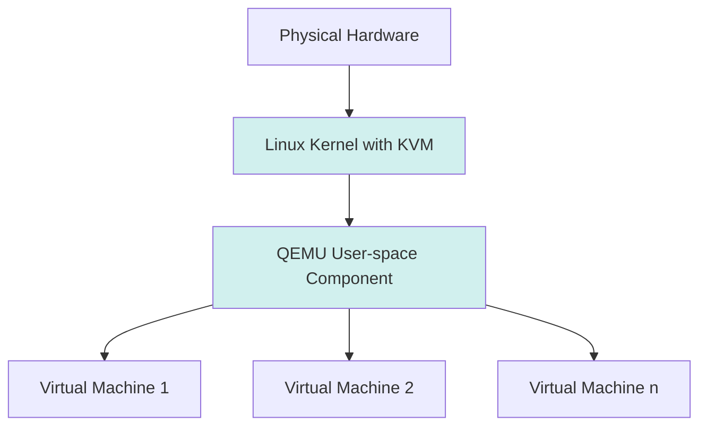

# Debian KVM: Virtualization with Kernel-based Virtual Machine

## Introduction

Kernel-based Virtual Machine (KVM) is a virtualization technology built directly into the Linux kernel, allowing you to run multiple virtual machines (VMs) efficiently on a single physical server. On Debian systems, KVM provides a powerful yet accessible way to create and manage virtual machines with near-native performance.

In this guide, we'll explore how to set up and use KVM on Debian, understand its key components, and learn practical applications for development environments, testing, and server consolidation.

## What is KVM?

KVM (Kernel-based Virtual Machine) is a full virtualization solution for Linux that turns the Linux kernel itself into a hypervisor. This means:

- It's built directly into the Linux kernel (since version 2.6.20)
- Requires CPU virtualization extensions (Intel VT-x or AMD-V)
- Provides near-native performance for guest operating systems
- Supports running multiple operating systems simultaneously

Here's how KVM fits into the virtualization landscape:



## Prerequisites

Before installing KVM on Debian, ensure your system meets these requirements:

1. A 64-bit CPU with virtualization extensions
2. Debian 10 (Buster) or newer
3. At least 4GB of RAM (more is better)
4. Sufficient disk space for VM storage

### Checking for Virtualization Support

To verify your CPU supports virtualization and that it's enabled in BIOS:

```bash
grep -E 'vmx|svm' /proc/cpuinfo
```

If this returns output, your processor supports virtualization. If nothing appears, you may need to enable virtualization in your system's BIOS/UEFI settings.

## Installing KVM on Debian

Let's install KVM and its required components:

```bash
sudo apt update
sudo apt install qemu-kvm libvirt-daemon-system libvirt-clients bridge-utils virtinst virt-manager
```

This installs:
- `qemu-kvm`: The QEMU emulator with KVM support
- `libvirt-daemon-system`: System services for libvirt
- `libvirt-clients`: Command-line utilities for managing VMs
- `bridge-utils`: Tools for configuring network bridges
- `virtinst`: Tools for installing virtual machines
- `virt-manager`: A GUI for managing virtual machines

### Post-Installation Setup

Add your user to the required groups to manage VMs without using sudo:

```bash
sudo adduser $(whoami) libvirt
sudo adduser $(whoami) kvm
```

Then either log out and back in or run:

```bash
newgrp libvirt
```

To verify the installation:

```bash
virsh list --all
```

The output should be an empty list of virtual machines:

```
 Id   Name   State
--------------------
```

## Understanding KVM Components

KVM consists of several components working together:

1. **KVM Kernel Module**: The core virtualization infrastructure
2. **QEMU**: Handles hardware emulation
3. **libvirt**: Provides API and management tools
4. **virt-manager/virsh**: User interfaces for VM management

### Key Directories and Files

- `/var/lib/libvirt/images/`: Default storage location for VM disk images
- `/etc/libvirt/`: Configuration files for libvirt
- `/var/log/libvirt/`: Log files for troubleshooting

## Creating Your First Virtual Machine

Let's create a simple Debian VM using the command line:

### Method 1: Using virt-install

```bash
sudo virt-install \
  --name debian-vm \
  --ram 2048 \
  --disk path=/var/lib/libvirt/images/debian-vm.qcow2,size=10 \
  --vcpus 2 \
  --os-variant debian10 \
  --network bridge=virbr0 \
  --graphics vnc \
  --console pty,target_type=serial \
  --cdrom ~/Downloads/debian-10.9.0-amd64-netinst.iso \
  --boot cdrom,hd
```

This creates a VM with:
- 2GB RAM
- 10GB disk space
- 2 virtual CPUs
- Networking via the default virtual bridge
- VNC graphics for installation

### Method 2: Using virt-manager (Graphical Interface)

For beginners, the graphical approach is often easier:

1. Launch virt-manager:
   ```bash
   sudo virt-manager
   ```

2. Click "Create a new virtual machine" in the toolbar

3. Follow the wizard to set up your VM:
   - Select installation media
   - Configure memory and CPU resources
   - Create or select a disk image
   - Configure networking
   - Complete the setup and start the VM

## Managing Virtual Machines

### Basic Management Commands

Here are essential commands to manage your VMs using `virsh`:

```bash
# List all VMs
virsh list --all

# Start a VM
virsh start debian-vm

# Connect to VM console
virsh console debian-vm

# Gracefully shutdown a VM
virsh shutdown debian-vm

# Force stop a VM
virsh destroy debian-vm

# Configure a VM to autostart on boot
virsh autostart debian-vm

# Disable autostart
virsh autostart --disable debian-vm
```

### Working with VM Disk Images

KVM primarily uses QCOW2 (QEMU Copy-On-Write version 2) disk image format:

```bash
# Create a new disk image
qemu-img create -f qcow2 new-disk.qcow2 10G

# Check disk image info
qemu-img info /var/lib/libvirt/images/debian-vm.qcow2

# Convert between formats (e.g., from raw to qcow2)
qemu-img convert -f raw -O qcow2 disk.raw disk.qcow2
```

### VM Snapshots

Snapshots allow you to save the state of a VM for later restoration:

```bash
# Create a snapshot
virsh snapshot-create-as debian-vm snapshot1 "Clean installation" --disk-only --atomic

# List snapshots
virsh snapshot-list debian-vm

# Restore to a snapshot
virsh snapshot-revert debian-vm snapshot1

# Delete a snapshot
virsh snapshot-delete debian-vm snapshot1
```

## Networking with KVM

KVM provides several networking options for your VMs:

### Default NAT Network

By default, libvirt creates a NAT network called `default` with the subnet `192.168.122.0/24`:

```bash
# Check network status
virsh net-list --all

# Start the default network if not running
virsh net-start default

# Set to autostart
virsh net-autostart default
```

### Creating a Custom Bridge Network

For VMs that need to appear on your local network:

1. Install bridge utilities if not already installed:
   ```bash
   sudo apt install bridge-utils
   ```

2. Edit network interfaces file:
   ```bash
   sudo nano /etc/network/interfaces
   ```

3. Add bridge configuration:
   ```
   # The primary network interface
   auto enp0s3
   iface enp0s3 inet manual

   # Bridge setup
   auto br0
   iface br0 inet dhcp
       bridge_ports enp0s3
       bridge_stp off
       bridge_waitport 0
       bridge_fd 0
   ```

4. Restart networking:
   ```bash
   sudo systemctl restart networking
   ```

5. Create a new libvirt network that uses this bridge:
   ```bash
   cat > bridge-network.xml << EOF
   <network>
     <name>br0</name>
     <forward mode="bridge"/>
     <bridge name="br0"/>
   </network>
   EOF

   virsh net-define bridge-network.xml
   virsh net-start br0
   virsh net-autostart br0
   ```

## Storage Management

### Storage Pools

KVM uses storage pools to organize VM storage:

```bash
# List storage pools
virsh pool-list --all

# Create a new directory-based storage pool
virsh pool-define-as my_images dir - - - - "/data/vm_images"
virsh pool-build my_images
virsh pool-start my_images
virsh pool-autostart my_images

# Check pool details
virsh pool-info my_images
```

### Storage Volumes

Within pools, individual VM disks are stored as volumes:

```bash
# List volumes in a pool
virsh vol-list default

# Create a new volume
virsh vol-create-as default new-disk.qcow2 10G --format qcow2

# Delete a volume
virsh vol-delete new-disk.qcow2 default
```

## Performance Tuning

### CPU Pinning

For better performance, you can pin VM vCPUs to specific physical CPUs:

```bash
# Check your CPU topology
lscpu

# Edit VM configuration to pin vCPUs
virsh edit debian-vm
```

Add the following within the `<vcpu>` section:

```xml
<vcpupin vcpu='0' cpuset='1'/>
<vcpupin vcpu='1' cpuset='2'/>
```

This pins vCPU 0 to physical CPU 1, and vCPU 1 to physical CPU 2.

### Memory Configuration

Enable huge pages for better memory performance:

```bash
# Check if hugepages are available
grep HugePages /proc/meminfo

# Enable via sysctl
echo "vm.nr_hugepages = 1024" | sudo tee -a /etc/sysctl.conf
sudo sysctl -p
```

Then edit your VM XML configuration:

```bash
virsh edit debian-vm
```

Add within the `<memoryBacking>` section:

```xml
<memoryBacking>
  <hugepages/>
</memoryBacking>
```

## Practical Use Cases for KVM

### 1. Development Environments

Create isolated development environments that match production:

```bash
# Create a dev VM with 4GB RAM and 2 CPUs
virt-install \
  --name dev-environment \
  --ram 4096 \
  --vcpus 2 \
  --disk path=/var/lib/libvirt/images/dev-env.qcow2,size=20 \
  --os-variant debian10 \
  --network bridge=virbr0 \
  --graphics vnc \
  --cdrom ~/Downloads/debian-10.9.0-amd64-netinst.iso
```

### 2. Testing Software on Multiple OS Versions

```bash
# Create a template VM
virt-install \
  --name template-debian \
  --ram 2048 \
  --vcpus 1 \
  --disk path=/var/lib/libvirt/images/template.qcow2,size=10 \
  --os-variant debian10 \
  --network bridge=virbr0 \
  --cdrom ~/Downloads/debian-10.9.0-amd64-netinst.iso

# After installation, clone it for testing
virt-clone \
  --original template-debian \
  --name test-instance1 \
  --file /var/lib/libvirt/images/test1.qcow2
```

### 3. Server Consolidation

Run multiple services in separate VMs on a single physical server:

```bash
# Web server VM
virt-install \
  --name web-server \
  --ram 1024 \
  --vcpus 1 \
  --disk path=/var/lib/libvirt/images/web.qcow2,size=10 \
  --os-variant debian10 \
  --network bridge=virbr0

# Database VM with more resources
virt-install \
  --name db-server \
  --ram 4096 \
  --vcpus 2 \
  --disk path=/var/lib/libvirt/images/db.qcow2,size=50 \
  --os-variant debian10 \
  --network bridge=virbr0
```

## Troubleshooting Common Issues

### 1. VM Won't Start

Check the libvirt logs:

```bash
sudo tail -f /var/log/libvirt/qemu/debian-vm.log
```

Common issues include:
- Insufficient permissions on disk images
- Resource conflicts
- Missing disk images

### 2. Networking Problems

Verify network configuration:

```bash
# Check if the default network is running
virsh net-list --all

# Restart the network if needed
virsh net-destroy default
virsh net-start default

# Verify bridge is up
ip addr show virbr0
```

### 3. Performance Issues

Check VM resource usage:

```bash
# Monitor VM performance
virt-top

# Check host resource usage
htop
```

## Summary

In this guide, we've covered:

- Installing and configuring KVM on Debian
- Creating and managing virtual machines
- Networking and storage configuration
- Performance tuning options
- Practical use cases for KVM virtualization

KVM on Debian provides a powerful, flexible virtualization platform suitable for development, testing, and production workloads. By leveraging this technology, you can make more efficient use of your hardware resources while maintaining isolation between different environments.

## Additional Resources

To continue learning about KVM on Debian:

- Practice creating different types of VMs with various resource allocations
- Experiment with different networking configurations
- Try converting physical machines to virtual ones (P2V)
- Explore advanced topics like live migration between hosts

## Exercises

1. Create a minimal Debian VM with 512MB RAM and 1 vCPU
2. Set up a bridged network so your VM appears on your local network
3. Create a VM template and clone it three times with different configurations
4. Practice taking and reverting to snapshots
5. Configure a VM to automatically start when your host boots

By mastering KVM on Debian, you'll have the skills to efficiently manage virtual infrastructures and make the most of your computing resources.