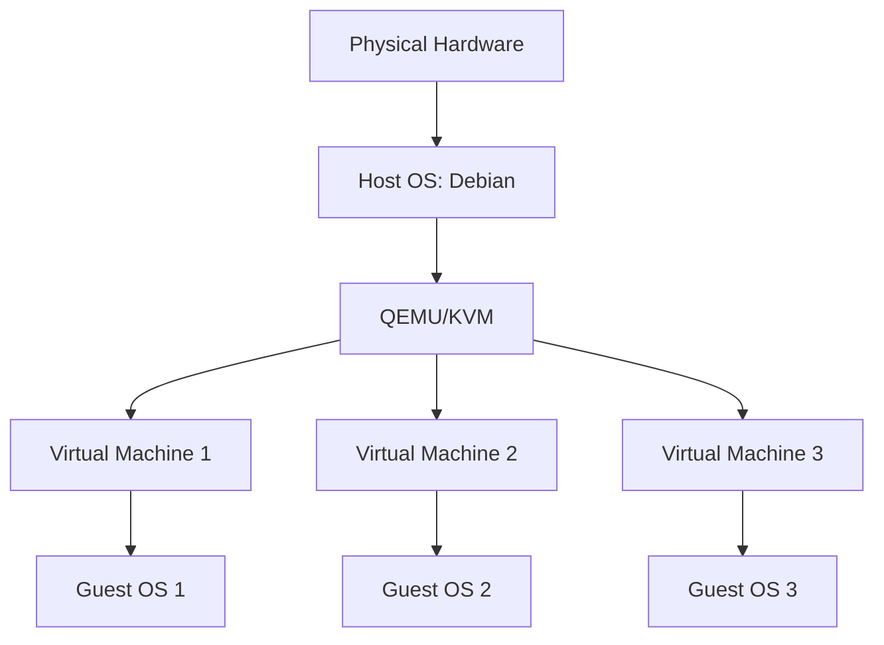

# Debian QEMU

## Introduction

QEMU (Quick EMUlator) is a powerful open-source machine emulator and virtualizer that lets you create and run virtual machines on your Debian system. When combined with KVM (Kernel-based Virtual Machine), QEMU provides near-native performance for running multiple operating systems simultaneously on the same hardware.

This guide will walk you through understanding, installing, and using QEMU on Debian. Whether you need to test software across different operating systems, create isolated environments for development, or simply experiment with various Linux distributions, QEMU offers a flexible solution.

## Understanding QEMU and Virtualization

### What is Virtualization?

Virtualization is the process of creating a software-based (virtual) version of computing resources like servers, storage devices, networks, or operating systems. These virtual instances function as separate systems despite running on the same physical hardware.

### QEMU vs. Other Virtualization Solutions

QEMU stands apart from other virtualization tools like VirtualBox or VMware in several ways:

- **Flexibility**: QEMU can emulate different CPU architectures (x86, ARM, MIPS, etc.)
- **Integration with KVM**: When used with KVM, QEMU achieves near-native performance
- **Lightweight**: Requires fewer resources than many other virtualization platforms
- **Open Source**: Completely free and community-supported



## Installing QEMU on Debian

### Prerequisites

Before installing QEMU, ensure your CPU supports hardware virtualization:

```bash
egrep -c '(vmx|svm)' /proc/cpuinfo
```

If the output is greater than 0, your CPU supports virtualization. You may also need to enable virtualization in your BIOS/UEFI settings.

### Basic Installation

To install QEMU and related packages on Debian:

```bash
sudo apt update
sudo apt install qemu-kvm qemu-system libvirt-clients libvirt-daemon-system virtinst bridge-utils
```

### Verifying the Installation

Confirm that the KVM module is loaded:

```bash
lsmod | grep kvm
```

Expected output:
```
kvm_intel             327680  0
kvm                   737280  1 kvm_intel
```

For AMD processors, you'll see `kvm_amd` instead of `kvm_intel`.

### Adding Your User to the Virtualization Group

To use QEMU without sudo privileges:

```bash
sudo usermod -aG libvirt $(whoami)
sudo usermod -aG kvm $(whoami)
```

Log out and log back in for these changes to take effect.

## Creating Your First Virtual Machine

### Preparing a Disk Image

Before creating a virtual machine, you need to create a disk image:

```bash
qemu-img create -f qcow2 debian-vm.qcow2 10G
```

This creates a 10GB disk image in the QCOW2 format, which supports thin provisioning (only using space as needed).

### Installing an Operating System

To install Debian on your virtual machine, you'll need an ISO image. This example assumes you've downloaded `debian-11.x.x-amd64-netinst.iso`:

```bash
qemu-system-x86_64 -m 2G -cpu host -enable-kvm \
  -drive file=debian-vm.qcow2,format=qcow2 \
  -cdrom debian-11.x.x-amd64-netinst.iso \
  -boot d \
  -display gtk
```

This command:
- Allocates 2GB of RAM (`-m 2G`)
- Uses your host CPU capabilities (`-cpu host`)
- Enables KVM acceleration (`-enable-kvm`)
- Uses the disk image we created
- Boots from the ISO image (`-boot d`)
- Opens a graphical window (`-display gtk`)

Follow the on-screen instructions to complete the installation.

### Starting Your Virtual Machine

After installation, start your VM without the ISO:

```bash
qemu-system-x86_64 -m 2G -cpu host -enable-kvm \
  -drive file=debian-vm.qcow2,format=qcow2 \
  -display gtk
```

## Advanced QEMU Features

### Networking Options

QEMU offers various networking modes:

#### User Mode (NAT) Networking

The simplest approach, providing outbound internet access:

```bash
qemu-system-x86_64 -m 2G -enable-kvm \
  -drive file=debian-vm.qcow2,format=qcow2 \
  -nic user,hostfwd=tcp::2222-:22
```

This forwards host port 2222 to guest port 22, allowing SSH access:

```bash
ssh -p 2222 username@localhost
```

#### Bridged Networking

For more advanced networking where the VM appears as a separate device on your network:

```bash
sudo ip link add br0 type bridge
sudo ip link set eth0 master br0
sudo ip link set br0 up

qemu-system-x86_64 -m 2G -enable-kvm \
  -drive file=debian-vm.qcow2,format=qcow2 \
  -nic bridge,br=br0
```

### Sharing Files with the Host

You can share files between the host and guest using the 9P filesystem:

```bash
mkdir ~/shared-folder
qemu-system-x86_64 -m 2G -enable-kvm \
  -drive file=debian-vm.qcow2,format=qcow2 \
  -fsdev local,id=shared_dev,path=~/shared-folder,security_model=none \
  -device virtio-9p-pci,fsdev=shared_dev,mount_tag=shared_mount
```

Inside the guest, mount the shared folder:

```bash
mkdir ~/host-files
mount -t 9p -o trans=virtio shared_mount ~/host-files
```

### Snapshots and Image Management

#### Creating Snapshots

Snapshots allow you to save the state of your VM:

```bash
qemu-img snapshot -c snapshot1 debian-vm.qcow2
```

#### Listing Snapshots

```bash
qemu-img snapshot -l debian-vm.qcow2
```

Expected output:
```
Snapshot list:
ID        TAG                 VM SIZE                DATE       VM CLOCK
1         snapshot1               0B 2023-06-01 12:00:00   00:00:00.000
```

#### Restoring Snapshots

```bash
qemu-img snapshot -a snapshot1 debian-vm.qcow2
```

## Managing VMs with Virsh

For easier VM management, you can use the `virsh` command-line tool, which is part of the libvirt package:

### Defining a VM

Create an XML file named `debian-vm.xml`:

```xml
<domain type='kvm'>
  <name>debian-vm</name>
  <memory unit='GiB'>2</memory>
  <vcpu>2</vcpu>
  <os>
    <type arch='x86_64'>hvm</type>
    <boot dev='hd'/>
  </os>
  <devices>
    <disk type='file' device='disk'>
      <driver name='qemu' type='qcow2'/>
      <source file='/path/to/debian-vm.qcow2'/>
      <target dev='vda' bus='virtio'/>
    </disk>
    <interface type='network'>
      <source network='default'/>
      <model type='virtio'/>
    </interface>
    <graphics type='vnc' port='-1'/>
  </devices>
</domain>
```

Define the VM:

```bash
virsh define debian-vm.xml
```

### Basic VM Operations

Start, stop, and manage your VM:

```bash
# Start VM
virsh start debian-vm

# List running VMs
virsh list

# List all VMs (including stopped ones)
virsh list --all

# Shut down VM gracefully
virsh shutdown debian-vm

# Force power off
virsh destroy debian-vm

# Remove VM definition (doesn't delete disk image)
virsh undefine debian-vm
```

## Real-World Applications

### Development and Testing Environments

QEMU is perfect for creating isolated development environments:

```bash
# Create a development VM
qemu-img create -f qcow2 dev-environment.qcow2 20G

# Run with development-specific settings
qemu-system-x86_64 -m 4G -smp cores=2 -enable-kvm \
  -drive file=dev-environment.qcow2,format=qcow2 \
  -nic user,hostfwd=tcp::8080-:80,hostfwd=tcp::2222-:22 \
  -display gtk
```

This setup forwards port 8080 on your host to port 80 in the VM, allowing you to test web applications.

### Operating System Compatibility Testing

Test your software on multiple operating systems:

```bash
# Create separate disk images for each OS
qemu-img create -f qcow2 debian-test.qcow2 10G
qemu-img create -f qcow2 ubuntu-test.qcow2 10G
qemu-img create -f qcow2 fedora-test.qcow2 10G

# Script to run the same tests across all environments
for os in debian ubuntu fedora; do
  qemu-system-x86_64 -m 2G -enable-kvm \
    -drive file=${os}-test.qcow2,format=qcow2 \
    -display none \
    -serial stdio \
    -kernel /path/to/test-script.sh
done
```

### Learning Different Architectures

QEMU can emulate different CPU architectures:

```bash
# Install ARM emulation packages
sudo apt install qemu-system-arm

# Create ARM disk image
qemu-img create -f qcow2 arm-debian.qcow2 8G

# Run ARM system
qemu-system-arm -M virt -m 1G \
  -drive file=arm-debian.qcow2,format=qcow2 \
  -cdrom debian-11.x.x-arm64-netinst.iso \
  -boot d
```

This allows you to experiment with ARM architecture without needing physical ARM hardware.

## Troubleshooting Common Issues

### Permission Problems

If you encounter permission issues:

```bash
ls -la /dev/kvm
```

The output should show that your user has access. If not, run:

```bash
sudo chmod 666 /dev/kvm
```

### Performance Issues

If VMs run slowly:

1. Ensure KVM is enabled:
   ```bash
   qemu-system-x86_64 -m 2G -cpu host -enable-kvm ...
   ```

2. Use the virtio driver for disks:
   ```bash
   qemu-system-x86_64 ... -drive file=debian-vm.qcow2,format=qcow2,if=virtio
   ```

3. Allocate appropriate memory:
   ```bash
   qemu-system-x86_64 -m 4G ...
   ```

### Network Connectivity Problems

If the VM can't connect to the internet:

1. Check host firewall settings
2. Try user mode networking:
   ```bash
   qemu-system-x86_64 ... -nic user
   ```

## Summary

QEMU is a versatile virtualization tool for Debian that offers:

- Hardware-accelerated virtualization with KVM
- Support for multiple architectures and operating systems
- Advanced features like snapshots, shared folders, and network customization
- Integration with libvirt for easier management

By mastering QEMU, you can create isolated environments for development, testing, and experimentation while efficiently utilizing your hardware resources.

## Additional Resources

- [Official QEMU Documentation](https://www.qemu.org/documentation/)
- [Debian Wiki: QEMU](https://wiki.debian.org/QEMU)
- [KVM Documentation](https://www.linux-kvm.org/page/Documents)

## Exercises for Practice

1. Create a minimal Debian VM with 512MB of RAM and 2GB disk space
2. Set up a network of three VMs that can communicate with each other
3. Create a VM with a shared folder for development files
4. Write a bash script to automate VM creation and configuration
5. Create a snapshot system for backups with automatic rotation