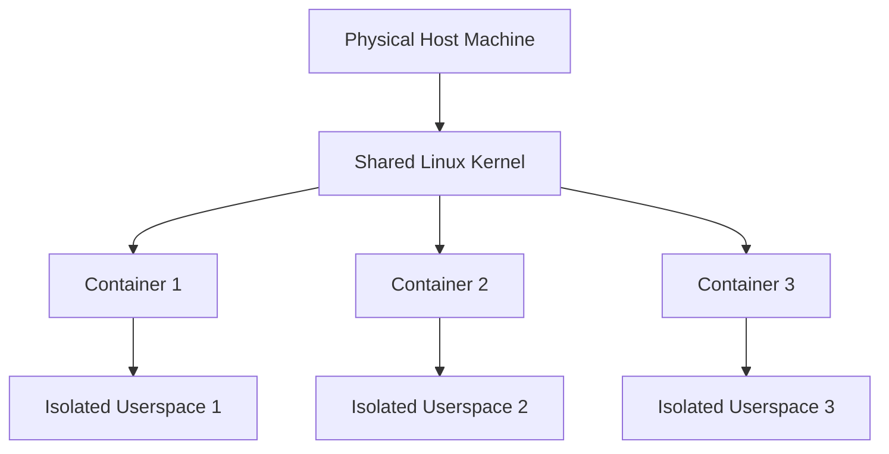

# Debian LXC Containers

## Introduction

Linux Containers (LXC) represent a lightweight virtualization technology that allows you to run multiple isolated Linux systems (containers) on a single host. Unlike traditional virtual machines that emulate entire hardware stacks, LXC containers share the host's kernel while maintaining separate userspace environments. This makes them significantly more efficient in terms of system resources.

Debian provides excellent support for LXC, making it an ideal platform for learning about and implementing container-based solutions. In this guide, we'll explore how to set up, configure, and manage LXC containers on Debian systems, providing you with practical skills to leverage this powerful technology.

## What Are LXC Containers?

LXC (Linux Containers) is an operating-system-level virtualization method that allows you to run multiple isolated Linux systems on a single host without the overhead of full virtual machines.



### Key Advantages of LXC Containers:

- **Resource Efficiency**: Containers share the host's kernel, consuming fewer resources than full VMs
- **Fast Startup**: Containers can start in seconds
- **Near-Native Performance**: Applications run with minimal overhead
- **Isolation**: Each container has its own filesystem, network interfaces, and process space
- **Ease of Management**: Simple tools for creating, starting, stopping, and managing containers

## Installing LXC on Debian

Let's begin by installing the necessary packages on your Debian system:

```bash
sudo apt update
sudo apt install lxc lxc-templates bridge-utils uidmap
```

These packages provide:
- `lxc`: The core container management tools
- `lxc-templates`: Templates for creating various Linux distributions in containers
- `bridge-utils`: Tools for configuring network bridges
- `uidmap`: Tools for user namespace mapping (allows unprivileged containers)

After installation, verify that LXC is working properly:

```bash
sudo systemctl status lxc
```

Expected output:
```
● lxc.service - LXC Container Initialization and Autoboot Code
     Loaded: loaded (/lib/systemd/system/lxc.service; enabled; vendor preset: enabled)
     Active: active (exited) since Wed 2023-07-05 14:22:36 UTC; 10s ago
       Docs: man:lxc-autostart
    Process: 1234 ExecStart=/usr/lib/x86_64-linux-gnu/lxc/lxc-init start (code=exited, status=0/SUCCESS)
   Main PID: 1234 (code=exited, status=0/SUCCESS)
```

## Network Configuration for LXC

Before creating containers, it's important to configure networking. By default, LXC uses a bridge interface (`lxcbr0`) to provide network connectivity to containers.

Check if the bridge interface exists:

```bash
ip addr show lxcbr0
```

If it doesn't exist, you can manually create it by editing `/etc/lxc/default.conf`:

```bash
sudo nano /etc/lxc/default.conf
```

Add or modify these lines:

```
lxc.net.0.type = veth
lxc.net.0.link = lxcbr0
lxc.net.0.flags = up
lxc.net.0.hwaddr = 00:16:3e:xx:xx:xx
```

Then create a bridge configuration in `/etc/network/interfaces.d/lxcbr0`:

```bash
sudo nano /etc/network/interfaces.d/lxcbr0
```

With content:

```
auto lxcbr0
iface lxcbr0 inet static
    bridge_ports none
    bridge_fd 0
    bridge_maxwait 0
    address 10.0.3.1
    netmask 255.255.255.0
    dnsmasq_conf=/etc/lxc/dnsmasq.conf
```

Create a dnsmasq configuration for DHCP service to containers:

```bash
sudo nano /etc/lxc/dnsmasq.conf
```

With content:

```
dhcp-range=10.0.3.2,10.0.3.254
dhcp-leasefile=/var/lib/misc/dnsmasq.lxcbr0.leases
```

Finally, enable IP forwarding and restart networking:

```bash
echo "net.ipv4.ip_forward=1" | sudo tee -a /etc/sysctl.conf
sudo sysctl -p
sudo systemctl restart networking
```

## Creating Your First LXC Container

Now that we have LXC installed and configured, let's create our first container:

```bash
sudo lxc-create -n my-debian-container -t debian -- -r bullseye
```

This command:
- `-n my-debian-container`: Names the container "my-debian-container"
- `-t debian`: Uses the Debian template
- `-- -r bullseye`: Passes the Debian release name to the template

Expected output:
```
Checking cache download in /var/cache/lxc/debian/rootfs-bullseye-amd64 ... 
Cache found. Extracting...
Downloading debian minimal ...
Downloading Debian release bullseye...
...
Current default time zone: 'Etc/UTC'
...
Root password is 'root', please change!
```

## Starting and Accessing Your Container

Let's start the container we just created:

```bash
sudo lxc-start -n my-debian-container
```

Verify that it's running:

```bash
sudo lxc-ls --fancy
```

Expected output:
```
NAME                STATE   AUTOSTART GROUPS IPV4       IPV6 
my-debian-container RUNNING 0         -      10.0.3.245 -   
```

Access the container's shell:

```bash
sudo lxc-attach -n my-debian-container
```

You'll now have a shell inside the container. To exit, simply type `exit`.

## Managing LXC Containers

Here are some essential commands for managing your LXC containers:

### Container Lifecycle

```bash
# Stop a running container
sudo lxc-stop -n my-debian-container

# Start a stopped container
sudo lxc-start -n my-debian-container

# Restart a container
sudo lxc-restart -n my-debian-container

# Freeze a container (pause execution)
sudo lxc-freeze -n my-debian-container

# Unfreeze a frozen container
sudo lxc-unfreeze -n my-debian-container

# Destroy (delete) a container
sudo lxc-destroy -n my-debian-container
```

### Monitoring Containers

```bash
# List all containers with status
sudo lxc-ls --fancy

# Show detailed container information
sudo lxc-info -n my-debian-container

# Monitor container resource usage
sudo lxc-monitor -n my-debian-container

# View container logs
sudo lxc-info -n my-debian-container -l DEBUG
```

## Container Configuration

Each container has a configuration file located at `/var/lib/lxc/container-name/config`. You can edit this file to customize various aspects of your container.

For example, to limit a container's resources:

```bash
sudo nano /var/lib/lxc/my-debian-container/config
```

Add these lines to limit CPU and memory:

```
# Limit to 2 CPUs
lxc.cgroup2.cpuset.cpus = 0-1

# Limit memory to 1GB
lxc.cgroup2.memory.max = 1G

# Limit swap to 256MB
lxc.cgroup2.memory.swap.max = 256M
```

After editing, restart the container for changes to take effect:

```bash
sudo lxc-restart -n my-debian-container
```

## Creating an Autostarting Container

To make a container start automatically when the host boots:

```bash
sudo nano /var/lib/lxc/my-debian-container/config
```

Add this line:

```
lxc.start.auto = 1
```

You can also set a delay and priority:

```
lxc.start.auto = 1
lxc.start.delay = 5
lxc.start.order = 100
```

## Practical Examples

### Example 1: Web Server Container

Let's create a dedicated container for hosting a web server:

```bash
# Create a container
sudo lxc-create -n web-server -t debian -- -r bullseye

# Start the container
sudo lxc-start -n web-server

# Access the container
sudo lxc-attach -n web-server

# Inside the container, install Nginx
apt update
apt install -y nginx

# Enable and start Nginx
systemctl enable nginx
systemctl start nginx

# Exit the container
exit
```

To make the web server accessible from outside, we need to set up port forwarding on the host:

```bash
# Install iptables
sudo apt install -y iptables-persistent

# Get the container's IP
CONTAINER_IP=$(sudo lxc-info -n web-server -iH)

# Forward host port 8080 to container port 80
sudo iptables -t nat -A PREROUTING -i eth0 -p tcp --dport 8080 -j DNAT --to-destination ${CONTAINER_IP}:80
sudo iptables -t nat -A POSTROUTING -o lxcbr0 -j MASQUERADE

# Save iptables rules
sudo netfilter-persistent save
```

Now you can access the web server by navigating to `http://host-ip:8080` in a web browser.

### Example 2: Database Container

Let's create a separate container for a database server:

```bash
# Create a container
sudo lxc-create -n db-server -t debian -- -r bullseye

# Start the container
sudo lxc-start -n db-server

# Access the container
sudo lxc-attach -n db-server

# Inside the container, install PostgreSQL
apt update
apt install -y postgresql

# Enable and start PostgreSQL
systemctl enable postgresql
systemctl start postgresql

# Configure PostgreSQL (basic setup)
su - postgres -c "createuser --interactive --pwprompt webuser"
su - postgres -c "createdb -O webuser webdb"

# Exit the container
exit
```

### Example 3: Networking Containers Together

Let's connect our web and database containers:

```bash
# Get the database container's IP
DB_IP=$(sudo lxc-info -n db-server -iH)

# Access the web container
sudo lxc-attach -n web-server

# Install PostgreSQL client
apt update
apt install -y postgresql-client

# Test connection to the database container
psql -h ${DB_IP} -U webuser -d webdb

# Exit the container
exit
```

This demonstrates how containers can communicate with each other over the network, allowing you to build multi-tier applications with each component isolated in its own container.

## Snapshots and Backups

LXC allows you to create snapshots of containers:

```bash
# Create a snapshot
sudo lxc-snapshot -n my-debian-container

# List snapshots
sudo lxc-snapshot -n my-debian-container -L

# Restore a snapshot
sudo lxc-snapshot -n my-debian-container -r snap0
```

For more comprehensive backups, you can export a container to a file:

```bash
sudo lxc-stop -n my-debian-container
sudo tar --numeric-owner -czf my-debian-container-backup.tar.gz -C /var/lib/lxc my-debian-container
sudo lxc-start -n my-debian-container
```

To restore from this backup:

```bash
sudo lxc-destroy -n my-debian-container
sudo tar --numeric-owner -xzf my-debian-container-backup.tar.gz -C /var/lib/lxc
sudo lxc-start -n my-debian-container
```

## Security Considerations

When using LXC containers, keep these security best practices in mind:

1. **Keep the host system updated**:
   ```bash
   sudo apt update && sudo apt upgrade -y
   ```

2. **Use unprivileged containers** when possible:
   ```bash
   # Add this to /etc/lxc/default.conf
   lxc.idmap = u 0 100000 65536
   lxc.idmap = g 0 100000 65536
   ```

3. **Limit container capabilities**:
   ```bash
   # Add to container config
   lxc.cap.drop = mac_admin mac_override sys_time sys_module sys_rawio
   ```

4. **Set resource limits** to prevent DoS attacks:
   ```bash
   # Add to container config
   lxc.cgroup2.memory.max = 1G
   lxc.cgroup2.cpu.max = 50000 100000
   ```

5. **Isolate container networks** when possible:
   ```bash
   # For containers that don't need network access
   lxc.net.0.type = empty
   ```

## Troubleshooting Common Issues

### Container Fails to Start

```bash
# Check logs
sudo lxc-start -n my-debian-container -F

# Verify configuration
sudo lxc-checkconfig
```

### Network Connectivity Issues

```bash
# Check bridge interface
ip addr show lxcbr0

# Verify iptables rules
sudo iptables -L -t nat

# Check container's network configuration
sudo cat /var/lib/lxc/my-debian-container/config | grep lxc.net
```

### Container Cannot Access Internet

```bash
# Ensure IP forwarding is enabled
sudo sysctl net.ipv4.ip_forward

# Check NAT configuration
sudo iptables -t nat -L POSTROUTING

# If missing, add NAT rule
sudo iptables -t nat -A POSTROUTING -s 10.0.3.0/24 ! -d 10.0.3.0/24 -j MASQUERADE
```

## Advanced LXC Features

### Container Hooks

You can automate tasks when containers start or stop using hooks:

```bash
sudo mkdir -p /var/lib/lxc/my-debian-container/hooks
```

Create a start hook:

```bash
sudo nano /var/lib/lxc/my-debian-container/hooks/start
```

Add script content:

```bash
#!/bin/bash
echo "Container started at $(date)" >> /var/log/lxc-start.log
```

Make it executable:

```bash
sudo chmod +x /var/lib/lxc/my-debian-container/hooks/start
```

Add it to the container config:

```
lxc.hook.start = /var/lib/lxc/my-debian-container/hooks/start
```

### Custom Container Templates

You can create custom container templates for your specific needs:

```bash
# Create a container to serve as template
sudo lxc-create -n template-container -t debian -- -r bullseye

# Start and customize it
sudo lxc-start -n template-container
sudo lxc-attach -n template-container

# Inside: install common packages, configure settings, etc.
apt update
apt install -y nginx postgresql

# Exit and stop
exit
sudo lxc-stop -n template-container

# Create a snapshot to use as template
sudo lxc-snapshot -n template-container
```

Now you can clone from this template:

```bash
sudo lxc-copy -n template-container -N new-container -s snap0
sudo lxc-start -n new-container
```

## Summary

In this guide, we've explored LXC containers on Debian systems, covering:

- The basic concepts and advantages of LXC containers
- Installation and network configuration
- Creating and managing containers
- Practical examples with web servers and databases
- Snapshots, backups, and security considerations
- Troubleshooting and advanced features

LXC containers provide a powerful way to isolate applications and services while maintaining high performance and efficient resource usage. They're an excellent choice for development environments, testing, and even production deployments for many use cases.

## Exercises

1. Create a container running Debian Bullseye and install a different web server (e.g., Apache) inside it.
2. Set up port forwarding to access the web server from outside the host.
3. Create a container with limited resources (1 CPU and 512MB RAM) and observe how it performs under load.
4. Create a backup of a container and restore it with a different name.
5. Create a container running a different distribution (e.g., Ubuntu) and explore the differences.

## Additional Resources

- [Official LXC Documentation](https://linuxcontainers.org/lxc/documentation/)
- [Debian Wiki - LXC](https://wiki.debian.org/LXC)
- [Linux Containers Forum](https://discuss.linuxcontainers.org/)
- [LXC Security](https://linuxcontainers.org/lxc/security/)
- [Container Orchestration with LXD](https://linuxcontainers.org/lxd/introduction/)