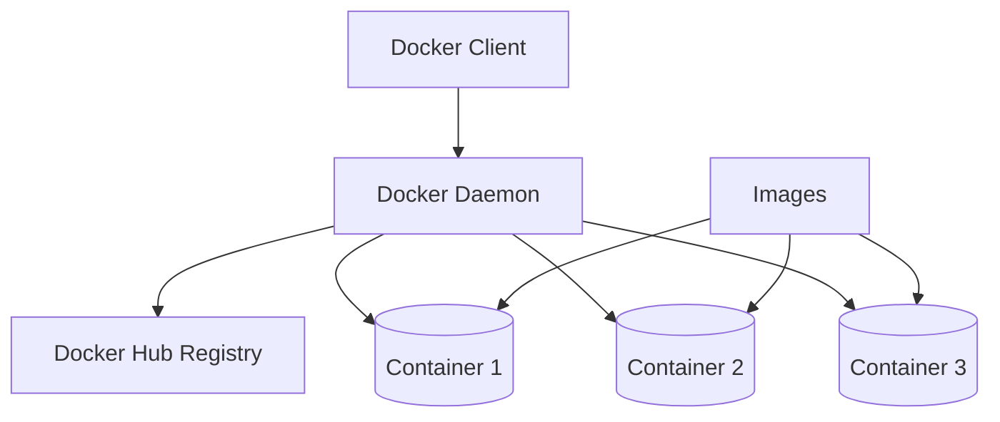

# Debian Docker Containers

## Introduction

Docker containers have revolutionized how we develop, deploy, and run applications. For Debian users, Docker provides a powerful way to create lightweight, portable, and isolated environments for running applications. In this guide, we'll explore how to set up and use Docker containers on Debian systems, understand core concepts, and implement best practices for container management.

Docker containers are standalone, executable packages that include everything needed to run an application: code, runtime, system tools, libraries, and settings. Unlike traditional virtual machines, containers share the host system's kernel, making them more efficient and faster to start.

## Prerequisites

Before we begin, ensure you have:

- A Debian system (Debian 10 Buster or newer recommended)
- Root or sudo access
- Basic Linux command line knowledge

## Installing Docker on Debian

Let's start by installing Docker on your Debian system:

```bash
# Update package information
sudo apt update

# Install required packages
sudo apt install -y apt-transport-https ca-certificates curl gnupg lsb-release

# Add Docker's official GPG key
curl -fsSL https://download.docker.com/linux/debian/gpg | sudo gpg --dearmor -o /usr/share/keyrings/docker-archive-keyring.gpg

# Set up the stable repository
echo "deb [arch=$(dpkg --print-architecture) signed-by=/usr/share/keyrings/docker-archive-keyring.gpg] https://download.docker.com/linux/debian $(lsb_release -cs) stable" | sudo tee /etc/apt/sources.list.d/docker.list > /dev/null

# Update package information again
sudo apt update

# Install Docker Engine
sudo apt install -y docker-ce docker-ce-cli containerd.io

# Verify installation
sudo docker run hello-world
```

The last command downloads a test image and runs it in a container. If successful, you'll see a message confirming that your Docker installation is working correctly.

**Output:**
```
Hello from Docker!
This message shows that your installation appears to be working correctly.

To generate this message, Docker took the following steps:
 1. The Docker client contacted the Docker daemon.
 2. The Docker daemon pulled the "hello-world" image from the Docker Hub.
 3. The Docker daemon created a new container from that image which runs the
    executable that produces the output you are currently reading.
 4. The Docker daemon streamed that output to the Docker client, which sent it
    to your terminal.
```

## Docker Architecture and Terminology

Before diving deeper, let's understand some key Docker concepts:



- **Docker Daemon**: The background service running on the host that manages building, running, and distributing Docker containers.
- **Docker Client**: The command line interface tool that allows users to interact with the Docker daemon.
- **Docker Image**: A read-only template used to create containers, similar to a snapshot.
- **Docker Container**: A runnable instance of an image with its own filesystem, networking, and isolated process space.
- **Docker Hub**: A registry of Docker images where you can find official and community images.

## Working with Docker Images

### Pulling Images

To download a Docker image from Docker Hub:

```bash
# Pull the official Debian image
sudo docker pull debian

# Pull a specific version
sudo docker pull debian:bullseye
```

**Output:**
```
Using default tag: latest
latest: Pulling from library/debian
214ca5fb9032: Pull complete 
Digest: sha256:0a90499893e67770366f5d1738475b9dc3c90f7a4241a01d3f3dba8517cca59d
Status: Downloaded newer image for debian:latest
docker.io/library/debian:latest
```

### Listing Images

To see all downloaded images:

```bash
sudo docker images
```

**Output:**
```
REPOSITORY   TAG       IMAGE ID       CREATED        SIZE
debian       latest    4eacea30377a   2 weeks ago    124MB
hello-world  latest    feb5d9fea6a5   4 months ago   13.3kB
```

## Running Docker Containers

### Basic Container Running

To run a container from an image:

```bash
# Run a Debian container interactively
sudo docker run -it debian bash
```

This command starts a new container from the Debian image and opens a bash shell inside it. The `-it` flags make the container interactive and allocate a pseudo-TTY.

Once inside the container, you're in an isolated Debian environment. Try some commands:

```bash
cat /etc/debian_version
apt update
apt install -y python3
python3 --version
exit  # To leave the container
```

### Running Containers in the Background

To run containers in detached mode (background):

```bash
# Run a web server container in the background
sudo docker run -d -p 8080:80 --name my-web-server nginx
```

This command:
- `-d`: Runs the container in detached mode
- `-p 8080:80`: Maps port 8080 on the host to port 80 in the container
- `--name my-web-server`: Assigns a name to the container
- `nginx`: Uses the nginx image to create a web server

You can now access the web server at http://localhost:8080 on your Debian system.

### Listing Running Containers

To see all running containers:

```bash
sudo docker ps
```

**Output:**
```
CONTAINER ID   IMAGE     COMMAND                  CREATED          STATUS          PORTS                  NAMES
3a7586b842f5   nginx     "/docker-entrypoint.…"   10 seconds ago   Up 9 seconds    0.0.0.0:8080->80/tcp   my-web-server
```

To see all containers (including stopped ones):

```bash
sudo docker ps -a
```

## Managing Docker Containers

### Stopping and Starting Containers

```bash
# Stop a running container
sudo docker stop my-web-server

# Start a stopped container
sudo docker start my-web-server
```

### Removing Containers

```bash
# Stop the container if it's running
sudo docker stop my-web-server

# Remove the container
sudo docker rm my-web-server
```

### Container Logs

To view the logs of a container:

```bash
sudo docker logs my-web-server

# Follow the logs in real-time
sudo docker logs -f my-web-server
```

## Creating Custom Docker Images

One of Docker's powerful features is the ability to create your own images.

### Using Dockerfile

A Dockerfile is a text document that contains all the commands needed to build an image. Here's a simple example:

1. Create a directory for your project:

```bash
mkdir my-debian-app
cd my-debian-app
```

2. Create a simple Python application file:

```bash
echo 'print("Hello from Debian Docker container!")' > app.py
```

3. Create a Dockerfile:

```bash
nano Dockerfile
```

Add the following content:

```dockerfile
# Use Debian as the base image
FROM debian:bullseye

# Update package lists and install Python
RUN apt-get update && \
    apt-get install -y python3 && \
    apt-get clean && \
    rm -rf /var/lib/apt/lists/*

# Set the working directory
WORKDIR /app

# Copy the application file
COPY app.py .

# Command to run when the container starts
CMD ["python3", "app.py"]
```

4. Build the image:

```bash
sudo docker build -t my-debian-app .
```

**Output:**
```
Sending build context to Docker daemon  3.072kB
Step 1/5 : FROM debian:bullseye
 ---> 4eacea30377a
Step 2/5 : RUN apt-get update &&     apt-get install -y python3 &&     apt-get clean &&     rm -rf /var/lib/apt/lists/*
 ---> Running in a7b3056c9703
[...]
Removing intermediate container a7b3056c9703
 ---> 7d24fc2e13c4
Step 3/5 : WORKDIR /app
[...]
Successfully built 9e494088612a
Successfully tagged my-debian-app:latest
```

5. Run your custom image:

```bash
sudo docker run my-debian-app
```

**Output:**
```
Hello from Debian Docker container!
```

## Docker Volumes for Persistent Storage

Containers are ephemeral by nature, meaning any changes made inside a container are lost when the container is removed. Docker volumes solve this problem by providing persistent storage.

### Creating and Using Volumes

```bash
# Create a volume
sudo docker volume create my-data

# Run a container with the volume mounted
sudo docker run -it --name debian-with-volume -v my-data:/data debian bash

# Inside the container, create a file in the mounted volume
echo "This data will persist" > /data/test.txt
exit

# Remove the container
sudo docker rm debian-with-volume

# Create a new container with the same volume
sudo docker run -it --name new-debian -v my-data:/data debian bash

# Verify the data persists
cat /data/test.txt
exit
```

You should see your original text, demonstrating that the data persists across different containers.

## Docker Networks

Docker networks allow containers to communicate with each other securely.

### Creating a Custom Network

```bash
# Create a bridge network
sudo docker network create my-network

# Run containers in the custom network
sudo docker run -d --name web --network my-network nginx
sudo docker run -d --name db --network my-network postgres:13

# Containers can now communicate using their names
sudo docker exec web ping db
```

## Docker Compose for Multi-Container Applications

Docker Compose is a tool for defining and running multi-container Docker applications.

### Installing Docker Compose

```bash
sudo curl -L "https://github.com/docker/compose/releases/download/v2.5.0/docker-compose-$(uname -s)-$(uname -m)" -o /usr/local/bin/docker-compose
sudo chmod +x /usr/local/bin/docker-compose
```

### Creating a Docker Compose File

Create a file named `docker-compose.yml`:

```yaml
version: '3'
services:
  web:
    image: nginx
    ports:
      - "8080:80"
    volumes:
      - ./html:/usr/share/nginx/html
    networks:
      - app-network

  db:
    image: postgres:13
    environment:
      POSTGRES_PASSWORD: example
    volumes:
      - db-data:/var/lib/postgresql/data
    networks:
      - app-network

networks:
  app-network:

volumes:
  db-data:
```

### Running with Docker Compose

```bash
# Create a directory for the web content
mkdir -p html
echo "<h1>Hello from Docker Compose!</h1>" > html/index.html

# Start the services
sudo docker-compose up -d

# Stop the services
sudo docker-compose down
```

## Best Practices for Debian Docker Containers

1. **Use Official Images**: Start with official Debian or application-specific images.

2. **Minimize Image Size**: Use `.dockerignore` to exclude unnecessary files and multi-stage builds to reduce image size.

3. **Don't Run as Root**: Create a non-root user in your Dockerfile:

```dockerfile
FROM debian:bullseye
RUN useradd -ms /bin/bash appuser
USER appuser
```

4. **One Service Per Container**: Follow the microservices principle by running one service per container.

5. **Use Environment Variables**: Make your containers configurable with environment variables.

6. **Health Checks**: Add health checks to verify if your containers are running correctly:

```dockerfile
FROM debian:bullseye
RUN apt-get update && apt-get install -y curl
HEALTHCHECK --interval=30s --timeout=3s CMD curl -f http://localhost/ || exit 1
```

7. **Use Docker Compose for Development**: Simplify your development workflow with Docker Compose.

8. **Regular Updates**: Keep your base images and dependencies updated to address security vulnerabilities.

## Debugging Docker Containers

When troubleshooting Docker containers on Debian, these commands are useful:

```bash
# Check container details
sudo docker inspect my-container

# Enter a running container
sudo docker exec -it my-container bash

# Check resource usage
sudo docker stats

# View container processes
sudo docker top my-container
```

## Security Considerations

1. **Scan Images**: Use tools like Docker Scout or Trivy to scan images for vulnerabilities.

```bash
# Example with Trivy
sudo apt install -y trivy
trivy image debian:bullseye
```

2. **Limit Capabilities**: Reduce container privileges by dropping capabilities:

```bash
sudo docker run --cap-drop=ALL --cap-add=NET_BIND_SERVICE nginx
```

3. **Read-Only Filesystem**: When possible, use read-only filesystems:

```bash
sudo docker run --read-only nginx
```

## Real-world Example: Setting Up a LEMP Stack

Let's create a complete LEMP (Linux, Nginx, MySQL, PHP) stack on Debian using Docker:

1. Create a project directory:

```bash
mkdir lemp-stack
cd lemp-stack
```

2. Create a `docker-compose.yml` file:

```yaml
version: '3'

services:
  web:
    image: nginx:latest
    ports:
      - "80:80"
    volumes:
      - ./www:/var/www/html
      - ./nginx/default.conf:/etc/nginx/conf.d/default.conf
    depends_on:
      - php
    networks:
      - lemp-network

  php:
    image: php:8.0-fpm
    volumes:
      - ./www:/var/www/html
    networks:
      - lemp-network

  db:
    image: mariadb:latest
    environment:
      MYSQL_ROOT_PASSWORD: rootpassword
      MYSQL_DATABASE: mydb
      MYSQL_USER: myuser
      MYSQL_PASSWORD: mypassword
    volumes:
      - db-data:/var/lib/mysql
    networks:
      - lemp-network

networks:
  lemp-network:

volumes:
  db-data:
```

3. Create the necessary directories and configuration:

```bash
mkdir -p www nginx
```

4. Create an Nginx configuration file:

```bash
cat > nginx/default.conf << 'EOF'
server {
    listen 80;
    server_name localhost;
    root /var/www/html;
    index index.php index.html;

    location / {
        try_files $uri $uri/ /index.php?$query_string;
    }

    location ~ \.php$ {
        fastcgi_pass php:9000;
        fastcgi_index index.php;
        fastcgi_param SCRIPT_FILENAME $document_root$fastcgi_script_name;
        include fastcgi_params;
    }
}
EOF
```

5. Create a test PHP file:

```bash
cat > www/index.php << 'EOF'
<?php
echo "<h1>LEMP Stack on Debian Docker</h1>";
echo "<p>PHP version: " . phpversion() . "</p>";

$dbhost = 'db';
$dbuser = 'myuser';
$dbpass = 'mypassword';
$dbname = 'mydb';

// Create connection
$conn = new mysqli($dbhost, $dbuser, $dbpass, $dbname);

// Check connection
if ($conn->connect_error) {
    die("Connection failed: " . $conn->connect_error);
}

echo "<p>Connected to MySQL successfully!</p>";
$conn->close();
?>
EOF
```

6. Start the LEMP stack:

```bash
sudo docker-compose up -d
```

7. Access your LEMP stack at http://localhost

## Summary

In this guide, we've covered:

- Installing Docker on Debian systems
- Understanding Docker concepts and architecture
- Working with Docker images and containers
- Creating custom Docker images with Dockerfiles
- Using volumes for persistent storage
- Setting up Docker networks
- Orchestrating multi-container applications with Docker Compose
- Following best practices for Docker security and efficiency
- Implementing a real-world LEMP stack example

Docker containers on Debian provide a powerful, flexible way to deploy applications with consistent environments. By leveraging containers, you can simplify deployment, improve resource utilization, and maintain isolation between applications.

## Additional Resources

- [Official Docker Documentation](https://docs.docker.com/)
- [Debian Wiki: Docker](https://wiki.debian.org/Docker)
- [Docker Hub](https://hub.docker.com/) for finding official and community images

## Exercises

1. Create a Dockerfile for a Python web application using Flask.
2. Set up a WordPress site using Docker Compose with persistent storage.
3. Create a custom bridge network and deploy three containers that communicate with each other.
4. Implement a CI/CD pipeline that builds and pushes Docker images for a Debian-based application.
5. Configure resource limits (CPU, memory) for Docker containers and observe their behavior under load.