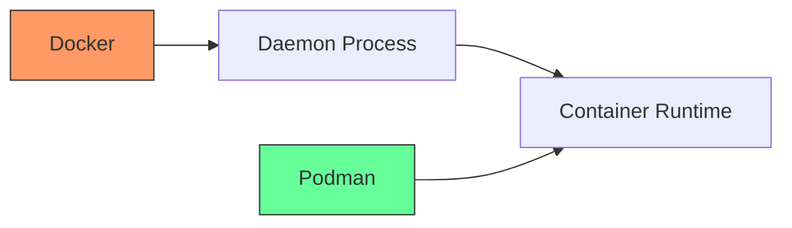

# Debian Podman

## Introduction

Podman (Pod Manager) is a daemonless container engine for developing, managing, and running OCI containers on your Linux system. Unlike Docker, which runs as a daemon with root privileges, Podman operates without a daemon and can run containers as a regular, non-privileged user, making it a more secure alternative.

In this guide, we'll explore how to set up and use Podman on Debian systems, understanding its key features, advantages over traditional containerization tools, and practical applications for your development workflow.

## Why Podman on Debian?

Podman offers several advantages for Debian users:

- **Daemonless architecture**: No background service required
- **Rootless containers**: Run containers without root privileges
- **Docker-compatible CLI**: Easy transition from Docker with similar commands
- **Pod-based architecture**: Supports Kubernetes-like pod deployments
- **Built-in support for systemd**: Better integration with Debian's init system



## Installation

Let's install Podman on your Debian system:

```bash
# Update your package lists
sudo apt update

# Install Podman
sudo apt install -y podman
```

After installation, verify that Podman is correctly installed:

```bash
podman --version
```

Expected output:
```
podman version 3.4.4
```

> Note: The exact version number may differ depending on your Debian release.

## Basic Podman Commands

If you're familiar with Docker, you'll find Podman commands quite similar:

### Pulling an Image

```bash
podman pull debian:bullseye-slim
```

Output:
```
Trying to pull debian:bullseye-slim...
Getting image source signatures
Copying blob sha256:a8780b506fa4eeb1d0779a1bf689d81e8cdd2854c66383a9961f1d873d7f7958
Copying config sha256:12da76057cf3c33506a95be91afdbb09533fdeae7bc691e9379c42284580a2d0
Writing manifest to image destination
Storing signatures
12da76057cf3c33506a95be91afdbb09533fdeae7bc691e9379c42284580a2d0
```

### Listing Images

```bash
podman images
```

Output:
```
REPOSITORY                TAG             IMAGE ID      CREATED      SIZE
docker.io/library/debian  bullseye-slim   12da76057cf3  2 weeks ago  80.4 MB
```

### Running a Container

```bash
podman run -it --name my-debian debian:bullseye-slim bash
```

This command starts a new Debian container and provides an interactive shell.

## Working with Containers

### Creating a Simple Web Server Container

Let's create a simple web server using Nginx:

```bash
# Pull the Nginx image
podman pull nginx:alpine

# Run Nginx container with port mapping
podman run -d --name webserver -p 8080:80 nginx:alpine
```

Now you can access your web server at http://localhost:8080

### Managing Containers

List running containers:

```bash
podman ps
```

Output:
```
CONTAINER ID  IMAGE                           COMMAND               CREATED        STATUS            PORTS                 NAMES
3f4ab82a0c69  docker.io/library/nginx:alpine  nginx -g daemon o...  10 seconds ago  Up 9 seconds ago  0.0.0.0:8080->80/tcp  webserver
```

Stop and remove a container:

```bash
# Stop the container
podman stop webserver

# Remove the container
podman rm webserver
```

## Rootless Containers

One of Podman's major advantages is the ability to run containers without root privileges:

```bash
# Verify your user can run rootless containers
podman unshare cat /proc/self/uid_map
```

If you see output mapping your user ID, rootless containers are working correctly.

### Setting Up Rootless Containers

For optimal rootless operation, you may need to configure subuid and subgid mappings:

```bash
# Check if you already have mappings
grep $(whoami) /etc/subuid /etc/subgid
```

If no mappings exist, create them:

```bash
sudo usermod --add-subuids 100000-165535 --add-subgids 100000-165535 $(whoami)
```

## Creating Pods with Podman

Podman introduces the concept of pods, similar to Kubernetes:

```bash
# Create a pod with port mapping
podman pod create --name webapp-pod -p 8080:80
```

Now add containers to the pod:

```bash
# Add a web server to the pod
podman run -d --pod webapp-pod --name web-container nginx:alpine

# Add a database container to the same pod
podman run -d --pod webapp-pod --name db-container postgres:13-alpine
```

List pods:

```bash
podman pod list
```

Output:
```
POD ID        NAME          STATUS    CREATED         INFRA ID      # OF CONTAINERS
a2f4c1b2e3d4  webapp-pod    Running   5 minutes ago   12f3e4d5c6b7  3
```

## Podman Compose - Managing Multi-Container Applications

Podman supports Docker Compose files through the `podman-compose` tool:

```bash
# Install podman-compose
pip3 install podman-compose
```

Create a `docker-compose.yml` file:

```yaml
version: '3'
services:
  web:
    image: nginx:alpine
    ports:
      - "8080:80"
    volumes:
      - ./html:/usr/share/nginx/html:ro
  
  db:
    image: postgres:13-alpine
    environment:
      POSTGRES_PASSWORD: example
      POSTGRES_USER: myuser
      POSTGRES_DB: mydb
    volumes:
      - pgdata:/var/lib/postgresql/data

volumes:
  pgdata:
```

Run the compose file with Podman:

```bash
podman-compose up -d
```

## Integrating with Systemd

Unlike Docker, Podman integrates naturally with systemd for managing container lifecycles:

```bash
# Generate a systemd service file for a container
podman generate systemd --name webserver --files

# Move the service file to systemd directory
sudo mv container-webserver.service /etc/systemd/system/

# Enable and start the service
sudo systemctl enable container-webserver.service
sudo systemctl start container-webserver.service
```

Check the service status:

```bash
sudo systemctl status container-webserver.service
```

## Building Custom Images with Podman

Podman can build images from Dockerfiles:

```bash
# Create a simple Dockerfile
mkdir -p ~/podman-build
cd ~/podman-build

cat << EOF > Dockerfile
FROM debian:bullseye-slim
RUN apt-get update && apt-get install -y nginx
EXPOSE 80
CMD ["nginx", "-g", "daemon off;"]
EOF

# Build the image
podman build -t my-nginx-image .
```

Run your custom image:

```bash
podman run -d -p 8080:80 my-nginx-image
```

## Migrating from Docker to Podman

If you're transitioning from Docker to Podman, you can create an alias to make the transition smoother:

```bash
# Add to your ~/.bashrc or ~/.zshrc
alias docker=podman
```

Most Docker commands will work with Podman with minimal or no changes.

## Best Practices for Podman on Debian

1. **Use rootless mode** whenever possible for improved security
2. **Leverage systemd integration** for managing container lifecycles
3. **Utilize pods** for related containers that need to work together
4. **Keep your images small** by using multi-stage builds and slim base images
5. **Set resource limits** to prevent container resource exhaustion:
   ```bash
   podman run --memory 512m --cpus 0.5 nginx:alpine
   ```

## Troubleshooting Common Issues

### Networking Problems

If containers can't communicate with each other:

```bash
# Check if the CNI plugins are installed
sudo apt install -y containernetworking-plugins
```

### Permission Errors

If you encounter permission errors with rootless containers:

```bash
# Check if your user has enough subuid/subgid mappings
grep $(whoami) /etc/subuid /etc/subgid

# Verify the proper cgroup v2 is enabled
sudo cat /sys/fs/cgroup/cgroup.controllers
```

### Storage Issues

If you're running out of storage:

```bash
# Clean up unused containers and images
podman system prune -a
```

## Advanced Podman Features

### Generating Kubernetes YAML

Podman can generate Kubernetes YAML from existing containers:

```bash
podman generate kube webserver > webserver.yaml
```

### Mounting Volumes

Mount a local directory into a container:

```bash
mkdir -p ~/website-content
echo "<h1>Hello from Podman!</h1>" > ~/website-content/index.html

podman run -d --name website -p 8080:80 -v ~/website-content:/usr/share/nginx/html:z nginx:alpine
```

The `:z` suffix allows SELinux to properly label the mounted directory.

## Summary

In this guide, we've explored Podman as a powerful alternative to Docker for containerization on Debian systems. We've covered installation, basic usage, rootless containers, pod management, and integration with systemd. Podman provides a more secure and flexible approach to container management, making it an excellent choice for Debian users looking to modernize their containerization workflow.

Podman's daemonless architecture, rootless containers, and compatibility with Docker commands make it easy to adopt while providing additional security benefits. Its integration with systemd and support for Kubernetes-like pods also makes it a forward-looking choice for container management.

## Additional Resources

- [Official Podman Documentation](https://podman.io/docs)
- [Podman GitHub Repository](https://github.com/containers/podman)
- [Debian Wiki on Containers](https://wiki.debian.org/Containers)

## Exercises

1. Create a rootless container running a web application of your choice
2. Build a multi-container application using Podman pods
3. Convert an existing Docker Compose setup to work with Podman
4. Set up a persistent Podman container managed by systemd
5. Create a custom Debian-based image with your application using Podman