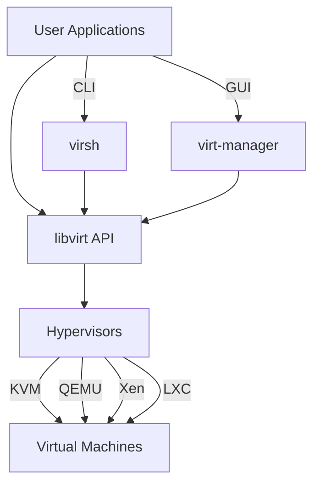

# Debian Virtualization Manager

## Introduction

Virtualization technology allows you to run multiple operating systems simultaneously on a single physical machine. This capability has revolutionized how we use computing resources, enabling better hardware utilization, isolation between services, and simplified system administration. Debian, as a robust and versatile Linux distribution, offers excellent support for virtualization technologies.

In this guide, we'll explore the virtualization management tools available in Debian, focusing on how to set up, configure, and manage virtual machines efficiently. Whether you're a student learning about virtualization concepts, a developer needing isolated environments for testing, or a system administrator looking to consolidate servers, this guide will help you master Debian's virtualization capabilities.

## Prerequisites

Before diving into Debian virtualization management, ensure you have:

- A Debian system (Debian 11 "Bullseye" or newer recommended)
- Administrator (root) privileges
- A CPU that supports hardware virtualization (Intel VT-x or AMD-V)
- Sufficient RAM and storage space for running virtual machines

## Core Virtualization Technologies in Debian

Debian supports multiple virtualization technologies, but the most commonly used stack includes:

1. **KVM (Kernel-based Virtual Machine)** - A full virtualization solution for Linux
2. **QEMU** - A generic machine emulator and virtualizer
3. **libvirt** - A toolkit to manage virtualization platforms
4. **virt-manager** - A desktop user interface for managing virtual machines

This combination provides a robust framework that balances performance, flexibility, and ease of use.

## Setting Up the Virtualization Environment

Let's start by installing the necessary packages:

```bash
sudo apt update
sudo apt install qemu-kvm libvirt-daemon-system libvirt-clients bridge-utils virtinst virt-manager
```

After installation, check if KVM is properly configured:

```bash
sudo kvm-ok
```

Expected output:
```
INFO: /dev/kvm exists
KVM acceleration can be used
```

If you see a message indicating KVM cannot be used, you might need to enable virtualization in your BIOS/UEFI settings.

Next, ensure your user can manage virtual machines by adding yourself to the required groups:

```bash
sudo adduser $(whoami) libvirt
sudo adduser $(whoami) libvirt-qemu
```

Log out and log back in for these changes to take effect.

## Understanding libvirt Architecture

The libvirt API is central to Debian's virtualization management. Let's visualize its architecture:



This architecture makes libvirt incredibly versatile, supporting multiple hypervisors through a unified interface.

## Managing Virtual Machines with virt-manager

While command-line tools offer more flexibility, `virt-manager` provides a user-friendly GUI for virtual machine management.

### Starting virt-manager

```bash
virt-manager
```

### Creating Your First Virtual Machine

1. Launch virt-manager
2. Click the "Create a new virtual machine" button
3. Select the installation method (local ISO image, network installation, etc.)
4. Follow the wizard to configure:
   - RAM allocation
   - CPU cores
   - Storage allocation
   - Network settings

### Example: Creating a Debian VM

Let's walk through creating a Debian virtual machine:

1. Download the Debian ISO from the official website
2. In virt-manager, click "Create a new virtual machine"
3. Select "Local install media"
4. Browse to your Debian ISO file
5. Allocate resources (recommendation for minimal Debian: 1GB RAM, 1 CPU, 10GB storage)
6. Create a new virtual network or use the default
7. Complete the wizard and start the installation

## Advanced VM Management with virsh

For more control and scripting capabilities, `virsh` is the command-line interface to libvirt.

### Basic virsh Commands

List all VMs:

```bash
virsh list --all
```

Example output:
```
 Id   Name        State
------------------------
 1    debian11    running
 -    ubuntu2204  shut off
```

Start a VM:

```bash
virsh start ubuntu2204
```

Shut down a VM gracefully:

```bash
virsh shutdown ubuntu2204
```

Force power off (use cautiously):

```bash
virsh destroy ubuntu2204
```

Get detailed information about a VM:

```bash
virsh dominfo debian11
```

Example output:
```
Id:             1
Name:           debian11
UUID:           7b9f6b55-6c54-4477-88de-b5edc8d77e91
OS Type:        hvm
State:          running
CPU(s):         1
Max memory:     1048576 KiB
Used memory:    1048576 KiB
Persistent:     yes
Autostart:      disable
Managed save:   no
Security model: apparmor
Security DOI:   0
```

### Working with VM Definitions

VM configurations in libvirt are stored as XML files. You can view a VM's XML definition:

```bash
virsh dumpxml debian11 > debian11.xml
```

After modifying the XML, you can update the VM definition:

```bash
virsh define debian11.xml
```

### Creating VMs from the Command Line

Create a new VM using `virt-install`:

```bash
virt-install \
  --name debian-cli \
  --ram 1024 \
  --disk path=/var/lib/libvirt/images/debian-cli.qcow2,size=10 \
  --vcpus 1 \
  --os-type linux \
  --os-variant debian11 \
  --network bridge=virbr0 \
  --graphics none \
  --console pty,target_type=serial \
  --location 'http://deb.debian.org/debian/dists/stable/main/installer-amd64/' \
  --extra-args 'console=ttyS0,115200n8 serial'
```

This creates a headless Debian VM that you interact with via the console.

## Managing Storage Pools and Volumes

Virtual machine disks need storage space, which libvirt manages through storage pools and volumes.

### Listing Storage Pools

```bash
virsh pool-list
```

Example output:
```
Name      State    Autostart
-------------------------------
default   active   yes
```

### Creating a New Storage Pool

First, create a directory for the new pool:

```bash
sudo mkdir -p /var/lib/libvirt/images/extra-pool
```

Define the pool:

```bash
virsh pool-define-as extra-pool dir - - - - "/var/lib/libvirt/images/extra-pool"
virsh pool-build extra-pool
virsh pool-start extra-pool
virsh pool-autostart extra-pool
```

### Creating a New Storage Volume

```bash
virsh vol-create-as extra-pool new-disk.qcow2 10G --format qcow2
```

This creates a 10GB disk in the 'extra-pool' storage pool.

## Network Management for VMs

Networking is crucial for virtual machines. Libvirt offers several network configurations.

### Listing Virtual Networks

```bash
virsh net-list --all
```

Example output:
```
Name      State    Autostart   Persistent
-----------------------------------------
default   active   yes         yes
```

### Creating a New Network

Create an XML file named `isolated.xml`:

```xml
<network>
  <name>isolated</name>
  <bridge name="virbr1"/>
  <ip address="192.168.100.1" netmask="255.255.255.0">
    <dhcp>
      <range start="192.168.100.128" end="192.168.100.254"/>
    </dhcp>
  </ip>
</network>
```

Then define and start the network:

```bash
virsh net-define isolated.xml
virsh net-start isolated
virsh net-autostart isolated
```

### Attaching a VM to a Specific Network

```bash
virsh attach-interface --domain debian11 --type network --source isolated --model virtio --config --live
```

## Snapshots: Preserving VM States

Snapshots allow you to save a VM's state and revert to it later.

### Creating a Snapshot

```bash
virsh snapshot-create-as debian11 snapshot1 "Clean Debian installation" --disk-only
```

### Listing Snapshots

```bash
virsh snapshot-list debian11
```

Example output:
```
Name         Creation Time               State
-------------------------------------------------
snapshot1    2023-03-15 14:30:45 +0200   disk-snapshot
```

### Reverting to a Snapshot

```bash
virsh snapshot-revert debian11 snapshot1
```

## Real-World Applications

Let's look at some practical applications of Debian virtualization:

### 1. Development Environment Isolation

For developers working on multiple projects with different dependencies:

```bash
# Create a development VM
virt-install \
  --name dev-environment \
  --ram 4096 \
  --disk path=/var/lib/libvirt/images/dev-env.qcow2,size=40 \
  --vcpus 2 \
  --os-type linux \
  --os-variant debian11 \
  --network bridge=virbr0 \
  --graphics spice \
  --location 'http://deb.debian.org/debian/dists/stable/main/installer-amd64/'
```

After setup, take a snapshot to preserve the clean state:

```bash
virsh snapshot-create-as dev-environment base "Clean development environment" --disk-only
```

Now you can experiment freely and revert when needed.

### 2. Server Consolidation

For running multiple servers on a single physical machine:

```bash
# Create a web server VM
virt-install \
  --name webserver \
  --ram 2048 \
  --disk path=/var/lib/libvirt/images/webserver.qcow2,size=20 \
  --vcpus 1 \
  --os-type linux \
  --os-variant debian11 \
  --network bridge=virbr0 \
  --graphics none \
  --console pty,target_type=serial \
  --location 'http://deb.debian.org/debian/dists/stable/main/installer-amd64/' \
  --extra-args 'console=ttyS0,115200n8 serial'

# Create a database server VM
virt-install \
  --name dbserver \
  --ram 4096 \
  --disk path=/var/lib/libvirt/images/dbserver.qcow2,size=50 \
  --vcpus 2 \
  --os-type linux \
  --os-variant debian11 \
  --network bridge=virbr0 \
  --graphics none \
  --console pty,target_type=serial \
  --location 'http://deb.debian.org/debian/dists/stable/main/installer-amd64/' \
  --extra-args 'console=ttyS0,115200n8 serial'
```

### 3. Testing System Updates

Before applying updates to a production system, test them in a VM:

```bash
# First, create a snapshot of your production VM
virsh snapshot-create-as production-server pre-update "Before system updates" --disk-only

# Apply updates and test
# If issues occur, revert to the snapshot
virsh snapshot-revert production-server pre-update
```

## Performance Tuning

To optimize your virtual machines' performance:

1. **CPU Pinning**: Assign specific VMs to specific CPU cores

```bash
virsh vcpupin debian11 0 2
```

This pins vCPU 0 of the debian11 VM to physical CPU core 2.

2. **Memory Tuning**: Use hugepages for better memory performance

First, configure hugepages on the host:

```bash
echo 'vm.nr_hugepages = 1024' | sudo tee -a /etc/sysctl.conf
sudo sysctl -p
```

Then update your VM's XML configuration:

```xml
<memoryBacking>
  <hugepages/>
</memoryBacking>
```

3. **I/O Tuning**: Choose the right disk cache mode

```xml
<disk type='file' device='disk'>
  <driver name='qemu' type='qcow2' cache='writeback'/>
  <source file='/var/lib/libvirt/images/debian11.qcow2'/>
  <target dev='vda' bus='virtio'/>
</disk>
```

## Troubleshooting Common Issues

### 1. VM Won't Start

Check the libvirt logs:

```bash
sudo journalctl -u libvirtd
```

Common issues include:
- Permission problems
- Missing storage
- Resource conflicts

### 2. Performance Problems

If a VM is running slowly:

```bash
virsh domstats debian11 --vcpu --balloon --block --interface
```

This provides statistics that can help identify bottlenecks.

### 3. Network Connectivity Issues

Check the network configuration:

```bash
virsh domiflist debian11
```

Verify that the virtual network is running:

```bash
virsh net-list
```

### 4. Access Issues

If you can't connect to the libvirt daemon:

```bash
sudo systemctl status libvirtd
```

Ensure the service is running and you have proper permissions:

```bash
sudo ls -la /var/run/libvirt/libvirt-sock
```

## Summary

Debian's virtualization management tools offer a powerful, flexible solution for creating and managing virtual machines. We've covered:

- Setting up the virtualization environment with KVM, QEMU, and libvirt
- Creating and managing VMs with both GUI (virt-manager) and CLI (virsh) tools
- Storage management for VMs
- Network configuration
- Snapshot creation and restoration
- Real-world applications and performance tuning

With these skills, you can leverage virtualization for development, testing, server consolidation, and more.

## Additional Resources

For further learning:

- The `man` pages for virsh, virt-install, and qemu
- Debian Wiki: [https://wiki.debian.org/KVM](https://wiki.debian.org/KVM)
- libvirt Documentation: [https://libvirt.org/docs.html](https://libvirt.org/docs.html)

## Exercises

1. Create a minimal Debian VM and install a web server.
2. Set up two VMs that can communicate with each other over a private network.
3. Create a snapshot, make some changes to your VM, then revert to the snapshot.
4. Write a bash script that automates the creation of a development VM with your preferred tools pre-installed.
5. Experiment with different storage formats (raw vs qcow2) and compare performance.