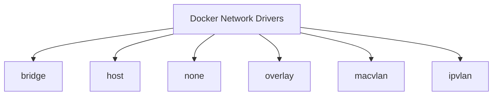

# Debian Container Networking

## Introduction

Container networking in Debian provides the foundation for containers to communicate with each other, with the host system, and with external networks. Understanding how container networking works is essential for deploying effective containerized applications in Debian environments.

This guide explains container networking concepts in Debian-based systems, focusing on popular containerization technologies like Docker and LXC (Linux Containers). You'll learn about different network modes, configuration options, and practical implementation techniques.

## Container Networking Fundamentals

### What is Container Networking?

Container networking enables isolated containers to communicate while maintaining appropriate security boundaries. Unlike traditional virtual machines that typically emulate complete networking stacks, containers share the host's kernel but can have isolated network namespaces.

### Network Namespaces

At the core of container networking in Debian is the concept of Linux network namespaces. A network namespace is an isolated instance of the network stack, including:

- Network interfaces
- Routing tables
- Firewall rules
- Socket ports

```bash
# Create a new network namespace
sudo ip netns add my_container

# List all network namespaces
ip netns list
```

Output:
```
my_container
```

Each container typically runs in its own network namespace, providing isolation from other containers and the host system.

## Docker Networking in Debian

Docker is one of the most popular containerization platforms in Debian environments. Let's explore its networking capabilities.

### Docker Network Drivers

Docker supports several built-in network drivers:



Let's examine each of these network drivers:

#### Bridge Network

The default network driver in Docker. Containers on the same bridge network can communicate while maintaining isolation from other networks.

```bash
# Create a bridge network
docker network create --driver bridge my_bridge_network

# Inspect the network
docker network inspect my_bridge_network
```

Example output (truncated):
```json
[
    {
        "Name": "my_bridge_network",
        "Id": "7d86d31b37b9ec2a88f70539f12b6973d242871f09a92cc56c0be776df3af8e1",
        "Created": "2025-03-12T14:01:23.407525634Z",
        "Scope": "local",
        "Driver": "bridge",
        "EnableIPv6": false,
        "IPAM": {
            "Driver": "default",
            "Options": {},
            "Config": [
                {
                    "Subnet": "172.18.0.0/16",
                    "Gateway": "172.18.0.1"
                }
            ]
        },
        "Internal": false,
        "Attachable": false,
        "Ingress": false,
        "ConfigFrom": {
            "Network": ""
        },
        "ConfigOnly": false,
        "Containers": {},
        "Options": {},
        "Labels": {}
    }
]
```

#### Host Network

Containers using the host network driver share the host's networking namespace, eliminating network isolation but maximizing performance.

```bash
# Run a container using host networking
docker run --network host -d nginx
```

When using host networking, containers can directly access all network interfaces on the host, including listening ports.

#### None Network

Containers with the none network driver have no external network connectivity, suitable for scenarios requiring complete network isolation.

```bash
# Run a container with no networking
docker run --network none -d alpine sleep 1000
```

#### Overlay Network

Enables communication between containers across multiple Docker hosts, essential for Docker Swarm deployments.

```bash
# Initialize Docker Swarm (if not already done)
docker swarm init

# Create an overlay network
docker network create --driver overlay --attachable my_overlay_network
```

#### Macvlan Network

Assigns MAC addresses to containers, making them appear as physical devices on the network.

```bash
# Create a macvlan network
docker network create -d macvlan \
  --subnet=192.168.1.0/24 \
  --gateway=192.168.1.1 \
  -o parent=eth0 my_macvlan_network
```

### Connecting Containers to Networks

You can connect containers to networks during creation or afterward:

```bash
# Connect at container creation
docker run --network my_bridge_network -d --name web_server nginx

# Connect an existing container to a network
docker network connect my_bridge_network database_container
```

### Exposing Container Ports

To make container services accessible from outside:

```bash
# Expose a container port to the host
docker run -p 8080:80 -d nginx
```

This maps port 80 in the container to port 8080 on the host, allowing external access to the container's web server.

## LXC Networking in Debian

Linux Containers (LXC) is another popular containerization technology in Debian environments.

### LXC Network Configuration

LXC offers several network configuration options:

1. **Empty**: No network devices
2. **Veth**: Virtual Ethernet pair (default)
3. **Macvlan**: Direct attachment to host's interface
4. **Phys**: Physical device passed to the container
5. **Bridge**: Connection to an existing bridge

The configuration is defined in the container's config file, typically located at `/var/lib/lxc/container_name/config`.

Example of LXC network configuration using a bridge:

```
# Network configuration
lxc.net.0.type = veth
lxc.net.0.link = lxcbr0
lxc.net.0.flags = up
lxc.net.0.hwaddr = 00:16:3e:xx:xx:xx
```

### Creating an LXC Bridge Network

Create a bridge interface for LXC containers:

```bash
# Install necessary packages
sudo apt update
sudo apt install -y bridge-utils

# Create a bridge
sudo brctl addbr lxcbr0
sudo ip addr add 10.0.3.1/24 dev lxcbr0
sudo ip link set lxcbr0 up

# Enable IP forwarding
echo 1 | sudo tee /proc/sys/net/ipv4/ip_forward

# Set up NAT for containers
sudo iptables -t nat -A POSTROUTING -s 10.0.3.0/24 -o eth0 -j MASQUERADE
```

To make this persistent after reboot, add the configuration to `/etc/network/interfaces`:

```
# LXC bridge
auto lxcbr0
iface lxcbr0 inet static
    address 10.0.3.1
    netmask 255.255.255.0
    bridge_ports none
    bridge_fd 0
    bridge_maxwait 0
```

## Advanced Container Networking Techniques

### Custom DNS Configuration

Configure custom DNS for Docker containers:

```bash
# Create a daemon.json file to configure Docker's DNS
sudo tee /etc/docker/daemon.json > /dev/null <<EOT
{
  "dns": ["8.8.8.8", "8.8.4.4"]
}
EOT

# Restart Docker to apply changes
sudo systemctl restart docker
```

### Network Troubleshooting

Common tools for troubleshooting container networking issues:

1. **ping**: Test basic connectivity
   ```bash
   # From host to container
   ping 172.17.0.2
   
   # From container to host (assuming you're in the container)
   ping 172.17.0.1
   ```

2. **tcpdump**: Capture network traffic
   ```bash
   # Capture traffic on the Docker bridge
   sudo tcpdump -i docker0
   ```

3. **netstat**: Show network connections
   ```bash
   # Show all listening ports
   netstat -tulpn
   ```

4. **docker network inspect**: Examine Docker network details
   ```bash
   docker network inspect bridge
   ```

### Inter-Container Communication

Different methods for containers to communicate:

#### Docker Networks

```bash
# Create a network
docker network create app_network

# Run containers on the same network
docker run -d --name web --network app_network nginx
docker run -d --name db --network app_network postgres

# Now 'web' can reach 'db' using the container name as hostname
# For example, from within the 'web' container:
# ping db
```

#### Ambassador Pattern

Using a proxy container to facilitate communication:

```bash
# Create an ambassador container
docker run -d --name redis-ambassador --link redis:redis \
           -p 6379:6379 svendowideit/ambassador

# Connect to Redis through the ambassador
docker run --rm -it --link redis-ambassador:redis redis redis-cli -h redis
```

## Container Network Security

### Network Isolation

Implement network isolation between container groups:

```bash
# Create isolated networks for different applications
docker network create --internal backend_network
docker network create frontend_network

# Database only accessible from backend
docker run -d --name db --network backend_network postgres

# Backend accessible from both networks
docker run -d --name api --network backend_network myapp/api
docker network connect frontend_network api

# Frontend only accessible from frontend network
docker run -d --name web --network frontend_network myapp/web
```

### Security Recommendations

1. **Use user-defined networks** instead of legacy links
2. **Avoid using the host network** unless absolutely necessary
3. **Don't expose ports unnecessarily**
4. **Use network policies** to restrict traffic
5. **Keep Docker and container images updated**
6. **Use Docker Content Trust** for image verification

## Practical Examples

### Example 1: Web Application Stack

Let's create a simple web application stack with Nginx, Node.js, and MongoDB:

```bash
# Create networks
docker network create frontend
docker network create backend

# Start MongoDB (only accessible from backend)
docker run -d --name mongo \
  --network backend \
  -v mongo_data:/data/db \
  mongo:latest

# Start Node.js API (accessible from both networks)
docker run -d --name api \
  --network backend \
  -e MONGO_URL=mongodb://mongo:27017/myapp \
  myapp/api:latest
docker network connect frontend api

# Start Nginx (accessible from outside)
docker run -d --name nginx \
  --network frontend \
  -p 80:80 \
  -v ./nginx.conf:/etc/nginx/conf.d/default.conf \
  nginx:latest
```

Example `nginx.conf`:

```
server {
    listen 80;
    server_name localhost;

    location /api {
        proxy_pass http://api:3000;
        proxy_set_header Host $host;
        proxy_set_header X-Real-IP $remote_addr;
    }

    location / {
        root /usr/share/nginx/html;
        index index.html;
    }
}
```

### Example 2: Service Discovery with Docker Compose

Using Docker Compose for service discovery and networking:

```yaml
version: '3'

services:
  web:
    image: nginx:latest
    ports:
      - "80:80"
    networks:
      - frontend
    depends_on:
      - api

  api:
    build: ./api
    environment:
      - DB_HOST=db
      - DB_PORT=5432
      - DB_NAME=myapp
      - DB_USER=postgres
      - DB_PASS=secret
    networks:
      - frontend
      - backend
    depends_on:
      - db

  db:
    image: postgres:latest
    environment:
      - POSTGRES_DB=myapp
      - POSTGRES_USER=postgres
      - POSTGRES_PASSWORD=secret
    volumes:
      - db_data:/var/lib/postgresql/data
    networks:
      - backend

networks:
  frontend:
  backend:

volumes:
  db_data:
```

To run this stack:

```bash
docker-compose up -d
```

## Summary

In this guide, we've explored container networking in Debian-based systems:

- Container networking fundamentals and network namespaces
- Docker networking drivers and configuration options
- LXC networking setup and configuration
- Advanced networking techniques including custom DNS and troubleshooting
- Security considerations for container networks
- Practical examples demonstrating real-world applications

Understanding container networking is crucial for building robust, secure, and efficient containerized applications in Debian environments. By mastering these concepts, you'll be able to design network architectures that meet your specific requirements while maintaining proper isolation and security.

## Additional Resources

- [Docker Networking Documentation](https://docs.docker.com/network/)
- [LXC Networking Documentation](https://linuxcontainers.org/lxc/manpages/man5/lxc.container.conf.5.html)
- [Linux Network Namespaces](https://man7.org/linux/man-pages/man7/namespaces.7.html)

## Exercises

1. Create a multi-container application using Docker Compose with three separate networks: public, application, and database.
2. Set up an LXC container with a macvlan network interface that gets an IP address directly from your network's DHCP server.
3. Configure container DNS to use your own DNS server instead of the default.
4. Implement the ambassador pattern to connect containers across different Docker hosts.
5. Create a network policy that restricts communication between containers to only specified ports.