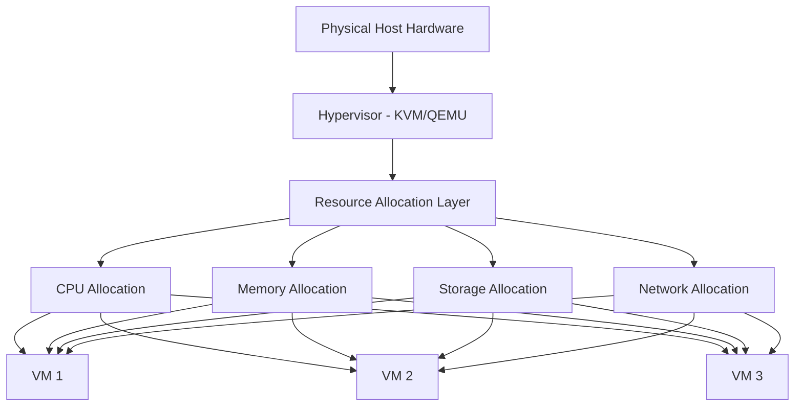

# Debian Resource Allocation

## Introduction

Resource allocation is a critical aspect of virtualization in Debian systems. It involves distributing CPU power, memory, storage, and network bandwidth among virtual machines (VMs) to ensure optimal performance and efficiency. Proper resource allocation prevents any single VM from monopolizing system resources, which could lead to performance degradation for other VMs.

In this guide, we'll explore various techniques and tools for effective resource allocation in Debian virtualization environments. Whether you're setting up a small development environment or managing a large-scale production system, understanding these concepts will help you maximize your hardware utilization and create a stable virtualized infrastructure.

## Key Resource Types

Before diving into allocation methods, let's understand the main resource types we need to manage:

1. **CPU Resources**: Processing power allocated to each virtual machine
2. **Memory (RAM)**: System memory assigned to virtual instances
3. **Storage**: Disk space and I/O operations
4. **Network Bandwidth**: Data transfer capabilities

## CPU Resource Allocation

### Understanding CPU Allocation

In Debian virtualization, CPU resources can be allocated in several ways:

- **vCPU Assignment**: Assigning virtual CPU cores to VMs
- **CPU Shares**: Setting relative priority for CPU time
- **CPU Pinning**: Binding virtual CPUs to physical CPU cores
- **CPU Limits**: Setting maximum CPU usage percentages

### Basic CPU Configuration with KVM/QEMU

Here's how to allocate CPU resources using `virt-install` when creating a new VM:

```bash
sudo virt-install \
  --name debian-vm \
  --vcpus 2 \
  --vcpus maxvcpus=4 \
  --cpu host \
  [other parameters]
```

This command creates a VM with:
- 2 virtual CPUs initially allocated
- Ability to scale up to 4 vCPUs if needed
- Host CPU model passed through to the VM

### CPU Pinning for Performance

CPU pinning can improve performance by binding vCPUs to specific physical cores. Edit your VM's XML configuration:

```bash
sudo virsh edit debian-vm
```

Add or modify the CPU configuration:

```xml
<vcpu placement='static'>2</vcpu>
<cputune>
  <vcpupin vcpu='0' cpuset='1'/>
  <vcpupin vcpu='1' cpuset='2'/>
</cputune>
```

This configuration:
- Pins vCPU 0 to physical core 1
- Pins vCPU 1 to physical core 2

### Monitoring CPU Usage

Monitor CPU usage with the `virt-top` command:

```bash
sudo virt-top
```

Output example:
```
ID    Name         %CPU  CPU Time     %MEM   MEM    State  Time
1     debian-vm    14.3  12:45.89     15.6   1600M  running 2:17:42
2     ubuntu-vm    22.1  35:30.12     25.3   2560M  running 5:22:12
```

## Memory Resource Allocation

### Configuring VM Memory

Allocate RAM to your virtual machines using the `--memory` parameter:

```bash
sudo virt-install \
  --name debian-vm \
  --memory 2048 \
  [other parameters]
```

This allocates 2GB of RAM to the virtual machine.

### Dynamic Memory Management

Debian's virtualization supports memory ballooning for dynamic resource allocation. Enable it by adding these parameters to your VM configuration:

```xml
<memballoon model='virtio'>
  <address type='pci' domain='0x0000' bus='0x00' slot='0x08' function='0x0'/>
</memballoon>
```

### Memory Optimization Techniques

1. **Kernel Same-page Merging (KSM)**

Enable KSM to allow the kernel to detect duplicate memory pages and merge them:

```bash
# Check if KSM is enabled
cat /sys/kernel/mm/ksm/run

# Enable KSM
echo 1 > /sys/kernel/mm/ksm/run
```

2. **Configure Huge Pages**

Edit your `/etc/default/grub` file:

```bash
GRUB_CMDLINE_LINUX="default_hugepagesz=1G hugepagesz=1G hugepages=4"
```

Then update GRUB and reboot:

```bash
sudo update-grub
sudo reboot
```

## Storage Resource Allocation

### Storage Pools

Create a storage pool to manage VM disk images:

```bash
sudo virsh pool-define-as vm-disks dir - - - - "/var/lib/libvirt/images"
sudo virsh pool-build vm-disks
sudo virsh pool-start vm-disks
sudo virsh pool-autostart vm-disks
```

### Storage Performance Tuning

Use the `io` attribute to set the I/O mode:

```xml
<disk type='file' device='disk'>
  <driver name='qemu' type='qcow2' cache='none' io='native'/>
  <source file='/var/lib/libvirt/images/debian-vm.qcow2'/>
  <target dev='vda' bus='virtio'/>
</disk>
```

Common `io` modes include:
- `native`: Use Linux's native AIO
- `threads`: Use thread pool for I/O operations
- `io_uring`: Modern asynchronous I/O interface (on newer systems)

### Thin Provisioning

Create a thin-provisioned disk to save space:

```bash
sudo qemu-img create -f qcow2 debian-vm.qcow2 50G
```

This creates a 50GB virtual disk that only uses the actual space consumed by data.

## Network Resource Allocation

### Basic Network Configuration

Create a VM with network assignment:

```bash
sudo virt-install \
  --name debian-vm \
  --network bridge=virbr0,model=virtio \
  [other parameters]
```

### Network Bandwidth Control

Control bandwidth using `<bandwidth>` XML elements:

```xml
<interface type='bridge'>
  <source bridge='virbr0'/>
  <model type='virtio'/>
  <bandwidth>
    <inbound average='1000' peak='5000' burst='1024'/>
    <outbound average='1000' peak='5000' burst='1024'/>
  </bandwidth>
</interface>
```

This configuration:
- Sets average bandwidth to 1000 KB/s
- Allows peak bursts up to 5000 KB/s
- Sets burst size to 1024 KB

## Resource Allocation Best Practices

### Visualizing Resource Allocation



### Resource Allocation Workflow

1. **Assess requirements** for each virtual machine
2. **Calculate total required resources** across all VMs
3. **Verify host capabilities** can meet the total demand
4. **Allocate minimum required resources** to each VM
5. **Apply resource constraints** where necessary
6. **Monitor resource usage** and adjust as needed
7. **Implement overcommitment policies** for CPU and memory if appropriate

### Overcommitment Strategies

Debian virtualization allows allocating more resources than physically available, based on the assumption that not all VMs will use their maximum allocation simultaneously.

```bash
# Set memory overcommitment
echo 0.8 > /sys/module/kvm/parameters/memory_overcommit_ratio
```

This sets memory overcommitment to 80% (allowing VMs to collectively be allocated 180% of physical RAM).

## Practical Example: Complete VM Setup with Resource Allocation

Let's create a comprehensive example of a Debian VM with optimized resource allocation:

```bash
# Create a thin-provisioned disk
sudo qemu-img create -f qcow2 /var/lib/libvirt/images/web-server.qcow2 20G

# Create VM with optimized resource allocation
sudo virt-install \
  --name web-server \
  --vcpus 2,maxvcpus=4 \
  --cpu host-passthrough,cache.mode=passthrough \
  --memory 2048 \
  --memorybacking hugepages=on \
  --disk path=/var/lib/libvirt/images/web-server.qcow2,format=qcow2,bus=virtio,io=native \
  --network bridge=virbr0,model=virtio \
  --graphics none \
  --console pty,target_type=serial \
  --location 'http://ftp.debian.org/debian/dists/stable/main/installer-amd64/' \
  --os-variant debian10
```

After installation, optimize the VM's XML configuration:

```bash
sudo virsh edit web-server
```

Add these optimizations:

```xml
<cputune>
  <vcpupin vcpu='0' cpuset='1'/>
  <vcpupin vcpu='1' cpuset='2'/>
  <shares>1024</shares>
  <period>100000</period>
  <quota>200000</quota>
</cputune>

<memtune>
  <hard_limit unit='KiB'>4194304</hard_limit>
  <soft_limit unit='KiB'>2097152</soft_limit>
</memtune>
```

### Understanding Resource Utilization

Monitor the resource usage of your VMs with these commands:

```bash
# Check CPU utilization
sudo virsh cpu-stats web-server --total

# Check memory usage
sudo virsh dommemstat web-server

# Check disk I/O
sudo virsh domblkstat web-server vda

# Check network I/O
sudo virsh domifstat web-server vnet0
```

Sample output for memory statistics:
```
actual 2097152
swap_in 0
swap_out 0
major_fault 142
minor_fault 3542
unused 235488
available 2097152
```

## Troubleshooting Resource Allocation Issues

### Common Issues and Solutions

1. **VM Performance Degradation**
   - Check for resource contention using `virt-top`
   - Look for other VMs using excessive resources
   - Consider increasing the allocation or implementing resource limits

2. **Out of Memory Errors**
   - Check host memory usage with `free -m`
   - Reduce memory allocation on low-priority VMs
   - Enable memory ballooning for dynamic adjustment

3. **I/O Bottlenecks**
   - Use `iostat` to identify storage performance issues
   - Consider using cache=none and io=native for disk configurations
   - Distribute VM storage across different physical disks

## Summary

Proper resource allocation is essential for efficient virtualization in Debian systems. We've covered:

- CPU allocation strategies including vCPU assignment and pinning
- Memory management techniques like ballooning and huge pages
- Storage optimization with different I/O modes and thin provisioning
- Network bandwidth control for managing data transfer

By applying these techniques, you can create a balanced virtualization environment that maximizes performance while efficiently utilizing your physical hardware resources.

## Additional Resources

- Debian Wiki on Virtualization: [Debian Wiki - Virtualization](https://wiki.debian.org/Virtualization)
- KVM Documentation: [KVM - Kernel Virtual Machine](https://www.linux-kvm.org/page/Documents)
- QEMU Documentation: [QEMU - Quick Emulator](https://www.qemu.org/docs/master/)

## Exercises

1. Set up a Debian VM with 2 vCPUs pinned to specific physical cores and monitor the performance difference.
2. Experiment with different memory allocation strategies and measure their impact on VM performance.
3. Create a storage benchmark test to compare different disk I/O modes in a VM.
4. Implement network bandwidth limits on a VM and test the actual throughput under load.
5. Create a resource allocation plan for a hypothetical server hosting 5 VMs with different workloads.