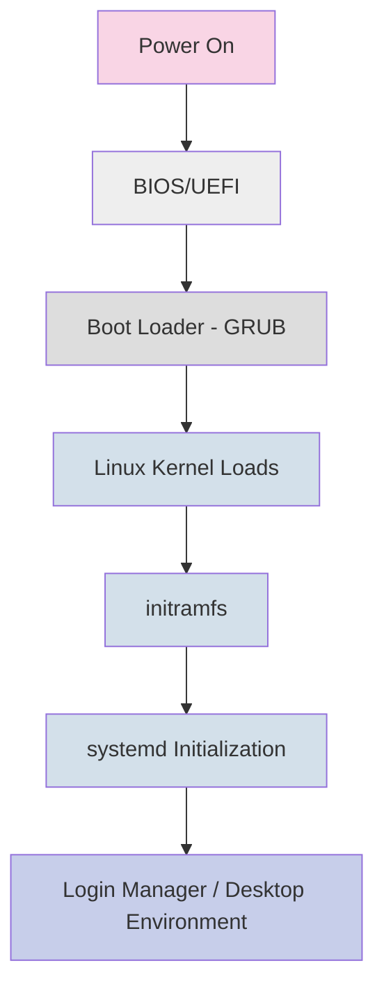

# Debian Boot Problems

## Introduction

Boot problems in Debian Linux can be frustrating, especially for beginners. When your system refuses to start properly, it can feel like you've lost access to your entire digital environment. The good news is that most boot issues follow predictable patterns and can be resolved with systematic troubleshooting.

This guide covers common Debian boot problems, how to diagnose them, and step-by-step solutions to get your system running again. Whether you're dealing with GRUB issues, kernel problems, or filesystem errors, you'll learn the fundamental concepts and practical approaches to resolve these problems.

## Common Boot Process in Debian

Before diving into troubleshooting, let's understand how a typical Debian system boots:



Problems can occur at any of these stages. Let's explore the most common issues and their solutions.

## 1. GRUB-Related Boot Problems

### Missing or Corrupted GRUB

**Problem**: System shows no GRUB menu and fails to boot, possibly displaying errors like "No bootable device" or "Operating System not found".

**Solution**: Restore GRUB using a Debian live USB:

1. Boot from a Debian live USB/CD
2. Open terminal and mount your system partition:

```bash
sudo fdisk -l  # Identify your Debian partition (e.g., /dev/sda1)
sudo mount /dev/sda1 /mnt
```

3. For UEFI systems, mount the EFI partition:

```bash
sudo mount /dev/sda2 /mnt/boot/efi  # Assuming sda2 is your EFI partition
```

4. Mount virtual filesystems:

```bash
for i in /dev /dev/pts /proc /sys /run; do sudo mount -B $i /mnt$i; done
```

5. Chroot into your installation:

```bash
sudo chroot /mnt
```

6. Reinstall and update GRUB:

```bash
grub-install /dev/sda  # Install to the drive, not partition
update-grub
```

7. Exit and reboot:

```bash
exit
sudo reboot
```

### GRUB Configuration Issues

**Problem**: GRUB shows but fails to boot Debian, or boots into the wrong system.

**Solution**: Edit GRUB configuration from the GRUB menu or via recovery:

1. At the GRUB menu, press 'e' to edit the boot entry
2. Look for the line starting with `linux` containing your kernel parameters
3. Add troubleshooting parameters as needed:
   - `nomodeset` - For graphics driver issues
   - `single` or `1` - Boot to single-user mode
   - Remove `quiet splash` for detailed boot messages

4. Press F10 to boot with these parameters

To make changes permanent after successful boot:

```bash
sudo nano /etc/default/grub
# Edit parameters as needed
sudo update-grub
```

## 2. Filesystem Problems

### Corrupted Filesystem

**Problem**: Boot process stops with messages about filesystem errors, or you see: "Give root password for maintenance".

**Solution**: Check and repair the filesystem:

1. Boot to recovery mode or use a live USB
2. Run filesystem check:

```bash
# Replace sda1 with your root partition
sudo fsck -f /dev/sda1
```

3. If prompted to fix errors, type 'y'
4. Reboot after completion:

```bash
sudo reboot
```

### Full Root Partition

**Problem**: System won't boot or enter emergency mode with errors about no space left.

**Diagnosis**: Boot to recovery mode and check disk usage:

```bash
df -h
```

**Solution**: Clean up space:

```bash
# Remove old packages
sudo apt-get clean
sudo apt-get autoremove

# Remove old kernels (keep the current and one previous)
dpkg -l | grep linux-image | awk '{print $2}' | sort -V
sudo apt-get purge linux-image-X.X.X-XX  # Replace with specific version

# Clear journal logs
sudo journalctl --vacuum-time=3d
```

## 3. Kernel-Related Issues

### Kernel Panic

**Problem**: System shows "Kernel panic - not syncing" messages and fails to boot.

**Solution**: Boot into an older kernel version:

1. Restart and enter GRUB menu
2. Select "Advanced options for Debian"
3. Choose an older kernel version
4. If successful, remove the problematic kernel:

```bash
# Identify kernels
dpkg -l | grep linux-image

# Remove the problematic kernel
sudo apt-get purge linux-image-X.X.X-XX  # Replace with specific version

# Update GRUB
sudo update-grub
```

### Missing or Corrupted initramfs

**Problem**: Boot fails with messages about missing initramfs or failure to mount root filesystem.

**Solution**: Regenerate the initramfs:

1. Boot from a live USB
2. Mount your Debian system:

```bash
sudo mount /dev/sda1 /mnt  # Replace sda1 with your root partition
```

3. Chroot into it:

```bash
for i in /dev /dev/pts /proc /sys /run; do sudo mount -B $i /mnt$i; done
sudo chroot /mnt
```

4. Rebuild initramfs for all installed kernels:

```bash
update-initramfs -u -k all
```

5. Exit and reboot:

```bash
exit
sudo reboot
```

## 4. Hardware Detection Issues

### Graphics Driver Problems

**Problem**: Black screen or freezes after GRUB with no error messages.

**Solution**: Boot with basic graphics drivers:

1. At GRUB menu, press 'e' to edit
2. Find the line starting with `linux` and add `nomodeset`
3. Press F10 to boot
4. After successful boot, fix the driver:

```bash
# Check current drivers
lspci -k | grep -A 2 -E "(VGA|3D)"

# For NVIDIA
sudo apt-get install nvidia-driver

# For AMD
sudo apt-get install firmware-amd-graphics
```

### Missing Firmware

**Problem**: Boot fails with messages about missing firmware.

**Solution**: Install necessary firmware packages:

1. Boot to recovery mode or from live USB
2. Install the firmware:

```bash
sudo apt-get update
sudo apt-get install firmware-linux firmware-linux-nonfree
```

For specific hardware firmware:

```bash
sudo apt-get install firmware-iwlwifi  # For Intel wireless
sudo apt-get install firmware-realtek  # For Realtek devices
sudo apt-get install firmware-atheros  # For Atheros devices
```

## 5. systemd and Service Issues

### Failed Services Blocking Boot

**Problem**: Boot hangs with messages about failed services or "A start job is running for..."

**Solution**: Diagnose and fix the problematic service:

1. Boot with the following parameter in GRUB:
   - Add `systemd.unit=rescue.target` to the kernel command line

2. Identify the problem:

```bash
systemctl --failed
journalctl -xb
```

3. Disable the problematic service temporarily:

```bash
sudo systemctl disable problematic-service.service
sudo reboot
```

4. After successful boot, investigate and fix the service issue

## Practical Examples

### Example 1: Recovering from a Failed Kernel Update

Maria updated her Debian system, which included a kernel update. After rebooting, she encountered a kernel panic. Here's how she solved it:

1. She restarted the computer and entered the GRUB menu
2. Selected "Advanced options for Debian"
3. Chose the previous kernel version which booted successfully
4. Opened the terminal and ran:

```bash
sudo apt-get update
sudo apt-get install --reinstall linux-image-$(uname -r)
sudo update-initramfs -u
sudo update-grub
```

5. Rebooted successfully with the fixed kernel

### Example 2: Dealing with a Corrupted GRUB after Windows Update

Alex had a dual-boot system with Windows and Debian. After a Windows update, GRUB disappeared. Here's how he restored it:

1. Booted from a Debian live USB
2. Mounted his Linux partition:

```bash
sudo mount /dev/sda5 /mnt  # His Debian was on sda5
```

3. Mounted other necessary partitions:

```bash
sudo mount /dev/sda1 /mnt/boot/efi  # His EFI partition was sda1
for i in /dev /dev/pts /proc /sys /run; do sudo mount -B $i /mnt$i; done
```

4. Chrooted into the installed system:

```bash
sudo chroot /mnt
```

5. Reinstalled GRUB:

```bash
grub-install /dev/sda
update-grub
```

6. Exited chroot and rebooted to find both Windows and Debian in the GRUB menu

## Summary

Debian boot problems can seem intimidating, but with systematic troubleshooting, most issues can be resolved. Remember these key points:

1. The boot process has several stages, and identifying which stage is failing helps target your solution
2. Recovery modes and live USBs are essential tools for fixing boot problems
3. Most solutions involve repairing or reconfiguring GRUB, fixing filesystem issues, or addressing kernel problems
4. Always keep a bootable USB drive with Debian or a rescue system handy

With practice, you'll become more confident in diagnosing and solving boot issues, a valuable skill for any Debian user.

## Additional Resources

- [Debian Wiki: Rescue Mode](https://wiki.debian.org/RescueMode)
- [Debian Administrator's Handbook](https://debian-handbook.info/)
- [GRUB2 Documentation](https://www.gnu.org/software/grub/manual/grub/grub.html)

## Practice Exercises

1. Create a Debian live USB and practice booting from it on your system
2. Intentionally modify (backup first!) your GRUB configuration and practice recovering it
3. Research the kernel parameters relevant to your hardware that might be needed for troubleshooting
4. Set up a virtual machine with Debian and practice the recovery techniques in a safe environment