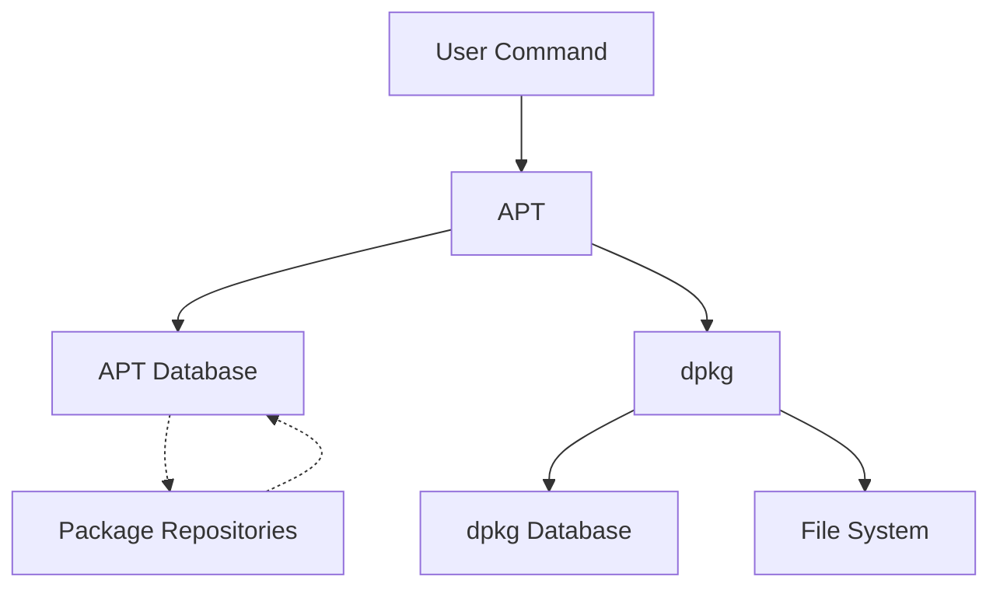

# Debian Package Errors

## Introduction

Debian-based Linux distributions (like Ubuntu, Linux Mint, and Debian itself) use a package management system to install, update, and remove software. This system consists of tools like `apt`, `apt-get`, and `dpkg` that handle software packages. While these tools are powerful, you might encounter various errors during package operations. This guide will help you understand and resolve common Debian package errors.

## Understanding Package Management in Debian

Before diving into errors, let's understand how package management works in Debian:



- **dpkg**: The low-level package manager that handles the actual installation and removal of packages
- **APT**: Advanced Package Tool, a higher-level interface that resolves dependencies and fetches packages
- **Repositories**: Online servers containing packages that APT downloads

## Common Package Errors and Solutions

### 1. Broken Dependencies

#### Error Example

```bash
$ sudo apt install some-package
Reading package lists... Done
Building dependency tree... Done
Some packages could not be installed. This may mean that you have
requested an impossible situation or if you are using the unstable
distribution that some required packages have not yet been created
or been moved out of Incoming.
```

#### Understanding the Error

This error occurs when:
- A package you're trying to install requires other packages that aren't available
- There's a conflict between package dependencies
- Required versions of dependencies can't be satisfied

#### Solution

```bash
# First try to fix broken dependencies
$ sudo apt --fix-broken install

# If that doesn't work, try:
$ sudo apt update
$ sudo apt upgrade

# For more specific dependency issues:
$ sudo apt-get -f install
```

### 2. Locked Database Errors

#### Error Example

```bash
$ sudo apt install package-name
E: Could not get lock /var/lib/dpkg/lock - open (11: Resource temporarily unavailable)
E: Unable to lock the administration directory (/var/lib/dpkg/), is another process using it?
```

#### Understanding the Error

This happens when:
- Another package management process is running (like Software Center)
- A previous package operation was interrupted
- The system is performing automatic updates

#### Solution

```bash
# Check if any apt/dpkg process is running
$ ps aux | grep -i apt
$ ps aux | grep -i dpkg

# If no process is actually running, you can remove the lock files:
$ sudo rm /var/lib/apt/lists/lock
$ sudo rm /var/lib/dpkg/lock
$ sudo rm /var/lib/dpkg/lock-frontend

# Then reconfigure dpkg:
$ sudo dpkg --configure -a
```

### 3. Corrupted Package Lists

#### Error Example

```bash
$ sudo apt update
E: Encountered a section with no Package: header
E: Problem with MergeList /var/lib/apt/lists/repository_path
E: The package lists or status file could not be parsed or opened.
```

#### Understanding the Error

This occurs when:
- Package list files become corrupted
- Network issues caused incomplete downloads
- Repository data is inconsistent

#### Solution

```bash
# Clear the local repository information:
$ sudo rm -rf /var/lib/apt/lists/*

# Then update to fetch fresh lists:
$ sudo apt update
```

### 4. Half-installed or Configured Packages

#### Error Example

```bash
$ sudo apt install package-name
E: dpkg was interrupted, you must manually run 'sudo dpkg --configure -a' to correct the problem.
```

#### Understanding the Error

This happens when:
- A previous installation was interrupted
- Package configuration failed during installation
- System crashed during package operations

#### Solution

```bash
# First, configure any unconfigured packages:
$ sudo dpkg --configure -a

# Then fix any broken installations:
$ sudo apt --fix-broken install

# Finally, attempt to complete pending operations:
$ sudo apt update && sudo apt upgrade
```

### 5. Unmet Dependencies

#### Error Example

```bash
$ sudo apt install package-name
The following packages have unmet dependencies:
  package-name : Depends: dependency-name (>= 2.0) but 1.8 is to be installed
E: Unable to correct problems, you have held broken packages.
```

#### Understanding the Error

This error occurs when:
- Required versions of dependencies can't be installed
- Package conflicts exist
- You have mixed repositories that don't work well together

#### Solution

```bash
# Try to install the specific dependency first:
$ sudo apt install dependency-name

# If that doesn't work, try:
$ sudo apt --fix-broken install

# For stubborn cases, try:
$ sudo apt-get clean
$ sudo apt-get update
$ sudo apt-get dist-upgrade
```

### 6. Hash Sum Mismatch

#### Error Example

```bash
$ sudo apt update
E: Failed to fetch http://repository.url/path  Hash Sum mismatch
E: Some index files failed to download. They have been ignored, or old ones used instead.
```

#### Understanding the Error

This happens when:
- Downloaded files don't match their expected checksums
- Network problems corrupted downloads
- Repository mirrors are out of sync

#### Solution

```bash
# Clear the partial downloads:
$ sudo rm -rf /var/lib/apt/lists/partial/*

# Switch to a different mirror temporarily:
$ sudo sed -i 's/us.archive.ubuntu.com/old-releases.ubuntu.com/g' /etc/apt/sources.list

# Update again:
$ sudo apt update
```

### 7. Package Authentication Errors

#### Error Example

```bash
$ sudo apt install package-name
WARNING: The following packages cannot be authenticated!
  package-name
Install these packages without verification? [y/N]
```

#### Understanding the Error

This occurs when:
- The package's signing key is not in your trusted keyring
- The repository was added without importing its key
- The key has expired or been revoked

#### Solution

```bash
# Update the package lists:
$ sudo apt update

# If you know the key ID (replace KEY_ID with actual key):
$ sudo apt-key adv --keyserver keyserver.ubuntu.com --recv-keys KEY_ID

# For newer systems using apt-key deprecation:
$ sudo gpg --keyserver keyserver.ubuntu.com --recv-keys KEY_ID
$ sudo gpg --export KEY_ID | sudo tee /etc/apt/trusted.gpg.d/custom.gpg > /dev/null
```

## Practical Troubleshooting Example

Let's walk through a real-world example of diagnosing and fixing package errors.

### Scenario: Failed Ubuntu System Upgrade

Imagine you started upgrading your system, but it got interrupted due to a power outage. Now you're seeing errors when trying to use apt.

#### Step 1: Check the system status

```bash
$ sudo apt update
E: dpkg was interrupted, you must manually run 'sudo dpkg --configure -a' to correct the problem.
```

#### Step 2: Resume interrupted configuration

```bash
$ sudo dpkg --configure -a
Setting up linux-image-5.15.0-46-generic (5.15.0-46.49) ...
Processing triggers for linux-image-5.15.0-46-generic (5.15.0-46.49) ...
```

This might take some time as it completes the configuration of all interrupted packages.

#### Step 3: Fix any remaining broken dependencies

```bash
$ sudo apt --fix-broken install
Reading package lists... Done
Building dependency tree... Done
Correcting dependencies... Done
```

#### Step 4: Update and continue the upgrade

```bash
$ sudo apt update
Hit:1 http://archive.ubuntu.com/ubuntu jammy InRelease
Get:2 http://security.ubuntu.com/ubuntu jammy-security InRelease [110 kB]
...
Reading package lists... Done

$ sudo apt upgrade
Reading package lists... Done
Building dependency tree... Done
Calculating upgrade... Done
The following packages will be upgraded:
...
```

## Advanced Troubleshooting Tools

### 1. `apt` Command Options

```bash
# Simulate installation without actually installing:
$ sudo apt install -s package-name

# Verbose output for debugging:
$ sudo apt -o Debug::pkgProblemResolver=true install package-name

# Display detailed errors:
$ sudo apt -o Debug::Acquire::http=true update
```

### 2. Using `dpkg` for Package Analysis

```bash
# List all installed packages:
$ dpkg -l

# Show information about a package:
$ dpkg -s package-name

# List all files owned by a package:
$ dpkg -L package-name

# Find which package owns a file:
$ dpkg -S /path/to/file
```

### 3. Finding and Fixing Problems with `apt-get`

```bash
# Fix broken dependencies:
$ sudo apt-get -f install

# Clean out cached package files:
$ sudo apt-get clean

# Remove packages that are no longer needed:
$ sudo apt-get autoremove
```

## Preventative Measures

To prevent package errors in the future:

1. **Avoid interrupting package operations**: Let installations and updates complete before shutting down

2. **Make backups before major upgrades**: Especially system upgrades

3. **Use snapshots when possible**: If you're using LVM or a filesystem with snapshot capability

4. **Read the warnings**: Package managers usually warn you about potential issues

5. **Use stable repositories**: Mixing repositories can cause dependency conflicts

6. **Keep your system updated**: Regular updates help prevent dependency problems

```bash
# Setup a simple automatic update script
$ sudo nano /etc/cron.daily/apt-update
```

Add the following content:

```bash
#!/bin/bash
apt update
apt -y -d upgrade
```

Then make it executable:

```bash
$ sudo chmod +x /etc/cron.daily/apt-update
```

## Summary

Debian package errors are common but usually resolvable. Understanding the package management system and common error types will help you troubleshoot effectively. Remember these key points:

- Most package errors relate to dependencies, locks, or interrupted operations
- The `apt` and `dpkg` tools provide extensive troubleshooting capabilities
- Keeping your system updated and using stable repositories prevents many errors
- Always read error messages carefully to understand the actual problem

## Additional Resources

- [Debian Package Management Guide](https://www.debian.org/doc/manuals/debian-reference/ch02.en.html)
- [Ubuntu Package Management Documentation](https://help.ubuntu.com/community/AptGet/Howto)
- [APT Command Handbook](https://itsfoss.com/apt-command-guide/)

## Exercises

1. Deliberately create a locked database situation by starting an apt process and then trying to run another one in a different terminal. Practice identifying and resolving the lock.

2. Set up a test environment (like a virtual machine) and practice recovering from an interrupted upgrade.

3. Create a shell script that performs common package maintenance tasks (updating, cleaning, autoremoving).

4. Learn to read and understand the package dependency information using `apt-cache depends package-name` and `apt-cache rdepends package-name`.