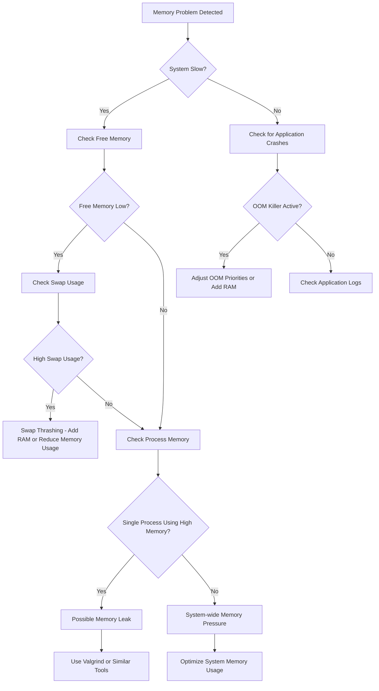

# Debian Memory Problems

## Introduction

Memory-related issues are common challenges in Debian systems that can significantly impact performance and stability. Whether you're experiencing slow response times, application crashes, or system freezes, understanding how Debian manages memory and how to diagnose memory problems is essential for effective troubleshooting. This guide will walk you through the fundamentals of memory management in Debian, common memory issues, and practical solutions to resolve them.

## Understanding Memory in Debian

Before diving into troubleshooting, let's understand how Debian handles memory:

### Types of Memory

Debian, like other Linux distributions, utilizes two main types of memory:

1. **Physical Memory (RAM)**: The hardware memory installed on your system.
2. **Virtual Memory**: Combines RAM with disk space (swap) to extend available memory.

### Memory Management Concepts

- **Resident Set Size (RSS)**: The portion of a process that resides in physical memory.
- **Virtual Set Size (VSZ)**: The total memory a process can access, including RAM and swap.
- **Shared Memory**: Memory segments shared between multiple processes.
- **Buffer/Cache**: Memory used by the kernel to cache disk operations and improve performance.

## Common Memory Problems in Debian

### 1. Physical Memory Exhaustion

When your system runs out of available RAM, it becomes sluggish and may start using swap space excessively.

**Symptoms:**
- System slowdowns
- Applications taking longer to start
- Frequent disk activity (swap thrashing)

### 2. Memory Leaks

A memory leak occurs when an application allocates memory but fails to release it when no longer needed.

**Symptoms:**
- Gradually increasing memory usage
- Application performance degradation over time
- Eventually leads to crashes when memory is exhausted

### 3. Out of Memory (OOM) Killer

When the system completely runs out of memory, the Linux kernel's OOM Killer terminates processes to free up memory.

**Symptoms:**
- Applications terminate unexpectedly
- Log entries about "Out of memory" in system logs
- System becomes unstable

### 4. Swap Thrashing

Excessive use of swap space causes the system to spend most of its time moving data between RAM and disk rather than performing useful work.

**Symptoms:**
- High disk I/O
- System becomes unresponsive
- CPU usage shows high "wait" time

## Diagnosing Memory Problems

Let's explore tools and commands to diagnose memory issues:

### Basic Memory Information

```bash
# Display memory usage summary
free -h

# Show memory information from /proc/meminfo
cat /proc/meminfo

# Monitor memory usage in real-time
watch -n 1 free -h
```

**Example Output:**
```
              total        used        free      shared  buff/cache   available
Mem:          7.7Gi       3.1Gi       1.2Gi       650Mi       3.4Gi       3.7Gi
Swap:         2.0Gi       256Mi       1.7Gi
```

### Process Memory Usage

```bash
# Show memory usage of all processes
ps aux --sort=-%mem | head -10

# Monitor process memory usage with top
top -o %MEM

# Get detailed memory information for a specific process
pmap -x [PID]
```

**Example Output from ps command:**
```
USER       PID %CPU %MEM    VSZ   RSS TTY      STAT START   TIME COMMAND
user     19234  2.0 12.5 2451616 972540 ?      Sl   10:23   0:42 firefox
user      2345  1.5  3.2 1524788 249760 ?      Sl   09:15   0:28 gnome-shell
user      3421  0.8  2.8  986232 215644 ?      Sl   09:18   0:12 evolution
```

### Advanced Memory Diagnostics

```bash
# Install and use the smem tool for detailed memory analysis
sudo apt install smem
smem -t -k -c "pid user command swap uss pss rss"

# Check OOM killer logs
dmesg | grep -i "out of memory"
```

## Memory Problem Solutions

### 1. Adding More RAM

If your system consistently uses all available RAM, consider upgrading your hardware:

```bash
# Check if your system can support additional RAM
sudo dmidecode -t memory
```

### 2. Optimizing Swap Configuration

```bash
# Check current swap configuration
swapon --show

# Create a new swap file (example: 2GB swap file)
sudo fallocate -l 2G /swapfile
sudo chmod 600 /swapfile
sudo mkswap /swapfile
sudo swapon /swapfile

# Add to fstab to make permanent
echo '/swapfile none swap sw 0 0' | sudo tee -a /etc/fstab

# Adjust swappiness (lower values reduce swap usage)
echo 'vm.swappiness=10' | sudo tee -a /etc/sysctl.conf
sudo sysctl -p
```

### 3. Identifying and Fixing Memory Leaks

For applications with suspected memory leaks:

```bash
# Install Valgrind for memory leak detection
sudo apt install valgrind

# Run your application with Valgrind
valgrind --leak-check=full --show-leak-kinds=all --track-origins=yes ./your_program
```

For system-wide monitoring:

```bash
# Install and use the memory_profiler Python package
sudo apt install python3-pip
sudo pip3 install memory_profiler
```

### 4. Managing OOM Killer Behavior

```bash
# Adjust OOM score for critical processes (less likely to be killed)
echo -100 > /proc/[PID]/oom_score_adj

# Adjust OOM score for non-critical processes (more likely to be killed)
echo 1000 > /proc/[PID]/oom_score_adj
```

### 5. Limiting Process Memory Usage

Use cgroups to limit memory usage for specific processes:

```bash
# Create a new cgroup
sudo cgcreate -g memory:limitgroup

# Set memory limit (example: 512MB)
sudo cgset -r memory.limit_in_bytes=512M limitgroup

# Run a process within the cgroup
sudo cgexec -g memory:limitgroup command args
```

## Real-World Examples

### Example 1: Troubleshooting a Memory-Hungry Web Server

Let's say your Debian system is running a web server that's consuming excessive memory:

```bash
# Identify the web server's memory usage
ps aux | grep apache2

# Check individual Apache processes
top -p $(pgrep -d ',' apache2)

# Examine Apache configuration
sudo nano /etc/apache2/mods-enabled/mpm_prefork.conf
```

Optimize Apache configuration:

```apacheconf
<IfModule mpm_prefork_module>
    StartServers            5
    MinSpareServers         5
    MaxSpareServers        10
    MaxRequestWorkers     150
    MaxConnectionsPerChild 4000
</IfModule>
```

### Example 2: Diagnosing and Fixing a Memory Leak

Suppose you have a custom application with a memory leak:

1. Monitor the application:
```bash
# Start monitoring the process
ps -o pid,rss,vsz,cmd -p [PID] --no-headers
watch -n 10 'ps -o pid,rss,vsz,cmd -p [PID] --no-headers'
```

2. Use Valgrind to find the leak:
```bash
valgrind --leak-check=full --log-file=memcheck.log ./myapplication
```

3. Examine the Valgrind output:
```bash
cat memcheck.log | grep "definitely lost"
```

4. Fix the leak in the application code, for example:

```c
// Before: Memory leak
char* buffer = malloc(1024);
strcpy(buffer, "Hello");
// No free(buffer)

// After: Memory leak fixed
char* buffer = malloc(1024);
strcpy(buffer, "Hello");
// Use the buffer...
free(buffer);
```

## Memory Problem Visualization

Here's a flowchart for diagnosing memory issues:



## Advanced Memory Management Techniques

### Using cgroups2 for Memory Control

Debian 10 (Buster) and later use cgroups v2 by default, which provides improved memory management:

```bash
# Create a new cgroup using cgroups v2
sudo mkdir -p /sys/fs/cgroup/memory/mygroup

# Set memory limit
echo 512M | sudo tee /sys/fs/cgroup/memory/mygroup/memory.max

# Add a process to the cgroup
echo $PID | sudo tee /sys/fs/cgroup/memory/mygroup/cgroup.procs
```

### Tuning the Linux VM Subsystem

Fine-tune memory management parameters:

```bash
# Reduce swappiness (0-100, lower values reduce swap usage)
sudo sysctl vm.swappiness=10

# Increase cache pressure (0-100, higher values clear cache more aggressively)
sudo sysctl vm.vfs_cache_pressure=50

# Make settings permanent
echo 'vm.swappiness=10' | sudo tee -a /etc/sysctl.conf
echo 'vm.vfs_cache_pressure=50' | sudo tee -a /etc/sysctl.conf
```

## Summary

Memory problems in Debian systems can manifest in various ways, from simple performance degradation to complete system instability. By understanding how memory works in Debian and using the diagnostic tools provided in this guide, you can identify and resolve most memory-related issues.

Remember these key points:
- Monitor memory usage regularly to catch problems early
- Use tools like `free`, `top`, and `ps` for basic diagnostics
- Consider advanced tools like `valgrind` for memory leak detection
- Optimize application configurations to reduce memory footprint
- Add more RAM or properly configure swap when necessary
- Use cgroups to control memory usage of specific processes

## Additional Resources

- [Debian Wiki - Memory Management](https://wiki.debian.org/Memory)
- [Linux Kernel Documentation - Memory Management](https://www.kernel.org/doc/html/latest/admin-guide/mm/index.html)
- [Understanding the Linux Out-of-Memory Killer](https://www.kernel.org/doc/gorman/html/understand/understand016.html)

## Practice Exercises

1. Use the `free` command to check your system's memory usage. Calculate the percentage of RAM currently in use.

2. Find the top 5 processes consuming the most memory on your system using the `ps` command.

3. Create a small C program with a deliberate memory leak, then use Valgrind to detect and analyze it.

4. Configure a swap file on your system and experiment with different swappiness values to see how they affect system performance.

5. Write a shell script that monitors memory usage and sends an alert when available memory drops below a specified threshold.