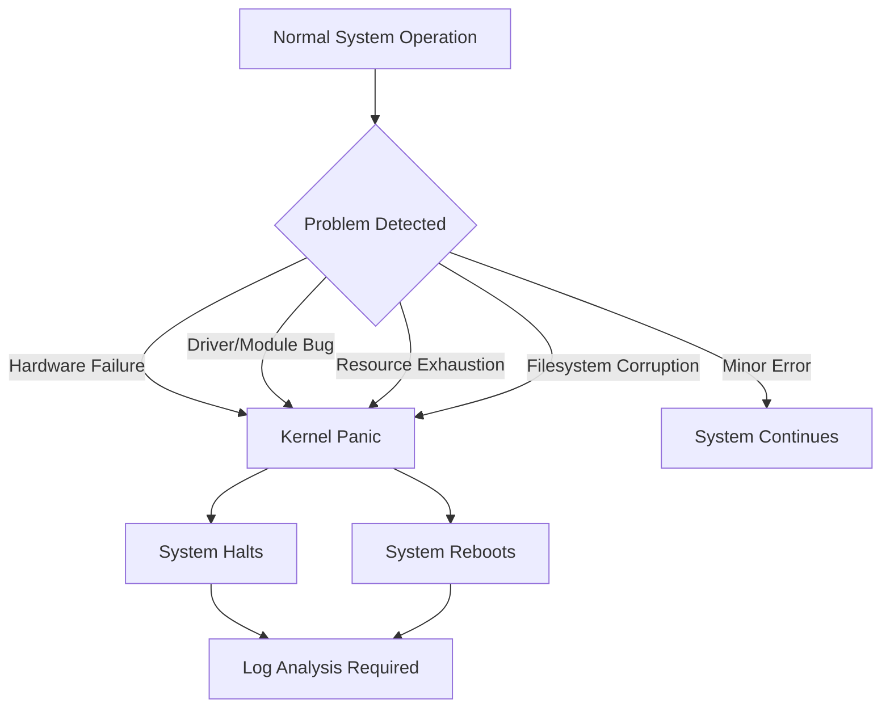

# Debian Kernel Panics

## Introduction

A kernel panic is one of the most severe errors that can occur in a Linux system like Debian. It happens when the operating system's kernel—the core part of the OS that manages hardware resources and provides essential services—encounters a critical error that it cannot recover from. Unlike application crashes that affect only a single program, a kernel panic affects the entire system, typically resulting in a system freeze or automatic reboot.

For beginners working with Debian systems, understanding kernel panics is crucial for effective troubleshooting and system maintenance. This guide will walk you through what kernel panics are, why they occur, how to diagnose them, and most importantly, how to resolve and prevent them.

## Understanding Kernel Panics

### What Exactly Is a Kernel Panic?

A kernel panic occurs when the Linux kernel detects an internal error so severe that continuing to run would risk system integrity or data corruption. Think of it as the kernel's last resort emergency brake—rather than continuing to operate in an unstable state, the system halts operations.

When a kernel panic occurs on a Debian system, you might see:

1. A screen filled with error messages (often called a "stack trace")
2. A system that has completely frozen
3. An automatic reboot (if configured)
4. Error messages in system logs after reboot

### Common Causes of Kernel Panics in Debian

Kernel panics don't happen without a reason. Here are the most common causes:

1. **Hardware Issues**:
   - Faulty RAM modules
   - Overheating components
   - Failing hard drives
   - Incompatible hardware

2. **Software Issues**:
   - Buggy kernel modules
   - Incompatible device drivers
   - Corrupted system files
   - Kernel version mismatches

3. **System Resource Problems**:
   - Out of memory conditions
   - Storage exhaustion
   - Resource deadlocks

Let's visualize the different paths that can lead to a kernel panic:



## Diagnosing Kernel Panics

### Capturing Panic Information

The first step in resolving kernel panics is gathering diagnostic information. Debian provides several ways to capture this data:

#### System Logs

After a reboot following a kernel panic, check the system logs using `journalctl`:

```bash
sudo journalctl -b -1 -k
```

This command shows kernel messages from the previous boot. Look for lines prefixed with "kernel:" near the end of the output.

For traditional syslog systems, you can also check:

```bash
sudo less /var/log/kern.log
sudo less /var/log/syslog
```

#### Kernel Crash Dumps

For more detailed analysis, you can configure Debian to save crash dumps using the `kdump` utility:

1. Install the necessary packages:

```bash
sudo apt update
sudo apt install kdump-tools linux-crashdump
```

2. Configure the utility:

```bash
sudo dpkg-reconfigure kdump-tools
```

3. After configuration, if a kernel panic occurs, crash dumps will be saved to `/var/crash/` for analysis.

### Reading Kernel Panic Messages

Kernel panic messages can be intimidating but contain valuable diagnostic information. Here's how to interpret them:

#### Example Kernel Panic Output

```
Kernel panic - not syncing: Fatal exception in interrupt
RIP: 0010:ffffffff81069aa1
Code: Unable to access opcode bytes at RIP 0xffffffff81069a77.
RSP: 0018:ffffffff81801db8 EFLAGS: 00000246
RAX: 0000000000000000 RBX: 0000000000000246 RCX: 0000000000000000
RDX: 0000000000000000 RSI: 0000000000000000 RDI: ffff8800b44b4c00
RBP: ffffffff81801e18 R08: 0000000000000000 R09: 0000000000000000
R10: 0000000000000000 R11: 0000000000000000 R12: 0000000000000000
R13: ffff8800b44b4c00 R14: 0000000000000000 R15: ffff88007d1a6600
FS:  0000000000000000(0000) GS:ffff88007d1a0000(0000) knlGS:0000000000000000
CS:  0010 DS: 0000 ES: 0000 CR0: 0000000080050033
CR2: 0000000000000000 CR3: 0000000001e0a000 CR4: 00000000000006f0
Call Trace:
 [<ffffffff8106ad0f>] ? __do_page_fault+0x1cf/0x500
 [<ffffffff8182fbd2>] ? page_fault+0x22/0x30
 [<ffffffff810732a5>] ? update_wall_time+0x115/0x180
 [<ffffffff81073e58>] ? tick_do_update_jiffies64+0x78/0x170
 [<ffffffff81074a01>] ? tick_check_idle+0x31/0x190
 [<ffffffff810670f7>] ? hrtimer_interrupt+0xa7/0x220
 [<ffffffff8100212a>] ? schedule+0x2a/0x80
 [<ffffffff814f7dfb>] ? acpi_idle_enter_simple+0xdb/0x110
 [<ffffffff814f7e7d>] ? acpi_idle_enter+0x1d/0x30
 [<ffffffff8100a19f>] ? cpuidle_idle_call+0xef/0x290
```

#### Key Components to Analyze:

1. **The trigger message**: "Kernel panic - not syncing: Fatal exception in interrupt"
   - This tells you the general category of the problem

2. **RIP value**: Shows the memory address where the instruction pointer was at the time of panic

3. **Register values**: RAX, RBX, etc. provide the state of CPU registers when the panic occurred

4. **Call Trace**: This is the most useful part for diagnosis—it shows the sequence of function calls that led to the panic

## Common Kernel Panic Scenarios and Solutions

Let's examine some common kernel panic scenarios in Debian systems and their solutions:

### 1. Hardware-Related Kernel Panics

#### RAM Issues

**Symptoms:**
- Random, non-reproducible kernel panics
- Errors mentioning "page allocation failure" or memory addresses

**Solution:**
```bash
# Install memtest86+
sudo apt install memtest86+

# Reboot and select memtest86+ from the GRUB menu
# Let it run for at least one full pass
```

If errors are found, replace the faulty RAM modules.

#### Storage Device Failures

**Symptoms:**
- Kernel panics during disk I/O operations
- Messages containing "I/O error" or "Buffer I/O error"

**Solution:**
```bash
# Check disk health
sudo apt install smartmontools
sudo smartctl -a /dev/sda  # Replace sda with your device
```

If SMART tests indicate failures, back up important data and replace the drive.

### 2. Driver and Module Related Panics

#### Problematic Kernel Modules

**Symptoms:**
- Panics when connecting specific hardware
- Call traces mentioning a specific module name

**Solution:**
Blacklist the problematic module:

```bash
# Create a blacklist file
sudo nano /etc/modprobe.d/blacklist-problem-module.conf

# Add the following line (replace module_name with the actual name)
blacklist module_name

# Update initramfs
sudo update-initramfs -u
```

#### Graphics Driver Issues

**Symptoms:**
- Panics on graphical login or when running GPU-intensive tasks
- References to "nouveau", "nvidia", "radeon", or "amdgpu" in panic logs

**Solution:**
Boot into recovery mode and try a different driver:

```bash
# For NVIDIA cards, try the open-source driver:
sudo apt remove --purge nvidia*
sudo apt install xserver-xorg-video-nouveau

# For AMD cards:
sudo apt remove --purge amdgpu*
sudo apt install xserver-xorg-video-radeon
```

### 3. Filesystem-Related Kernel Panics

**Symptoms:**
- Panics during filesystem operations
- Messages referring to "ext4", "btrfs", or other filesystem names

**Solution:**
Boot from a live USB and check the filesystem:

```bash
# For ext4 filesystems
sudo fsck.ext4 -f /dev/sda1  # Replace with your partition

# For btrfs
sudo apt install btrfs-progs
sudo btrfs check /dev/sda1  # Replace with your partition
```

## Preventive Measures

### Keeping Your System Updated

Regular updates help prevent kernel panics by fixing known bugs:

```bash
sudo apt update
sudo apt upgrade
sudo apt dist-upgrade
```

### Kernel Configuration

For systems that experience frequent panics, consider modifying kernel parameters in GRUB:

```bash
sudo nano /etc/default/grub
```

Add helpful parameters to `GRUB_CMDLINE_LINUX_DEFAULT`:

```
GRUB_CMDLINE_LINUX_DEFAULT="quiet splash mem=8G noapic acpi=off"
```

Then update GRUB:

```bash
sudo update-grub
```

### Set Up Kernel Crash Dumps

Configure your system to save kernel crash information for better diagnosis:

```bash
sudo apt install linux-crashdump kdump-tools
sudo dpkg-reconfigure kdump-tools
```

## Real-World Example: Troubleshooting a Production Server

Let's walk through a real-world scenario of troubleshooting a kernel panic on a Debian web server:

### The Scenario

A Debian web server hosting a busy e-commerce site suddenly starts experiencing kernel panics every few days. The panics always seem to happen during peak traffic times.

### Step 1: Gathering Information

After a reboot, we check the logs:

```bash
sudo journalctl -b -1 -k | grep -i panic -A 20
```

We discover entries like:

```
kernel: BUG: kernel NULL pointer dereference, address: 0000000000000010
kernel: #PF: supervisor write access in kernel mode
kernel: Kernel panic - not syncing: Attempted to kill init! exitcode=0x00000009
```

### Step 2: Analyzing Patterns

We notice that the panics always occur when the server load average exceeds 15, suggesting a resource issue.

### Step 3: Identifying the Cause

After further investigation using `dmesg` and `journalctl`, we discover that a specific PHP module is causing memory corruption when under heavy load.

### Step 4: Implementing the Solution

```bash
# Disable the problematic PHP module
sudo phpdismod problematic_module

# Add more swap space to handle peak loads
sudo fallocate -l 4G /swapfile
sudo chmod 600 /swapfile
sudo mkswap /swapfile
sudo swapon /swapfile
echo '/swapfile none swap sw 0 0' | sudo tee -a /etc/fstab

# Update the kernel and PHP
sudo apt update && sudo apt upgrade
```

### Result

After implementing these solutions, the server runs stably for months without any further kernel panics.

## Summary

Kernel panics are serious but manageable issues in Debian systems. By understanding their causes, knowing how to gather diagnostic information, and following the troubleshooting steps outlined in this guide, you can effectively resolve and prevent these critical system errors.

Remember these key points:

1. A kernel panic is the kernel's way of preventing system damage when it encounters a critical error
2. Common causes include hardware failures, problematic drivers, and resource exhaustion
3. System logs and crash dumps are essential for diagnosis
4. Regular system updates and proper configuration help prevent panics
5. Hardware testing is often necessary to eliminate physical causes

## Additional Resources

For further learning, consider exploring these resources:

- [Debian Wiki: Kernel Crash Dump](https://wiki.debian.org/KernelCrashDump)
- [Linux Kernel Documentation](https://www.kernel.org/doc/html/latest/)
- The `man` pages for tools like `journalctl`, `dmesg`, and `kdump-tools`

## Practice Exercises

1. Set up kernel crash dumps on a test system and analyze a sample crash report
2. Create a bootable USB with memtest86+ and run a complete memory test
3. Research common kernel parameters that can help stabilize problematic systems
4. Compare kernel panic handling between different Linux distributions and Debian

By practicing these skills in a controlled environment, you'll be well-prepared to handle real-world kernel panics when they occur.