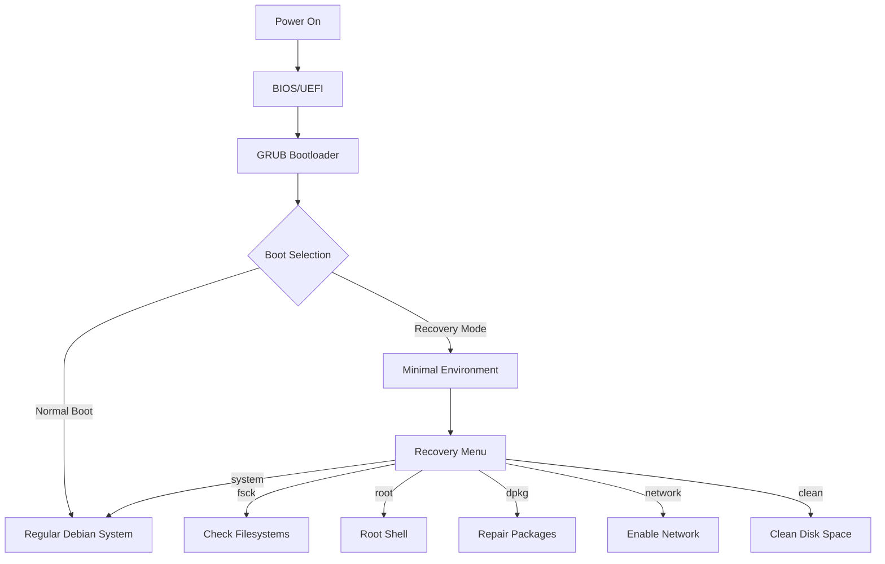

# Debian Recovery Mode

## Introduction

Debian Recovery Mode is a special boot option that allows you to troubleshoot and repair your Debian Linux system when it cannot boot normally. It provides a minimal environment with essential utilities that help you diagnose and fix various system issues, from broken package installations to file system errors.

This guide will walk you through the process of accessing Recovery Mode, understanding its options, and using it to solve common problems that might prevent your Debian system from functioning correctly.

## When to Use Recovery Mode

Recovery Mode is particularly useful in the following situations:

- Your system fails to boot normally
- You've lost your root password
- System files have been corrupted
- Package installations have broken the system
- You need to repair file system errors
- Your system needs configuration changes that can't be made in normal mode

## Accessing Recovery Mode

### Method 1: Via GRUB Menu

1. Start or restart your Debian system
2. When the GRUB boot menu appears, select the entry that contains "(recovery mode)" or press `e` to edit the normal boot entry
3. If you pressed `e`, add the word `single` to the end of the line that starts with `linux` or `linux16`, then press `F10` to boot

```bash
# Example of modified GRUB entry
linux /boot/vmlinuz-5.10.0-18-amd64 root=UUID=1234-5678 ro quiet single
```

### Method 2: From Command Line (if system can still boot)

```bash
# Reboot directly into recovery mode
sudo systemctl isolate rescue.target

# Or, to reboot the system into recovery mode
sudo systemctl rescue
```

## Understanding the Recovery Menu

When your system boots into Recovery Mode, you'll be presented with a menu that looks like this:

```
Recovery Menu (filesystem state: read-only)
===========================================

fsck       - Check all file systems
root       - Drop to root shell prompt
system     - Continue normal boot
dpkg       - Repair broken packages
network    - Enable networking
clean      - Try to make free space
```

Let's explore each of these options:

## Recovery Mode Options Explained

### 1. fsck - Check All File Systems

This option runs the File System Consistency Check utility on all your mounted file systems. It helps identify and repair disk errors that might be preventing normal boot.

```bash
# What happens when you select this option
fsck -f /dev/sda1  # Example output for your root partition
fsck 1.46.2 (28-Feb-2021)
/dev/sda1: clean, 98765/3276800 files, 1234567/13107200 blocks
```

### 2. root - Drop to Root Shell Prompt

This provides you with a shell prompt with root privileges, allowing you to manually fix system issues.

```bash
# Example commands you might run in root shell
# Check system logs
less /var/log/syslog

# Edit configuration files
nano /etc/default/grub

# Check disk usage
df -h
```

### 3. system - Continue Normal Boot

This option attempts to continue the normal boot process, useful if you've made changes and want to see if they fixed the issue.

### 4. dpkg - Repair Broken Packages

This runs package management repair tools to fix broken or interrupted package installations.

```bash
# What happens when you select this option
dpkg --configure -a
apt-get update
apt-get -f install
```

### 5. network - Enable Networking

By default, Recovery Mode disables networking for security. This option enables it, allowing you to download packages or access online resources.

```bash
# Example of what you might see after enabling networking
Temporary enabling networking...
[   OK   ] Started Network Manager.
[   OK   ] Reached target Network.
IPv4 address for eth0: 192.168.1.100
IPv6 address for eth0: fe80::1234:5678:abcd:ef01
```

### 6. clean - Try to Make Free Space

This option attempts to clean up disk space by removing unnecessary files.

```bash
# Example output when selecting this option
Cleaning up temporary files...
/tmp: removed 245 MB
/var/tmp: removed 56 MB
/var/cache/apt/archives: removed 350 MB
```

## Common Recovery Scenarios

### Scenario 1: Fixing Boot Issues with GRUB

If GRUB is misconfigured or damaged:

```bash
# Mount the root file system if it's not already mounted
mount -o remount,rw /

# Update GRUB configuration
update-grub

# Reinstall GRUB if necessary
grub-install /dev/sda  # Replace /dev/sda with your boot drive
```

### Scenario 2: Resetting a Forgotten Root Password

If you've forgotten your root password:

```bash
# From the root shell prompt
passwd root

# Enter and confirm your new password
New password: 
Retype new password: 
passwd: password updated successfully
```

### Scenario 3: Fixing Broken Package Installations

If a package installation was interrupted or caused problems:

```bash
# First enable read-write mode for the root file system
mount -o remount,rw /

# Then update package status
dpkg --configure -a

# Fix broken dependencies
apt-get -f install

# Update package lists
apt-get update

# Upgrade packages
apt-get upgrade
```

### Scenario 4: Recovering from a Full Disk

If your system partition is full:

```bash
# Check disk usage
df -h

# Find large files
find / -type f -size +100M -exec ls -lh {} \; | sort -k5 -rh

# Clean package cache
apt-get clean

# Remove old kernel packages
apt-get autoremove
```

## Advanced Recovery Techniques

### Using chroot to Repair a System

For more severe issues, you might need to use a live CD/USB and chroot into your system:

```bash
# From a live environment
# Mount your root filesystem
mount /dev/sda1 /mnt

# Mount necessary virtual filesystems
mount --bind /dev /mnt/dev
mount --bind /proc /mnt/proc
mount --bind /sys /mnt/sys

# Enter the chroot environment
chroot /mnt

# Now you can perform repairs as if you were booted into the system
update-grub
apt-get update
```

### Recovering Files Before Reinstalling

If you need to perform a full reinstall but want to save your data:

```bash
# From recovery mode or live environment
# Mount a backup device
mount /dev/sdb1 /mnt/backup

# Back up important data
cp -r /home/username /mnt/backup/
cp /etc/fstab /mnt/backup/
cp -r /var/www /mnt/backup/
```

## Understanding Recovery Mode Boot Process

The following diagram shows how Recovery Mode fits into the Debian boot process:



## Troubleshooting Recovery Mode Issues

### Recovery Mode Not Appearing in GRUB Menu

If you can't see the recovery mode option:

```bash
# Edit GRUB configuration
nano /etc/default/grub

# Make sure this line is commented out or removed:
# GRUB_DISABLE_RECOVERY="true"

# Update GRUB after making changes
update-grub
```

### Unable to Mount Root Filesystem

If you see errors about mounting the root filesystem:

```bash
# Boot parameters to try (by editing GRUB entry)
# Add one of these to the linux line:
rootdelay=90
# or
fsck.mode=force
```

### Emergency Mode or Maintenance Mode

If you end up in emergency mode instead of recovery mode:

```bash
# Check system logs
journalctl -xb

# Check system state
systemctl list-units --failed

# Try to continue boot
systemctl default
```

## Summary

Debian Recovery Mode is an essential tool for system administrators and even ordinary users to troubleshoot and repair their Debian systems. By providing access to a minimal environment with root privileges, it allows you to:

- Repair file system errors
- Fix broken package installations
- Reset passwords
- Edit configuration files
- Recover from boot failures

Understanding how to access and use Recovery Mode is a crucial skill for anyone maintaining a Debian system, as it can save you from having to perform a full reinstallation when problems occur.

## Additional Resources

- Debian Wiki: System Recovery
- The Debian Administrator's Handbook
- GRUB2 Documentation
- Linux File System Hierarchy Standard

## Practice Exercises

1. Boot your Debian system into Recovery Mode and explore the available options without making any changes.
2. Create a backup of your GRUB configuration, then practice editing it to customize your boot options.
3. Simulate a full disk scenario by filling a test partition, then use Recovery Mode to clean up space.
4. Set up a test virtual machine with Debian, intentionally break a package installation, and then fix it using Recovery Mode.