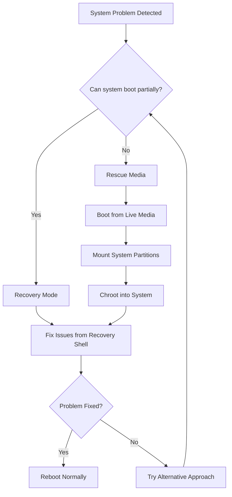

# Debian System Rescue

When your Debian system refuses to boot or encounters serious problems, you don't need to panic or reinstall immediately. Linux systems, including Debian, provide various rescue options that can help you recover your system, salvage your data, and fix boot issues.

## Introduction to System Rescue

System rescue in Debian involves using special boot methods and recovery tools to access and repair a system that has become unbootable or severely compromised. Common scenarios that might require system rescue include:

- Failed system upgrades
- Broken package dependencies
- Corrupted boot files
- Lost or forgotten passwords
- Hardware driver issues
- File system corruption
- Accidentally deleted system files

The goal of system rescue is to regain access to your system, diagnose the problem, and perform repairs without data loss.

## Debian Rescue Methods Overview



## Essential Rescue Tools and Media

### Debian Installation Media

The Debian installation media includes a rescue mode that can be used to repair a broken system.

#### Using Debian Installation Media for Rescue:

1. Boot from the Debian installation media (USB or DVD)
2. At the boot menu, select "Advanced options"
3. Choose "Rescue mode"
4. Follow the prompts to mount your system

### Debian Live Environment

A Debian Live USB can provide a fully functional operating system that runs from memory, allowing you to access your installed system's files.

#### Creating a Debian Live USB:

```bash
# On a working Linux system
sudo dd if=debian-live-11.x.x-amd64-gnome.iso of=/dev/sdX bs=4M status=progress
```

Replace `/dev/sdX` with your USB device (be extremely careful to identify the correct device).

### SystemRescue

SystemRescue is a specialized Linux distribution designed for system recovery that includes many useful tools.

## Recovery Mode

If your system can still partially boot, you can use Debian's built-in recovery mode.

### Accessing Recovery Mode:

1. Restart your computer
2. At the GRUB menu, select "Advanced options for Debian GNU/Linux"
3. Choose a kernel version followed by "(recovery mode)"
4. When the Recovery Menu appears, select "Drop to root shell prompt"

```
┌─────────────────────┤ Recovery Menu ├─────────────────────┐
│                                                           │
│    fsck             Check all file systems                │
│    root             Drop to root shell prompt             │
│    network          Enable networking                     │
│    system-summary   System summary                        │
│    dpkg             Repair broken packages                │
│    grub             Update grub bootloader                │
│                                                           │
│                                                           │
│                                                           │
│                                                           │
│                          <Ok>                             │
│                                                           │
└───────────────────────────────────────────────────────────┘
```

## Fixing Common Boot Issues

### Repairing GRUB Bootloader

If GRUB is damaged or missing, you can reinstall it:

```bash
# After booting into rescue mode and mounting your system
mount -o remount,rw /
mount --all

# For BIOS systems
grub-install /dev/sda
update-grub

# For UEFI systems
mount /dev/sda1 /boot/efi  # Mount EFI partition if not auto-mounted
grub-install --target=x86_64-efi --efi-directory=/boot/efi
update-grub
```

### Fixing File System Issues

File system corruption can prevent booting. Use fsck to check and repair:

```bash
# Check root filesystem (run from rescue mode or live environment)
# Do NOT run fsck on mounted filesystems!
fsck -f /dev/sda2  # Replace with your root partition
```

## Using Chroot to Access and Repair Your System

Chroot allows you to "change root" into your installed system from a rescue environment, letting you work as if you've booted normally.

### Setting Up a Chroot Environment:

```bash
# From a live environment:
sudo -i  # Become root

# Mount your root filesystem
mount /dev/sda2 /mnt  # Replace sda2 with your root partition

# Mount essential virtual filesystems
mount --bind /dev /mnt/dev
mount --bind /dev/pts /mnt/dev/pts
mount --bind /proc /mnt/proc
mount --bind /sys /mnt/sys

# If you have a separate boot partition
mount /dev/sda1 /mnt/boot  # Replace sda1 with your boot partition

# If you use UEFI
mount /dev/sda1 /mnt/boot/efi  # Replace sda1 with your EFI partition

# Change root into your system
chroot /mnt /bin/bash

# Set a proper PATH
export PATH=/usr/local/sbin:/usr/local/bin:/usr/sbin:/usr/bin:/sbin:/bin
```

### Common Repair Tasks in Chroot

#### Fixing Package Issues

```bash
# Update package database
apt update

# Fix broken packages
apt --fix-broken install

# Reconfigure unconfigured packages
dpkg --configure -a

# Reinstall a critical package
apt reinstall systemd
```

#### Recovering from Failed Upgrades

```bash
# Complete interrupted upgrades
apt upgrade

# If a distribution upgrade failed
apt dist-upgrade
```

#### Resetting a Forgotten Password

```bash
# Change root password
passwd

# Change user password
passwd username
```

## Rescuing Data from an Unbootable System

If your system is beyond repair, prioritize data recovery:

```bash
# Mount your home directory to an external drive
mount /dev/sda2 /mnt  # Your root or home partition
mount /dev/sdb1 /media/backup  # Your backup drive

# Copy your data
cp -av /mnt/home/username /media/backup/
```

## Using Systemd's Emergency and Rescue Targets

Systemd provides special targets for system recovery:

### Emergency Target:
- Most minimal environment
- Only root filesystem mounted as read-only
- No services started
- Emergency shell on main console

To boot into emergency mode, add `systemd.unit=emergency.target` to the kernel command line in GRUB.

### Rescue Target:
- Basic system initialization
- Root filesystem mounted read-write
- Some essential services started
- Rescue shell on main console

To boot into rescue mode, add `systemd.unit=rescue.target` to the kernel command line in GRUB.

## Step-by-Step Recovery Scenarios

### Scenario 1: System Won't Boot Due to Missing Init

If you receive an error like `Cannot find /sbin/init`, follow these steps:

1. Boot into rescue mode
2. Check if the file exists:
   ```bash
   ls -l /sbin/init
   ```
3. If missing, it may be a symlink to systemd:
   ```bash
   apt install --reinstall systemd
   ln -sf /lib/systemd/systemd /sbin/init
   ```
4. Update your initramfs:
   ```bash
   update-initramfs -u -k all
   ```
5. Reboot

### Scenario 2: Restoring a Deleted System File

If you accidentally deleted an important system file:

1. Boot with rescue media
2. Mount your system and chroot into it
3. Determine which package provides the file:
   ```bash
   dpkg -S /path/to/missing/file
   ```
4. Reinstall the package:
   ```bash
   apt install --reinstall package-name
   ```

### Scenario 3: Recovering from a Failed Kernel Update

If a kernel update renders your system unbootable:

1. Boot into an older kernel from the GRUB menu
2. Remove the problematic kernel:
   ```bash
   apt remove linux-image-x.x.x-x-amd64
   update-grub
   ```

## Preventive Measures

### Creating System Backups

Regular backups are essential for quick recovery:

```bash
# Back up system configuration
sudo rsync -aAXv --exclude={"/dev/*","/proc/*","/sys/*","/tmp/*","/run/*","/mnt/*","/media/*","/lost+found"} / /path/to/backup/folder
```

### Setting Up Timeshift

Timeshift is like System Restore for Linux:

```bash
# Install Timeshift
apt install timeshift

# Create a snapshot (through GUI or CLI)
timeshift --create --comments "Before system upgrade"
```

### Keeping a Rescue USB Handy

Always prepare a rescue USB before you need it:

```bash
# Install the live-build tools
apt install live-build

# Create a custom rescue image (advanced)
lb config
lb build
```

## Debian Rescue Commands Reference

| Command | Description | Example Usage |
|---------|-------------|--------------|
| `fsck` | Check and repair filesystems | `fsck -f /dev/sda2` |
| `mount` | Mount filesystems | `mount /dev/sda2 /mnt` |
| `chroot` | Change root directory | `chroot /mnt /bin/bash` |
| `grub-install` | Install GRUB bootloader | `grub-install /dev/sda` |
| `update-grub` | Update GRUB configuration | `update-grub` |
| `dpkg --configure` | Configure unconfigured packages | `dpkg --configure -a` |
| `update-initramfs` | Update initramfs image | `update-initramfs -u -k all` |
| `blkid` | Display block device attributes | `blkid /dev/sda2` |
| `lsblk` | List block devices | `lsblk -f` |

## Summary

Debian provides multiple tools and methods to rescue your system when problems occur. Rather than immediately reinstalling, you can use these techniques to diagnose and repair issues, potentially saving your data and configuration. The key points to remember are:

1. Have rescue media ready before you need it
2. Know how to access recovery mode and use chroot
3. Understand the basic repair commands for common issues
4. Always back up important data regularly
5. Document your system configuration for easier recovery

## Additional Resources

- [Debian Administrator's Handbook](https://debian-handbook.info/)
- [Debian Wiki: System Recovery](https://wiki.debian.org/SystemRecovery)
- [Debian Wiki: Rescue Cheatsheet](https://wiki.debian.org/RescueCheatsheet)

## Exercises

1. Create a Debian rescue USB and practice booting from it.
2. Set up a virtual machine, break the bootloader intentionally, and repair it using the techniques in this guide.
3. Practice creating and restoring from Timeshift snapshots.
4. Identify your system's partitions and create a reference sheet with their device names and mount points.
5. Document your system's hardware configuration for driver troubleshooting.