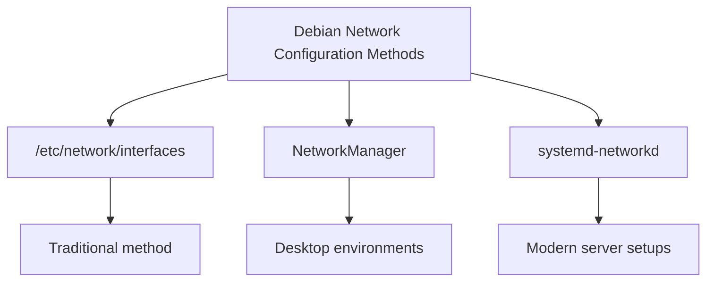

# Debian Network Issues

## Introduction

Network connectivity issues are among the most common problems faced by Linux users, especially beginners. When your Debian system can't connect to the internet or local network, it can be frustrating and prevent you from performing essential tasks. This guide aims to help you understand, diagnose, and resolve common network issues in Debian-based systems.

## Understanding Debian Networking Basics

Before diving into troubleshooting, let's understand how networking works in Debian:

### Network Components

Debian's networking system consists of several key components:

1. **Network Interfaces** - Physical (like `eth0`, `wlan0`) or virtual (like `lo` for loopback)
2. **Network Configuration Files** - Located mainly in `/etc/network/`
3. **Network Services** - Like `NetworkManager`, `systemd-networkd`
4. **DNS Resolution** - Managed by `/etc/resolv.conf`

### Network Configuration Method

Debian systems typically use one of these methods to configure networking:



## Common Network Issues and Solutions

### 1. No Network Connectivity

#### Symptoms:
- Cannot access the internet
- Cannot ping other devices on the network
- Network icon shows disconnected

#### Diagnostic Steps:

First, check if your network interface is up:

```bash
ip link show
```

Example output:
```
1: lo: <LOOPBACK,UP,LOWER_UP> mtu 65536 qdisc noqueue state UNKNOWN mode DEFAULT group default qlen 1000
    link/loopback 00:00:00:00:00:00 brd 00:00:00:00:00:00
2: eth0: <BROADCAST,MULTICAST> mtu 1500 qdisc noop state DOWN mode DEFAULT group default qlen 1000
    link/ether 00:0c:29:b5:5f:8e brd ff:ff:ff:ff:ff:ff
```

If you see `state DOWN` for your interface (like `eth0` above), try bringing it up:

```bash
sudo ip link set eth0 up
```

Check for IP address assignment:

```bash
ip addr show
```

If your interface doesn't have an IP address, you can try requesting one via DHCP:

```bash
sudo dhclient eth0
```

### 2. DNS Resolution Issues

#### Symptoms:
- Can ping IP addresses (e.g., `8.8.8.8`) but not domain names (e.g., `google.com`)
- Error messages like "Temporary failure in name resolution"

#### Solution:

Check your DNS configuration:

```bash
cat /etc/resolv.conf
```

You should see nameserver entries like:
```
nameserver 8.8.8.8
nameserver 8.8.4.4
```

If these are missing or incorrect, you can manually add them:

```bash
echo "nameserver 8.8.8.8" | sudo tee /etc/resolv.conf
echo "nameserver 1.1.1.1" | sudo tee -a /etc/resolv.conf
```

For a more permanent solution, consider editing the NetworkManager configuration:

```bash
sudo nano /etc/NetworkManager/conf.d/dns.conf
```

Add the following:
```
[main]
dns=none

[global-dns-domain-*]
servers=8.8.8.8,1.1.1.1
```

Then restart NetworkManager:

```bash
sudo systemctl restart NetworkManager
```

### 3. Wi-Fi Connection Issues

#### Symptoms:
- Cannot connect to wireless networks
- Wi-Fi adapter not detected
- Connection drops frequently

#### Diagnostic Steps:

Check if your wireless interface is recognized:

```bash
sudo iw dev
```

If no wireless interfaces are shown, check if the driver is loaded:

```bash
lspci -k | grep -A 3 Network
```

For missing drivers, you might need to install firmware packages:

```bash
sudo apt update
sudo apt install firmware-iwlwifi  # For Intel wireless cards
# OR
sudo apt install firmware-realtek  # For Realtek wireless cards
```

After installing firmware, reload the kernel module:

```bash
sudo modprobe -r iwlwifi  # Replace with your module name
sudo modprobe iwlwifi
```

### 4. Static IP Configuration

Sometimes you need to set a static IP. Edit the interfaces file:

```bash
sudo nano /etc/network/interfaces
```

Add or modify the configuration for your interface:

```
# The primary network interface
auto eth0
iface eth0 inet static
    address 192.168.1.100
    netmask 255.255.255.0
    gateway 192.168.1.1
    dns-nameservers 8.8.8.8 8.8.4.4
```

Apply the changes:

```bash
sudo systemctl restart networking
```

### 5. NetworkManager Issues

If you're using NetworkManager (common in desktop environments), you might encounter configuration conflicts.

Reset NetworkManager:

```bash
sudo systemctl restart NetworkManager
```

If that doesn't help, check for conflicting services:

```bash
sudo systemctl status networking
sudo systemctl status systemd-networkd
```

Disable conflicting services:

```bash
sudo systemctl stop networking
sudo systemctl disable networking
sudo systemctl enable NetworkManager
sudo systemctl start NetworkManager
```

## Advanced Troubleshooting Techniques

### Network Diagnostic Commands

These commands will help you diagnose network issues:

| Command | Purpose |
|---------|---------|
| `ping` | Test basic connectivity |
| `traceroute` | Show the route packets take |
| `mtr` | Combine ping and traceroute |
| `netstat` or `ss` | Display network connections |
| `dig` or `nslookup` | Test DNS resolution |
| `ip route` | Show routing table |

Example of using `mtr` to diagnose connection issues:

```bash
sudo apt install mtr  # Install if needed
mtr google.com
```

Example output:
```
                                      My traceroute  [v0.93]
debian (192.168.1.100)                                   2023-05-15T20:04:01+0000
Keys:  Help   Display mode   Restart statistics   Order of fields   quit
                                       Packets               Pings
 Host                                Loss%   Snt   Last   Avg  Best  Wrst StDev
 1. router.home                       0.0%    10    0.3   0.4   0.3   0.5   0.1
 2. 142.250.191.78                    0.0%    10   10.1  10.3   9.8  11.2   0.4
 3. 142.251.49.78                     0.0%    10   10.3  10.5  10.1  10.9   0.3
 4. google.com                        0.0%     9   10.2  10.6  10.1  11.4   0.5
```

### Analyzing Network Traffic

For deeper analysis, use `tcpdump`:

```bash
sudo apt install tcpdump
sudo tcpdump -i eth0 -n
```

To analyze specific traffic:

```bash
sudo tcpdump -i eth0 port 53  # DNS traffic
```

## Practical Examples

### Example 1: Troubleshooting a Connection Issue

Scenario: Your Debian system shows network interfaces but cannot connect to the internet.

Systematic approach:

1. Check physical connectivity:
   ```bash
   # Look for link status
   ip link show eth0
   ```

2. Check IP addressing:
   ```bash
   ip addr show eth0
   ```

3. Check routing:
   ```bash
   ip route
   ```

4. Test local connectivity:
   ```bash
   ping 192.168.1.1  # Your default gateway
   ```

5. Test internet connectivity:
   ```bash
   ping 8.8.8.8
   ```

6. Test DNS resolution:
   ```bash
   ping google.com
   ```

7. If steps 1-5 work but step 6 fails, fix DNS:
   ```bash
   echo "nameserver 8.8.8.8" | sudo tee /etc/resolv.conf
   ```

### Example 2: Setting Up a Reliable Network Configuration

For a stable server configuration, you might want to use systemd-networkd:

1. Create a network configuration file:
   ```bash
   sudo nano /etc/systemd/network/20-wired.network
   ```

2. Add the following content:
   ```
   [Match]
   Name=eth0

   [Network]
   DHCP=yes
   # Or for static IP:
   # Address=192.168.1.100/24
   # Gateway=192.168.1.1
   # DNS=8.8.8.8
   ```

3. Enable and start systemd-networkd:
   ```bash
   sudo systemctl enable systemd-networkd
   sudo systemctl start systemd-networkd
   ```

## Firewall Configuration

Debian's default firewall, `iptables` (or the newer `nftables`), might block connections. Check and adjust rules:

```bash
# View current rules
sudo iptables -L

# Allow incoming SSH connections
sudo iptables -A INPUT -p tcp --dport 22 -j ACCEPT

# Save rules permanently
sudo apt install iptables-persistent
sudo netfilter-persistent save
```

## Summary

Network issues in Debian can stem from various sources, including hardware problems, configuration errors, driver issues, or service conflicts. The key to resolving these issues is a systematic approach:

1. Check physical connections
2. Verify interface status
3. Check IP configuration
4. Test basic connectivity
5. Examine DNS settings
6. Look for service conflicts
7. Check firewall rules

Remember that Debian offers multiple ways to configure networking, and conflicts between these methods can cause problems. Standardizing on one approach (NetworkManager for desktops, systemd-networkd for servers) can help prevent issues.

## Additional Resources

- [Debian Wiki: NetworkConfiguration](https://wiki.debian.org/NetworkConfiguration)
- [Debian Handbook: Networking](https://debian-handbook.info/browse/stable/sect.network-config.html)
- [Linux Command Library](https://linuxcommandlibrary.com/basics/network)

## Exercises

1. Use the `ip` command to identify all network interfaces on your system.
2. Configure your system to use Google's DNS servers (8.8.8.8 and 8.8.4.4).
3. Use `tcpdump` to capture DNS traffic on your system when you perform a `ping google.com`.
4. Create a configuration to automatically connect to a specific Wi-Fi network at boot.
5. Set up a static IP address for your system using both the traditional method and systemd-networkd.