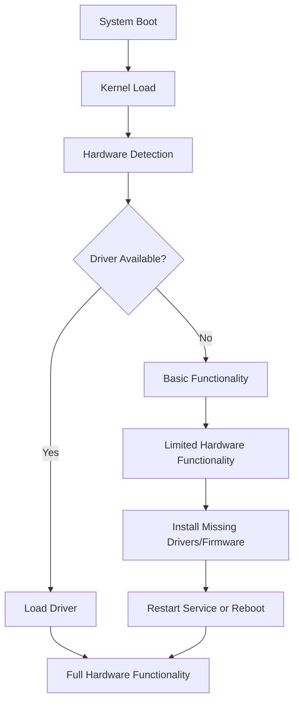

# Debian Hardware Problems

## Introduction

Hardware compatibility and configuration issues are common challenges when working with Debian Linux. Unlike proprietary operating systems that come with extensive driver support, Debian relies on open-source drivers that may not always provide complete functionality for all hardware components. This guide will help you identify, diagnose, and resolve common hardware problems in Debian systems.

## Common Hardware Issues in Debian

### 1. Graphics Card Problems

Graphics issues are among the most frequently encountered hardware problems in Debian systems, often manifesting as:

- Black screens during boot
- Low resolution displays
- Screen tearing or artifacts
- System freezes
- Missing 3D acceleration

#### Identifying Your Graphics Hardware

Before troubleshooting, you need to identify your graphics hardware:

```bash
lspci | grep -i vga
```

Example output:
```
01:00.0 VGA compatible controller: NVIDIA Corporation GA104 [GeForce RTX 3070] (rev a1)
```

#### Troubleshooting NVIDIA Graphics

For NVIDIA cards, you'll typically need to install proprietary drivers:

```bash
# Update package lists
sudo apt update

# Install nvidia drivers
sudo apt install nvidia-driver
```

If you encounter issues with the proprietary drivers, you can switch to the open-source Nouveau driver:

```bash
sudo apt install xserver-xorg-video-nouveau
```

#### Troubleshooting AMD Graphics

For AMD graphics, the open-source driver is usually included with Debian, but you might need firmware:

```bash
sudo apt install firmware-amd-graphics
```

For newer AMD cards, you might need to add non-free repositories:

```bash
# Add non-free to sources
sudo sed -i 's/main/main non-free contrib/g' /etc/apt/sources.list

# Update and install firmware
sudo apt update
sudo apt install firmware-linux firmware-linux-nonfree
```

### 2. Wi-Fi Connection Problems

Wi-Fi issues are another common hardware problem in Debian systems.

#### Identifying Your Wireless Hardware

```bash
lspci | grep -i wireless
# or
lspci | grep -i network
# or for USB devices
lsusb | grep -i wireless
```

Example output:
```
03:00.0 Network controller: Intel Corporation Wi-Fi 6 AX200 (rev 1a)
```

#### Installing Missing Firmware

Many Wi-Fi adapters require non-free firmware:

```bash
sudo apt install firmware-iwlwifi   # For Intel wireless cards
sudo apt install firmware-realtek    # For Realtek wireless cards
sudo apt install firmware-atheros    # For Atheros wireless cards
sudo apt install firmware-brcm80211  # For Broadcom wireless cards
```

After installing firmware, restart the networking service:

```bash
sudo systemctl restart NetworkManager
# or
sudo service networking restart
```

#### Enabling Wi-Fi if Disabled

Check if Wi-Fi is blocked by rfkill:

```bash
rfkill list
```

If blocked, unblock it:

```bash
sudo rfkill unblock wifi
```

### 3. Audio Problems

Audio issues can range from no sound at all to poor quality or distorted sound.

#### Checking Audio Hardware

Identify your audio hardware:

```bash
lspci | grep -i audio
```

Example output:
```
00:1f.3 Audio device: Intel Corporation Comet Lake PCH cAVS
```

#### Basic Audio Troubleshooting

Check if your sound is muted:

```bash
alsamixer
```

Press F6 to select your sound card, and use arrow keys to adjust volume levels.

Install PulseAudio volume control for a graphical interface:

```bash
sudo apt install pavucontrol
```

Then run `pavucontrol` to access the audio mixer.

#### Restarting Audio Services

```bash
# Restart PulseAudio
pulseaudio -k
pulseaudio --start

# Restart ALSA
sudo alsa force-reload
```

### 4. Printer Setup Issues

Debian uses CUPS (Common Unix Printing System) for printer management.

#### Installing CUPS

```bash
sudo apt install cups cups-client cups-filters
```

#### Starting CUPS Service

```bash
sudo systemctl enable cups
sudo systemctl start cups
```

#### Adding a Printer

For most modern printers, you can use the CUPS web interface:

1. Open a browser and navigate to http://localhost:631
2. Click "Administration" then "Add Printer"
3. Enter your system credentials when prompted
4. Follow the wizard to set up your printer

For specific printer drivers, you might need:

```bash
sudo apt install printer-driver-gutenprint  # For many common printers
sudo apt install printer-driver-hpcups      # For HP printers
```

## Hardware Detection Tools

Debian provides several tools to help diagnose hardware issues:

### The `lshw` Command

The `lshw` (list hardware) command provides detailed information about your hardware configuration:

```bash
# Install lshw
sudo apt install lshw

# Run lshw with GUI
sudo lshw -gui

# Or in terminal with nice formatting
sudo lshw -short
```

Example output:
```
H/W path         Device     Class       Description
=======================================================
                             system      Computer
/0                           bus         Motherboard
/0/0                         processor   Intel(R) Core(TM) i7-10750H
/0/0/0                       memory      L1 cache
/0/0/1                       memory      L2 cache
/0/1                         memory      16GiB System Memory
```

### The `hwinfo` Command

`hwinfo` provides even more detailed hardware information:

```bash
# Install hwinfo
sudo apt install hwinfo

# Get summary
hwinfo --short

# Full info (very verbose)
hwinfo
```

### The `inxi` Command

`inxi` is a command-line system information script:

```bash
# Install inxi
sudo apt install inxi

# Basic system info
inxi -Fxz
```

Example output:
```
System:
  Host: debian Kernel: 5.10.0-20-amd64 x86_64 bits: 64
  Desktop: GNOME 3.38.5 Distro: Debian GNU/Linux 11 (bullseye)
Machine:
  Type: Laptop System: Dell product: XPS 15 9500
  Mobo: Dell model: 0F3CW8 v: A00 serial: <superuser required>
  UEFI: Dell v: 1.13.0 date: 07/20/2021
```

## Managing Hardware Drivers

### Kernel Modules

Kernel modules are drivers that can be loaded and unloaded without rebooting.

#### Listing Loaded Modules

```bash
lsmod
```

#### Loading a Module

```bash
sudo modprobe module_name
```

#### Unloading a Module

```bash
sudo modprobe -r module_name
```

#### Making Module Settings Permanent

To load a module at boot:

```bash
echo "module_name" | sudo tee -a /etc/modules
```

To blacklist a module:

```bash
echo "blacklist module_name" | sudo tee -a /etc/modprobe.d/blacklist.conf
```

### Finding Missing Firmware

The `dmesg` command can help identify missing firmware:

```bash
dmesg | grep -i firmware
```

Example output indicating missing firmware:
```
[    2.345678] iwlwifi 0000:00:14.3: firmware: failed to load iwlwifi-QuZ-a0-hr-b0-59.ucode
```

## Hardware-Specific Troubleshooting

### 1. Laptop Function Keys

Many laptops have special function keys (Fn keys) for controlling brightness, volume, etc. These might not work out of the box.

Install tools for function key support:

```bash
sudo apt install acpi acpid
sudo systemctl enable acpid
sudo systemctl start acpid
```

### 2. Touchpad Issues

For laptops with touchpad problems:

```bash
# Install synaptics driver
sudo apt install xserver-xorg-input-synaptics
```

Create a configuration file:

```bash
sudo mkdir -p /etc/X11/xorg.conf.d
```

Then create `/etc/X11/xorg.conf.d/70-synaptics.conf` with:

```
Section "InputClass"
  Identifier "touchpad"
  Driver "synaptics"
  MatchIsTouchpad "on"
  Option "TapButton1" "1"
  Option "TapButton2" "3"
  Option "TapButton3" "2"
  Option "VertEdgeScroll" "on"
  Option "VertTwoFingerScroll" "on"
  Option "HorizEdgeScroll" "on"
  Option "HorizTwoFingerScroll" "on"
  Option "CircularScrolling" "on"
  Option "PalmDetect" "1"
  Option "PalmMinWidth" "8"
  Option "PalmMinZ" "100"
EndSection
```

### 3. Power Management Issues

For laptops with battery or power management issues:

```bash
# Install power management tools
sudo apt install tlp tlp-rdw

# Start and enable the service
sudo systemctl enable tlp
sudo systemctl start tlp
```

## Kernel-Related Hardware Issues

Sometimes hardware problems are related to the Linux kernel version.

### Checking Current Kernel

```bash
uname -r
```

Example output:
```
5.10.0-20-amd64
```

### Installing a Different Kernel

For newer hardware, a newer kernel might provide better support:

```bash
# Update package lists
sudo apt update

# Install the backports repository
sudo apt install -t bullseye-backports linux-image-amd64
```

After installing a new kernel, reboot to use it:

```bash
sudo reboot
```

## Using a Live USB for Hardware Testing

If you're having severe hardware compatibility issues, create a live USB with a newer Debian version:

1. Download the latest Debian ISO from the official website
2. Use a tool like Balena Etcher or dd to create a bootable USB
3. Boot from the USB and test if your hardware works correctly
4. If it works, consider upgrading your installed system

## Visualizing the Hardware Detection Process

The following diagram illustrates how Debian detects and configures hardware:



## Summary

Troubleshooting hardware issues in Debian requires:

1. Properly identifying your hardware
2. Understanding which drivers or firmware are needed
3. Installing the appropriate packages
4. Configuring the system correctly
5. Testing and verifying functionality

Remember that non-free firmware is often required for full hardware functionality, especially for wireless cards, graphics cards, and some printers. While Debian's default installation prioritizes free software, you can add non-free repositories to gain access to proprietary firmware when necessary.

## Additional Resources

- [Debian Wiki Hardware Page](https://wiki.debian.org/Hardware)
- [Debian User Forums](https://forums.debian.net/)
- [The Debian Administrator's Handbook](https://debian-handbook.info/)

## Practice Exercises

1. Use the commands presented in this guide to create an inventory of all hardware components in your system.
2. Identify any missing drivers or firmware for your hardware and install them.
3. Create a simple shell script that checks for common hardware issues and reports them.
4. Set up a printer on your Debian system using CUPS.
5. Configure power management for optimal battery life on a Debian laptop.