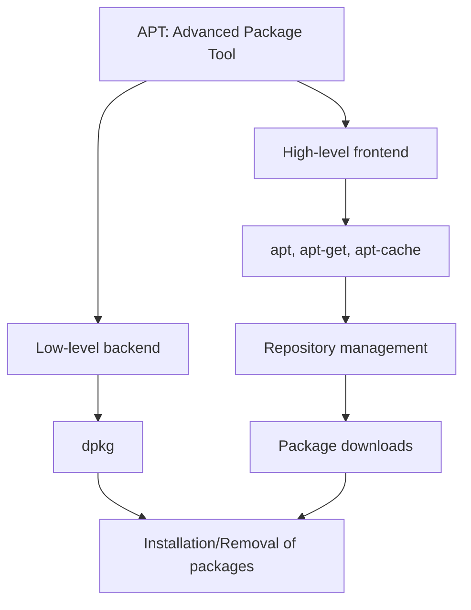
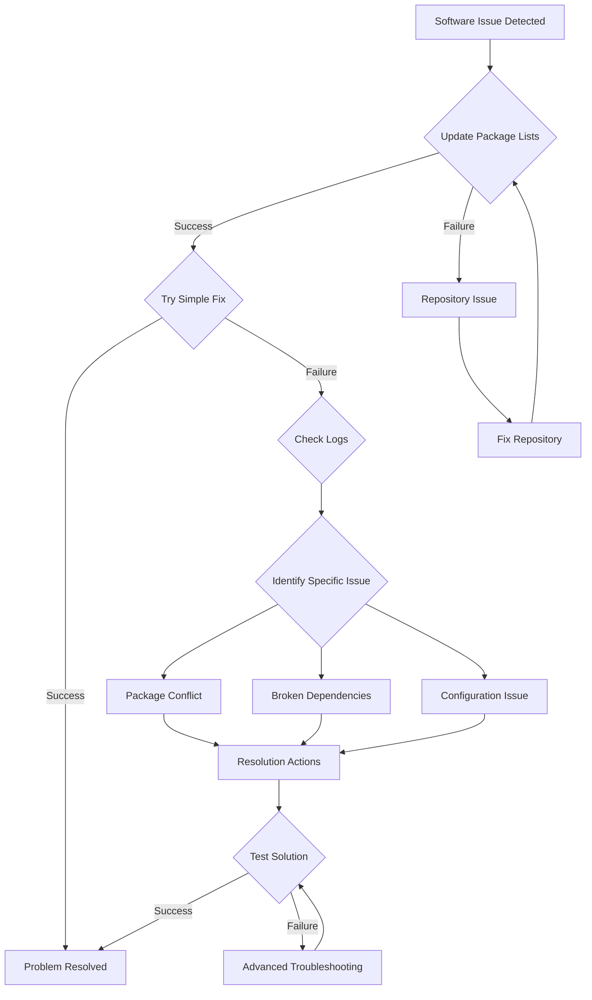

# Debian Software Troubleshooting

## Introduction

Debian is one of the most reliable Linux distributions available, but like any operating system, software issues can occur. Understanding how to diagnose and fix these problems is an essential skill for any Debian user. This guide will walk you through common software issues and their solutions, focusing on the package management system that forms the backbone of software installation and maintenance in Debian.

Whether you're facing broken packages, dependency problems, or installation failures, this guide will provide you with the knowledge and tools to resolve these issues effectively. We'll cover everything from basic APT commands to advanced troubleshooting techniques.

## Understanding Debian's Package Management System

Before diving into troubleshooting, let's understand how Debian's package management works:



Debian uses a two-layer package management system:
- **dpkg**: The low-level tool that handles the direct installation and removal of `.deb` package files
- **APT** (Advanced Package Tool): The high-level interface that handles dependencies, repository management, and upgrades

## Common Software Issues and Solutions

### 1. Fixing Broken Packages

One of the most common issues is broken packages that cause errors during installation or updates.

#### Symptoms:
- Error messages containing phrases like "broken packages," "unmet dependencies," or "packages could not be installed"
- Failed installations or upgrades
- System unable to install new software

#### Solution:

Try these commands in sequence until the issue is resolved:

```bash
# Update the package lists
sudo apt update

# Fix broken packages
sudo apt --fix-broken install

# Configure unconfigured packages
sudo dpkg --configure -a

# Force all packages to re-install dependencies
sudo apt-get -f install
```

**Example:**

Input:
```bash
sudo apt install firefox
```

Output:
```
Reading package lists... Done
Building dependency tree... Done
Some packages could not be installed. This may mean that you have
requested an impossible situation or if you are using the unstable
distribution that some required packages have not yet been created
or been moved out of Incoming.
The following information may help to resolve the situation:

The following packages have unmet dependencies:
 firefox : Depends: libgtk-3-0 (>= 3.24.0) but it is not going to be installed
E: Unable to correct problems, you have held broken packages.
```

To fix this issue:

Input:
```bash
sudo apt --fix-broken install
```

Output:
```
Reading package lists... Done
Building dependency tree... Done
Correcting dependencies... Done
The following additional packages will be installed:
  libgtk-3-0
Suggested packages:
  gtk-3-examples
The following NEW packages will be installed:
  libgtk-3-0
0 upgraded, 1 newly installed, 0 to remove and 0 not upgraded.
Need to get 2,501 kB of archives.
After this operation, 8,436 kB of additional disk space will be used.
Do you want to continue? [Y/n] y
...
```

### 2. Resolving Package Conflicts

Package conflicts occur when different packages require incompatible versions of the same dependency.

#### Solution:

```bash
# List all packages with their dependencies
apt-cache rdepends packagename

# Show detailed information about a package
apt-cache policy packagename

# Remove problematic packages (if necessary)
sudo apt remove packagename
```

### 3. Cleaning Package Cache

Over time, the APT cache can grow large and potentially contain corrupted package files.

```bash
# Clean the local repository of retrieved package files
sudo apt clean

# Remove packages that are no longer needed
sudo apt autoremove

# Only remove outdated package files
sudo apt autoclean
```

### 4. Troubleshooting APT Repository Issues

Sometimes issues with the software repositories themselves can cause problems.

#### Symptoms:
- Failed updates with errors about repositories
- "404 Not Found" errors
- GPG key errors

#### Solution:

Check and fix repository issues:

```bash
# View the repository sources
cat /etc/apt/sources.list
ls /etc/apt/sources.list.d/

# Update the repository information
sudo apt update

# Fix missing GPG keys
sudo apt-key adv --keyserver keyserver.ubuntu.com --recv-keys KEY_ID
```

Where `KEY_ID` is the missing key ID mentioned in the error message.

**Example:**

Input:
```bash
sudo apt update
```

Output:
```
Err:1 http://security.debian.org/debian-security bullseye-security InRelease
  The following signatures couldn't be verified because the public key is not available: NO_PUBKEY 112695A0E562B32A
```

To fix this:

Input:
```bash
sudo apt-key adv --keyserver keyserver.ubuntu.com --recv-keys 112695A0E562B32A
```

Output:
```
Executing: /tmp/apt-key-gpghome.aBcDeF/gpg.1.sh --keyserver keyserver.ubuntu.com --recv-keys 112695A0E562B32A
gpg: key 112695A0E562B32A: public key "Debian Security Archive Automatic Signing Key" imported
gpg: Total number processed: 1
gpg:               imported: 1
```

### 5. Diagnosing with dpkg Logs

The dpkg logs can provide valuable information for troubleshooting:

```bash
# View recent package installation logs
less /var/log/dpkg.log

# Search for errors in the log
grep "error\|fail" /var/log/dpkg.log
```

### 6. Recovering from Failed Upgrades

If a system upgrade fails and leaves the system in an inconsistent state:

```bash
# Configure all unpacked but unconfigured packages
sudo dpkg --configure -a

# Continue a previously aborted installation
sudo apt-get dist-upgrade
```

## Advanced Troubleshooting Techniques

### 1. Reinstalling Packages

Sometimes completely reinstalling a package can resolve issues:

```bash
# Reinstall a package and its dependencies
sudo apt-get --reinstall install packagename
```

### 2. Holding and Unholding Package Versions

If you need to prevent a package from being upgraded due to compatibility issues:

```bash
# Hold a package at its current version
sudo apt-mark hold packagename

# Allow a package to be upgraded again
sudo apt-mark unhold packagename
```

### 3. Inspecting and Purging Packages

For more intensive cleanup:

```bash
# Completely remove a package and its configuration files
sudo apt-get purge packagename

# List files installed by a package
dpkg -L packagename

# Check which package a file belongs to
dpkg -S /path/to/file
```

### 4. Simulating Operations

Before making changes, you can simulate APT operations:

```bash
# Simulate an installation
sudo apt-get -s install packagename

# Show what would happen during an upgrade
sudo apt-get --dry-run upgrade
```

## Practical Examples

### Example 1: Resolving Dependency Issues During Firefox Installation

Let's say you encounter dependency problems while installing Firefox:

```bash
# Attempt to install Firefox
sudo apt install firefox
# Error: Unmet dependencies

# Update package lists
sudo apt update

# Fix broken packages
sudo apt --fix-broken install

# Try installation again
sudo apt install firefox
```

### Example 2: Fixing a Broken Apache2 Installation

If you find that Apache2 is not functioning correctly after an update:

```bash
# Check the status
systemctl status apache2
# Error: apache2.service failed

# Reconfigure the package
sudo dpkg-reconfigure apache2

# Reinstall completely
sudo apt-get purge apache2
sudo apt-get install apache2
```

### Example 3: Handling Conflicts Between Python Versions

Managing multiple Python versions can cause conflicts:

```bash
# Check installed Python packages
dpkg -l | grep python

# Fix specifically conflicting packages
sudo apt-get install python3-minimal --reinstall

# Update alternatives if needed
sudo update-alternatives --config python
```

## Debugging Process Flowchart

Here's a systematic approach to troubleshooting Debian software issues:



## Summary

Troubleshooting software issues in Debian requires understanding the package management system and a systematic approach to diagnosis and resolution. The key tools in your arsenal are:

- `apt` and `apt-get` for high-level package management
- `dpkg` for low-level package operations
- Repository management commands
- Log analysis tools

By following the steps outlined in this guide, you should be able to resolve most common software issues in Debian. Remember that the Debian community is very active and supportive, so don't hesitate to search for specific error messages online or ask for help in forums if you encounter particularly challenging problems.

## Additional Resources

1. Official Debian documentation: [https://www.debian.org/doc/](https://www.debian.org/doc/)
2. Debian User Forums: [https://forums.debian.net/](https://forums.debian.net/)
3. The Debian Administrator's Handbook: Available online
4. Man pages: `man apt`, `man dpkg`, `man sources.list`

## Exercises

1. **Practice Exercise**: Intentionally break a package installation by interrupting it, then fix the system using the commands learned.
2. **Log Analysis**: Examine your own system's `/var/log/dpkg.log` and identify recent package operations.
3. **Repository Management**: Add a new repository to your system, update the package lists, and then safely remove the repository.
4. **Dependency Tracking**: Pick a complex package like a desktop environment and map out its dependencies using `apt-cache depends`.
5. **Simulation Practice**: Use the `--dry-run` option to simulate various maintenance tasks and observe what changes would be made to your system.

Remember that practice in a safe environment (like a virtual machine) is the best way to become proficient at troubleshooting without risking your main system.