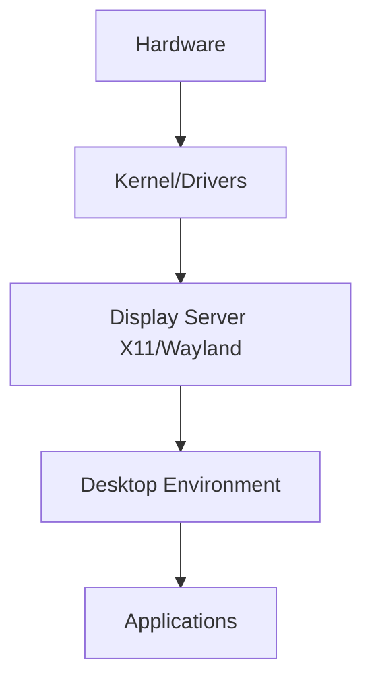

# Debian Graphical Issues

## Introduction

When working with Debian Linux, you might occasionally encounter graphical issues that prevent your system from displaying correctly. These problems can range from minor annoyances like screen flickering to critical failures where the graphical environment refuses to start. Understanding the structure of Debian's graphical stack and common troubleshooting techniques will help you diagnose and resolve these issues efficiently.

This guide targets beginners who are new to Debian and Linux systems. We'll explore the different components of Debian's graphical subsystem, identify common problems, and learn effective troubleshooting methods.

## Understanding Debian's Graphical Stack

Before diving into specific issues, it's important to understand how the graphical system in Debian works. The graphical stack consists of several layers:



1. **Hardware**: Your GPU (Graphics Processing Unit) and monitor
2. **Kernel/Drivers**: Linux kernel and specific GPU drivers
3. **Display Server**: X.Org (X11) or Wayland
4. **Desktop Environment**: GNOME, KDE, XFCE, etc.
5. **Applications**: Programs that run within the desktop environment

Issues can occur at any of these levels, so troubleshooting often involves identifying which component is causing the problem.

## Common Debian Graphical Issues

### 1. Black Screen After Boot

One of the most common issues is encountering a black screen after booting Debian.

#### Possible Causes:
- Missing or incorrect GPU drivers
- Incompatible display server settings
- Issues with the display manager

#### Troubleshooting Steps:

1. **Access a terminal**: Press `Ctrl+Alt+F2` to switch to a virtual terminal.

2. **Check system logs**:
```bash
sudo journalctl -b | grep -i error
```

3. **Verify the graphics driver**:
```bash
lspci -v | grep -A 10 VGA
```

4. **Reinstall the display manager**:
```bash
sudo apt update
sudo apt install --reinstall lightdm  # or gdm3, sddm depending on your system
```

### 2. Screen Resolution Problems

Another common issue involves incorrect screen resolution or refresh rate.

#### Troubleshooting Steps:

1. **Check available resolutions**:
```bash
xrandr
```

2. **Set a specific resolution**:
```bash
xrandr --output HDMI-1 --mode 1920x1080
```

3. **Generate a mode if your desired resolution isn't listed**:
```bash
# Create a new mode
xrandr --newmode "1920x1080_60.00" 173.00 1920 2048 2248 2576 1080 1083 1088 1120 -hsync +vsync

# Add the mode to your output
xrandr --addmode HDMI-1 "1920x1080_60.00"

# Apply the mode
xrandr --output HDMI-1 --mode "1920x1080_60.00"
```

4. **Make resolution changes permanent**:

Create or edit the file `/etc/X11/xorg.conf.d/10-monitor.conf`:

```bash
sudo mkdir -p /etc/X11/xorg.conf.d
sudo nano /etc/X11/xorg.conf.d/10-monitor.conf
```

Add the following content:

```
Section "Monitor"
    Identifier "HDMI-1"
    Option "PreferredMode" "1920x1080"
EndSection
```

### 3. Graphics Driver Issues

Graphics driver issues are a common source of problems, especially with NVIDIA and AMD GPUs.

#### Identifying Your Graphics Card:

```bash
lspci | grep -i vga
```

#### Installing Drivers:

**For Intel (open-source drivers are included by default):**
```bash
sudo apt update
sudo apt install xserver-xorg-video-intel
```

**For NVIDIA:**
```bash
sudo apt update
sudo apt install nvidia-driver
```

**For AMD:**
```bash
sudo apt update
sudo apt install firmware-amd-graphics
```

#### Testing if 3D acceleration is working:
```bash
glxinfo | grep "direct rendering"
```

If working correctly, you should see: `direct rendering: Yes`

### 4. Screen Tearing

Screen tearing appears as horizontal lines across moving content, most noticeable in videos or games.

#### Solution for Intel:

Create a file `/etc/X11/xorg.conf.d/20-intel.conf`:

```bash
sudo nano /etc/X11/xorg.conf.d/20-intel.conf
```

Add the following content:

```
Section "Device"
    Identifier "Intel Graphics"
    Driver "intel"
    Option "TearFree" "true"
EndSection
```

#### Solution for NVIDIA:

Open the NVIDIA settings:

```bash
sudo nvidia-settings
```

Navigate to "X Server Display Configuration" → "Advanced" and enable "Force Composition Pipeline" or "Force Full Composition Pipeline".

### 5. Display Manager Fails to Start

If your display manager (login screen) fails to start, you might need to reconfigure it.

```bash
sudo dpkg-reconfigure lightdm  # or gdm3, sddm
```

To check the status of your display manager:

```bash
systemctl status lightdm  # or gdm3, sddm
```

### 6. Multiple Monitor Issues

Problems with multiple monitors are common, especially when using different resolutions or orientations.

#### Basic Configuration:

```bash
xrandr --output HDMI-1 --auto --output DP-1 --auto --right-of HDMI-1
```

#### Creating a Persistent Configuration:

Use the `arandr` tool for a graphical interface:

```bash
sudo apt install arandr
arandr  # arrange screens visually and save configuration
```

This generates a script that you can add to your startup applications.

## Fixing X11 and Wayland Issues

### X11 Configuration

X11 is the traditional display server in Debian. When facing issues, you might need to modify its configuration:

1. **Generate a basic configuration file**:
```bash
sudo Xorg -configure
```

2. **Edit the generated file**:
```bash
sudo cp /root/xorg.conf.new /etc/X11/xorg.conf
sudo nano /etc/X11/xorg.conf
```

### Switching Between X11 and Wayland

Sometimes, switching between display servers can resolve issues:

**To check which display server you're using:**
```bash
echo $XDG_SESSION_TYPE
```

**To switch from Wayland to X11 in GDM:**

Edit `/etc/gdm3/daemon.conf`:

```bash
sudo nano /etc/gdm3/daemon.conf
```

Uncomment the line:
```
WaylandEnable=false
```

Then restart GDM:
```bash
sudo systemctl restart gdm3
```

## Debugging Tools and Techniques

### 1. Examining Log Files

Log files are crucial for diagnosing graphical issues:

```bash
# Check X.Org logs
cat /var/log/Xorg.0.log | grep EE  # Errors
cat /var/log/Xorg.0.log | grep WW  # Warnings

# Check system logs
journalctl -b | grep -i x11
journalctl -b | grep -i wayland
```

### 2. Testing with a Minimal X Session

To test if the issue is with your desktop environment or the X server itself:

```bash
sudo apt install xterm
startx /usr/bin/xterm
```

If xterm starts, the problem is likely with your desktop environment rather than X11.

### 3. Checking GPU Status and Temperature

Overheating can cause graphical glitches:

```bash
sudo apt install lm-sensors
sudo sensors-detect  # Follow the prompts
sensors  # Check temperatures
```

For NVIDIA GPUs:
```bash
nvidia-smi
```

## Real-World Examples

### Example 1: Fixing Flickering Screen on Intel Graphics

A common issue with Intel graphics is screen flickering. Here's how to fix it:

1. Create a configuration file:
```bash
sudo nano /etc/modprobe.d/intel-graphics.conf
```

2. Add the following line:
```
options i915 enable_rc6=0
```

3. Reboot the system:
```bash
sudo reboot
```

### Example 2: Resolving NVIDIA Driver Installation Issues

When NVIDIA drivers fail to install properly:

1. Remove existing NVIDIA packages:
```bash
sudo apt purge nvidia*
```

2. Blacklist the nouveau driver:
```bash
sudo nano /etc/modprobe.d/blacklist-nouveau.conf
```

Add:
```
blacklist nouveau
options nouveau modeset=0
```

3. Update initramfs:
```bash
sudo update-initramfs -u
```

4. Reboot the system:
```bash
sudo reboot
```

5. Install NVIDIA drivers:
```bash
sudo apt update
sudo apt install nvidia-driver
```

### Example 3: Setting Up Automatic Screen Configuration at Login

To automatically configure screens when logging in:

1. Use `arandr` to visually set up your screens and save the configuration as a script.

2. Edit your autostart file:
```bash
mkdir -p ~/.config/autostart
nano ~/.config/autostart/monitor-setup.desktop
```

3. Add:
```
[Desktop Entry]
Type=Application
Exec=/path/to/your/saved/screen-setup.sh
Hidden=false
X-GNOME-Autostart-enabled=true
Name=Monitor Setup
Comment=Sets up monitors automatically
```

## Common Command Reference

Here's a quick reference of useful commands for troubleshooting graphical issues:

| Command | Description |
|---------|-------------|
| `xrandr` | Display and manipulate screen outputs |
| `lspci -v \| grep -A 10 VGA` | Show graphics card information |
| `glxinfo \| grep rendering` | Check if direct rendering is working |
| `sudo lshw -C display` | List hardware details for display devices |
| `inxi -G` | Show graphics and display information |
| `cat /var/log/Xorg.0.log` | View X server logs |
| `systemctl status display-manager` | Check display manager status |

## Summary

Troubleshooting graphical issues in Debian requires understanding the graphical stack components and applying systematic debugging techniques. We've covered:

- The structure of Debian's graphical system
- Common issues and their solutions
- Driver installation and configuration
- Multiple monitor setup
- X11 and Wayland configuration
- Debugging tools and techniques

Remember that graphical issues often result from driver incompatibilities, configuration problems, or hardware limitations. By systematically identifying which component is causing the problem, you can apply the appropriate solution.

## Additional Resources

- [Debian Wiki: Graphics](https://wiki.debian.org/Graphics)
- [Debian User Forums](https://forums.debian.net/)
- [X.Org Documentation](https://www.x.org/wiki/Documentation/)
- [ArchWiki: Xorg](https://wiki.archlinux.org/title/Xorg) (While for Arch Linux, contains valuable information applicable to Debian)

## Practice Exercises

1. Identify your graphics card and installed driver.
2. Create a script that automatically configures your preferred screen resolution.
3. Set up a dual-monitor configuration with different orientations.
4. Investigate and resolve screen tearing issues on your system.
5. Create a backup plan for recovering from graphics driver failures (what commands would you use, what files would you modify).